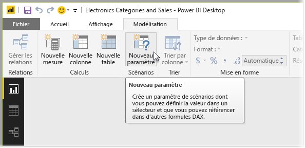
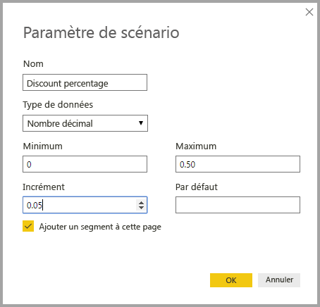
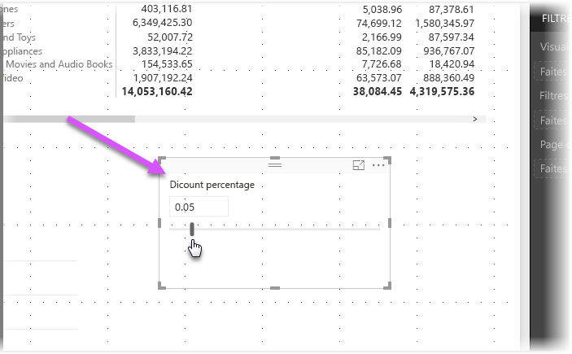
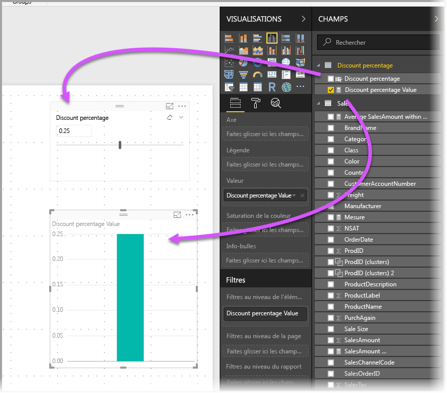
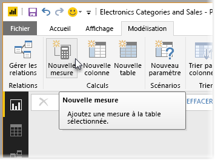
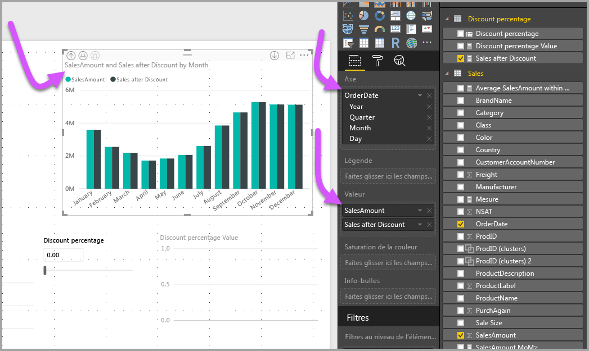
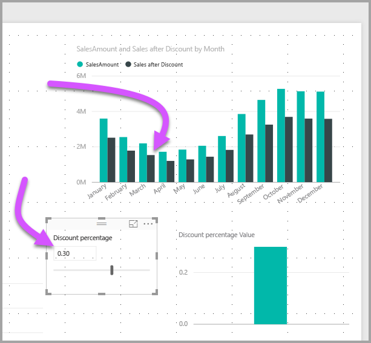

# Créer et utiliser le paramètre What if pour visualiser des variables dans Power BI Desktop
Depuis la version d’août 2017 de **Power BI Desktop**, vous pouvez créer des variables **What if** pour vos rapports, interagir avec la variable en tant que segment, ainsi que visualiser et quantifier différentes valeurs de clés dans vos rapports.

Le paramètre **What if** se trouve sous l’onglet **Modélisation** de **Power BI Desktop**. Lorsque vous le sélectionnez, une boîte de dialogue s’affiche et vous pouvez configurer le paramètre.

## Création d’un paramètre What if
Pour créer le paramètre **What if**, sélectionnez le bouton **What if** sous l’onglet **Modélisation** de **Power BI Desktop**. Dans l’image suivante, nous avons créé un paramètre appelé *Pourcentage de remise* et défini son type de données sur *Nombre décimal*. La valeur *Minimum* est égale à zéro, la valeur *Maximum* est égale à 0,50 (50 %). Nous avons également défini l’*Incrément* sur 0,05 (ou 5 %). Il s’agit de la valeur d’ajustement du paramètre lors de son utilisation dans un rapport.

> [!NOTE]
> Pour les nombres décimaux, assurez-vous de les faire précéder d’un zéro, par exemple 0,50 plutôt que simplement ,50. Sinon, le nombre n’est pas validé et le bouton **OK** ne peut pas être sélectionné.
> 
> 

Pour vous faciliter la tâche, la case à cocher **Ajouter un segment à cette page** place automatiquement un segment avec votre paramètre **What if** sur la page de rapport actuelle.

La création du paramètre **What if** crée également une mesure, qui vous permet de visualiser la valeur actuelle du paramètre **What if**.

Il est important et utile de noter que lorsque vous créez un paramètre **What if**, ce dernier et la mesure font alors partie de votre modèle. Ainsi, ils sont disponibles dans l’ensemble du rapport et peuvent être utilisés sur d’autres pages du rapport. De plus, dans la mesure où ils font partie du modèle, vous pouvez supprimer le segment de la page du rapport. Si vous souhaitez l’utiliser à nouveau, saisissez simplement le paramètre **What if** dans la liste **Champs** et faites-le glisser sur le canevas (puis remplacez le visuel par un segment) pour réafficher facilement le paramètre dans votre rapport.

## Utilisation d’un paramètre What if
Vous allez créer un exemple simple d’utilisation du paramètre **What if**. Vous avez créé le paramètre **What if** dans la section précédente. Vous allez maintenant l’utiliser en créant une mesure dont la valeur s’ajuste avec le curseur. Pour ce faire, créez une mesure.

La nouvelle mesure correspond simplement au montant total des ventes, avec le taux de remise appliqué. Vous pouvez créer des mesures complexes et intéressantes, bien entendu, qui permettent aux utilisateurs de vos rapports de visualiser la variable de votre paramètre **What if**. Par exemple, vous pouvez créer un rapport qui permet aux vendeurs de voir leur rémunération s’ils répondent à certains objectifs ou pourcentages de vente, ou de voir l’impact de remises plus importantes sur l’augmentation des ventes.

Tapez la formule de mesure dans la barre de formule, puis nommez-la **Ventes après remise**. Le résultat est le suivant :

Créez ensuite un visuel de colonne avec *OrderDate* sur l’axe, avec *SalesAmount* et la mesure récemment créée *Ventes après remise* en tant que valeurs.

Ensuite, lorsque vous déplacez le curseur, vous constatez que la colonne *Ventes après remise* reflète le montant des ventes avec remise.

C’est tout. Vous pouvez utiliser le paramètre **What if** dans toutes sortes de situations, pour permettre aux utilisateurs de rapports d’interagir avec les différents scénarios que vous créez dans vos rapports.

