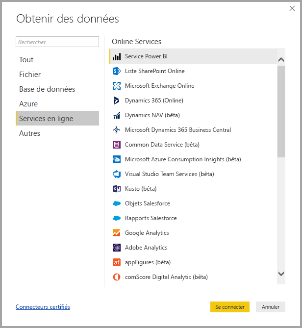
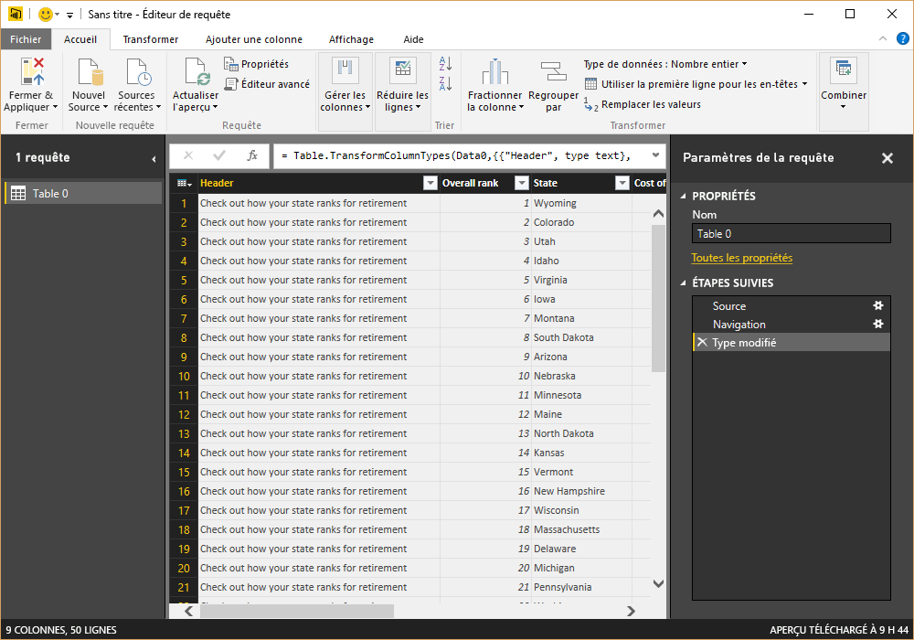
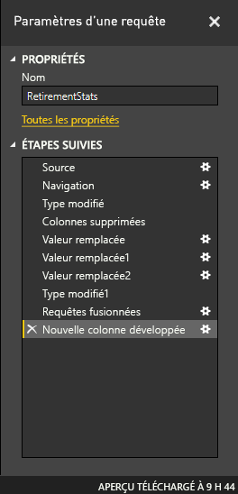
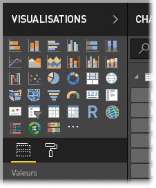
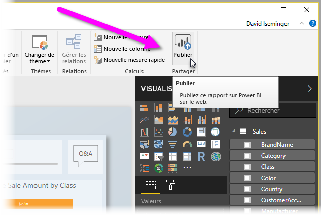

# Qu’est-ce que Power BI Desktop ?

**Power BI Desktop** est une application gratuite qui s’installe sur un ordinateur local et permet de se connecter à des données, de les transformer et de les visualiser. Avec **Power BI Desktop**, vous pouvez vous connecter à différentes sources de données et les associer (selon processus couramment nommé modélisation) dans un modèle de données permettant de créer des visuels et des collections de visuels, et de les partager sous forme de rapports avec d’autres personnes de votre organisation. La plupart des utilisateurs qui travaillent sur des projets d’informatique décisionnelle utilisent **Power BI Desktop** pour créer des rapports, puis le **service Power BI** pour les partager avec d’autres personnes.

Voici les utilisations les plus courantes de **Power BI Desktop** :

* Se connecter aux données
* Transformer et nettoyer ces données pour créer un modèle de données
* Créer des visuels, par exemple, des graphiques, qui donnent des représentations visuelles des données
* Créer des rapports correspondant à des collections de visuels, sur une ou plusieurs pages de rapport
* Partager des rapports avec d’autres utilisateurs à l’aide du **service Power BI**

Les personnes responsables de ces tâches sont souvent considérées comme des *analystes de données* (parfois nommés simplement *analystes*) ou des professionnels de l’informatique décisionnelle (souvent appelés *créateurs de rapports*). Toutefois, nombreux sont ceux qui ne se considèrent pas comme des analystes ou des créateurs de rapports et utilisent **Power BI Desktop** pour créer des rapports attrayants, ou pour extraire des données provenant de différentes sources, générer des modèles de données et les partager avec leurs collègues et leur organisation.

Avec **Power BI Desktop**, vous pouvez créer des rapports complexes et riches visuellement à partir de données provenant de plusieurs sources, pour ensuite les partager avec d’autres personnes de votre organisation. 

## Se connecter aux données
La première chose à faire pour commencer à utiliser **Power BI Desktop** est de se connecter aux données. De nombreuses sources de données sont accessibles avec **Power BI Desktop**. Pour vous connecter à des données, sélectionnez le ruban **Accueil**, puis **Obtenir des données > Plus**. L’illustration suivante montre la fenêtre **Obtenir des données** qui s’affiche, indiquant le vaste éventail de catégories auxquelles Power BI Desktop peut se connecter.

Lorsque vous sélectionnez un type de données, une fenêtre vous invite à entrer les informations, par exemple, l’URL et les informations d’identification, nécessaires pour que Power BI Desktop puisse se connecter à la source de données en votre nom.

Une fois la connexion à une ou plusieurs sources de données établie, l’objectif est de transformer les données d’une façon pertinente.

## Transformer et nettoyer les données, créer un modèle de données

Dans Power BI Desktop, vous pouvez nettoyer et transformer les données à l’aide de **l’Éditeur de requête** intégré. Il permet d’apporter des modifications aux données, par exemple, changer un type de données, supprimer des colonnes ou combiner des données provenant de plusieurs sources. C’est un peu comme la sculpture : on part d’un gros bloc d’argile (les données), puis on enlève certaines parties ou on en ajoute d’autres selon les endroits, jusqu’à atteindre la forme souhaitée. 

Toutes les étapes de transformation des données (par exemple, renommer une table, transformer un type de données ou supprimer des colonnes) sont enregistrées par **l’Éditeur de requête**. Chaque fois que cette requête se connecte à la source de données, ces mêmes opérations sont effectuées afin que les données soient toujours mises en forme de la manière spécifiée.

L’illustration suivante montre le volet **Paramètres de la requête** d’une requête mise en forme et transformée en modèle.

 

Dès que vos données auront été mises en forme, vous pourrez créer des visuels. 

## Créer des éléments visuels 

Une fois le modèle de données élaboré, vous pouvez faire glisser des *champs* vers le canevas de rapport pour créer des *visuels*. Un *visuel* est une représentation graphique des données du modèle. Le suivant représente un histogramme simple. 

Power BI Desktop propose de nombreux types de visuels. Pour créer ou modifier un visuel, sélectionnez l’icône de visuel dans le volet **Visualisations**. Si un visuel est sélectionné sur le canevas de rapport, il devient du type sélectionné. Dans le cas contraire, un nouveau visuel est créé en fonction de la sélection.

## Créer des rapports

La plupart du temps, l’objectif est de créer une collection de visuels qui indiquent différents aspects des données utilisées pour créer le modèle dans Power BI Desktop. Une collection de visuels au sein d’un fichier Power BI Desktop est appelée *rapport*. Un rapport peut comporter une ou plusieurs pages, de même qu’un fichier Excel peut être composé d’une ou plusieurs feuilles de calcul. L’illustration suivante montre la première page d’un rapport Power BI Desktop, nommée Vue d’ensemble (l’onglet apparaît dans la partie basse). Ce rapport comprend dix pages.

## Partager des rapports

Dès que le rapport est prêt à être partagé avec d’autres utilisateurs, vous pouvez le **publier** sur le **service Power BI** et le mettre à la disposition de tous les collaborateurs de votre organisation qui possèdent une licence Power BI. Pour publier un rapport Power BI Desktop, sélectionnez le bouton **Publier** dans le ruban **Accueil** de Power BI Desktop.

Dès que vous avez sélectionné **Publier**, Power BI Desktop vous connecte au **service Power BI** avec votre compte Power BI, puis vous invite à sélectionner l’endroit où le rapport sera partagé, par exemple, votre espace de travail, un espace de travail d’équipe ou un autre emplacement au sein du service Power BI. Vous devez disposer d’une licence Power BI pour pouvoir partager des rapports sur le service Power BI.

## Étapes suivantes

Pour bien démarrer avec **Power BI Desktop**, la première chose à faire est de télécharger et d’installer l’application. Il existe deux façons d’obtenir **Power BI Desktop** :

* [télécharger Power BI Desktop sur le Web](desktop-get-the-desktop.md) ;
* [télécharger Power BI Desktop](http://aka.ms/pbidesktopstore) sur le Windows Store.
