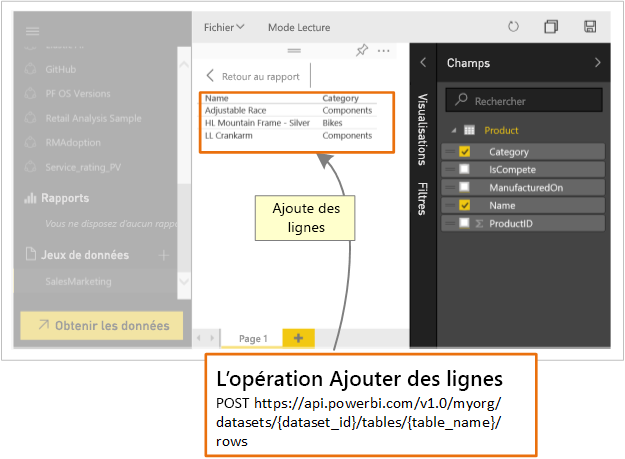

# Comment les développeurs peuvent-ils se servir de l’API Power BI ?

À l’aide de l’API REST Power BI, vous pouvez créer des applications qui s’intègrent aux rapports, tableaux de bord et vignettes Power BI.

Avec l’API REST Power BI, il est possible d’effectuer des tâches de gestion sur des objets Power BI tels que des rapports, des jeux de données et des espaces de travail.

Voici quelques opérations possibles avec les API Power BI.

| **Pour en savoir plus** | **Référencer ces informations** |
|----------------------------------------------------------------------------------|------------------------------------------------------------------------------------|
| Incorporer des rapports, des tableaux de bord et des vignettes pour les utilisateurs de Power BI et ceux qui n’utilisent pas Power BI. | [Guide pratique pour incorporer vos tableaux de bord, rapports et vignettes Power BI](../embedded/embed-sample-for-customers.md) |
| Effectuez des tâches de gestion sur des objets Power BI. | [Référence de l’API REST de Power BI](/rest/api/power-bi/) |
| Étendre un workflow d’entreprise existant pour transmettre des données clés à un tableau de bord Power BI. | [Transmettre des données à un tableau de bord ](walkthrough-push-data.md) |
| Authentifiez-vous sur Power BI. | [S’authentifier sur Power BI ](../embedded/get-azuread-access-token.md) |

> [!NOTE]
> Les API Power BI font encore référence aux espaces de travail en tant que groupes. Toutes les références à des groupes indiquent que vous travaillez avec des espaces de travail.

## Outils développeurs d’API

| Outil(s) | Description |
|---------|-------------|
| [Outil Playground](https://microsoft.github.io/PowerBI-JavaScript/demo) | Découvrez un exemple complet de l’utilisation des API JavaScript Power BI. Cet outil représente aussi un moyen rapide de jouer avec différents types d’exemples Power BI Embedded. |
| [Wiki JavaScript Power BI](https://github.com/Microsoft/powerbi-javascript/wiki) | Pour obtenir plus d’informations sur les API JavaScript Power BI. |
| [Postman](https://www.getpostman.com/) | Exécutez des requêtes, testez, déboguez, supervisez, exécutez des tests automatisés et bien plus encore. |

## Transmettre des données à Power BI

Vous pouvez utiliser l’API Power BI pour [envoyer (push) des données dans un jeu de données](walkthrough-push-data.md). Cette fonctionnalité vous permet d’ajouter une ligne à une table à l’intérieur d’un jeu de données. Les nouvelles données sont ensuite reflétées dans des vignettes sur un tableau de bord et dans des visuels à l’intérieur de votre rapport.

## Dépôts GitHub

* [Exemples des développeurs Power BI](https://github.com/Microsoft/PowerBI-Developer-Samples)
* [Kit de développement logiciel (SDK) .NET](https://github.com/Microsoft/PowerBI-CSharp)
* [API JavaScript](https://github.com/Microsoft/PowerBI-JavaScript)

## Étapes suivantes

* [Transmission de données à un jeu de données](walkthrough-push-data.md)
* [Développement d’un visuel Power BI](../visuals/custom-visual-develop-tutorial.md)
* [Informations de référence sur l’API REST de Power BI](rest-api-reference.md)
* [API REST Power BI](/rest/api/power-bi/)

D’autres questions ? [Essayez d’interroger la communauté Power BI](https://community.powerbi.com/)