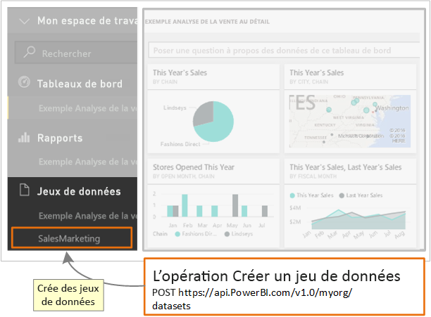

# <a name="step-3-create-a-dataset-in-power-bi"></a>Étape 3 : Créer un jeu de données dans Power BI
Cet article fait partie d’une procédure pas à pas pour [transmettre des données à un jeu de données](walkthrough-push-data.md).

À l’**étape 2** de la procédure de transmission des données à un jeu de données intitulée [Obtenir un jeton d’accès d’authentification](walkthrough-push-data-get-token.md), vous avez obtenu un jeton pour vous authentifier auprès d’**Azure AD**. Pendant cette étape, vous utilisez le jeton pour appeler l’opération [PostDataset](https://docs.microsoft.com/rest/api/power-bi/pushdatasets).

Pour appeler une ressource REST, vous utilisez une URL qui localise la ressource et vous envoyez une chaîne JSON (JavaScript Objet Notation), qui décrit le jeu de données, à la ressource du service Power BI. Une ressource REST identifie la partie du service Power BI que vous voulez utiliser. Pour transmettre des données au jeu de données, la ressource cible est un **jeu de données**. L’URL qui identifie un jeu de données est `https://api.PowerBI.com/v1.0/myorg/datasets`. Si vous transmettez des données au sein d’un groupe, l’URL est `https://api.PowerBI.com/v1.0/myorg/groups/{group_id}/datasets`.

Pour authentifier une opération REST Power BI, vous ajoutez le jeton que vous avez obtenu à l’étape [Obtenir un jeton d’accès d’authentification](walkthrough-push-data-get-token.md) à un en-tête de demande :

Quand vous appelez l’opération [PostDataset](https://docs.microsoft.com/rest/api/power-bi/pushdatasets), un jeu de données est créé. 



Voici comment créer un jeu de données dans Power BI.

## <a name="create-a-dataset-in-power-bi"></a>Créer un jeu de données dans Power BI
> [!NOTE]
> Avant de commencer, veillez à suivre les étapes précédentes de la procédure pas à pas [Transmettre des données à un jeu de données](walkthrough-push-data.md).
> 
> 

1. Dans le projet Application console que vous avez créé à l’[étape 2 : obtenir un jeton d’accès d’authentification](walkthrough-push-data-get-token.md), ajoutez **using System.Net;** et **using System.IO;** au fichier Program.cs.
2. Dans le fichier Program.cs, ajoutez le code suivant.
3. Exécutez l’application console, puis connectez-vous à votre compte Power BI. Le **jeu de données créé** doit apparaître dans la fenêtre de console. De plus, vous pouvez vous connecter à Power BI pour voir le nouveau jeu de données.

**Exemple de transmission de données à un jeu de données**

Ajoutez ce code dans le fichier Program.cs.

* Dans static void Main(string[] args) :
  
    ```csharp
    static void Main(string[] args)
    {
        //Get an authentication access token
        token = GetToken();
  
        //Create a dataset in Power BI
        CreateDataset();
    }
    ```
* Ajoutez une méthode CreateDataset() :
  
    ```csharp
    #region Create a dataset in Power BI
    private static void CreateDataset()
    {
        //TODO: Add using System.Net and using System.IO
  
        string powerBIDatasetsApiUrl = "https://api.powerbi.com/v1.0/myorg/datasets";
        //POST web request to create a dataset.
        //To create a Dataset in a group, use the Groups uri: https://api.PowerBI.com/v1.0/myorg/groups/{group_id}/datasets
        HttpWebRequest request = System.Net.WebRequest.Create(powerBIDatasetsApiUrl) as System.Net.HttpWebRequest;
        request.KeepAlive = true;
        request.Method = "POST";
        request.ContentLength = 0;
        request.ContentType = "application/json";
  
        //Add token to the request header
        request.Headers.Add("Authorization", String.Format("Bearer {0}", token));
  
        //Create dataset JSON for POST request
        string datasetJson = "{\"name\": \"SalesMarketing\", \"tables\": " +
            "[{\"name\": \"Product\", \"columns\": " +
            "[{ \"name\": \"ProductID\", \"dataType\": \"Int64\"}, " +
            "{ \"name\": \"Name\", \"dataType\": \"string\"}, " +
            "{ \"name\": \"Category\", \"dataType\": \"string\"}," +
            "{ \"name\": \"IsCompete\", \"dataType\": \"bool\"}," +
            "{ \"name\": \"ManufacturedOn\", \"dataType\": \"DateTime\"}" +
            "]}]}";
  
        //POST web request
        byte[] byteArray = System.Text.Encoding.UTF8.GetBytes(datasetJson);
        request.ContentLength = byteArray.Length;
  
        //Write JSON byte[] into a Stream
        using (Stream writer = request.GetRequestStream())
        {
            writer.Write(byteArray, 0, byteArray.Length);
  
            var response = (HttpWebResponse)request.GetResponse();
  
            Console.WriteLine(string.Format("Dataset {0}", response.StatusCode.ToString()));
  
            Console.ReadLine();
        }
    }
    #endregion
    ```

L’étape suivante vous montre comment [obtenir un jeu de données pour ajouter des lignes à une table Power BI](walkthrough-push-data-get-datasets.md).

Ci-après figure le [listing du code complet](#code).

<a name="code"/>

## <a name="complete-code-listing"></a>Listing du code complet

```csharp
using System;
using Microsoft.IdentityModel.Clients.ActiveDirectory;
using System.Net;
using System.IO;

namespace walkthrough_push_data
{
    class Program
    {
        private static string token = string.Empty;

        static void Main(string[] args)
        {

            //Get an authentication access token
            token = GetToken();

            //Create a dataset in Power BI
            CreateDataset();

        }

        #region Get an authentication access token
        private static string GetToken()
        {
            // TODO: Install-Package Microsoft.IdentityModel.Clients.ActiveDirectory -Version 2.21.301221612
            // and add using Microsoft.IdentityModel.Clients.ActiveDirectory

            //The client id that Azure AD created when you registered your client app.
            string clientID = "{Client_ID}";

            //RedirectUri you used when you register your app.
            //For a client app, a redirect uri gives Azure AD more details on the application that it will authenticate.
            // You can use this redirect uri for your client app
            string redirectUri = "https://login.live.com/oauth20_desktop.srf";

            //Resource Uri for Power BI API
            string resourceUri = "https://analysis.windows.net/powerbi/api";

            //OAuth2 authority Uri
            string authorityUri = "https://login.microsoftonline.com/common/";

            //Get access token:
            // To call a Power BI REST operation, create an instance of AuthenticationContext and call AcquireToken
            // AuthenticationContext is part of the Active Directory Authentication Library NuGet package
            // To install the Active Directory Authentication Library NuGet package in Visual Studio,
            //  run "Install-Package Microsoft.IdentityModel.Clients.ActiveDirectory" from the nuget Package Manager Console.

            // AcquireToken will acquire an Azure access token
            // Call AcquireToken to get an Azure token from Azure Active Directory token issuance endpoint
            AuthenticationContext authContext = new AuthenticationContext(authorityUri);
            string token = authContext.AcquireToken(resourceUri, clientID, new Uri(redirectUri)).AccessToken;

            Console.WriteLine(token);
            Console.ReadLine();

            return token;
        }

        #endregion


        #region Create a dataset in Power BI
        private static void CreateDataset()
        {
            //TODO: Add using System.Net and using System.IO

            string powerBIDatasetsApiUrl = "https://api.powerbi.com/v1.0/myorg/datasets";
            //POST web request to create a dataset.
            //To create a Dataset in a group, use the Groups uri: https://api.PowerBI.com/v1.0/myorg/groups/{group_id}/datasets
            HttpWebRequest request = System.Net.WebRequest.Create(powerBIDatasetsApiUrl) as System.Net.HttpWebRequest;
            request.KeepAlive = true;
            request.Method = "POST";
            request.ContentLength = 0;
            request.ContentType = "application/json";

            //Add token to the request header
            request.Headers.Add("Authorization", String.Format("Bearer {0}", token));

            //Create dataset JSON for POST request
            string datasetJson = "{\"name\": \"SalesMarketing\", \"tables\": " +
                "[{\"name\": \"Product\", \"columns\": " +
                "[{ \"name\": \"ProductID\", \"dataType\": \"Int64\"}, " +
                "{ \"name\": \"Name\", \"dataType\": \"string\"}, " +
                "{ \"name\": \"Category\", \"dataType\": \"string\"}," +
                "{ \"name\": \"IsCompete\", \"dataType\": \"bool\"}," +
                "{ \"name\": \"ManufacturedOn\", \"dataType\": \"DateTime\"}" +
                "]}]}";

            //POST web request
            byte[] byteArray = System.Text.Encoding.UTF8.GetBytes(datasetJson);
            request.ContentLength = byteArray.Length;

            //Write JSON byte[] into a Stream
            using (Stream writer = request.GetRequestStream())
            {
                writer.Write(byteArray, 0, byteArray.Length);

                var response = (HttpWebResponse)request.GetResponse();

                Console.WriteLine(string.Format("Dataset {0}", response.StatusCode.ToString()));

                Console.ReadLine();
            }
        }
        #endregion
    }
}
```

[Étape suivante >](walkthrough-push-data-get-datasets.md)

## <a name="next-steps"></a>Étapes suivantes
* [Obtenir un jeu de données pour ajouter des lignes à une table Power BI](walkthrough-push-data-get-datasets.md)  
* [Obtenir un jeton d’accès d’authentification](walkthrough-push-data-get-token.md)  
* [PostDataset](https://docs.microsoft.com/rest/api/power-bi/pushdatasets/datasets_postdataset)  
[PostDatasetInGroup](https://docs.microsoft.com/rest/api/power-bi/pushdatasets/datasets_postdatasetingroup)  
* [Transmettre des données à un tableau de bord Power BI](walkthrough-push-data.md)  
* [Vue d’ensemble de l’API REST Power BI](overview-of-power-bi-rest-api.md)  
* [Référence de l’API REST de Power BI](https://docs.microsoft.com/rest/api/power-bi/)  

D’autres questions ? [Posez vos questions à la communauté Power BI](https://community.powerbi.com/)

