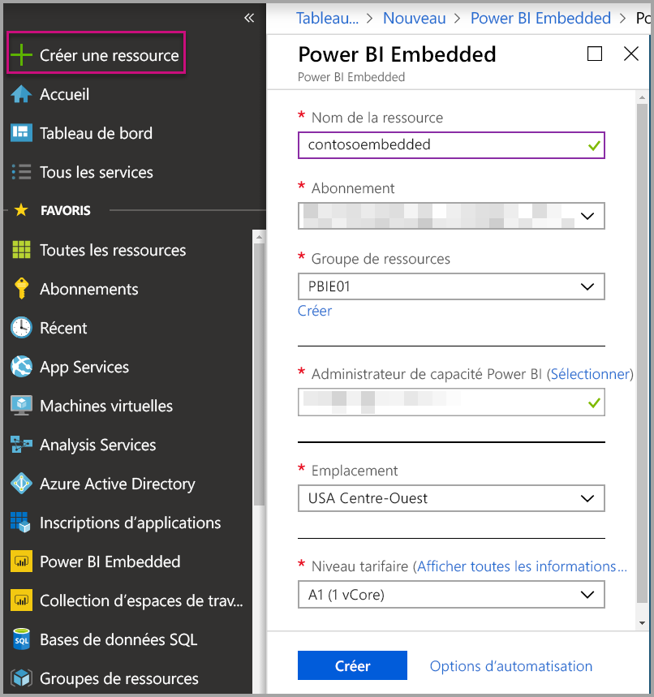
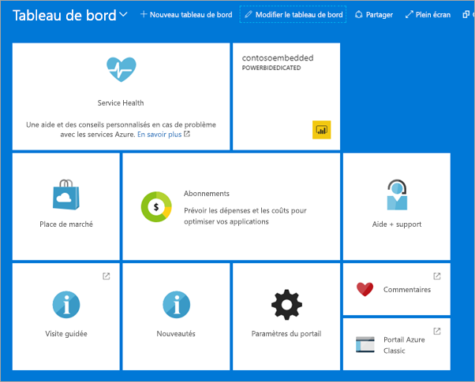

# Créer une capacité Power BI Embedded dans le Portail Microsoft Azure

Cet article explique pas à pas comment créer une capacité Power BI Embedded dans Microsoft Azure. Power BI Embedded simplifie les fonctionnalités de Power BI en vous permettant d’ajouter rapidement à vos applications de superbes visuels, rapports et tableaux de bord.

Si vous n’avez pas d’abonnement Azure, créez un [compte gratuit](https://azure.microsoft.com/free/) avant de commencer.

> [!VIDEO https://www.youtube.com/embed/aXrvFfg_iSk]

## Avant de commencer

Pour suivre ce guide de démarrage rapide, vous avez besoin des éléments suivants :

* **Abonnement Azure :** accédez à la page [Azure - Essai gratuit](https://azure.microsoft.com/free/) pour créer un compte.
* **Azure Active Directory :** votre abonnement doit être associé à un locataire Azure Active Directory (AAD). De plus, ***vous devez être connecté à Azure avec un compte relevant de ce locataire***. Les comptes Microsoft ne sont pas pris en charge. Pour en savoir plus, consultez [Authentification et autorisations utilisateur](https://docs.microsoft.com/azure/analysis-services/analysis-services-manage-users).
* **Locataire Power BI :** au moins un compte de votre locataire AAD doit avoir souscrit à Power BI.
* **Groupe de ressources :** utilisez un groupe de ressources que vous possédez déjà ou [créez-en un](https://docs.microsoft.com/azure/azure-resource-manager/resource-group-overview).

## Créer une capacité

1. Connectez-vous au [portail Azure](https://portal.azure.com/).

2. Sélectionnez **Créer une ressource** > **Données + Analytique**.

3. Dans la zone de recherche, recherchez *Power BI Embedded*.

4. Dans Power BI Embedded, sélectionnez **Créer**.

5. Fournissez les informations nécessaires, puis sélectionnez **Créer**.

    

    |Paramètre |Description |
    |---------|---------|
    |**Nom de la ressource**|Nom identifiant la capacité. Le nom de la ressource s’affiche dans le portail d’administration Power BI en plus du Portail Microsoft Azure.|
    |**Abonnement**|Abonnement pour lequel vous souhaitez créer la capacité.|
    |**Groupe de ressources**|Groupe de ressources qui contient cette nouvelle capacité. Choisissez un groupe de ressources existant ou créez-en un autre. Pour plus d’informations, consultez [Vue d’ensemble d’Azure Resource Manager](https://docs.microsoft.com/azure/azure-resource-manager/resource-group-overview).|
    |**Administrateur de capacité Power BI**|Les administrateurs de capacité Power BI peuvent afficher la capacité dans le portail d’administration Power BI et accorder des autorisations d’affectation à d’autres utilisateurs. Par défaut, l’administrateur de capacité est votre compte. L’administrateur de capacité doit faire partie de votre locataire Power BI.|
    |**Emplacement**|Emplacement où est hébergé Power BI pour votre locataire. Ce paramètre est résolu automatiquement et aucun autre emplacement ne peut être sélectionné.|
    |**Niveau tarifaire**|Sélectionnez la référence SKU (nombre de cœurs v-core et taille de la mémoire) qui correspond à vos besoins.  Pour plus d’informations, consultez [Tarifs de Power BI Embedded](https://azure.microsoft.com/pricing/details/power-bi-embedded/).|

6. Sélectionnez **Créer**.

L’opération de création prend généralement moins d’une minute ; souvent quelques secondes. Si vous sélectionnez **Épingler au tableau de bord**, vous pouvez accéder à votre tableau de bord pour examiner votre nouvelle capacité. Vous pouvez aussi accéder à **Tous les services** > **Power BI Embedded** pour voir si votre capacité est prête.

## Étapes suivantes

Pour utiliser votre nouvelle capacité Power BI Embedded, accédez au portail d’administration Power BI pour affecter des espaces de travail. Pour plus d’informations, consultez [Gérer les capacités dans Power BI Premium et Power BI Embedded](https://powerbi.microsoft.com/documentation/powerbi-admin-premium-manage/).

Si vous n’avez pas besoin d’utiliser cette capacité, vous pouvez la suspendre pour faire cesser la facturation. Pour plus d’informations, consultez [Suspendre et démarrer une capacité Power BI Embedded dans le Portail Microsoft Azure](azure-pbie-pause-start.md).

Pour commencer à incorporer du contenu Power BI dans votre application, consultez [Guide pratique pour incorporer vos tableaux de bord, rapports et vignettes Power BI](https://powerbi.microsoft.com/documentation/powerbi-developer-embedding-content/).

D’autres questions ? [Essayez d’interroger la communauté Power BI](http://community.powerbi.com/)