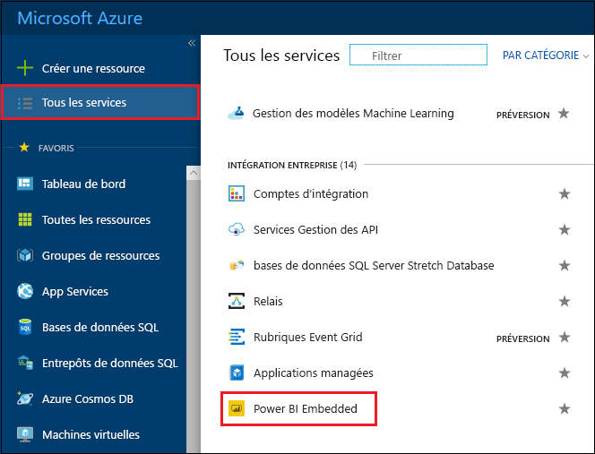
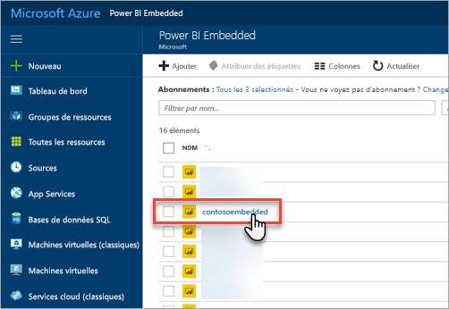
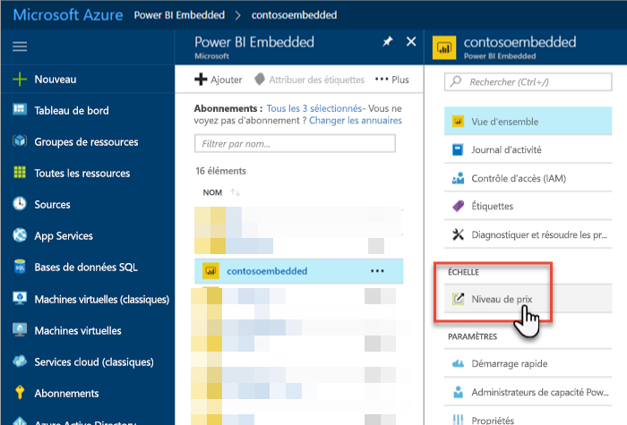
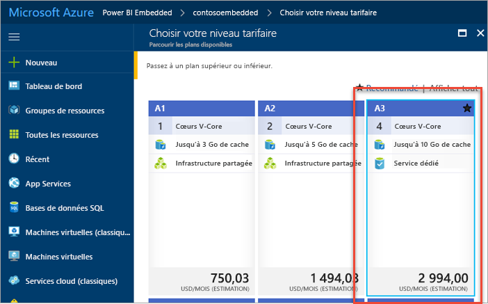
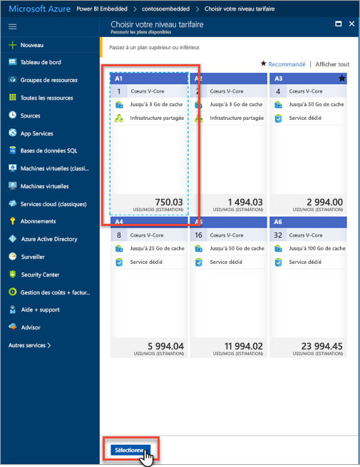
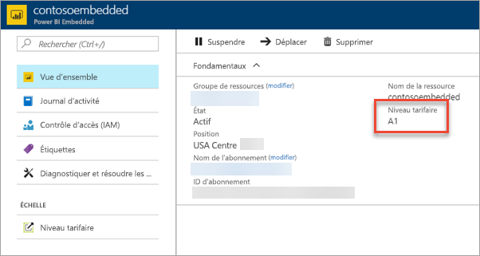

# Mettre à l’échelle une capacité Power BI Embedded dans le Portail Microsoft Azure

Cet article explique pas à pas comment mettre à l’échelle une capacité Power BI Embedded dans Microsoft Azure. La mise à l’échelle vous permet d’accroître ou de diminuer la taille de votre capacité.

Cela suppose que vous avez créé une capacité Power BI Embedded. Si ce n’est pas le cas, consultez [Créer une capacité Power BI Embedded dans le Portail Microsoft Azure](azure-pbie-create-capacity.md) pour commencer.

> [!NOTE]
> La durée d’une opération de mise à l’échelle est d’environ une minute. Pendant ce temps, la capacité n’est pas disponible. Le chargement du contenu incorporé peut échouer.

## Mettre à l’échelle une capacité

1. Connectez-vous au [portail Azure](https://portal.azure.com/).

2. Sélectionnez **Tous les services** > **Power BI Embedded** pour voir vos capacités.

    

3. Sélectionnez la capacité que vous voulez mettre à l’échelle.

    

4. Sélectionnez **Niveau tarifaire** sous **Mettre à l’échelle** au sein de votre capacité.

    

    Votre niveau tarifaire actuel présente un contour bleu.

    

5. Pour monter ou descendre en puissance, sélectionnez le niveau souhaité. Le nouveau niveau sélectionné présente un contour bleu en pointillés. Sélectionnez **Sélectionner** pour passer au nouveau niveau.

    

    La mise à l’échelle de votre capacité peut prendre entre une et deux minutes.

6. Confirmez votre niveau en affichant l’onglet vue d’ensemble. Le niveau tarifaire actuel est répertorié.

    

## Étapes suivantes

Pour suspendre ou démarrer votre capacité, consultez [Suspendre et démarrer une capacité Power BI Embedded dans le Portail Microsoft Azure](azure-pbie-pause-start.md).

Pour commencer à incorporer du contenu Power BI dans votre application, consultez [Guide pratique pour incorporer vos tableaux de bord, rapports et vignettes Power BI](https://powerbi.microsoft.com/documentation/powerbi-developer-embedding-content/).

D’autres questions ? [Essayez d’interroger la communauté Power BI](http://community.powerbi.com/)
