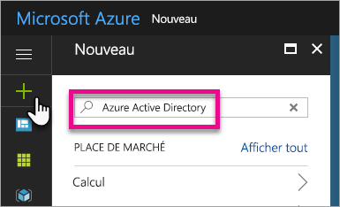
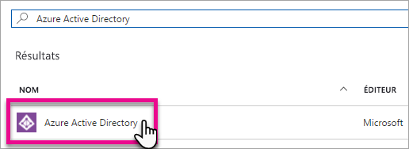
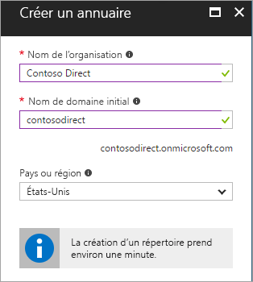
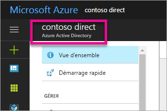
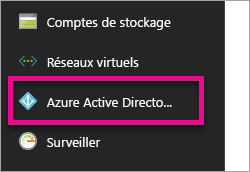
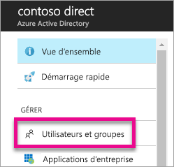
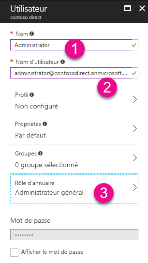
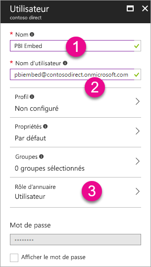
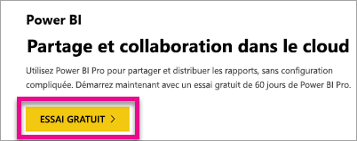

# Créer un locataire Azure Active Directory pour utiliser Power BI
Découvrez comment créer un locataire Azure Active Directory (Azure AD) pour votre application personnalisée à l’aide des API REST Power BI.

Dans Azure Active Directory, un locataire représente une organisation. Il s’agit d’une instance dédiée du service Azure AD qu’une organisation reçoit et détient lorsqu’elle s’inscrit à un service cloud Microsoft tel qu’Azure, Microsoft Intune ou Office 365. Chaque locataire Azure AD est distinct et indépendant des autres locataires Azure AD.

Lorsque vous disposez d’un locataire Azure AD, vous pouvez définir une application et lui attribuer des autorisations pour lui permettre d’utiliser les API REST Power BI.

Si votre organisation possède déjà un locataire Azure AD, vous pouvez l’utiliser pour votre application. En fonction des besoins de votre application, vous pouvez recourir à ce locataire ou en créer un. Cet article explique comment créer un locataire.

## Créer un client Azure Active Directory
Pour intégrer Power BI à votre application personnalisée, vous devez définir une application dans Azure AD. Pour ce faire, il vous faut un répertoire Azure AD. Il s’agit de votre locataire. Si votre organisation n’a pas encore de locataire, parce qu’elle n’utilise pas Power BI ou Office 365, [vous devez en créer un](https://docs.microsoft.com/azure/active-directory/develop/active-directory-howto-tenant). Vous pouvez également créer un locataire si vous souhaitez que votre application soit indépendante du locataire de votre organisation. Cela vous permet de bien distinguer les choses.

Si nécessaire, vous pouvez également créer un locataire à des fins de test.

Pour créer un locataire Azure AD, procédez comme suit :

1. Accédez au [portail Azure](https://portal.azure.com) et connectez-vous à l’aide d’un compte associé à un abonnement Azure.
2. Sélectionnez l’**icône Plus (+)** et recherchez *Azure Active Directory*.
   
    
3. Sélectionnez **Azure Active Directory** dans les résultats de la recherche.
   
    
4. Sélectionnez **Créer**.
5. Entrez le **nom de l’organisation** ainsi que le **nom de domaine initial**. Sélectionnez ensuite **Créer**. Votre répertoire est ainsi créé.
   
    
   
   > [!NOTE]
   > Votre domaine initial fait partie de onmicrosoft.com. Vous pourrez ultérieurement ajouter d’autres noms de domaine. Plusieurs domaines peuvent être attribués au répertoire d’un locataire.
   > 
   > 
6. Une fois le répertoire créé, sélectionnez la zone d’informations pour le gérer.

Votre répertoire est maintenant créé. L’étape suivante consiste à ajouter un utilisateur au locataire.

## Créer des utilisateurs dans votre locataire Azure Active Directory
Maintenant que vous disposez d’un répertoire, vous devez créer au moins deux utilisateurs. L’un d’eux est l’administrateur général du locataire, et l’autre votre utilisateur principal pour l’incorporation. Considérez celui-ci comme un compte de service.

1. Dans le portail Azure, vérifiez que vous vous trouvez sur la sortie Azure Active Directory.
   
    
   
    Si ce n’est pas le cas, sélectionnez l’icône Azure Active Directory sur la barre de services de gauche.
   
    
2. Sous **Gérer**, sélectionnez **Utilisateurs et groupes**.
   
    
3. Sélectionnez **Tous les utilisateurs**, puis **+ Nouvel utilisateur**.
4. Attribuez un nom et un nom d’utilisateur à ce nouvel utilisateur. Celui-ci devient l’administrateur général du locataire. Vous devez également définir le **Rôle d’annuaire** sur *Administrateur général*. En outre, vous pouvez afficher le mot de passe temporaire. Lorsque vous avez terminé, sélectionnez **Créer**.
   
    
5. La même procédure s’applique à la création d’un utilisateur ordinaire dans votre locataire. Elle peut également être utilisée pour votre compte d’incorporation principal. Dans ce cas, le paramètre **Rôle d’annuaire** doit être défini sur *Utilisateur*. Veillez à noter le mot de passe. Sélectionnez ensuite **Créer**.
   
    
6. Inscrivez-vous à Power BI à l’aide du compte d’utilisateur que vous avez créé à l’étape 5. Pour ce faire, accédez à [powerbi.com](https://powerbi.microsoft.com/get-started/) et sélectionnez **Essai gratuit** sous *Power BI - Partage et collaboration dans le cloud*.
   
    
   
    Au moment de l’inscription, vous êtes invité à essayer Power BI Pro gratuitement pendant 60 jours. Vous pouvez opter pour cette solution pour devenir utilisateur professionnel. Si tel est votre objectif, vous pouvez également commencer à développer une solution incorporée.
   
   > [!NOTE]
   > Veillez à vous connecter avec l’adresse de courrier que vous avez spécifiée pour le compte d’utilisateur.
   > 
   > 

## Étapes suivantes
Maintenant que vous disposez d’un locataire Azure AD, vous pouvez l’utiliser pour tester des éléments dans Power BI et/ou vous pouvez commencer à incorporer des rapports et des tableaux de bord Power BI dans votre application. Pour plus d’informations sur l’incorporation d’éléments, consultez [Incorporation de vos tableaux de bord, rapports et vignettes Power BI](embedding-content.md).

[Qu’est-ce qu’un annuaire Azure AD ?](https://docs.microsoft.com/azure/active-directory/active-directory-whatis)  
[Obtention d’un locataire Azure Active Directory](https://docs.microsoft.com/azure/active-directory/develop/active-directory-howto-tenant)  

D’autres questions ? [Essayez d’interroger la communauté Power BI](http://community.powerbi.com/)

