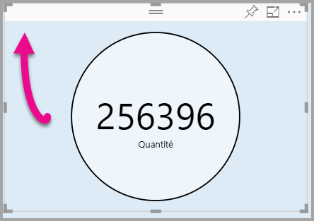

# <a name="tutorial-adding-formatting-options-to-a-power-bi-visual"></a>Tutoriel : Ajouter des options de mise en forme à un visuel Power BI

Dans ce tutoriel, nous allons étudier comment ajouter des propriétés communes au visuel.

Dans ce tutoriel, vous allez découvrir comment :
> [!div class="checklist"]
> * Ajouter des propriétés visuelles.
> * Packager le visuel.
> * Importer le visuel personnalisé dans un rapport Power BI Desktop.

## <a name="adding-formatting-options"></a>Ajout d’options de mise en forme

1. Dans **Power BI**, sélectionnez la **page Mettre en forme**.

    Le message suivant apparaît : *Les options de mise en forme ne sont pas disponibles pour ce visuel*.

    

2. Dans **Visual Studio Code**, ouvrez le fichier *capabilities.json*.

3. Avant le tableau **dataViewMappings**, ajoutez **objects** (après la ligne 8).

    ```json
    "objects": {},
    ```
    

4. Enregistrez le fichier **capabilities.json**.

5. Dans **Power BI**, examinez à nouveau les options de mise en forme.

    > [!Note]
    > Si vous ne voyez pas de changement dans les options de mise en forme, sélectionnez **Recharger le visuel personnalisé**.

    

6. Définissez l’option **Titre** sur *Désactivé*. Le visuel n’affiche plus le nom de la mesure dans le coin supérieur gauche.

    

    

### <a name="adding-custom-formatting-options"></a>Ajouter des options de mise en forme personnalisées

Vous pouvez ajouter des propriétés personnalisées pour pouvoir configurer la couleur du cercle et également la largeur de la bordure.

1. Dans PowerShell, arrêtez le visuel personnalisé.

2. Dans Visual Studio Code, dans le fichier **capabilities.json**, insérez le fragment JSON suivant dans l’objet intitulé **objects**.

    ```json
    "circle": {
     "displayName": "Circle",
     "properties": {
         "circleColor": {
             "displayName": "Color",
             "description": "The fill color of the circle.",
             "type": {
                 "fill": {
                     "solid": {
                         "color": true
                     }
                 }
             }
         },
         "circleThickness": {
             "displayName": "Thickness",
             "description": "The circle thickness.",
             "type": {
                 "numeric": true
                 }
             }
         }
     },
    ```

    Le fragment JSON décrit un groupe nommé circle, qui se compose de deux options nommées circleColor et circleThickness.

   

3. Enregistrez le fichier **capabilities.json**.

4. Dans le **volet Explorer**, sélectionnez **settings.ts** dans le dossier **src**. *Ce fichier représente les paramètres du visuel de démarrage*.

5. Dans le fichier **settings.ts**, remplacez les deux classes par le code suivant.

    ```typescript
    export class CircleSettings {
     public circleColor: string = "white";
     public circleThickness: number = 2;
    }
    export class VisualSettings extends DataViewObjectsParser {
     public circle: CircleSettings = new CircleSettings();
    }
    ```

    

    Ce module définit les deux classes. La classe **CircleSettings** définit deux propriétés dont le nom correspond aux objets définis dans le fichier **capabilities.json** (**circleColor** et **circleThickness**), ainsi que les valeurs par défaut. La classe **VisualSettings** hérite de la classe **DataViewObjectParser**, ajoute une propriété nommée **circle**, qui correspond à l’objet défini dans le fichier *capabilities.json*, et retourne une instance de **CircleSettings**.

6. Enregistrez le fichier **settings.ts**.

7. Ouvrez le fichier **visual.ts**.

8. Dans la classe **Visual**, ajoutez la propriété suivante.

    ```typescript
    private visualSettings: VisualSettings;
    ```
    Cette propriété stocke une référence à l’objet **VisualSettings**, qui décrit les paramètres du visuel.

    

9. Dans la classe **Visual**, ajoutez la méthode suivante avant la méthode **update**. Cette méthode est utilisée pour remplir les options de mise en forme.

    ```typescript
    public enumerateObjectInstances(options: EnumerateVisualObjectInstancesOptions): VisualObjectInstanceEnumeration {
     const settings: VisualSettings = this.visualSettings ||
    VisualSettings.getDefault() as VisualSettings;
     return VisualSettings.enumerateObjectInstances(settings, options);
    }
    ```
    Cette méthode est utilisée pour remplir les options de mise en forme.

    

10. Dans la méthode **update**, après la déclaration de la variable **radius**, ajoutez le code suivant.

    ```typescript
    this.visualSettings = VisualSettings.parse<VisualSettings>(dataView);

    this.visualSettings.circle.circleThickness = Math.max(0, this.visualSettings.circle.circleThickness);

    this.visualSettings.circle.circleThickness = Math.min(10, this.visualSettings.circle.circleThickness);
    ```
    Ce code récupère les options de mise en forme. Il ajuste les valeurs de la propriété **circleThickness**, en les convertissant en 0 si elles sont négatives, ou en 10 si elles sont supérieures à 10.

    

11. Dans **l’élément circle**, remplacez la valeur de **style fill** par l’expression suivante.

    ```typescript
    this.visualSettings.circle.circleColor
    ```

    

12. Dans **l’élément circle**, remplacez la valeur de **style stroke-width** par l’expression suivante.

    ```typescript
    this.visualSettings.circle.circleThickness
    ```

    

13. Enregistrez le fichier visual.ts.

14. Dans PowerShell, démarrez le visuel.

    ```powershell
    pbiviz start
    ```

15. Dans **Power BI**, sélectionnez **Activer/désactiver le rechargement automatique** dans la barre d’outils flottant au-dessus du visuel.

16. Dans les options **Mise en forme du visuel**, développez **Cercle**.

    

    Modifiez les options **Couleur** et **Épaisseur**.

    Modifiez l’option **Épaisseur** en lui affectant une valeur inférieure à zéro et une valeur supérieure à 10. Le visuel change alors cette valeur en un minimum ou un maximum tolérable.

## <a name="packaging-the-custom-visual"></a>Packager le visuel personnalisé

Entrez les valeurs des propriétés du projet de visuel personnalisé, mettez à jour le fichier d’icône, puis packagez le visuel personnalisé.

1. Dans **PowerShell**, arrêtez le visuel personnalisé.

2. Ouvrez le fichier **pbiviz.json** dans **Visual Studio Code**.

3. Dans l’objet **visual**, modifiez la propriété **displayName** en lui donnant la valeur *Circle Card*.

    Dans le volet **Visualisations**, placez le curseur sur l’icône pour révéler le nom d’affichage.

    

4. Dans la propriété **description**, entrez le texte suivant.

    *Affiche une valeur de mesure de mise en forme à l’intérieur d’un cercle*

5. Si vous le souhaitez, entrez vos informations dans l’objet **author**.

6. Enregistrez le fichier **pbiviz.json**.

7. Dans l’objet **assets**, le document définit un chemin d’accès à une icône. L’icône est l’image qui apparaît dans le volet **_Visualisations_** . Ce doit être un fichier **PNG** de *20 pixels par 20 pixels*.

8. Dans l’Explorateur Windows, copiez le fichier icon.png, puis collez-le pour remplacer le fichier par défaut situé dans le dossier assets.

9. Dans Visual Studio Code, développez le dossier assets dans le volet Explorateur, puis sélectionnez le fichier icon.png.

10. Vérifiez l’icône.

    

11. Dans Visual Studio Code, vérifiez que tous les fichiers sont enregistrés.

12. Pour packager le visuel personnalisé, entrez la commande suivante dans PowerShell.

    ```powershell
    pbiviz package
    ```

    

Le package est maintenant généré dans le dossier **dist** du projet. Le package contient tous les éléments requis pour importer le visuel personnalisé dans le service Power BI ou dans un rapport Power BI Desktop. Vous avez maintenant packagé le visuel personnalisé ; il est prêt à être utilisé.

## <a name="importing-the-custom-visual"></a>Importer le visuel personnalisé

Vous pouvez maintenant ouvrir le rapport Power BI Desktop et importer le visuel personnalisé Circle Card.

1. Ouvrez **Power BI Desktop**, créez un rapport avec un *exemple de jeu de données*.

2. Dans le volet **_Visualisations_** , sélectionnez les **points de suspension**, puis **Importer à partir d’un fichier**.

    

3. Dans la **fenêtre Importer**, sélectionnez **Importer**.

4. Dans la fenêtre Ouvrir, accédez au dossier **dist** dans votre répertoire de projet.

5. Sélectionnez le fichier **circleCard.pbiviz**, puis **Ouvrir**.

6. Une fois le visuel importé avec succès, sélectionnez **OK**.

7. Vérifiez que le visuel a été ajouté au volet **_Visualisations_** .

    

8. Placez le curseur sur l’icône **Circle Card** ; l’info-bulle s’affiche.

## <a name="debugging"></a>Débogage

Pour obtenir des conseils sur le débogage de votre élément visuel personnalisé, voir le [guide de débogage](https://microsoft.github.io/PowerBI-visuals/docs/how-to-guide/how-to-debug/).

## <a name="next-steps"></a>Étapes suivantes

Vous pouvez lister le visuel que vous venez de développer pour que d’autres puissent s’en servir en l’envoyant à **AppSource**. Pour plus d’informations sur ce processus, reportez-vous à [Publier des visuels Power BI dans AppSource](office-store.md).