# <a name="tutorial-developing-a-power-bi-custom-visual"></a>Tutoriel : Développement d’un visuel personnalisé Power BI

Nous permettons aux développeurs d’ajouter facilement des visuels personnalisées à Power BI utilisables dans les tableaux de bord et les rapports. Pour vous aider à démarrer, nous avons publié le code de toutes nos visualisations sur GitHub.

En plus de l’infrastructure de la visualisation, nous fournissons notre suite et nos outils de test afin d’aider la communauté à créer des visuels personnalisés de qualité pour Power BI.

Ce didacticiel vous montre comment développer un visuel personnalisé Power BI nommé carte circulaire pour afficher une valeur de mesure mise en forme à l’intérieur d’un cercle. La carte visuelle prend en charge la personnalisation de la couleur de remplissage et de l’épaisseur de son contour.

Dans le rapport Power BI Desktop, les cartes sont modifiées pour devenir des cartes circulaires.

  

Dans ce tutoriel, vous allez découvrir comment :
> [!div class="checklist"]
> * créer un visuel personnalisé Power BI ;
> * développer le visuel personnalisé avec des éléments visuels D3 ;
> * configurer la liaison de données avec les visuels ;
> * mettre en forme les valeurs de données.

## <a name="prerequisites"></a>Conditions préalables

* Si vous n’avez pas d’abonnement à **Power BI Pro**, [inscrivez-vous à un essai gratuit](https://powerbi.microsoft.com/pricing/) avant de commencer.
* Vous devez avoir installé [Visual Studio Code](https://www.visualstudio.com/).
* Vous devez avoir [Windows PowerShell](https://docs.microsoft.com/powershell/scripting/setup/installing-windows-powershell?view=powershell-6) version 4 ou ultérieure pour les utilisateurs Windows OU [Terminal](https://macpaw.com/how-to/use-terminal-on-mac) pour les utilisateurs OSX.

## <a name="setting-up-the-developer-environment"></a>Configuration de l’environnement de développeur

Outre les conditions préalables, quelques autres outils doivent être installés.

### <a name="installing-nodejs"></a>Installation de node.js

1. Pour installer Node.js, dans un navigateur web, accédez à [Node.js](https://nodejs.org).

2. Téléchargez la dernière mise à jour du programme d’installation MSI.

3. Exécutez le programme d’installation, puis suivez les étapes d’installation. Acceptez les termes du contrat de licence et tous les paramètres par défaut.

   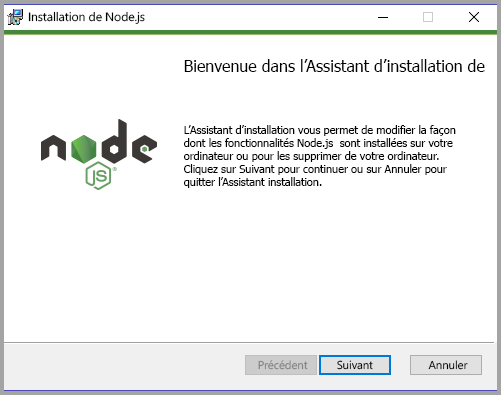

4. Redémarrez l’ordinateur.

### <a name="installing-packages"></a>Installation des packages

Vous devez maintenant installer le package **pbiviz**.

1. Ouvrez Windows PowerShell après le redémarrage de l’ordinateur.

2. Pour installer pbiviz, entrez la commande suivante.

    ```powershell
    npm i -g powerbi-visuals-tools
    ```

### <a name="creating-and-installing-a-certificate"></a>Création et installation d’un certificat

#### <a name="windows"></a>Windows

1. Pour créer un certificat, exécutez la commande suivante.

    ```powershell
    pbiviz --create-cert
    ```

  Elle retourne un résultat qui produit une *phrase secrète*. Dans ce cas, la *phrase secrète* est **_15105661266553327_**.

  

2. Maintenant, nous devons installer le certificat. pour installer le certificat, exécutez la commande suivante.

    ```powershell
    pbiviz --install-cert
    ```

3. Dans l’Assistant Importation de certificat, vérifiez que l’emplacement du magasin est défini sur l’utilisateur actuel. Sélectionnez ensuite *Suivant*.

      

4. À l’étape **Fichier à importer**, sélectionnez *Suivant*.

5. À l’étape **Protection de clé privée**, dans la zone du mot de passe, collez la phrase secrète reçue lors de la création du certificat.  Dans ce cas également, c’est **_15105661266553327_**.

      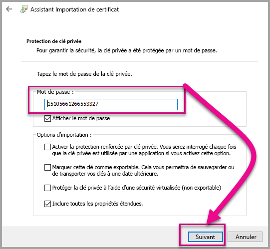

6. À l’étape **Magasin de certificats**, sélectionnez l’option **Placer tous les certificats dans le magasin suivant**. Sélectionner ensuite *Parcourir*.

      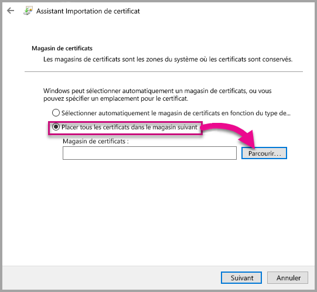

7. Dans la fenêtre **Sélectionner un magasin de certificats**, sélectionnez **Autorités de certification racines de confiance**, puis *OK*. Sélectionnez ensuite *Suivant* sur l’écran **Magasin de certificats**.

      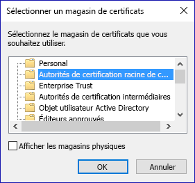

8. Pour terminer l’importation, sélectionnez **Terminer**.

9. Si vous recevez un avertissement de sécurité, sélectionnez **Oui**.

    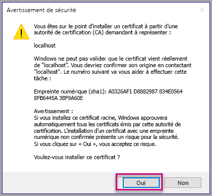

10. Lorsque vous êtes informé que l'importation a réussi, sélectionnez **OK**.

    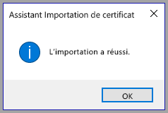

> [!Important]
> Ne fermez pas la session Windows PowerShell.

#### <a name="osx"></a>OSX

1. Si le verrou dans le coin supérieur gauche est verrouillé, sélectionnez-le pour le déverrouiller. Recherchez *localhost*, puis double-cliquez sur le certificat.

    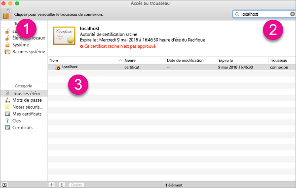

2. Sélectionnez **Toujours faire confiance**fermez la fenêtre.

    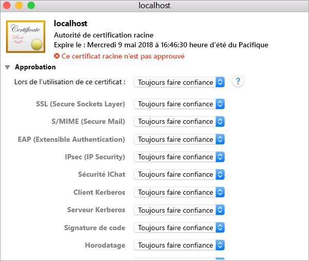

3. Entrez vos nom d’utilisateur et mot de passe. Sélectionnez **Mettre à jour les paramètres**.

    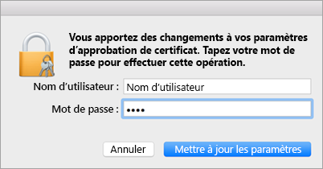

4. Fermez les navigateurs que vous avez ouverts.

> [!NOTE]
> Si le certificat n’est pas reconnu, il se peut que vous deviez redémarrer votre ordinateur.

## <a name="creating-a-custom-visual"></a>Création d’un visuel personnalisé

Maintenant que vous avez configuré votre environnement, il est temps de créer votre visuel personnalisé.

Vous pouvez [télécharger](https://github.com/Microsoft/PowerBI-visuals-circlecard) le code source complet pour ce tutoriel.

1. Vérifiez que le package Power BI Visual Tools a été installé.

    ```powershell
    pbiviz
    ```
    Vous devriez voir la sortie de l’aide.

    <pre><code>
        +syyso+/
    oms/+osyhdhyso/
    ym/       /+oshddhys+/
    ym/              /+oyhddhyo+/
    ym/                     /osyhdho
    ym/                           sm+
    ym/               yddy        om+
    ym/         shho /mmmm/       om+
        /    oys/ +mmmm /mmmm/       om+
    oso  ommmh +mmmm /mmmm/       om+
    ymmmy smmmh +mmmm /mmmm/       om+
    ymmmy smmmh +mmmm /mmmm/       om+
    ymmmy smmmh +mmmm /mmmm/       om+
    +dmd+ smmmh +mmmm /mmmm/       om+
            /hmdo +mmmm /mmmm/ /so+//ym/
                /dmmh /mmmm/ /osyhhy/
                    //   dmmd
                        ++

        PowerBI Custom Visual Tool

    Usage: pbiviz [options] [command]

    Commands:

    new [name]        Create a new visual
    info              Display info about the current visual
    start             Start the current visual
    package           Package the current visual into a pbiviz file
    update [version]  Updates the api definitions and schemas in the current visual. Changes the version if specified
    help [cmd]        display help for [cmd]

    Options:

    -h, --help      output usage information
    -V, --version   output the version number
    --install-cert  Install localhost certificate
    </code></pre>

    <a name="ssl-setup"></a>

2. Examinez la sortie, notamment la liste des commandes prises en charge.

     

3. Pour créer un projet de visuels personnalisés, entrez la commande suivante. **CircleCard** est le nom du projet.

    ```PowerShell
    pbiviz new CircleCard
    ```
    

    > [!Note]
    > Vous créez le projet à l’emplacement actuel de l’invite.

4. Accédez au dossier du projet.

    ```powershell
    cd CircleCard
    ```
5. Démarrez le visuel personnalisé. Votre visuel CircleCard est maintenant exécuté tout en étant hébergé sur votre ordinateur.

    ```powershell
    pbiviz start
    ```

    

> [!Important]
> Ne fermez pas la session Windows PowerShell.

### <a name="testing-the-custom-visual"></a>Test du visuel personnalisé

Dans cette section, nous allons tester le visuel personnalisé CircleCard en téléchargeant un rapport Power BI Desktop, puis en modifiant le rapport pour afficher le visuel personnalisé.

1. Connectez-vous à [PowerBI.com](https://powerbi.microsoft.com/) > accédez à l’**Icône d’engrenage** > puis sélectionnez **Paramètres**.

      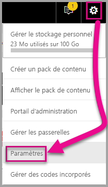

2. Sélectionnez **Développeur**, puis cochez la case **Activer le visuel de développeur pour les tests**.

    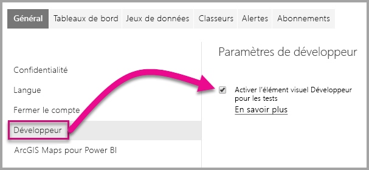

3. Télécharger un rapport Power BI Desktop.  

    Obtenir des données > Fichiers > Fichier local.

    Vous pouvez [télécharger](https://microsoft.github.io/PowerBI-visuals/docs/step-by-step-lab/images/US_Sales_Analysis.pbix) un exemple de rapport Power BI Desktop si vous n’en avez encore créé aucun.

    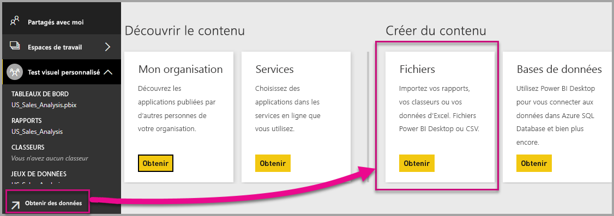 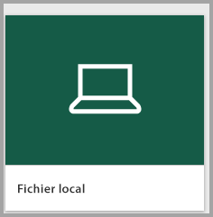

    Pour afficher le rapport, sélectionnez à présent **US_Sales_Analysis** dans la section **Rapport** du volet de navigation gauche.

    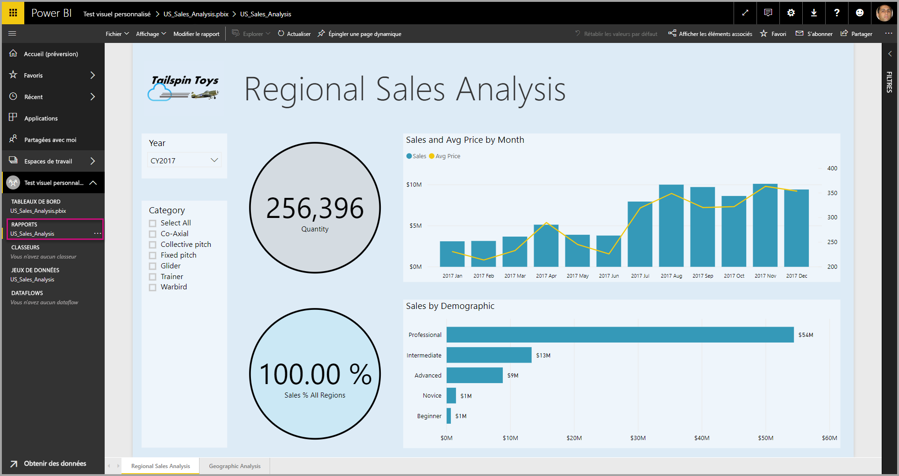

4. Vous devez maintenant modifier le rapport dans le service Power BI.

    Accédez à **Modifier le rapport**.

    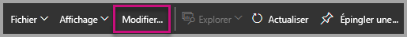

5. Dans le volet **Visualisations**, sélectionnez **Visuel de développeur**.

    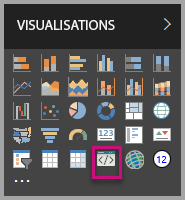

    > [!Note]
    > Cette visualisation représente le visuel personnalisé que vous avez démarré sur votre ordinateur. Il est disponible uniquement lorsque les paramètres de développeur ont été activés.

6. Notez qu’une visualisation a été ajoutée au canevas de rapport.

    

    > [!Note]
    > Il s’agit d’un visuel très simple qui affiche le nombre de fois où sa méthode de mise à jour a été appelée. À ce stade, le visuel ne récupère encore aucune donnée.

7. Lorsque vous sélectionnez le nouveau visuel dans le rapport, accédez au volet Champ > développer les ventes > sélectionner la quantité.

    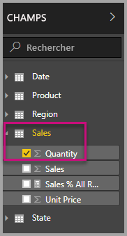

8. Ensuite, pour tester le nouveau visuel, redimensionnez le visuel et notez les incréments de valeurs de mise à jour.

    

Pour arrêter le visuel personnalisé en cours d’exécution dans PowerShell, entrez Ctrl+C. Lorsque vous êtes invité à arrêter le programme de traitement par lots, entrez Y, puis appuyez sur Entrée.

## <a name="adding-visual-elements"></a>Ajout d’éléments visuels

Maintenant, vous devez installer la **bibliothèque D3 JavaScript**. D3 est une bibliothèque JavaScript pour la production de visualisations dynamiques et interactives de données dans les navigateurs web. Elle utilise des normes SVG HTML5 et CSS largement implémentées.

Vous pouvez maintenant développer le visuel personnalisé pour afficher un cercle avec du texte.

> [!Note]
> De nombreuses entrées de texte dans ce tutoriel peuvent être copiées [ici](https://github.com/Microsoft/powerbi-visuals-circlecard).

1. Pour installer la **bibliothèque D3** dans PowerShell, entrez la commande ci-dessous.

    ```powershell
    npm i d3@3.5.5 --save
    ```

    

2. Pour installer les définitions de type pour la  **bibliothèque D3**, entrez la commande ci-dessous.

    ```powershell
    npm i @types/d3@3.5
    ```

    

    Cette commande installe les définitions TypeScript basées sur des fichiers JavaScript, ce qui vous permet de développer le visuel personnalisé dans TypeScript (qui est un sur-ensemble de JavaScript). Visual Studio Code est un IDE idéal pour développer des applications TypeScript.

3. Lancer [Visual Studio Code](https://code.visualstudio.com/).

    Vous pouvez lancer **Visual Studio Code** à partir de PowerShell à l’aide de la commande suivante.

    ```powershell
    code .
    ```

4. Dans le **volet Explorateur**, développez le dossier **node_modules** pour vérifier que la **bibliothèque d3** a été installée.

    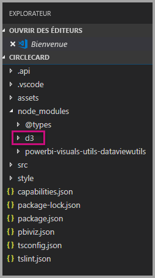

5. Notez le fichier TypeScript, **index.d.ts**, en développant node_modules > @types > d3 dans le **volet Explorer**.

    

6. Sélectionnez le fichier **pbiviz.json**.

7. Pour inscrire la **bibliothèque d3**, entrez la référence de fichier suivante dans le tableau externalJS. Veillez à ajouter une *virgule* entre la référence de fichier existante et la nouvelle référence de fichier.

    ```javascript
    "node_modules/d3/d3.min.js"
    ```
    

8. Enregistrer les modifications du fichier **pbiviz.json**.

### <a name="developing-the-visual-elements"></a>Développement des éléments visuels

Nous pouvons maintenant explorer comment développer le visuel personnalisé pour afficher un cercle et un exemple de texte.

1. Dans le **volet Explorer**, développez le dossier **src**, puis sélectionnez **visual.ts**.

    > [!Note]
    > Notez les commentaires en haut du fichier **visual.ts**. L’utilisation gratuite des packages de visuels personnalisés Power BI est autorisée conformément aux termes du contrat de licence MIT. Dans le cadre du contrat, vous devez laisser les commentaires en haut du fichier.

2. Supprimer la logique de visuel personnalisé par défaut suivante de la classe Visual.
    * Les quatre déclarations de variables privées au niveau de la classe.
    * Toutes les lignes de code du constructeur.
    * Toutes les lignes de code de la méthode de mise à jour.
    * Toutes les lignes restantes dans le module, y compris les méthodes parseSettings et enumerateObjectInstances.

    Vérifiez que le code du module ressemble à ce qui suit.

    ```typescript
    module powerbi.extensibility.visual {
    "use strict";
    export class Visual implements IVisual {

        constructor(options: VisualConstructorOptions) {

        }

        public update(options: VisualUpdateOptions) {

            }
        }
    }
    ```

3. Sous la déclaration de classe *Visual*, insérez les propriétés de classe suivantes.

    ```typescript
     private host: IVisualHost;
     private svg: d3.Selection<SVGElement>;
     private container: d3.Selection<SVGElement>;
     private circle: d3.Selection<SVGElement>;
     private textValue: d3.Selection<SVGElement>;
     private textLabel: d3.Selection<SVGElement>; 
    ```

    

4. Ajoutez le code suivant au *constructeur*.

    ```typescript
    this.svg = d3.select(options.element)
                 .append('svg')
                 .classed('circleCard', true);
    this.container = this.svg.append("g")
                         .classed('container', true);
    this.circle = this.container.append("circle")
                             .classed('circle', true);
    this.textValue = this.container.append("text")
                                 .classed("textValue", true);
    this.textLabel = this.container.append("text")
                                 .classed("textLabel", true);
    ```

    Ce code ajoute un groupe SVG à l’intérieur du visuel, puis ajoute trois formes : un cercle et deux éléments de texte.

    Pour mettre en forme le code dans le document, cliquez avec la touche droite de la souris n’importe où dans le **document Visual Studio Code**, puis sélectionnez **Mettre en forme le document**.

      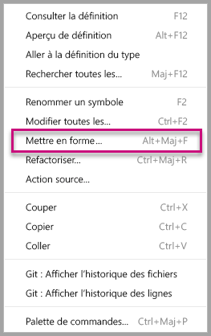

    Pour améliorer la lisibilité, il est recommandé de mettre en forme le document chaque fois que vous collez des extraits de code.

5. Ajoutez le code suivant à la méthode de *mise à jour*.

    ```typescript
    let width: number = options.viewport.width;
    let height: number = options.viewport.height;
    this.svg.attr({
     width: width,
     height: height
    });
    let radius: number = Math.min(width, height) / 2.2;
    this.circle
     .style("fill", "white")
     .style("fill-opacity", 0.5)
     .style("stroke", "black")
     .style("stroke-width", 2)
    .attr({
     r: radius,
     cx: width / 2,
     cy: height / 2
    });
    let fontSizeValue: number = Math.min(width, height) / 5;
    this.textValue
     .text("Value")
     .attr({
         x: "50%",
         y: "50%",
         dy: "0.35em",
         "text-anchor": "middle"
     }).style("font-size", fontSizeValue + "px");
    let fontSizeLabel: number = fontSizeValue / 4;
    this.textLabel
     .text("Label")
     .attr({
         x: "50%",
         y: height / 2,
         dy: fontSizeValue / 1.2,
         "text-anchor": "middle"
     })
     .style("font-size", fontSizeLabel + "px");
    ```

    *Ce code définit la largeur et la hauteur du visuel, puis initialise les attributs et les styles des éléments du visuel.*

6. Enregistrez le fichier **visual.ts**.

7. Sélectionnez le fichier **capabilities.json**.

    À la ligne 14, supprimez la totalité de l’élément objets (lignes 14 à 60).

8. Enregistrez le fichier **capabilities.json**.

9. Dans PowerShell, démarrez le visuel personnalisé.

    ```powershell
    pbiviz start
    ```

### <a name="toggle-auto-reload"></a>Activer/désactiver le rechargement automatique

1. Retournez au rapport Power BI.
2. Dans la barre d’outils flottante au-dessus du visuel de développeur, sélectionnez **Activer/désactiver le rechargement automatique**.

    

    Cette option garantit que le visuel est rechargé automatiquement chaque fois que vous enregistrez des modifications apportées au projet.

3. À partir du **volet Champs**, faites glisser le champ **Quantité** dans le visuel de développeur.

4. Vérifiez que le visuel ressemble à ce qui suit.

    

5. Redimensionnez le visuel.

    Notez que les valeurs du cercle et du texte s’adaptent à la dimension disponible du visuel.

    La méthode de mise à jour est appelée en continu avec redimensionnement du visuel, et il en résulte un redimensionnement fluide des éléments visuels.

    Vous avez maintenant développé les éléments visuels.

6. Poursuivez l’exécution du visuel.

## <a name="configuring-data-binding"></a>Configuration de la liaison de données

Définissez les rôles des données et les mappages des vues de données, puis modifiez la logique du visuel personnalisé pour afficher la valeur et le nom d’affichage d’une mesure.

### <a name="configuring-the-capabilities"></a>Configuration des fonctionnalités

Modifiez le fichier **capabilities.json** pour définir le rôle des données et les mappages des vues de données.

1. Dans Visual Studio Code, dans le fichier **capabilities.json**, tableau **dataRoles**, supprimez tout le contenu (lignes 3 à 12).

2. À l’intérieur du tableau **dataRoles**, insérez le code suivant.

    ```json
    {
     "displayName": "Measure",
     "name": "measure",
     "kind": "Measure"
    }
    ```
    Le tableau **dataRoles** définit à présent un rôle unique de données de type **mesure**, qui est nommé **mesure** et s’affiche sous la forme **Mesure**. Ce rôle de données permet de transmettre soit un champ de mesure, soit un champ résumé.

3. Dans le tableau **dataViewMappings**, supprimez tout le contenu (lignes 10 à 31).

4. Dans le tableau **dataViewMappings**, insérez le contenu suivant.

    ```json
            {
            "conditions": [
                { "measure": { "max": 1 } }
            ],
            "single": {
                "role": "measure"
            }
           }
    ```
    Le tableau **dataViewMappings** définit à présent qu’un champ peut passer au rôle de données nommé **mesure**.

5. Enregistrez le fichier **capabilities.json**.

6. Dans Power BI, notez que le visuel peut maintenant être configuré avec **Mesure**.

    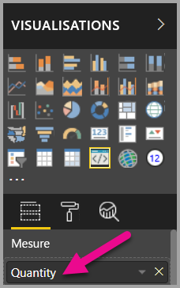

    > [!Note]
    > Le projet de visuel n’inclut pas encore la logique de liaison de données.

### <a name="exploring-the-dataview"></a>Exploration de la vue des données

1. Dans la barre d’outils flottante au-dessus du visuel, sélectionnez **Afficher le Dataview**.

    

2. Développez vers le bas dans **unique**, puis notez la valeur.

    

3. Développez jusqu’aux **métadonnées**, puis jusqu’au tableau **colonnes**, en notant tout particulièrement les valeurs **format** et **displayName**.

    

4. Pour revenir au visuel, dans la barre d’outils flottante au-dessus du visuel, sélectionnez **Afficher le Dataview**.

    

### <a name="configuring-data-binding"></a>Configuration de la liaison de données

1. Dans **Visual Studio Code**, dans le fichier **visual.ts**, ajoutez l’instruction suivante en tant que la première instruction de la méthode de mise à jour.

    ```typescript
    let dataView: DataView = options.dataViews[0];
    ```
    

    Cette instruction assigne *dataView* à une variable pour un accès facile et déclare la variable pour référencer l’objet *dataView*.

2. Dans la méthode de **mise à jour**, replace.text("Value") ** par ce qui suit.

    ```typescript
    .text(dataView.single.value as string)
    ```
    

3. Dans la méthode **mettre à jour**, remplacez **.text(“Label”)** par ce qui suit.

    ```typescript
    .text(dataView.metadata.columns[0].displayName)
    ```
    

4. Enregistrez le fichier **visual.ts**.

5. Dans **Power BI**, passez en revue le visuel, qui affiche maintenant la valeur et le nom d’affichage.

Vous avez maintenant configuré les rôles de données et lié le visuel à l’objet dataview.

Dans le tutoriel suivant, vous allez apprendre à ajouter des options de mise en forme au visuel personnalisé.

## <a name="debugging"></a>Débogage

Pour obtenir des conseils sur le débogage de votre élément visuel personnalisé, voir le [guide de débogage](https://microsoft.github.io/PowerBI-visuals/docs/how-to-guide/how-to-debug/).

## <a name="next-steps"></a>Étapes suivantes

> [!div class="nextstepaction"]
> [Ajout d’options de mise en forme](custom-visual-develop-tutorial-format-options.md)
