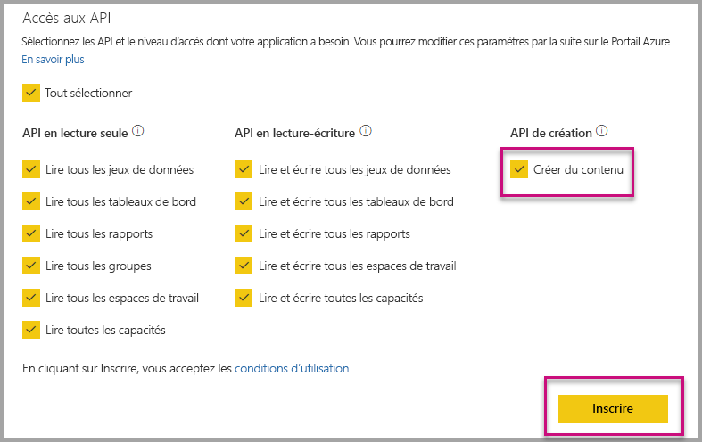

# Installer automatiquement les applications Power BI lors de l’incorporation pour votre organisation

Pour incorporer du contenu à partir d’une application, l’utilisateur qui est l’incorporation doit avoir [accès à l’application](../service-create-distribute-apps.md). Si l’application est installée pour l’utilisateur, puis l’incorporation travaille en étroite collaboration. Pour plus d’informations, consultez [incorporer des rapports ou tableaux de bord à partir de l’application](embed-from-apps.md). Il est possible de définir dans PowerBI.com toutes les applications pouvant être [installé automatiquement](https://powerbi.microsoft.com/blog/automatically-install-apps/). Toutefois, cette action est effectuée au niveau du client et s’applique à toutes les applications.

## Installer automatiquement l’application sur l’incorporation

Si un utilisateur a accès à une application, mais l’application n’est pas installé, puis l’incorporation échoue. Afin d’éviter ces échecs lors de l’incorporation d’une application, vous pouvez autoriser l’installation automatique de l’application lors de l’incorporation. Cela signifie que si l’application que tente d’incorporer de l’utilisateur n’est pas installée, il est automatiquement installé pour vous. Par conséquent, le contenu que vous voulez est incorporé immédiatement, ce qui entraîne une expérience sans heurts pour l’utilisateur.

## Incorporer des utilisateurs de Power BI (utilisateur l'possède les données)

Pour autoriser l’installation automatique des applications pour vos utilisateurs, vous devez donner à votre application l’autorisation « Créer contenu » lorsque [l’inscription de votre application](register-app.md#register-with-the-power-bi-application-registration-tool), ou ajoutez-le si vous déjà inscrit votre application.

Ensuite, vous devez fournir l’ID d’application dans l’URL d’incorporation. Pour fournir l’ID d’application, le créateur de l’application doit tout d’abord installer l’application, puis utilisez une des prises en charge [API Rest Power BI](https://docs.microsoft.com/rest/api/power-bi/) appels - [Get Reports](https://docs.microsoft.com/rest/api/power-bi/reports/getreports) ou [Get Dashboards](https://docs.microsoft.com/rest/api/power-bi/dashboards/getdashboards). Puis le créateur de l’application doit prendre l’Url d’incorporation de la réponse de l’API REST. L’ID d’application s’affiche dans l’URL si le contenu émane d’une application.  Une fois que vous avez l’URL d’incorporation, vous pouvez l’utiliser pour incorporer régulièrement.

## Sécuriser les incorporer

Pour utiliser l’installation automatique des applications, le créateur de l’application doit tout d’abord installer l’application, puis accédez à l’application sur PowerBI.com, accédez au rapport, puis obtient le lien de manière habituelle. Tous les autres utilisateurs ayant accès à l’application que vous pouvez utiliser le lien peuvent incorporer le rapport.

## Considérations et limitations

* Vous pouvez incorporer uniquement les rapports et tableaux de bord pour ce scénario.

* Cette fonctionnalité est actuellement pas pris en charge l’application possède les données et de scénarios d’incorporation de SharePoint.