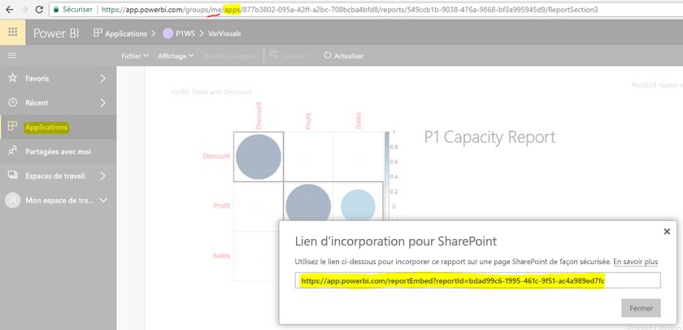

# Incorporer des rapports ou des tableaux de bord à partir d’applications

Dans **Power BI**, vous pouvez créer des applications qui rassemblent des **tableaux de bord** et des **rapports** connexes à un même emplacement, puis les publier pour de grands groupes de personnes au sein de votre organisation. L’utilisation de ces applications est pertinente quand tous vos utilisateurs sont des utilisateurs Power BI, pour que vous puissiez partager du contenu avec eux à l’aide d’applications Power BI. Nous souhaitons partager quelques étapes rapides sur la façon d’accomplir l’incorporation de contenu hors d’une application Power BI publiée et dans une application tierce.

## Comment récupérer l’URL d’incorporation de rapport pour l’incorporation

1. Instanciez l’application dans un espace de travail utilisateur (« Mon espace de travail ») en partageant avec vous-même ou en guidant un autre utilisateur à travers ce flux.

2. Ouvrez le rapport souhaité dans le service Power BI.

3. Accédez à Fichier -> Incorporer dans SharePoint Online, puis récupérez l’URL d’incorporation de rapport à cet endroit (visible dans la capture ci-dessous) ou appelez l’API REST GetReports/GetReport et extrayez le champ embedURL du rapport correspondant hors de la réponse. (Notez que lors de l’appel à REST, l’URL ne doit pas inclure d’identificateur d’espace de travail, car l’application a été instanciée dans l’espace de travail de l’utilisateur.)

4. Utilisez l’URL d’incorporation récupérée à l’étape 3 à utiliser avec le kit SDK JS.

    

## Comment récupérer l’URL d’incorporation de tableau de bord pour l’incorporation

1. Instanciez l’application dans un espace de travail utilisateur (« Mon espace de travail ») en partageant avec vous-même ou en guidant un autre utilisateur à travers ce flux.

2. Appelez l’API REST GetDashboards et extrayez le champ embedURL du tableau de bord correspondant hors de la réponse. (Notez que lors de l’appel à REST, l’URL ne doit pas inclure d’identificateur d’espace de travail, car l’application a été instanciée dans l’espace de travail de l’utilisateur.)

3. Utilisez l’URL d’incorporation récupérée à l’étape 4 à utiliser avec notre kit SDK JS.

## Étapes suivantes

Découvrez aussi comment incorporer à partir d’espaces de travail d’application pour vos clients tiers et votre organisation.

> [!div class="nextstepaction"]
>[Incorporer pour les clients tiers](embed-sample-for-customers.md)

> [!div class="nextstepaction"]
>[Incorporer pour votre organisation](embed-sample-for-your-organization.md)