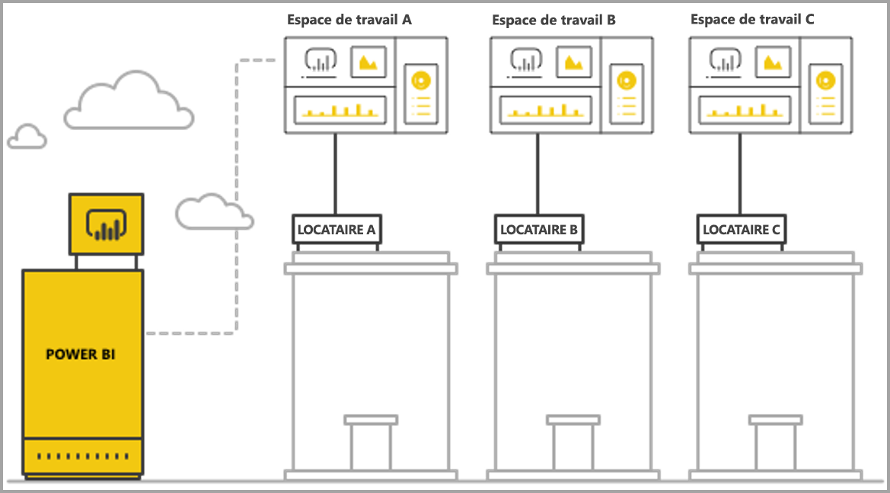
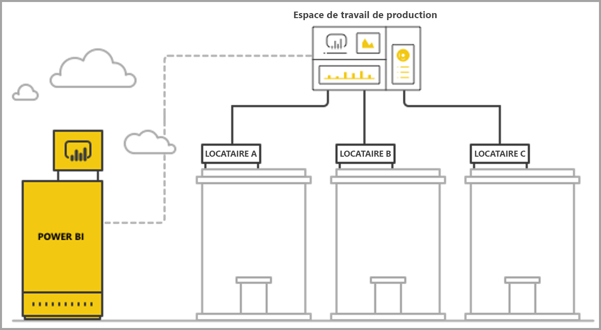

# Gérer la mutualisation avec l’analytique incorporée Power BI

Lorsque vous concevez une application SaaS multi-locataire, vous devez choisir avec soin le modèle de location qui répond le mieux aux besoins de votre application SaaS. Ce processus s’applique également à Power BI en tant que partie d’analytique incorporée de votre application SaaS. Un modèle de location détermine comment les données de chaque locataire sont mappées et gérées au sein de Power BI et du compte de stockage. Votre modèle de location affecte la conception et la gestion de l’application. Changer ultérieurement de modèle peut être coûteux et entraîner une interruption.

Avec Power BI Embedded, deux approches fondamentales principales sont possibles pour préserver la séparation entre les locataires.

   1. **Isolation basée sur l’espace de travail** : création d’un espace de travail Power BI distinct par locataire.
   2. **Isolation basée sur la sécurité au niveau des lignes** : dans laquelle les données sous-jacentes sont utilisées pour contrôler et gérer l’accès aux données par utilisateur ou par groupe.

Cet article décrit les différentes approches et les analyse en fonction de plusieurs critères d’évaluation.

## Concepts et terminologie

**[AAD](https://docs.microsoft.com/en-us/azure/active-directory/fundamentals/active-directory-whatis)** : Azure Active Directory.

**Application AAD** : identité d’application dans AAD. Une application AAD est nécessaire pour l’authentification.

**Application SaaS (logiciel en tant que service)** : système implémenté par une entreprise ou un éditeur de logiciels indépendant qui est généralement un service en ligne. Il peut également s’agir de systèmes logiciels associés conçus pour servir plusieurs locataires clients (organisations). Pour cet article, **l’application SaaS utilise Power BI Embedded pour fournir des analyses à ses différents locataires**. Power BI Embedded s’applique également à tous les types d’applications lorsqu’ils disposent d’une connexion en ligne.

**Locataire** : client (organisation) qui utilise l’application SaaS et les ressources ou données fournies par le client à l’application SaaS.

**[Power BI](../power-bi-overview.md)** : service cloud Power BI qui sert de plateforme pour Power BI Embedded.

**Locataire Power BI** : ensemble de ressources Power BI associées à un locataire AAD.

**[Espace de travail Power BI](../service-create-workspaces.md)** : conteneur du contenu dans Power BI.

**Artefacts Power BI** : il existe plusieurs artefacts Power BI dans les espaces de travail Power BI tels que les tableaux de bord, rapports, jeux de données et flux de données.

**[Power BI Embedded](azure-pbie-what-is-power-bi-embedded.md)** : ensemble d’API publiques qui permettent aux développeurs de créer des applications qui gèrent du contenu Power BI et incorporent des éléments Power BI.

**[Sécurité au niveau des lignes (SNL)](embedded-row-level-security.md)** : permet de contrôler l’accès utilisateur aux données de lignes individuelles dans une table. Vous pouvez implémenter une sécurité au niveau des lignes au niveau de la source de données ou dans le modèle sémantique Power BI.

**Utilisateur maître** : identité qui représente l’application SaaS dans Power BI et qui est utilisée par l’application SaaS lors de l’appel d’API Power BI. Il doit s’agir d’un utilisateur AAD disposant d’une licence Power BI Pro.

**Utilisateur d’application AAD (principal du service)** : identité qui représente l’application SaaS dans Power BI et qui est utilisée par l’application SaaS lors de l’appel d’API Power BI. Il doit s’agir d’une application web AAD. Il peut remplacer l’utilisateur *maître* pour s’authentifier auprès de Power BI.

**Capacité** : ensemble de ressources dédiées à l’exécution du service Power BI. Les [capacités Power BI Premium](../service-premium.md) sont destinées aux entreprises utilisant Power BI en interne, tandis que les [capacités Power BI Embedded](azure-pbie-create-capacity.md) sont conçues pour les développeurs d’applications développant des applications SaaS pour des tiers.

**[Licence Power BI Pro](../service-admin-purchasing-power-bi-pro.md)** : licence basée sur l’utilisateur qui octroie des droits de publication de contenu sur les espaces de travail d’application, de consommation des applications sans la capacité Premium, de partage des tableaux de bord et d’abonnement aux rapports et tableaux de bord.

**[Modes de connectivité de données](../desktop-directquery-about.md)** : connexion de sources de données à Power BI qui peut être effectuée dans différents modes :

   * Importer : l’approche la plus courante pour obtenir des données.
   * DirectQuery : connexion directe aux données contenues dans son référentiel source.
   * Connexion active : autre mode qui se connecte directement aux données Analysis Services (Azure et localement).

## Critères d’évaluation

Le meilleur choix de modèle mutualisé approprié pour votre application SaaS varie en fonction des besoins métiers et techniques spécifiques, de l’architecture de données et bien d’autres encore. Le fait de bien comprendre ces besoins, ainsi que les options et compromis de modèle de location disponibles, peut vous aider à définir une architecture robuste, performante, économique et évolutive pour votre application SaaS.

Vous trouverez ci-dessous un ensemble d’éléments à prendre en compte lors du choix entre les différents modèles de location.

### Architecture de données

En règle générale, les développeurs qui créent des applications avec Power BI Embedded disposent déjà d’une base de données à locataire unique ou multi-locataire. Il est plus facile d’utiliser un modèle de location pour Power BI Embedded similaire au modèle de location de la base de données. Si le modèle de location de la base de données n’a pas été défini, vous souhaiterez peut-être prendre en compte d’aspects avant de déterminer votre architecture de données.

### Isolation des données

Quelle est la sensibilité des données stockées ? De quel niveau d’isolation avez-vous besoin pour séparer les différents locataires clients ? La réponse peut varier entre les différents secteurs d’activité ou clients spécifiques ayant certains besoins.

### Extensibilité

Pour trouver la meilleure solution, définissez l’échelle à atteindre dans un avenir proche. N’oubliez pas qu’une solution qui pourrait convenir maintenant peut ne pas suffire lorsque l’utilisation et les données augmentent. Lors de l’analyse de l’extensibilité, prenez en compte la liste suivante :

   * Nombre de locataires (clients).
   * Nombre de rapports, tableaux de bord et jeux de données de chaque locataire.
   * Taille des données sur chaque jeu de données et fréquence d’actualisation.
   * Nombre d’utilisateurs.
   * Nombre d’utilisateurs simultanés pendant les heures de pointe.

Certaines applications SaaS peuvent avoir un faible nombre de clients et une faible utilisation, mais de grandes quantités de données. D’autres peuvent avoir de nombreux clients et une utilisation intensive, mais une petite quantité de données et des rapports pour chaque client. Un nombre élevé dans ces situations peut avoir un impact sur les coûts et la complexité opérationnelle futurs.

### Automatisation et complexité opérationnelle

Identifiez les processus fréquents ayant besoin d’une automatisation.

   * Quelle est la fréquence d’intégration de nouveaux locataires ? Quelles sont les actions nécessaires pour intégrer complètement chacun d’entre eux ?
   * Quelle est la cadence de publication de nouveau contenu Power BI ou mis à jour qui doit être déployé ?
   * Combien de rôles de sécurité au niveau des lignes sont définis pour chaque locataire ?  

L’identification de ces processus et de leurs méthodes de résolution peut vous aider à comprendre la complexité opérationnelle impliquée dans la gestion de chaque modèle.

### Besoins de résidence des données et nécessité de prise en charge de plusieurs zones géographiques

Power BI Embedded prend en charge le déploiement multigéographique (fonctionnalité d’évaluation). La fonctionnalité [multigéographique](embedded-multi-geo.md) permet de déployer des ressources Power BI Embedded dans différentes régions avec un contenu spécifique destiné à résider dans des régions spécifiques. Cette fonctionnalité peut être utilisée dans tous les modèles, mais peut avoir un impact sur la quantité de contenu à gérer et les coûts. La fonctionnalité multigéographique est actuellement conçue pour répondre à des besoins de résidence des données et n’améliore pas la performance en rapprochant les données des consommateurs.

### Cost

[Power BI Embedded](https://azure.microsoft.com/en-us/services/power-bi-embedded/) inclut un modèle d’achat basé sur les ressources, tel que **Power BI Premium**. Vous achetez une ou plusieurs capacités avec une puissance de calcul et une mémoire fixes. Cette capacité est le facteur de coût principal lorsque vous utilisez **Power BI Embedded**. Le nombre d’utilisateurs utilisant la capacité est illimité. La seule limite concerne la performance de la capacité. Une [licence Power BI Pro](../service-admin-licensing-organization.md) est nécessaire pour chaque utilisateur *maître* ou des utilisateurs spécifiques devant accéder au portail Power BI.

Nous vous recommandons de tester et de mesurer la charge prévue sur votre capacité en simulant l’environnement et l’utilisation, puis d’effectuer un test de charge sur la capacité. Vous pouvez mesurer la charge et la performance avec les diverses mesures disponibles dans la capacité Azure ou l’[application de mesures de capacité Premium](../service-admin-premium-monitor-capacity.md).

### Personnalisation et création de contenu

Deux approches des applications SaaS permettent aux utilisateurs de modifier et de créer des rapports ou de charger des données dans le service en tant que partie du flux :

   * [Mode de modification/création dans un iFrame incorporé](https://github.com/Microsoft/PowerBI-JavaScript/wiki/Create-Report-in-Embed-View) : l’utilisateur obtient une vue du rapport ou une nouvelle zone de dessin vide dans l’application SaaS. Il peut ainsi utiliser la barre d’outils de Power BI pour créer du contenu basé sur un jeu de données dans l’espace de travail. Nous recommandons cette option dans la mesure où elle se trouve dans le contexte de l’utilisateur, dans un environnement familier. La prise en main de l’utilisation et de la modification est simplifiée, et l’utilisateur génère un rapport lié à un jeu de données existant.

   * Utilisez Power BI Desktop pour créer du contenu et le charger via l’interface utilisateur de l’application SaaS dans l’espace de travail. Dans cette approche, les utilisateurs disposent d’un plus grand nombre d’outils à utiliser avec Power BI Desktop. Nous déconseillons toutefois cette approche dans la mesure où les utilisateurs doivent connaître un outil supplémentaire en dehors du contexte de l’application SaaS. Charger un fichier PBIX implique que l’utilisateur ajoute un jeu de données supplémentaire, qui peut être un doublon de jeux de données déjà présents dans l’espace de travail.

## Isolation basée sur l’espace de travail Power BI

Avec l’isolation basée sur l’espace de travail Power BI, l’application SaaS prend en charge plusieurs locataires à partir d’un seul locataire Power BI. L’isolation basée sur l’espace de travail contient l’ensemble du contenu Power BI utilisé par différents locataires. La séparation des locataires s’effectue au niveau de l’espace de travail Power BI, en créant plusieurs espaces de travail. Chaque espace de travail contient les jeux de données, rapports et tableaux de bord utiles pour ce locataire. En outre, chaque espace de travail est lié uniquement aux données du locataire. Si vous avez besoin d’une isolation supplémentaire, vous pouvez créer un utilisateur *maître* ou un principal du service pour chaque espace de travail et son contenu.

### Architecture de données

Deux approches principales de gestion des données du locataire sont possibles.

* Une base de données distincte par locataire
* Une base de données multi-locataire unique

Si le stockage de l’application SaaS conserve une base de données distincte par locataire, la solution naturelle consiste à utiliser des jeux de données à locataire unique dans Power BI avec la chaîne de connexion de chaque jeu de données pointant vers la base de données correspondante.

Si le stockage de l’application SaaS utilise une base de données multi-locataire pour tous les locataires, il est facile de séparer les locataires par espace de travail. Vous pouvez configurer la connexion de base de données du jeu de données Power BI avec une requête de base de données pouvant être paramétrée qui ne récupère que les données du locataire utiles. Vous pouvez mettre à jour la connexion à l’aide de [Power BI Desktop](../desktop-query-overview.md) ou à l’aide de l’[API](https://docs.microsoft.com/rest/api/power-bi/datasets/updatedatasourcesingroup) avec des [paramètres](https://docs.microsoft.com/en-us/rest/api/power-bi/datasets/updateparametersingroup) sur la requête.

### Isolation des données

Dans ce modèle de location, les données sont séparées au niveau de l’espace de travail. Un mappage simple entre un espace de travail et un locataire empêche les utilisateurs d’un locataire de voir le contenu d’un autre locataire. Le recours à un utilisateur *maître* unique nécessite que vous ayez accès à l’ensemble des différents espaces de travail. La configuration des données affichées par l’utilisateur final est définie lors de la [génération du jeton incorporé](https://docs.microsoft.com/en-us/rest/api/power-bi/embedtoken), un processus principal uniquement que les utilisateurs finaux ne peut pas voir ni modifier.

Pour ajouter une isolation supplémentaire, un développeur d’applications peut définir un utilisateur *maître* ou une application par l’espace de travail plutôt qu’un utilisateur *maître* ou une application unique ayant accès à plusieurs espaces de travail. Vous pouvez ainsi vous assurer que toute erreur humaine ou fuite d’informations d’identification n’entraîne pas une exposition des données de plusieurs clients.

### Extensibilité

Un avantage de ce modèle est tel que la séparation des données en plusieurs jeux de données pour chaque locataire permet de pallier les [limites de taille d’un jeu de données unique](https://docs.microsoft.com/en-us/power-bi/service-premium-large-datasets) (de 10 Go actuellement dans une capacité). Lorsque la capacité est dépassée, [les jeux de données non utilisés peuvent être supprimés](../service-premium-understand-how-it-works.md) pour libérer de la mémoire pour les jeux de données actifs. Ceci n’est pas possible avec un jeu de données volumineux unique. Grâce à plusieurs jeux de données, il est également possible de séparer les locataires entre plusieurs capacités Power BI si nécessaire. [En savoir plus sur le fonctionnement de la capacité](../service-admin-premium-manage.md).

Malgré ces avantages, vous devez prendre en compte l’échelle que l’application SaaS peut atteindre ultérieurement. Par exemple, une application peut atteindre les limitations du nombre d’artefacts qu’elle peut effectivement gérer. Pour plus de détails, consultez les [limitations](#summary-comparison-of-the-different-approaches) de déploiement plus loin dans cet article. La référence SKU de capacité utilisée présente une limite de taille de mémoire à laquelle les jeux de données doivent s’adapter, [de nombre d’actualisations pouvant être exécutées simultanément](../service-premium-understand-how-it-works.md) et de fréquence maximale d’actualisation des données. Il est recommandé de tester lorsque vous gérez des centaines, voire des milliers, de jeux de données. Il est également recommandé de prendre en compte le volume moyen et maximal d’utilisation, ainsi que les locataires spécifiques ayant des jeux de données volumineux ou des modèles d’utilisation différents, qui sont gérés différemment des autres locataires.

### Automatisation et complexité opérationnelle

Avec l’isolation basée sur l’espace de travail Power BI, un développeur d’applications devra peut-être gérer des centaines, voire des milliers, d’artefacts. Vous devez définir les processus qui se produisent fréquemment dans la gestion du cycle de vie de votre application, et vous assurer de disposer de l’ensemble d’outils approprié pour effectuer ces opérations à l’échelle dans ce modèle de location. Des exemples d’opérations incluent, entre autres :

   * Ajout d’un nouveau locataire (client)
   * Mise à jour d’un rapport ou d’un tableau de bord pour certains ou tous les locataires
   * Mise à jour du schéma de jeu de données pour certains ou tous les locataires
   * Personnalisations non planifiées pour des locataires spécifiques
   * Fréquence d’actualisation du jeu de données

Par exemple, la création d’un espace de travail pour un nouveau locataire est une tâche courante qui doit être automatisée. Grâce à l’[API REST Power BI](https://docs.microsoft.com/rest/api/power-bi/), vous pouvez obtenir une [automatisation complète pendant la création d’espaces de travail](https://powerbi.microsoft.com/blog/duplicate-workspaces-using-the-power-bi-rest-apis-a-step-by-step-tutorial/).

### Besoins multigéographiques

La fonction multigéographique implique d’acheter une capacité dans les régions souhaitées et d’associer un espace de travail à cette capacité. Si vous devez prendre en charge différents locataires dans différentes régions, vous devez associer l’espace de travail du locataire à une capacité dans la région souhaitée. Il s’agit d’une opération simple dont le coût équivaut à placer tous les espaces de travail dans la même capacité. Toutefois, si vos locataires doivent placer des données dans plusieurs régions, tous les artefacts de l’espace de travail doivent être dupliqués dans chaque capacité régionale, augmentant ainsi le coût et la complexité de gestion.

### Cost

Les développeurs d’applications utilisant Power BI Embedded doivent [acheter une capacité Power BI Embedded pour accéder à la production](embed-sample-for-customers.md#move-to-production).  Il est important de comprendre l’impact du modèle d’isolation basée sur l’espace de travail et son effet sur les capacités.

Le modèle d’isolation basée sur l’espace de travail convient bien aux capacités pour les raisons suivantes :

   * Le plus petit objet que vous pouvez associer indépendamment à une capacité est un espace de travail (vous ne pouvez donc pas associer un rapport, par exemple). En séparant les locataires par espaces de travail, vous disposez d’une flexibilité totale dans la gestion de chaque locataire et de ses besoins de performances, optimisant ainsi l’utilisation de la capacité grâce à une mise à l’échelle vers le haut ou le bas. Par exemple, les locataires volumineux et fondamentaux caractérisés par un volume et une volatilité élevés peuvent être gérés dans une capacité distincte pour garantir un niveau de service homogène, tout en regroupant les locataires plus petits dans une autre capacité afin d’optimiser les coûts.

   * La séparation des espaces de travail implique également de séparer les jeux de données entre les locataires de sorte que les modèles de données puissent se trouver dans des blocs plus petits plutôt que dans un jeu de données volumineux unique. Avec cette tâche, la capacité est en mesure de mieux l’utilisation de la mémoire, de supprimer les petits jeux de données non utilisés lorsqu’ils sont inutiles, tout en garantissant la satisfaction des utilisateurs vis-à-vis des performances.

Les développeurs d’applications doivent prendre en compte la limite du nombre d’actualisations parallèles, car les processus d’actualisation peuvent nécessiter une capacité supplémentaire lorsque vous disposez de plusieurs jeux de données.

### Personnalisation et création de contenu

Pour les principaux cas d’utilisation de création de contenu, le développeur d’applications doit déterminer rigoureusement les locataires pouvant disposer de fonctions d’édition et le nombre d’utilisateurs de chaque locataire pouvant modifier. Autoriser plusieurs utilisateurs de chaque locataire à modifier peut entraîner la génération d’un volume élevé de contenu, qui peut atteindre une limitation de jeu de données comme le nombre de rapports par jeu de données ou le nombre de jeux de données dans un espace de travail. Si vous accordez cette fonctionnalité à des utilisateurs, nous vous recommandons, si nécessaire, de surveiller rigoureusement la génération de contenu et la montée en puissance. Pour les mêmes raisons, nous déconseillons l’utilisation de cette fonctionnalité pour la personnalisation du contenu, dans laquelle chaque utilisateur peut apporter des modifications mineures à un rapport et l’enregistrer pour lui-même. Si l’application SaaS permet de personnaliser le contenu, envisagez de présenter et de communiquer les stratégies de rétention d’espace de travail relatives au contenu spécifique à l’utilisateur afin de faciliter le flux de suppression de contenu lorsque les utilisateurs finaux accèdent à un nouveau poste, quittent l’entreprise ou n’utilisent plus la plateforme.

## Isolation basée sur la sécurité au niveau des lignes

Avec l’isolation basée sur la sécurité au niveau des lignes, l’application SaaS utilise un seul espace de travail pour héberger plusieurs locataires. Cela signifie que chaque rapport, tableau de bord et jeu de données d’artefact Power BI est créé lorsque tous les locataires l’utilisent. La séparation des données entre les locataires s’effectue à l’aide de la [sécurité au niveau des lignes](embedded-row-level-security.md) sur le jeu de données multi-locataire. Lorsque des utilisateurs finaux se connectent à l’application SaaS et ouvrent du contenu, un jeton incorporé est généré pour cette session utilisateur, et contient les rôles et filtres qui garantissent que l’utilisateur ne voit que les données qu’il est autorisé à voir. Si les utilisateurs d’un même locataire ne sont pas autorisés à voir les mêmes données, le développeur d’applications doit implémenter des rôles hiérarchiques entre les locataires et au sein du même locataire.

### Architecture de données

L’implémentation de l’isolation basée sur la sécurité au niveau des lignes est plus aisée lorsque les données de tous les locataires sont stockées dans un même entrepôt de données. Dans ce cas, le développeur d’applications peut transmettre les données pertinentes de l’entrepôt de données dans le jeu de données Power BI uniquement, via une Requête directe ou une importation de données. Si les données contenues dans la base de données sont séparées par locataire, elles doivent être combinées dans un jeu de données unique, ce qui entraîne un degré de séparation entre les locataires inférieur à celui existant dans la base de données.

### Isolation des données

Avec l’isolation basée sur la sécurité au niveau des lignes, la séparation des données s’effectue à l’aide de [définitions de sécurité au niveau des lignes](embedded-row-level-security.md) sur le jeu de données, ce qui signifie que toutes les données coexistent. Cette forme de séparation des données est plus vulnérable aux fuites de données dues à une erreur de développement. Bien que la sécurité au niveau des lignes soit effectuée sur le serveur principal et sécurisée pour un utilisateur final, si les données sont très sensibles ou si les clients demandent une séparation des données, il peut être préférable d’utiliser l’isolation basée sur l’espace de travail.

### Extensibilité

Avec l’isolation basée sur la sécurité au niveau des lignes, les données doivent tenir dans la limite de taille du jeu de données, qui est actuellement de 10 Go. Avec l’introduction de l’[actualisation incrémentielle](../service-premium-incremental-refresh.md) et la publication à venir d’un point de terminaison XMLA pour les jeux de données Power BI, la limite de taille du jeu de données devrait augmenter de manière significative. Les données doivent toutefois toujours tenir dans la mémoire de la capacité, avec suffisamment de mémoire restante pour l’exécution des actualisations de données. Les déploiements à grande échelle ont besoin d’une capacité importante pour éviter que les utilisateurs ne rencontrent des problèmes liés à une mémoire dépassant les limites de la capacité actuelle. D’autres méthodes de gestion de l’échelle incluent l’utilisation d’**[agrégations](../desktop-aggregations.md)** ou la connexion directe à la source de données à l’aide d’une connexion DirectQuery ou active, plutôt que la mise en cache de toutes les données dans la capacité Power BI.

### Automatisation et complexité opérationnelle

La gestion des artefacts est bien plus simple avec l’isolation basée sur la sécurité au niveau des lignes qu’avec l’isolation basée sur l’espace de travail, car il n’existe qu’une seule version d’un artefact pour chaque environnement (développement/test/production) au lieu d’une version par locataire. À grande échelle, la gestion des artefacts implique de gérer et de mettre à jour des dizaines d’artefacts plutôt que des milliers, voire des dizaines des milliers.

Power BI n’inclut pas encore d’API permettant de modifier ou de créer des rôles et règles SNL. L’ajout ou la modification de rôles ne peut être effectuée que manuellement dans Power BI Desktop. Si une hiérarchie SNL doit être appliquée, elle peut être complexe et source d’erreurs de gestion si vous ne la planifiez pas rigoureusement.

Si le développeur d’applications doit gérer de nombreux rôles et définitions de rôles qui doivent être créés ou mis à jour fréquemment, l’isolation basée sur la sécurité au niveau des lignes n’est pas évolutive du point de vue de la facilité de gestion.

Une autre complexité opérationnelle réside dans la nécessité de surveiller étroitement l’utilisation de la mémoire et de créer un mécanisme d’alertes et de mise à l’échelle fiable afin de garantir une expérience optimale pour les utilisateurs.  

### Besoins multigéographiques

Dans la mesure où toutes les données sont stockées dans un jeu de données unique, il est difficile de répondre aux besoins de résidence des données qui nécessitent que certaines données soient liées à des emplacements spécifiques. Ceci peut également augmenter considérablement les coûts d’utilisation de plusieurs régions, car toutes les données sont répliquées et stockées dans chaque région. Si un nombre limité seulement de locataires a besoin de zones géographiques différentes, vous pouvez conserver les données de ces locataires uniquement dans une autre région en utilisant le modèle d’isolation basée sur l’espace de travail décrit ci-dessus.

### Cost

Le facteur de coût principal lié à l’isolation basée sur la sécurité au niveau des lignes est l’empreinte mémoire du jeu de données. Vous avez besoin d’une capacité suffisante pour stocker le jeu de données et disposer d’une mémoire tampon supplémentaire pour les pics de demande de mémoire. Une méthode d’atténuation de ce problème consiste à stocker les données dans une base de données SQL Server ou un cube SQL Server Analysis Services et à utiliser une connexion Direct Query ou active pour récupérer les données de la source de données en temps réel. Cette approche augmente les coûts des sources de données, mais réduit la nécessité d’une grande capacité due aux besoins en mémoire, réduisant ainsi les coûts de capacité Power BI.

### Personnalisation et création de contenu

Lorsque les utilisateurs finaux modifient ou créent des rapports, ils peuvent utiliser le jeu de données multi-locataire de production. C’est la raison pour laquelle nous vous conseillons d’utiliser uniquement l’option d’iFrame incorporé pour modifier ou [créer des rapports](https://github.com/Microsoft/PowerBI-JavaScript/wiki/Create-Report-in-Embed-View), car elle repose sur le même jeu de données avec la sécurité au niveau des lignes appliquée. Le fait que les utilisateurs chargent des fichiers PBIX avec des jeux de données supplémentaires peut être coûteux et difficile à gérer avec l’isolation basée sur la sécurité au niveau des lignes. De plus, lorsque les utilisateurs génèrent du nouveau contenu dans le même espace de travail, vous devez vous assurer que l’espace de travail de production n’atteint pas ses limites et vous devez créer un mécanisme fiable pour distinguer le contenu associé à tel ou tel locataire.

## Comparaison récapitulative des différentes approches

> [!Important]
> L’analyse suivante est basée sur l’état actuel du produit. Dans la mesure où nous publions chaque mois de nouvelles fonctionnalités, nous développons sans cesse de nouvelles fonctions et fonctionnalités qui répondent aux limitations et points faibles existants. Veillez à consulter nos billets de blog mensuels pour découvrir les nouveautés et revenez à cet article pour voir comment les fonctionnalités affectent la suggestion de modèle de location.

| Critères d’évaluation | Basé sur l’espace de travail   | Basé sur la sécurité au niveau des lignes  |  |  |
|--------------------------------------|----------------------------------------------------------------------------------------------------------------------|---------------------------------------------------------------------------------------|---|---|
| Architecture de données  | La plus simple lorsqu’il existe une base de données distincte par locataire  | La plus simple lorsque toutes les données de tous les locataires se trouvent dans un entrepôt de données unique   |  |  |
| Isolation des données  | Correct. Chaque locataire possède un jeu de données dédié.  | Modéré. Toutes les données se trouvent dans un jeu de données partagé unique, mais gérées via un contrôle d’accès.  |  |  |
| Extensibilité  | Moyen. Diviser les données entre plusieurs jeux de données permet une optimisation.  | Minimal. Contrainte par les limites de jeu de données.  |  |  |
| Besoins multigéographiques  | Adaptée lorsque la plupart des locataires se trouvent dans une seule région.  | Non recommandé. L’ensemble du jeu de données doit être stocké dans plusieurs régions.  |  |  |
| Automatisation et complexité opérationnelle  | Automatisation correcte pour chaque locataire.   Gestion complexe de nombreux artefacts à l’échelle.  | Gestion simple des artefacts Power BI mais gestion complexe de la SNL à l’échelle.  |  |  |
| Cost  | Faible à moyen. Permet d’optimiser l’utilisation afin de réduire les coûts par locataire.  Peut augmenter lorsque des actualisations fréquentes sont nécessaires.  | Moyen à élevé si vous utilisez le mode d’importation.  Faible à moyen si vous utilisez le mode Direct Query.  |  |  |
| Personnalisation et création de contenu  | Adapté. Peut atteindre les limitations à grande échelle.  | Génération de contenu dans l’iFrame incorporé uniquement  |  |  |

## Considérations et limitations relatives au déploiement

**Limites d’artefact Power BI :**

* Le nombre d’espaces de travail V1 (groupes) dont un utilisateur/une application peut être un membre/administrateur est de 250.
* Le nombre d’espaces de travail V2 (dossiers) dont un utilisateur/une application peut être un membre/administrateur est de 1 000.
* Le nombre de jeux de données dans un espace de travail est de 1 000.
* Le nombre de rapports/tableaux de bord liés à un jeu de données est de 1 000.
* La limite de taille de mémoire de jeu de données pour charger un fichier *.pbix* est de 10 Go.

**Considérations et limitations relatives à la capacité Power BI :**

* Chaque capacité ne peut utiliser que sa mémoire et ses V-cores alloués, selon la [référence SKU achetée](../service-premium.md).
* Pour connaître la taille de jeu de données recommandée pour chaque référence SKU, consultez [Jeux de données volumineux Premium](../service-premium-large-datasets.md).
* La taille maximale de jeu de données dans une capacité dédiée est de 10 Go.
* Le nombre d’actualisations planifiées pour un jeu de données en *mode d’importation* par jour est de 48.
* L’intervalle entre les actualisations planifiées pour un jeu de données en *mode d’importation* est de 30 minutes.
* Pour le nombre d’actualisations pouvant être exécutées simultanément sur une capacité, consultez la [gestion et l’optimisation des ressources](../service-premium-understand-how-it-works.md).
* La durée moyenne de mise à l’échelle d’une capacité est comprise entre 1 et 2 minutes. Pendant ce temps, la capacité n’est pas disponible. Nous vous recommandons d’utiliser une approche de montée en puissance parallèle pour [éviter les temps d’arrêt](https://powerbi.microsoft.com/blog/power-bi-developer-community-november-update-2018/#scale-script).

## Étapes suivantes

* [Analytique incorporée avec Power BI](embedding.md)
* [Power BI Embedded](azure-pbie-what-is-power-bi-embedded.md)
* [Power BI Premium](../service-premium.md)
* [Sécurité au niveau des lignes](embedded-row-level-security.md)