# Tutoriel : Incorporer un rapport, un tableau de bord ou une vignette Power BI dans une application pour les clients
Avec **Power BI Embedded dans Azure**, vous pouvez incorporer des rapports, des tableaux de bord et des vignettes dans une application à l’aide de l’exemple **App Owns Data (L’application possède les données)**. **Application possède des données** vise à permettre d’avoir une application qui utilise Power BI comme sa plateforme d’analyse incorporée. Ce scénario concerne généralement les **développeurs des éditeurs de logiciels indépendants**. En tant que **développeur d’éditeur de logiciels indépendant**, vous pouvez créer du contenu Power BI qui affiche des rapports, des tableaux de bord ou des vignettes dans une application qui est entièrement intégrée et interactive, sans exiger des utilisateurs de l’application qu’ils disposent d’une licence Power BI, ou même qu’ils sachent que c’est Power BI qui se cache derrière. Ce tutoriel montre comment intégrer un rapport dans une application avec le Kit de développement logiciel (SDK) **Power BI** .NET ainsi que l’API JavaScript **Power BI** en utilisant **Power BI Embedded dans Azure**  pour vos clients suivant un modèle **L’application possède les données**.

Dans ce tutoriel, vous allez découvrir comment :
>[!div class="checklist"]
>* inscrire une application dans Azure ;
>* incorporer un rapport Power BI dans une application.

## Conditions préalables
Pour commencer, vous avez besoin d’un compte **Power BI Pro** qui sera votre **compte principal** et d’un abonnement **Microsoft Azure**.

* Si vous n’avez pas d’abonnement à **Power BI Pro**, [inscrivez-vous à un essai gratuit](https://powerbi.microsoft.com/en-us/pricing/) avant de commencer.
* Si vous n’avez pas d’abonnement Azure, créez un [compte gratuit](https://azure.microsoft.com/free/?WT.mc_id=A261C142F) avant de commencer.
* Vous aurez besoin de votre propre installation de [client Azure Active Directory ](create-an-azure-active-directory-tenant.md).
* [Visual Studio](https://www.visualstudio.com/) doit être installé (version 2013 ou ultérieure).

## Configurer l’environnement de développement d’analytique incorporée

Avant de commencer à incorporer des rapports, des tableaux de bord ou des vignettes dans votre application, vérifiez que votre environnement est configuré de façon à autoriser l’incorporation. Dans le cadre de la configuration, vous devez effectuer les opérations suivantes.

### Inscrire une application dans Azure Active Directory (Azure AD)

Inscrivez votre application sur Azure Active Directory pour l’autoriser à accéder aux API REST Power BI. Vous pourrez ainsi établir une identité pour votre application et spécifier des autorisations sur les ressources REST de Power BI.

1. Acceptez les [conditions d’utilisation de l’API Microsoft Power BI](https://powerbi.microsoft.com/api-terms).

2. Connectez-vous au [portail Azure](https://portal.azure.com).
 
    

3. Dans le volet de navigation de gauche, choisissez **Tous les services** et sélectionnez **Inscriptions d’applications**, puis **Nouvelle inscription d’application**.
   
     
    

4. Suivez les invites pour créer une application. Dans le cas où les applications possèdent les données, il est nécessaire d’utiliser le type d’application **Natif**. Vous devez également indiquer un **URI de redirection**, qui sera utilisé par **Azure AD** pour retourner des réponses de jeton. Entrez une valeur propre à votre application (par exemple, http://localhost:13526/redirect).

    

### Appliquer des autorisations à une application dans Azure Active Directory

Il est nécessaire d’activer des autorisations supplémentaires pour l’application en plus de celles qui ont été spécifiées sur la page d’inscription de l’application. Vous devrez utiliser le compte *principal* servant à l’incorporation, et il devra s’agir d’un compte Administrateur général.

### Utiliser le portail Azure Active Directory

1. Accédez à [Inscriptions des applications](https://portal.azure.com/#blade/Microsoft_AAD_IAM/ApplicationsListBlade) dans le portail Azure, puis sélectionnez l’application que vous utilisez pour l’incorporation.
   
    

2. Sélectionnez **Paramètres** ; ensuite, sous **Accès aux API**, sélectionnez **Autorisations requises**.
   
    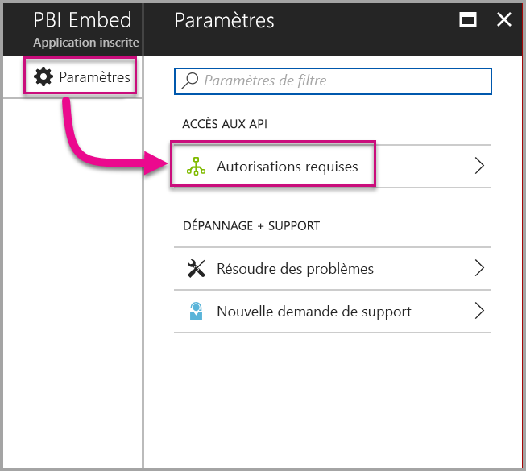

3. Sélectionnez **Windows Azure Active Directory** puis vérifiez que l’option **Accéder au répertoire en tant qu’utilisateur actuellement connecté** est sélectionnée. Sélectionnez **Enregistrer**.
   
    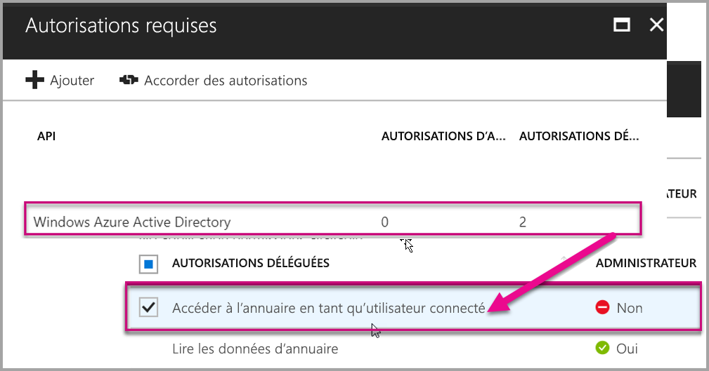

4. Sélectionnez **Ajouter**.

    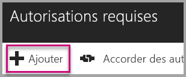

5. Sélectionnez **Sélectionner une API**.

    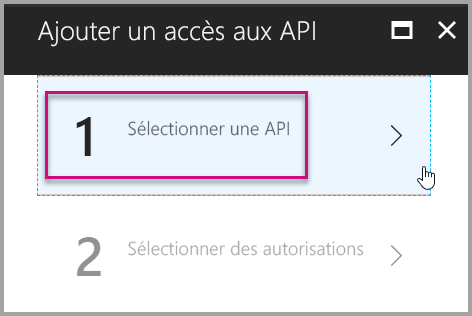

6. Sélectionnez **Service Power BI**, puis **Sélectionner**.

    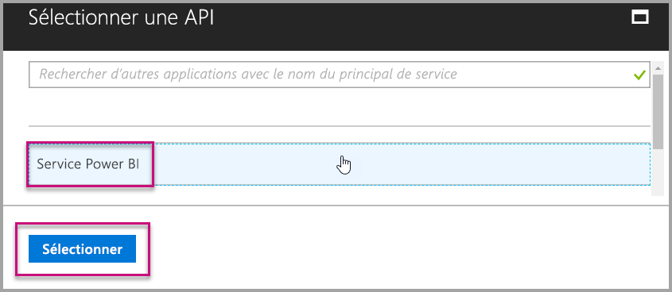

7. Sous **Autorisations déléguées**, sélectionnez toutes les autorisations. Vous devez les sélectionner une par une afin d’enregistrer les sélections. Lorsque vous avez terminé, sélectionnez **Enregistrer**.
   
    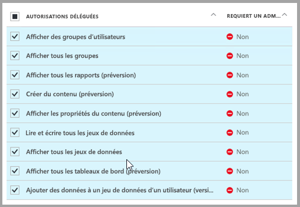

8. Dans **Autorisations requises**, sélectionnez **Accorder des autorisations**.
   
    L’action **Accorder des autorisations** est nécessaire pour éviter qu’Azure AD exige une confirmation du *compte principal*. Si le compte qui effectue cette action est celui d’un administrateur global, vous pouvez accorder des autorisations pour tous les utilisateurs de votre organisation pour cette application. Si le compte qui effectue cette action est le *compte principal* et pas celui d’un administrateur global, vous pouvez uniquement accorder des autorisations au *compte principal* pour cette application.
   
    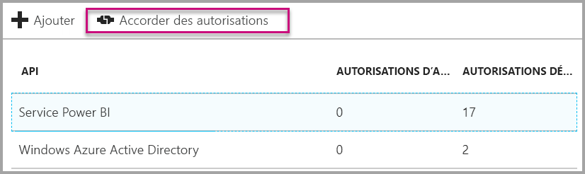

## Configurer un environnement Power BI

### Créer un espace de travail d’application

Si vous incorporez des rapports, des tableaux de bord ou des vignettes pour vos clients, vous devez placer votre contenu au sein d’un espace de travail d’application. Le compte *principal* doit être administrateur de cet espace de travail d’application.

1. Commencez par créer l’espace de travail. Sélectionnez **Espaces de travail** > **Créer un espace de travail d’application**. C’est à cet endroit que sera placé le contenu auquel votre application devra avoir accès.

    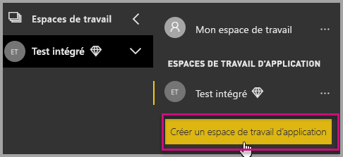

2. Nommez l’espace de travail. Si l’**ID d’espace de travail** correspondant n’est pas disponible, modifiez-le de façon à obtenir un ID unique. Ce sera aussi le nom de l’application.

    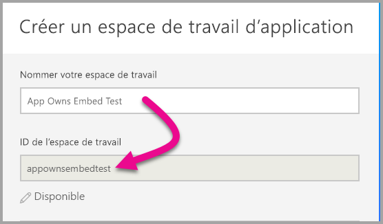

3. Vous devez définir quelques options. Si vous choisissez **Public**, toute personne au sein de votre organisation peut voir le contenu de l’espace de travail. En revanche, **Privé** signifie que seuls les membres de l’espace de travail peuvent en voir le contenu.

    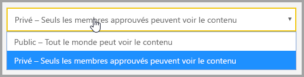

    Vous ne pouvez pas modifier le paramètre Public/Privé après avoir créé le groupe.

4. Vous pouvez également spécifier si les membres peuvent **apporter des modifications** ou consulter en **lecture seule**.

    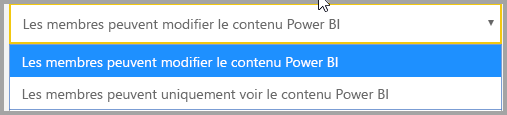

5. Ajouter les adresses e-mail des personnes qui doivent avoir accès à l’espace de travail, puis sélectionnez **Ajouter**. Vous ne pouvez ajouter d’alias de groupe, uniquement des individus.

6. Décidez pour chaque personne si celle-ci est membre ou administrateur. Les administrateurs peuvent modifier l’espace de travail, y compris y ajouter des membres. Les membres peuvent modifier le contenu de l’espace de travail, sauf s’ils disposent d’un accès en affichage seul. Les administrateurs et les membres peuvent publier l’application.

Vous pouvez à présent voir le nouvel espace de travail. Power BI crée l’espace de travail et l’ouvre. Celui-ci figure dans la liste des espaces de travail dont vous êtes membre. Étant donné que vous êtes administrateur, vous pouvez sélectionner les points de suspension (…) pour revenir en arrière afin d’apporter des modifications, d’ajouter des membres ou de modifier leurs autorisations.

   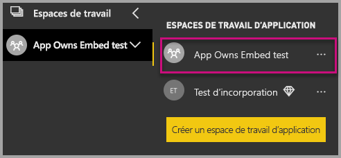

### Créer et publier des rapports

Vous pouvez créer vos rapports et jeux de données à l’aide de Power BI Desktop, puis publier ces rapports dans un espace de travail d’applications. Pour publier les rapports dans un espace de travail d’applications, l’utilisateur final doit disposer d’une licence Power BI Pro.

1. Téléchargez l’exemple [Blog Demo](https://github.com/Microsoft/powerbi-desktop-samples) (Démonstration blog) sur GitHub.

    

2. Ouvrez l’exemple de rapport PBIX dans **Power BI Desktop**.

   

3. Publiez-le sur **l’espace de travail d’application**.

   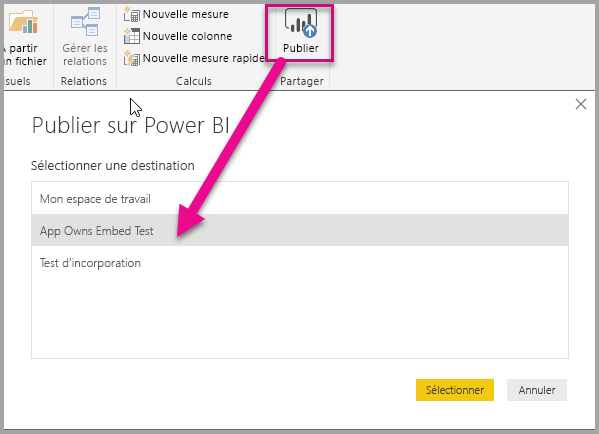

    Vous pouvez à présent voir le rapport dans le service Power BI en ligne.

   

## Incorporer du contenu

L’incorporation pour vos clients dans votre application exige que vous obteniez un **jeton d’accès** pour votre compte principal à partir d’**Azure AD**. Il est obligatoire d’[obtenir un jeton d’accès à Azure AD](get-azuread-access-token.md#access-token-for-non-power-bi-users-app-owns-data) pour votre application Power BI à l’aide du modèle L’application possède les données avant d’effectuer des appels à l’API Power BI.

Suivez ces étapes pour commencer l’incorporation de votre contenu à l’aide d’un exemple d’application.

1. Téléchargez [l’exemple App Owns Data](https://github.com/Microsoft/PowerBI-Developer-Samples) (L’application possède les données) sur GitHub pour commencer.

    

2. Ouvrez le fichier Web.config dans l’exemple d’application. Il y a cinq champs à renseigner pour pouvoir exécuter l’application : **clientID**, **groupId**, **reportId**, **pbiUsername** et **pbiPassword**.

      

    * Renseignez l’information **clientId** avec **l’ID d’application** provenant **d’Azure**. **L’ID client** permet à l’application de s’identifier auprès des utilisateurs auxquels vous demandez des autorisations. Pour obtenir la valeur **clientId**, suivez les étapes ci-dessous :

    1. Connectez-vous au [portail Azure](https://portal.azure.com).

        

    2. Dans le volet de navigation de gauche, choisissez **Tous les services**, puis sélectionnez **Inscriptions d’applications**.

        
    3. Sélectionnez l’application pour laquelle vous souhaitez récupérer la valeur **clientId**.

        

    4. Un **ID d’application** devrait être listé au format GUID. Utilisez cet **ID d’application** comme **clientId** de l’application.

             

    * Renseignez l’information **groupId** avec le **GUID d’espace de travail d’application** provenant de Power BI.

        

    * Renseignez l’information **reportId** avec le **GUID de rapport** provenant de Power BI.

            

    * Renseignez le champ **pbiUsername** avec le compte Power BI d’utilisateur principal.
    * Renseignez le champ **pbiPassword** avec le mot de passe du compte Power BI d’utilisateur principal.

3. Exécutez l’application !

    Tout d’abord, sélectionnez **Exécuter** dans **Visual Studio**.

    

    Ensuite, sélectionnez **Incorporer un rapport**. Sélectionnez l’option correspondant au contenu choisi pour le test (rapports, tableaux de bord ou vignettes) dans l’application.

    
 
    Vous pouvez à présent voir le rapport dans l’exemple d’application.

    

## Passer à la production

Maintenant que vos avez terminé de développer votre application, il est temps de sauvegarder votre espace de travail d’application avec une capacité dédiée. Une capacité dédiée est nécessaire de passer à la production.

### Créer une capacité dédiée
En créant une capacité dédiée, vous pouvez tirer parti du fait de disposer d’une ressource dédiée pour votre client. Les espaces de travail non affectés à une capacité dédiée sont attribués à une capacité partagée. Vous pouvez créer une capacité dédiée à l’aide de la solution relative à la [capacité dédiée Power BI Embedded](https://docs.microsoft.com/azure/power-bi-embedded/create-capacity) dans Azure.

>[!Note]
>Les jetons incorporés avec des licences PRO étant destinés aux tests de développement, le nombre de jetons incorporés qu’un compte principal Power BI peut générer est limité. Vous devez acheter une capacité dédiée pour l’incorporation dans un environnement de production. Avec une capacité dédiée, le nombre de jetons incorporés que vous pouvez générer n’est pas limité. Accédez à [Obtenir les fonctionnalités disponibles](https://msdn.microsoft.com/library/mt846473.aspx) pour vérifier la valeur d’utilisation qui indique l’utilisation actuelle d’Embedded en pourcentage.
>

### Affecter un espace de travail d’application à une capacité dédiée

Une fois la capacité dédiée créée, affectez-lui l’espace de travail d’application. Pour ce faire, effectuez les étapes suivantes.

1. Dans le **service Power BI**, développez les espaces de travail, puis sélectionnez les points de suspension en regard de l’espace de travail avec lequel vous incorporez votre contenu. Sélectionnez ensuite **Modifier l’espace de travail**.

    

2. Développez **Avancé**, activez **Capacité dédiée**, puis sélectionnez la capacité dédiée que vous avez créée. Ensuite, sélectionnez **Enregistrer**.

    

Pour obtenir un exemple complet d’utilisation de l’API JavaScript, vous pouvez utiliser [l’outil Playground](https://microsoft.github.io/PowerBI-JavaScript/demo). C’est un moyen rapide de jouer avec différents types d’exemples Power BI Embedded. Des informations supplémentaires sur l’API JavaScript sont également disponibles sur la page du [wiki PowerBI-JavaScript](https://github.com/Microsoft/powerbi-javascript/wiki).

Pour toute question sur Power BI Embedded, consultez la page [FAQ](embedded-faq.md).  Si vous rencontrez des problèmes liés à Power Bi Embedded au sein de votre application, consultez la page [Résolution des problèmes](embedded-troubleshoot.md).

D’autres questions ? [Essayez d’interroger la communauté Power BI](http://community.powerbi.com/)