# <a name="tutorial-embed-power-bi-content-into-an-application-for-your-customers"></a>Tutoriel : Incorporer du contenu Power BI dans une application pour vos clients

Avec **Power BI Embedded dans Azure**, vous pouvez incorporer des rapports, des tableaux de bord et des vignettes dans une application à l’aide de l’exemple App Owns Data (L’application possède les données). **Application possède des données** vise à permettre d’avoir une application qui utilise Power BI comme sa plateforme d’analyse incorporée. En tant que **développeur chez un éditeur de logiciels indépendant**, vous pouvez créer du contenu Power BI qui affiche des rapports, des tableaux de bord ou des vignettes dans une application qui est entièrement intégrée et interactive, sans exiger des utilisateurs qu’ils disposent d’une licence Power BI. Ce tutoriel montre comment intégrer un rapport dans une application avec le kit SDK .NET Power BI et l’API JavaScript Power BI en utilisant **Power BI Embedded dans Azure** pour vos clients.

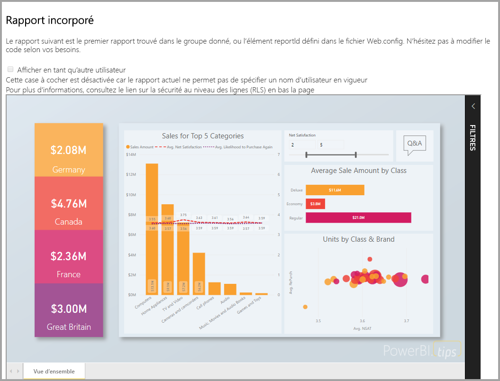

Dans ce tutoriel, vous allez découvrir comment :
> [!div class="checklist"]
> * inscrire une application dans Azure ;
> * incorporer un rapport Power BI dans une application.

## <a name="prerequisites"></a>Conditions préalables

Pour commencer, vous devez disposer des éléments suivants :

* Un [compte Power BI Pro](../service-self-service-signup-for-power-bi.md) (compte principal composé d’un nom d’utilisateur et d’un mot de passe pour se connecter à votre compte Power BI Pro) ou un [principal de service (jeton d’application uniquement)](embed-service-principal.md).
* Un abonnement [Microsoft Azure](https://azure.microsoft.com/).
* Vous avez besoin de votre propre installation d’un [locataire Azure Active Directory](create-an-azure-active-directory-tenant.md).

Si vous n’avez pas d’abonnement à **Power BI Pro**, [inscrivez-vous à un essai gratuit](https://powerbi.microsoft.com/pricing/) avant de commencer.

Si vous n’avez pas d’abonnement Azure, créez un [compte gratuit](https://azure.microsoft.com/free/?WT.mc_id=A261C142F) avant de commencer.

## <a name="set-up-your-embedded-analytics-development-environment"></a>Configurer votre environnement de développement d’analytique incorporée

Avant de commencer à incorporer des rapports, des tableaux de bord ou des vignettes dans votre application, vérifiez que votre environnement autorise l’incorporation avec Power BI.

Vous pouvez accéder à [l’outil de configuration de l’incorporation](https://aka.ms/embedsetup/AppOwnsData) pour démarrer rapidement et télécharger un exemple d’application qui vous guide tout au long de la création d’un environnement et de l’incorporation d’un rapport.

Cependant, si vous choisissez de configurer l’environnement manuellement, vous pouvez continuer et suivre les instructions ci-dessous.

### <a name="register-an-application-in-azure-active-directory-azure-ad"></a>Inscrire une application dans Azure Active Directory (Azure AD)

[Inscrivez votre application](register-app.md) auprès d’Azure Active Directory pour l’autoriser à accéder aux [API REST Power BI](https://docs.microsoft.com/rest/api/power-bi/). Cette inscription vous permet ainsi d’établir une identité pour votre application et de spécifier des autorisations sur les ressources REST de Power BI. La façon dont vous commencez à inscrire une application varie selon que vous souhaitez utiliser un compte principal ou un [principal de service](embed-service-principal.md).

La méthode que vous choisissez affecte le type d’application que vous inscrivez dans Azure.

Si vous décidez d’utiliser un compte principal, procédez à l’inscription d’une application **native**. Le choix d’une application native s’explique par le fait que vous utilisez une connexion non interactive.

Si vous décidez d’utiliser le principal de service, vous devez procéder à l’inscription d’une **application web côté serveur**. Vous inscrivez une application web côté serveur pour créer un secret d’application.

## <a name="set-up-your-power-bi-environment"></a>Configurer votre environnement Power BI

### <a name="create-an-app-workspace"></a>Créer un espace de travail d’application

Si vous incorporez des rapports, des tableaux de bord ou des vignettes pour vos clients, vous devez placer votre contenu au sein d’un espace de travail d’application. Les espaces de travail que vous pouvez configurer sont de deux types : les [espaces de travail traditionnels](../service-create-workspaces.md) et les [nouveaux espaces de travail](../service-create-the-new-workspaces.md). Si vous utilisez un compte *principal*, le type d’espace de travail n’a pas d’importance. Par contre, si vous utilisez un *[principal de service](embed-service-principal.md)* pour vous connecter à votre application, vous devez recourir aux nouveaux espaces de travail. Dans les deux cas, le compte *principal* ou le *principal de service* doit être administrateur des espaces de travail d’application impliqués dans votre application.

### <a name="create-and-publish-your-reports"></a>Créer et publier des rapports

Vous pouvez créer vos rapports et jeux de données à l’aide de Power BI Desktop, puis publier ces rapports dans un espace de travail d’applications. Vous pouvez accomplir cette tâche deux façons : en tant qu’utilisateur final, vous pouvez publier des rapports dans un espace de travail d’application traditionnel avec un compte principal (licence Power BI Pro). Si vous utilisez un principal de service, vous pouvez publier des rapports dans les nouveaux espaces de travail à l’aide des [API REST Power BI](https://docs.microsoft.com/rest/api/power-bi/imports/postimportingroup).

Les étapes ci-dessous montrent comment publier votre rapport PBIX dans votre espace de travail Power BI.

1. Téléchargez l’exemple [Blog Demo](https://github.com/Microsoft/powerbi-desktop-samples) (Démonstration blog) sur GitHub.

    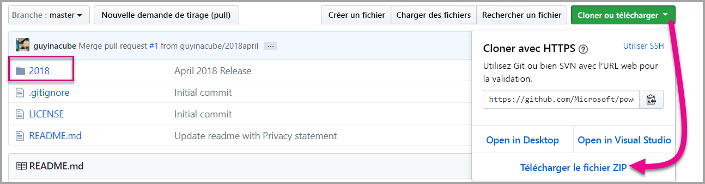

2. Ouvrez l’exemple de rapport PBIX dans **Power BI Desktop**.

   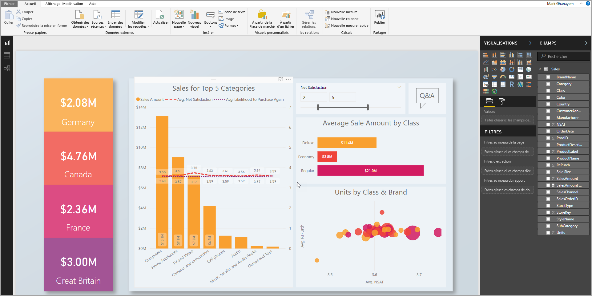

3. Publiez-le dans les **espaces de travail d’application**. Ce processus diffère selon que vous utilisez un compte principal (licence Power BI Pro) ou un principal de service. Si vous utilisez un compte principal, vous pouvez publier votre rapport par le biais de Power BI Desktop.  Par contre, si vous utilisez un principal de service, vous devez utiliser les API REST Power BI.

## <a name="embed-content-using-the-sample-application"></a>Incorporer du contenu en utilisant l’exemple d’application

Cet exemple est intentionnellement simple pour faciliter la démonstration. C’est à vous ou à vos développeurs de protéger le secret de l’application ou les informations d’identification du compte principal.

Suivez les étapes ci-dessous pour commencer l’incorporation de votre contenu en utilisant l’exemple d’application.

1. Téléchargez [Visual Studio](https://www.visualstudio.com/) (version 2013 ou ultérieure). Veillez à télécharger le dernier [package NuGet](https://www.nuget.org/profiles/powerbi).

2. Téléchargez [l’exemple App Owns Data](https://github.com/Microsoft/PowerBI-Developer-Samples) (L’application possède les données) sur GitHub pour commencer.

    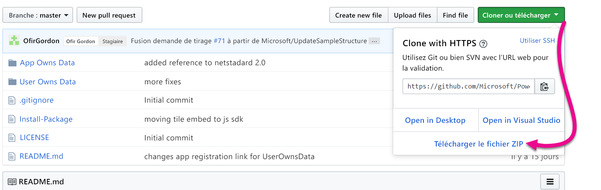

3. Ouvrez le fichier **Web.config** dans l’exemple d’application. Vous devez renseigner certains champs pour pouvoir exécuter l’application. Vous pouvez choisir **MasterUser** ou **ServicePrincipal** comme **AuthenticationType**. Les champs que vous devez renseigner varient en fonction du type de méthode d’authentification que vous choisissez.

    > [!Note]
    > La valeur par défaut d’**AuthenticationType** dans cet exemple est MasterUser.

    <center>

    | **MasterUser** <br> (licence Power BI Pro) | **ServicePrincipal** <br> (jeton d’application uniquement)|
    |---------------|-------------------|
    | [applicationId](#application-id) | [applicationId](#application-id) |
    | [workspaceId](#workspace-id) | [workspaceId](#workspace-id) |
    | [reportId](#report-id) | [reportId](#report-id) |
    | [pbiUsername](#power-bi-username-and-password) |  |
    | [pbiPassword](#power-bi-username-and-password) |  |
    |  | [applicationsecret](#application-secret) |
    |  | [tenant](#tenant) |

   </center>

    

### <a name="application-id"></a>ID de l’application

Cet attribut est nécessaire pour les deux types d’authentification : compte principal et [principal de service](embed-service-principal.md).

Dans le champ **applicationId**, indiquez **l’ID d’application** **d’Azure**. L’information **applicationId** est utilisée par l’application pour s’identifier auprès des utilisateurs auxquels vous demandez des autorisations.

Pour récupérer la valeur **applicationId**, suivez ces étapes :

1. Connectez-vous au [portail Azure](https://portal.azure.com).

2. Dans le volet de navigation de gauche, sélectionnez **Tous les services**, puis **Inscriptions d’applications**.

    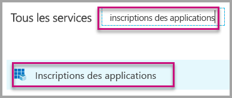

3. Sélectionnez l’application ayant besoin de la valeur **applicationId**.

    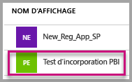

4. Un **ID d’application** est listé au format GUID. Utilisez cet **ID d’application** comme **applicationId** de l’application.

    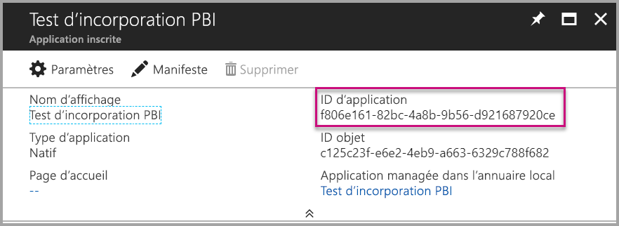

### <a name="workspace-id"></a>ID de l’espace de travail

Cet attribut est nécessaire pour les deux types d’authentification : compte principal et [principal de service](embed-service-principal.md).

Dans **workspaceId**, indiquez le GUID d’espace de travail d’application (groupe) provenant de Power BI. Vous pouvez obtenir ces informations à partir de l’URL quand vous êtes connecté au service Power BI ou à l’aide de Powershell.

URL <br>

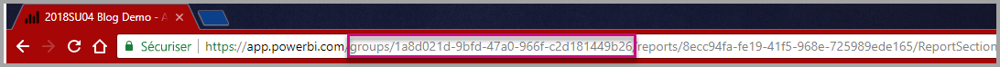

PowerShell <br>

```powershell
Get-PowerBIworkspace -name "App Owns Embed Test"
```

   

### <a name="report-id"></a>ID du rapport

Cet attribut est nécessaire pour les deux types d’authentification : compte principal et [principal de service](embed-service-principal.md).

Dans **reportId**, indiquez le GUID de rapport provenant de Power BI. Vous pouvez obtenir ces informations à partir de l’URL quand vous êtes connecté au service Power BI ou à l’aide de Powershell.

URL<br>


PowerShell <br>

```powershell
Get-PowerBIworkspace -name "App Owns Embed Test" | Get-PowerBIReport
```


### <a name="power-bi-username-and-password"></a>Nom d’utilisateur et mot de passe Power BI

Ces attributs sont uniquement nécessaires pour l’authentification au moyen d’un compte principal.

Si vous utilisez un [principal de service](embed-service-principal.md) pour vous authentifier, il est inutile de renseigner les attributs du nom d’utilisateur et du mot de passe.

* Dans **pbiUsername**, indiquez le compte principal Power BI.
* Dans **pbiPassword**, indiquez le mot de passe du compte principal Power BI.

### <a name="application-secret"></a>Secret de l’application

Cet attribut est uniquement nécessaire pour l’authentification au moyen d’un [principal de service](embed-service-principal.md).

Renseignez les informations **ApplicationSecret** à partir de la section **Clés** de votre section **Inscriptions d’applications** dans **Azure**.  Cet attribut fonctionne quand vous utilisez un [principal de service](embed-service-principal.md).

Pour obtenir la valeur **ApplicationSecret**, effectuez les étapes suivantes :

1. Connectez-vous au [portail Azure](https://portal.azure.com).

2. Dans le volet de navigation de gauche, sélectionnez **Tous les services**, puis **Inscriptions des applications**.

    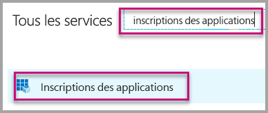

3. Sélectionnez l’application qui doit utiliser la valeur **ApplicationSecret**.

    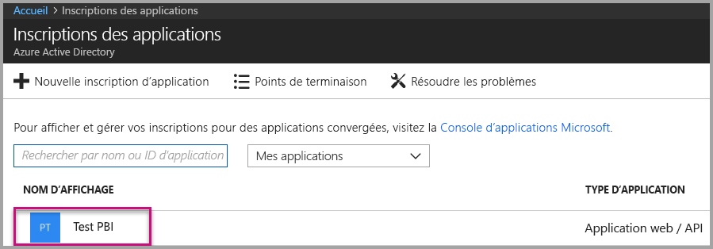

4. Sélectionnez **Paramètres**.

    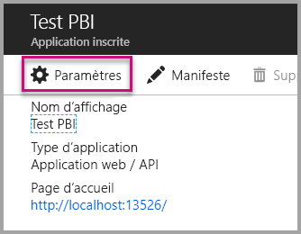

5. Sélectionnez **Clés**.

    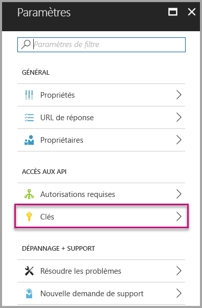

6. Entrez un nom dans la zone **Description** et sélectionnez une durée. Puis sélectionnez **Enregistrer** afin d’obtenir la **valeur** pour votre application. Lorsque vous fermez le volet **Clés** après l’enregistrement de la valeur de la clé, le champ de valeur apparaît uniquement masqué. À ce stade, vous n’êtes pas en mesure de récupérer la valeur de la clé. Si vous perdez la valeur de la clé, créez-en une autre dans le portail Azure.

    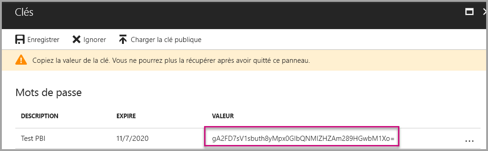

### <a name="tenant"></a>Locataire

Cet attribut est uniquement nécessaire pour l’authentification au moyen d’un [principal de service](embed-service-principal.md).

Dans **tenant**, indiquez votre ID de locataire Azure. Vous pouvez obtenir ces informations à partir du [portail Azure AD](https://docs.microsoft.com/onedrive/find-your-office-365-tenant-id#use-the-azure-ad-portal) quand vous êtes connecté au service Power BI ou à l’aide de Powershell.

### <a name="run-the-application"></a>Exécuter l’application

1. Sélectionnez **Exécuter** dans **Visual Studio**.

    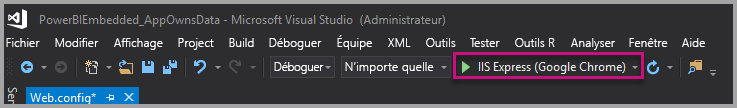

2. Ensuite, sélectionnez **Incorporer un rapport**. Sélectionnez l’option correspondant au contenu choisi pour le test (rapports, tableaux de bord ou vignettes) dans l’application.

    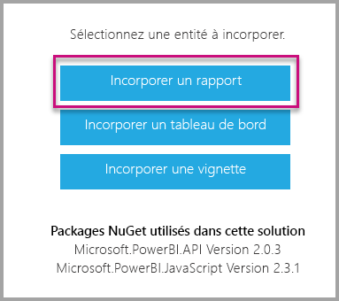

3. Vous pouvez à présent voir le rapport dans l’exemple d’application.

    

## <a name="embed-content-within-your-application"></a>Incorporer du contenu dans votre application

Même si les étapes permettant d’incorporer votre contenu sont effectuées avec les [API REST Power BI](https://docs.microsoft.com/rest/api/power-bi/), les exemples de code décrits dans cet article utilisent le **kit SDK .NET**.

L’incorporation pour vos clients dans votre application exige que vous obteniez un **jeton d’accès** pour votre compte principal ou [principal de service](embed-service-principal.md) à partir d’**Azure AD**. Vous devez obligatoirement [obtenir un jeton d’accès Azure AD](get-azuread-access-token.md#access-token-for-non-power-bi-users-app-owns-data) pour votre application Power BI avant d’effectuer des appels aux [API REST Power BI](https://docs.microsoft.com/rest/api/power-bi/).

Pour créer le client Power BI avec votre **jeton d’accès**, vous devez créer votre objet client Power BI pour interagir avec les [API REST Power BI](https://docs.microsoft.com/rest/api/power-bi/). Pour cela, wrappez l’élément **AccessToken** avec un objet client Power BI ***Microsoft.Rest.TokenCredentials***.

```csharp
using Microsoft.IdentityModel.Clients.ActiveDirectory;
using Microsoft.Rest;
using Microsoft.PowerBI.Api.V2;

var tokenCredentials = new TokenCredentials(authenticationResult.AccessToken, "Bearer");

// Create a Power BI Client object. it's used to call Power BI APIs.
using (var client = new PowerBIClient(new Uri(ApiUrl), tokenCredentials))
{
    // Your code to embed items.
}
```

### <a name="get-the-content-item-you-want-to-embed"></a>Obtenir l’élément de contenu que vous souhaitez incorporer

Vous pouvez utiliser l’objet client Power BI pour récupérer une référence à l’élément que vous souhaitez incorporer.

Voici un exemple de code montrant comment récupérer le premier rapport à partir d’un espace de travail donné.

*Un exemple d’obtention d’un élément de contenu, qu’il s’agisse d’un rapport, d’un tableau de bord ou d’une vignette à incorporer, est disponible dans le fichier Services\EmbedService.cs dans l’[exemple d’application](https://github.com/Microsoft/PowerBI-Developer-Samples).*

```csharp
using Microsoft.PowerBI.Api.V2;
using Microsoft.PowerBI.Api.V2.Models;

// You need to provide the workspaceId where the dashboard resides.
ODataResponseListReport reports = await client.Reports.GetReportsInGroupAsync(workspaceId);

// Get the first report in the group.
Report report = reports.Value.FirstOrDefault();
```

### <a name="create-the-embed-token"></a>Créer le jeton incorporé

Un jeton d’incorporation doit être généré pour être utilisé à partir de l’API JavaScript. Le jeton d’incorporation est propre à l’élément incorporé. De ce fait, chaque fois que vous incorporez un élément de contenu Power BI, vous devez lui créer un jeton d’incorporation. Pour en savoir plus, notamment sur les niveaux d’accès (**accessLevel**) à utiliser, consultez [API GenerateToken](https://msdn.microsoft.com/library/mt784614.aspx).

*Un exemple de création d’un jeton d’incorporation de rapport, de tableau de bord ou de vignette est disponible dans le fichier Services\EmbedService.cs dans l’[exemple d’application](https://github.com/Microsoft/PowerBI-Developer-Samples).*

```csharp
using Microsoft.PowerBI.Api.V2;
using Microsoft.PowerBI.Api.V2.Models;

// Generate Embed Token.
var generateTokenRequestParameters = new GenerateTokenRequest(accessLevel: "view");
EmbedToken tokenResponse = client.Reports.GenerateTokenInGroup(workspaceId, report.Id, generateTokenRequestParameters);

// Generate Embed Configuration.
var embedConfig = new EmbedConfig()
{
    EmbedToken = tokenResponse,
    EmbedUrl = report.EmbedUrl,
    Id = report.Id
};
```

Une classe est créée pour **EmbedConfig** et **TileEmbedConfig**. Un exemple est disponible dans le fichier **Models\EmbedConfig.cs** et le fichier **Models\TileEmbedConfig.cs**.

### <a name="load-an-item-using-javascript"></a>Charger un élément en utilisant JavaScript

JavaScript permet de charger un rapport dans un élément div sur votre page web.

Pour obtenir un exemple complet d’utilisation de l’API JavaScript, vous pouvez utiliser [l’outil Playground](https://microsoft.github.io/PowerBI-JavaScript/demo). L’outil Playground est un moyen rapide de jouer avec différents types d’exemples Power BI Embedded. Pour plus d’informations sur l’API JavaScript, vous pouvez consulter la page du [wiki PowerBI-JavaScript](https://github.com/Microsoft/powerbi-javascript/wiki).

Voici un exemple qui utilise un modèle **EmbedConfig** et un modèle **TileEmbedConfig** avec les vues d’un rapport.

*Un exemple d’ajout de rapport, de tableau de bord ou de vignette est disponible dans les fichiers Views\Home\EmbedReport.cshtml, Views\Home\EmbedDashboard.cshtml ou Views\Home\Embedtile.cshtml dans l’[exemple d’application](#embed-your-content-within-a-sample-application).*

```javascript
<script src="~/scripts/powerbi.js"></script>
<div id="reportContainer"></div>
<script>
    // Read embed application token from Model
    var accessToken = "@Model.EmbedToken.Token";

    // Read embed URL from Model
    var embedUrl = "@Html.Raw(Model.EmbedUrl)";

    // Read report Id from Model
    var embedReportId = "@Model.Id";

    // Get models. models contains enums that can be used.
    var models = window['powerbi-client'].models;

    // Embed configuration used to describe what and how to embed.
    // This object is used when calling powerbi.embed.
    // This also includes settings and options such as filters.
    // You can find more information at https://github.com/Microsoft/PowerBI-JavaScript/wiki/Embed-Configuration-Details.
    var config = {
        type: 'report',
        tokenType: models.TokenType.Embed,
        accessToken: accessToken,
        embedUrl: embedUrl,
        id: embedReportId,
        permissions: models.Permissions.All,
        settings: {
            filterPaneEnabled: true,
            navContentPaneEnabled: true
        }
    };

    // Get a reference to the embedded report HTML element
    var reportContainer = $('#reportContainer')[0];

    // Embed the report and display it within the div container.
    var report = powerbi.embed(reportContainer, config);
</script>
```

## <a name="move-to-production"></a>Passer à la production

Maintenant que votre application est développée, il est temps de sauvegarder l’espace de travail de votre application avec une capacité dédiée. 

> [!Important]
> Une capacité dédiée est nécessaire de passer à la production.

### <a name="create-a-dedicated-capacity"></a>Créer une capacité dédiée

En créant une capacité dédiée, vous pouvez profiter du fait que vous disposez d’une ressource dédiée pour votre client. Vous pouvez acheter une capacité dédiée dans le [Portail Microsoft Azure](https://portal.azure.com). Pour en savoir plus sur la création d’une capacité Power BI Embedded, consultez [Créer une capacité Power BI Embedded dans le Portail Microsoft Azure](azure-pbie-create-capacity.md).

Examinez le tableau ci-dessous pour déterminer la capacité Power BI Embedded qui répond le mieux à vos besoins.

| Nœud de capacité | Nombre total de cœurs<br/>*(Serveur principal + serveur frontal)* | Cœurs du serveur principal | Cœurs du serveur frontal | Limites de connexions actives/DirectQuery|
| --- | --- | --- | --- | --- | --- |
| A1 |1 v-core(s) |0,5 cœur(s), 3 Go de RAM |0,5 cœur |0,5 par seconde |
| A2 |2 v-core(s) |1 cœur(s), 5 Go de RAM |1 cœur(s) | 10 par seconde |
| A3 |4 v-core(s) |2 cœur(s), 10 Go de RAM |2 cœur(s) | 15 par seconde |
| A4 |8 v-core(s) |4 cœur(s), 25 Go de RAM |4 cœur(s) |30 par seconde |
| A5 |16 v-core(s) |8 cœur(s), 50 Go de RAM |8 cœur(s) |60 par seconde |
| A6 |32 v-core(s) |16 cœur(s), 100 Go de RAM |16 cœur(s) |120 par seconde |

**_Les références SKU A ne vous permettent pas d’accéder à du contenu Power BI avec une licence Power BI GRATUITE._**

L’utilisation de jetons d’incorporation avec des licences PRO étant destinée aux tests de développement, le nombre de jetons d’incorporation qu’un principal de service ou compte principal Power BI peut générer est limité. Une capacité dédiée nécessite l’incorporation dans un environnement de production. Avec une capacité dédiée, le nombre de jetons incorporés que vous pouvez générer n’est pas limité. Accédez à [Fonctionnalités disponibles](https://docs.microsoft.com/rest/api/power-bi/availablefeatures/getavailablefeatures) pour vérifier la valeur qui indique l’utilisation actuelle de jetons incorporés en pourcentage. Le volume d’utilisation varie en fonction du compte principal.

Pour plus d’informations, consultez le [livre blanc Planification d’une capacité d’analytique incorporée](https://aka.ms/pbiewhitepaper).

### <a name="assign-an-app-workspace-to-a-dedicated-capacity"></a>Affecter un espace de travail d’application à une capacité dédiée

Une fois que vous avez créé une capacité dédiée, vous pouvez lui affecter votre espace de travail d’application.

Pour affecter une capacité dédiée à un espace de travail à l’aide d’un [principal de service](embed-service-principal.md), utilisez l’[API REST Power BI](https://docs.microsoft.com/rest/api/power-bi/capacities/groups_assigntocapacity). Quand vous utilisez l’API REST Power BI, veillez à utiliser l’[ID objet du principal de service](embed-service-principal.md#how-to-get-the-service-principal-object-id).

Suivez les étapes ci-dessous pour affecter une capacité dédiée à un espace de travail à l’aide d’un **compte principal**.

1. Dans le **service Power BI**, développez les espaces de travail, puis sélectionnez les points de suspension en regard de l’espace de travail que vous utilisez pour incorporer votre contenu. Sélectionnez ensuite **Modifier l’espace de travail**.

    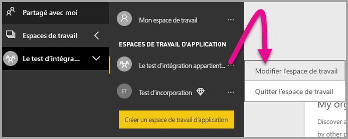

2. Développez **Avancé**, activez **Capacité dédiée**, puis sélectionnez la capacité dédiée que vous avez créée. Ensuite, sélectionnez **Enregistrer**.

    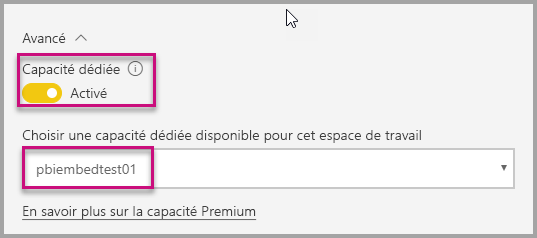

3. Une fois que vous avez sélectionné **Enregistrer**, un **losange** devrait apparaître à côté du nom de l’espace de travail de l’application.

    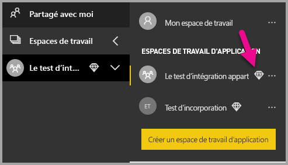

## <a name="next-steps"></a>Étapes suivantes

Dans ce tutoriel, vous avez appris à incorporer du contenu Power BI dans une application pour vos clients. Vous pouvez aussi essayer d’incorporer du contenu Power BI pour votre organisation.

> [!div class="nextstepaction"]
>[Incorporer pour votre organisation](embed-sample-for-your-organization.md)

D’autres questions ? [Essayez d’interroger la communauté Power BI](http://community.powerbi.com/)
