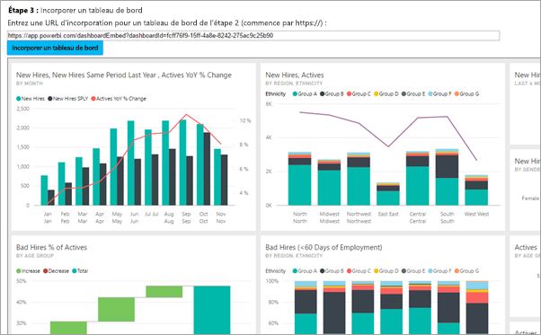

# <a name="embed-a-power-bi-dashboard-tile-or-report-into-your-application"></a>Incorporer un tableau de bord, une vignette ou un rapport Power BI dans votre application
Découvrez comment intégrer (ou incorporer) un tableau de bord, une vignette ou un rapport dans une application web en utilisant le SDK Power BI .NET, ainsi que l’API JavaScript Power BI, lorsque l’incorporation s’adresse à vos clients. Il s’agit typiquement d’un scénario concernant les éditeurs de logiciels indépendants.



Pour vous familiariser avec cette procédure pas à pas, vous avez besoin d’un compte **Power BI Pro**. Si vous n’avez pas de compte, vous pouvez [demander gratuitement un compte Power BI](../service-self-service-signup-for-power-bi.md), puis vous inscrire à [Power BI Pro (Version d’évaluation)](../service-self-service-signup-for-power-bi.md#in-service-power-bi-pro-60-day-trial). Vous pouvez également créer votre propre [locataire Azure Active Directory](create-an-azure-active-directory-tenant.md) à des fins de test.

> [!NOTE]
> Vous voulez plutôt incorporer un tableau de bord s’adressant à votre organisation ? Consultez [Intégrer un tableau de bord dans une application pour votre organisation](integrate-dashboard.md).
> 
> 

Pour intégrer un tableau de bord à une application web, utilisez l’API **Power BI** et un **jeton d’accès** d’autorisation Azure Active Directory (AD) pour obtenir un tableau de bord. Ensuite, chargez le tableau de bord à l’aide d’un jeton incorporé. L’API **Power BI** fournit un accès par programme à certaines ressources **Power BI**. Pour plus d’informations, consultez [Vue d’ensemble de l’API REST Power BI](https://msdn.microsoft.com/library/dn877544.aspx), [Kit de développement logiciel (SDK) Power BI .NET](https://github.com/Microsoft/PowerBI-CSharp) et [API JavaScript Power BI](https://github.com/Microsoft/PowerBI-JavaScript).

## <a name="download-the-sample"></a>Télécharger l’exemple
Cet article présente le code utilisé dans l’[exemple Incorporation pour votre organisation](https://github.com/Microsoft/PowerBI-Developer-Samples/tree/master/App%20Owns%20Data) sur GitHub. Pour suivre cette procédure pas à pas, vous pouvez télécharger l’exemple.

## <a name="step-1---register-an-app-in-azure-ad"></a>Étape 1 - Inscrire une application dans Azure AD
Vous devez inscrire votre application avec Azure AD afin d’effectuer des appels d’API REST. Pour plus d’informations, consultez [Inscrire une application Azure AD pour incorporer du contenu Power BI](register-app.md).

Si vous avez téléchargé l’[exemple Incorporation pour votre organisation](https://github.com/Microsoft/PowerBI-Developer-Samples/tree/master/App%20Owns%20Data), utilisez l’**ID client** que vous obtenez après inscription pour que l’exemple puisse s’authentifier sur Azure AD. Pour configurer l’exemple, modifiez **l’ID client** dans le fichier *web.config*.

## <a name="step-2---get-an-access-token-from-azure-ad"></a>Étape 2 : obtenir un jeton d’accès à partir d’Azure AD
Dans votre application, vous devez d’abord obtenir un **jeton d’accès**, à partir d’Azure AD, avant de pouvoir effectuer des appels d’API REST Power BI. Pour plus d’informations, consultez [Authentifier des utilisateurs et obtenir un jeton d’accès Azure AD pour votre application Power BI](get-azuread-access-token.md).

Vous pouvez voir des exemples associés dans chaque tâche d’élément de contenu dans **Controllers\HomeController.cs**.

## <a name="step-3---get-a-content-item"></a>Étape 3 : obtenir un élément de contenu
Vous devez effectuer quelques opérations pour vous assurer du bon déroulement de l’incorporation de votre contenu Power BI. Même si toutes ces étapes peuvent être effectuées directement avec l’API REST, l’exemple d’application, ainsi que les autres exemples présentés ici, sont réalisés avec le SDK .NET.

### <a name="create-the-power-bi-client-with-your-access-token"></a>Créer un client Power BI avec votre jeton d’accès
Avec votre jeton d’accès, vous devez créer votre objet de client Power BI pour interagir avec les API Power BI. Pour cela, encapsulez l’élément AccessToken avec un objet *Microsoft.Rest.TokenCredentials*.

```
using Microsoft.IdentityModel.Clients.ActiveDirectory;
using Microsoft.Rest;
using Microsoft.PowerBI.Api.V2;

var tokenCredentials = new TokenCredentials(authenticationResult.AccessToken, "Bearer");

// Create a Power BI Client object. It will be used to call Power BI APIs.
using (var client = new PowerBIClient(new Uri(ApiUrl), tokenCredentials))
{
    // Your code to embed items.
}
```

### <a name="get-the-content-item-you-want-to-embed"></a>Obtenir l’élément de contenu que vous souhaitez incorporer
Utilisez l’objet client Power BI pour récupérer une référence vers l’élément que vous souhaitez incorporer. Vous pouvez incorporer des tableaux de bord, des vignettes ou des rapports. Voici un exemple montrant comment récupérer un premier tableau de bord, rapport ou vignette à partir d’un espace de travail donné.

Un exemple de ceci est disponible dans **Controllers\HomeController.cs** de l’[exemple L’application possède les données](https://github.com/Microsoft/PowerBI-Developer-Samples/tree/master/App%20Owns%20Data).

**Tableaux de bord**

```
using Microsoft.PowerBI.Api.V2;
using Microsoft.PowerBI.Api.V2.Models;

// You will need to provide the GroupID where the dashboard resides.
ODataResponseListDashboard dashboards = client.Dashboards.GetDashboardsInGroup(GroupId);

// Get the first report in the group.
Dashboard dashboard = dashboards.Value.FirstOrDefault();
```

**Vignette**

```
using Microsoft.PowerBI.Api.V2;
using Microsoft.PowerBI.Api.V2.Models;

// To retrieve the tile, you first need to retrieve the dashboard.

// You will need to provide the GroupID where the dashboard resides.
ODataResponseListDashboard dashboards = client.Dashboards.GetDashboardsInGroup(GroupId);

// Get the first report in the group.
Dashboard dashboard = dashboards.Value.FirstOrDefault();

// Get a list of tiles from a specific dashboard
ODataResponseListTile tiles = client.Dashboards.GetTilesInGroup(GroupId, dashboard.Id);

// Get the first tile in the group.
Tile tile = tiles.Value.FirstOrDefault();
```

**Rapport**

```
using Microsoft.PowerBI.Api.V2;
using Microsoft.PowerBI.Api.V2.Models;

// You will need to provide the GroupID where the dashboard resides.
ODataResponseListReport reports = client.Reports.GetReportsInGroupAsync(GroupId);

// Get the first report in the group.
Report report = reports.Value.FirstOrDefault();
```

### <a name="create-the-embed-token"></a>Créer le jeton incorporé
Un jeton d’incorporation doit être généré pour être utilisé à partir de l’API JavaScript. Le jeton d’incorporation est propre à l’élément que vous incorporez. Cela signifie que chaque fois que vous incorporez un contenu Power BI, vous devez lui créer un jeton d’incorporation. Pour en savoir plus, notamment sur les niveaux d’accès (**accessLevel**) à utiliser, consultez [API GenerateToken](https://msdn.microsoft.com/library/mt784614.aspx).

> [!IMPORTANT]
> Étant donné que les jetons incorporés sont uniquement destinés aux tests de développement, le nombre de jetons incorporés qu’un compte principal Power BI peut générer est limité. Vous [devez acheter une capacité](https://docs.microsoft.com/power-bi/developer/embedded-faq#technical) pour les scénarios d’incorporation de production. Une fois une capacité achetée, la génération de jetons incorporés n’est pas limitée. Accédez à [Obtenir les fonctionnalités disponibles](https://msdn.microsoft.com/en-us/library/mt846473.aspx) pour vérifier combien de jetons intégrés gratuits ont été utilisés.

Un exemple de ceci est disponible dans le fichier **Controllers\HomeController.cs** de l’[exemple Incorporation pour votre organisation](https://github.com/Microsoft/PowerBI-Developer-Samples/tree/master/App%20Owns%20Data).

Cela suppose la création d’une classe pour **EmbedConfig** et **TileEmbedConfig**. Des exemples de ces opérations sont disponibles dans **Models\EmbedConfig.cs** et **Models\TileEmbedConfig.cs**.

**Tableau de bord**

```
using Microsoft.PowerBI.Api.V2;
using Microsoft.PowerBI.Api.V2.Models;

// Generate Embed Token.
var generateTokenRequestParameters = new GenerateTokenRequest(accessLevel: "view");
EmbedToken tokenResponse = client.Dashboards.GenerateTokenInGroup(GroupId, dashboard.Id, generateTokenRequestParameters);

// Generate Embed Configuration.
var embedConfig = new EmbedConfig()
{
    EmbedToken = tokenResponse,
    EmbedUrl = dashboard.EmbedUrl,
    Id = dashboard.Id
};
```

**Vignette**

```
using Microsoft.PowerBI.Api.V2;
using Microsoft.PowerBI.Api.V2.Models;

// Generate Embed Token for a tile.
var generateTokenRequestParameters = new GenerateTokenRequest(accessLevel: "view");
EmbedToken tokenResponse = client.Tiles.GenerateTokenInGroup(GroupId, dashboard.Id, tile.Id, generateTokenRequestParameters);

// Generate Embed Configuration.
var embedConfig = new TileEmbedConfig()
{
    EmbedToken = tokenResponse,
    EmbedUrl = tile.EmbedUrl,
    Id = tile.Id,
    dashboardId = dashboard.Id
};
```

**Rapport**

```
using Microsoft.PowerBI.Api.V2;
using Microsoft.PowerBI.Api.V2.Models;

// Generate Embed Token.
var generateTokenRequestParameters = new GenerateTokenRequest(accessLevel: "view");
EmbedToken tokenResponse = client.Reports.GenerateTokenInGroup(GroupId, report.Id, generateTokenRequestParameters);

// Generate Embed Configuration.
var embedConfig = new EmbedConfig()
{
    EmbedToken = tokenResponse,
    EmbedUrl = report.EmbedUrl,
    Id = report.Id
};
```


## <a name="step-4---load-an-item-using-javascript"></a>Étape 4 : charger un élément à l’aide de JavaScript
Vous pouvez utiliser JavaScript pour charger un tableau de bord dans un élément div sur votre page web. L’exemple utilise un modèle EmbedConfig/TileEmbedConfig, avec les affichages d’un tableau de bord, d’une vignette ou d’un rapport. Pour obtenir un exemple complet de l’utilisation de l’API JavaScript, vous pouvez consulter l’[exemple Microsoft Power BI Embedded](https://microsoft.github.io/PowerBI-JavaScript/demo).

Un exemple d’application associé est disponible dans l’[exemple Incorporation pour votre organisation](https://github.com/Microsoft/PowerBI-Developer-Samples/tree/master/App%20Owns%20Data).

**Views\Home\EmbedDashboard.cshtml**

```
<script src="~/scripts/powerbi.js"></script>
<div id="dashboardContainer"></div>
<script>
    // Read embed application token from Model
    var accessToken = "@Model.EmbedToken.Token";

    // Read embed URL from Model
    var embedUrl = "@Html.Raw(Model.EmbedUrl)";

    // Read dashboard Id from Model
    var embedDashboardId = "@Model.Id";

    // Get models. models contains enums that can be used.
    var models = window['powerbi-client'].models;

    // Embed configuration used to describe the what and how to embed.
    // This object is used when calling powerbi.embed.
    // This also includes settings and options such as filters.
    // You can find more information at https://github.com/Microsoft/PowerBI-JavaScript/wiki/Embed-Configuration-Details.
    var config = {
        type: 'dashboard',
        tokenType: models.TokenType.Embed,
        accessToken: accessToken,
        embedUrl: embedUrl,
        id: embedDashboardId
    };

    // Get a reference to the embedded dashboard HTML element
    var dashboardContainer = $('#dashboardContainer')[0];

    // Embed the dashboard and display it within the div container.
    var dashboard = powerbi.embed(dashboardContainer, config);
</script>
```

**Views\Home\EmbedTile.cshtml**

```
<script src="~/scripts/powerbi.js"></script>
<div id="tileContainer"></div>
<script>
    // Read embed application token from Model
    var accessToken = "@Model.EmbedToken.Token";

    // Read embed URL from Model
    var embedUrl = "@Html.Raw(Model.EmbedUrl)";

    // Read tile Id from Model
    var embedTileId = "@Model.Id";

    // Read dashboard Id from Model
    var embedDashboardeId = "@Model.dashboardId";

    // Get models. models contains enums that can be used.
    var models = window['powerbi-client'].models;

    // Embed configuration used to describe the what and how to embed.
    // This object is used when calling powerbi.embed.
    // This also includes settings and options such as filters.
    // You can find more information at https://github.com/Microsoft/PowerBI-JavaScript/wiki/Embed-Configuration-Details.
    var config = {
        type: 'tile',
        tokenType: models.TokenType.Embed,
        accessToken: accessToken,
        embedUrl: embedUrl,
        id: embedTileId,
        dashboardId: embedDashboardeId
    };

    // Get a reference to the embedded tile HTML element
    var tileContainer = $('#tileContainer')[0];

    // Embed the tile and display it within the div container.
    var tile = powerbi.embed(tileContainer, config);
</script>
```

**Views\Home\EmbedReport.cshtml**

```
<script src="~/scripts/powerbi.js"></script>
<div id="reportContainer"></div>
<script>
    // Read embed application token from Model
    var accessToken = "@Model.EmbedToken.Token";

    // Read embed URL from Model
    var embedUrl = "@Html.Raw(Model.EmbedUrl)";

    // Read report Id from Model
    var embedReportId = "@Model.Id";

    // Get models. models contains enums that can be used.
    var models = window['powerbi-client'].models;

    // Embed configuration used to describe the what and how to embed.
    // This object is used when calling powerbi.embed.
    // This also includes settings and options such as filters.
    // You can find more information at https://github.com/Microsoft/PowerBI-JavaScript/wiki/Embed-Configuration-Details.
    var config = {
        type: 'report',
        tokenType: models.TokenType.Embed,
        accessToken: accessToken,
        embedUrl: embedUrl,
        id: embedReportId,
        permissions: models.Permissions.All,
        settings: {
            filterPaneEnabled: true,
            navContentPaneEnabled: true
        }
    };

    // Get a reference to the embedded report HTML element
    var reportContainer = $('#reportContainer')[0];

    // Embed the report and display it within the div container.
    var report = powerbi.embed(reportContainer, config);
</script>
```

## <a name="next-steps"></a>Étapes suivantes
Vous pouvez examiner un exemple d’application sur GitHub. Les exemples ci-dessus sont basés sur cet exemple. Pour plus d’informations, consultez l’[exemple Incorporation pour votre organisation](https://github.com/Microsoft/PowerBI-Developer-Samples/tree/master/App%20Owns%20Data).

Pour en savoir plus sur l’API JavaScript, consultez [API JavaScript Power BI](https://github.com/Microsoft/PowerBI-JavaScript).

D’autres questions ? [Essayez d’interroger la communauté Power BI](http://community.powerbi.com/)

