# <a name="tutorial-embed-a-power-bi-report-dashboard-or-tile-into-an-application-for-your-organization"></a>Tutoriel : Incorporer un rapport, un tableau de bord ou une vignette Power BI dans une application pour votre organisation
Ce tutoriel montre comment intégrer un rapport à une application avec le **SDK .NET Power BI** ainsi que l’**API JavaScript Power BI** lors de l’incorporation de **Power BI**  à une application pour votre organisation. Avec **Power BI**, vous pouvez incorporer des rapports, des tableaux de bord ou des vignettes à une application à l’aide de l’exemple **User Owns Data** (L’utilisateur est propriétaire des données). **Utilisateur possède les données** permet à votre application d’étendre le service Power BI.


Dans ce tutoriel, vous allez découvrir comment :
>[!div class="checklist"]
>* inscrire une application dans Azure ;
>* incorporer un rapport Power BI dans une application.

## <a name="prerequisites"></a>Conditions préalables
Pour commencer, vous devez disposer d’un compte **Power BI Pro** et d’un abonnement **Microsoft Azure**.

* Si vous n’avez pas d’abonnement à **Power BI Pro**, [inscrivez-vous à un essai gratuit](https://powerbi.microsoft.com/en-us/pricing/) avant de commencer.
* Si vous n’avez pas d’abonnement Azure, créez un [compte gratuit](https://azure.microsoft.com/free/?WT.mc_id=A261C142F) avant de commencer.
* Vous aurez besoin de votre propre installation de [client Azure Active Directory ](create-an-azure-active-directory-tenant.md).
* [Visual Studio](https://www.visualstudio.com/) doit être installé (version 2013 ou ultérieure).

## <a name="setup-your-embedded-analytics-development-environment"></a>Configurer l’environnement de développement d’analytique incorporée

Avant de commencer à incorporer des rapports, des tableaux de bord ou des vignettes dans votre application, vérifiez que votre environnement est configuré de façon à autoriser l’incorporation. Dans le cadre de la configuration, vous devez effectuer les opérations suivantes.

Vous pouvez accéder à [l’outil d’expérience d’intégration](https://aka.ms/embedsetup/UserOwnsData) pour démarrer rapidement et télécharger un exemple d’application qui vous permet de créer un environnement et d’incorporer un rapport.

Cependant, si vous choisissez de configurer l’environnement manuellement, vous pouvez continuer et suivre les instructions ci-dessous.
### <a name="register-an-application-in-azure-active-directory-azure-ad"></a>Inscrire une application dans Azure Active Directory (Azure AD)

Inscrivez votre application sur Azure Active Directory pour l’autoriser à accéder aux API REST Power BI. Vous pourrez ainsi établir une identité pour votre application et spécifier des autorisations sur les ressources REST de Power BI.

1. Acceptez les [conditions d’utilisation de l’API Microsoft Power BI](https://powerbi.microsoft.com/api-terms).

2. Connectez-vous au [portail Azure](https://portal.azure.com).

    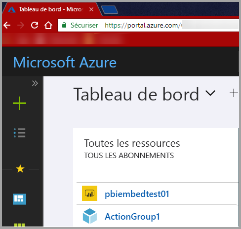

3. Dans le volet de navigation de gauche, choisissez **Tous les services** et sélectionnez **Inscriptions d’applications**, puis **Nouvelle inscription d’application**.

    </br>
    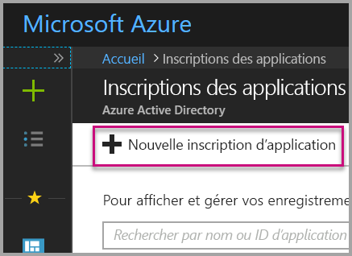

4. Suivez les invites pour créer une application. Dans le cas où l’utilisateur est propriétaire des données (**User Owns Data**), vous devez utiliser **Application/API web** comme type d’application. Vous devez également indiquer une **URL de connexion**, qu’**Azure AD** utilise pour retourner les réponses de jeton. Entrez une valeur propre à votre application (par exemple, http://localhost:13526/).

    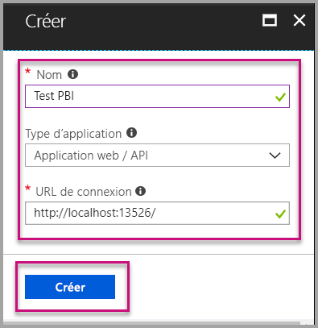

### <a name="apply-permissions-to-your-application-within-azure-active-directory"></a>Appliquer des autorisations à une application dans Azure Active Directory

Il est nécessaire d’activer des autorisations supplémentaires pour l’application en plus de celles qui ont été spécifiées dans la page d’inscription de l’application. Vous devez être connecté avec un compte d’*administrateur général* pour activer les autorisations.

### <a name="use-the-azure-active-directory-portal"></a>Utiliser le portail Azure Active Directory

1. Accédez à [Inscriptions des applications](https://portal.azure.com/#blade/Microsoft_AAD_IAM/ApplicationsListBlade) dans le portail Azure, puis sélectionnez l’application que vous utilisez pour l’incorporation.

    

2. Sélectionnez **Paramètres** ; ensuite, sous **Accès aux API**, sélectionnez **Autorisations requises**.

    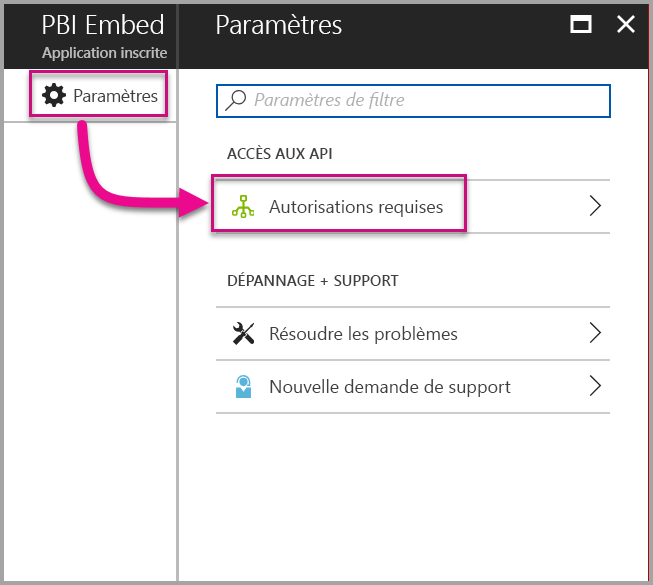

3. Sélectionnez **Windows Azure Active Directory** puis vérifiez que l’option **Accéder au répertoire en tant qu’utilisateur actuellement connecté** est sélectionnée. Sélectionnez **Enregistrer**.

    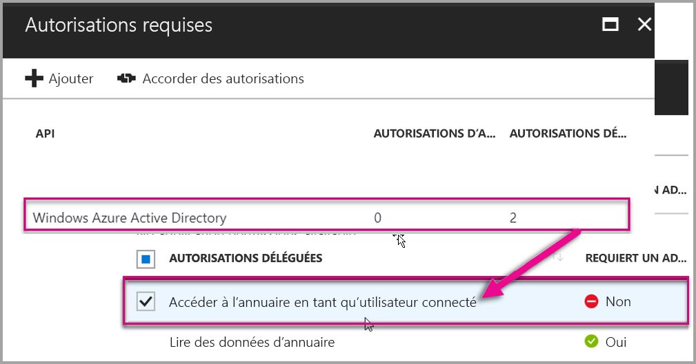

4. Sélectionnez **Ajouter**.

    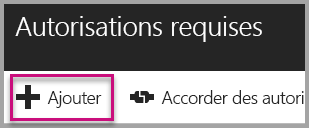

5. Sélectionnez **Sélectionner une API**.

    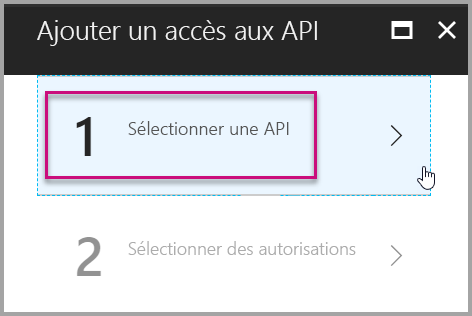

6. Sélectionnez **Service Power BI**, puis **Sélectionner**.

    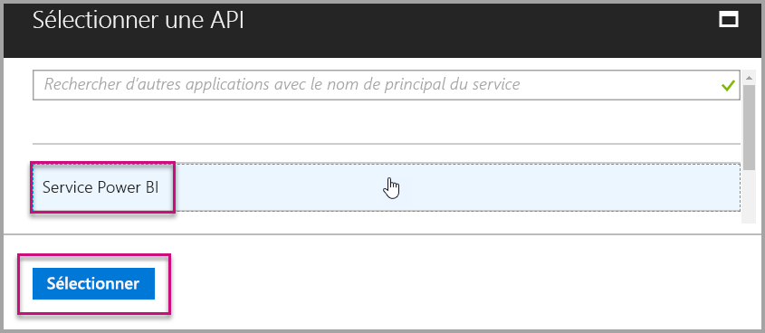

7. Sous **Autorisations déléguées**, sélectionnez toutes les autorisations. Vous devez les sélectionner une par une pour enregistrer les sélections. Lorsque vous avez terminé, sélectionnez **Enregistrer**.

    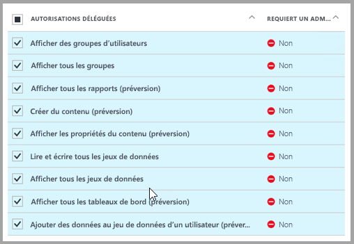

## <a name="setup-your-power-bi-environment"></a>Configurer un environnement Power BI

### <a name="create-an-app-workspace"></a>Créer un espace de travail d'application

Si vous incorporez des rapports, des tableaux de bord ou des vignettes pour vos clients, vous devez placer votre contenu au sein d’un espace de travail d’application.

1. Commencez par créer l’espace de travail. Sélectionnez **Espaces de travail** > **Créer un espace de travail d’application**. C’est à cet endroit que vous placez le contenu auquel votre application doit accéder.

    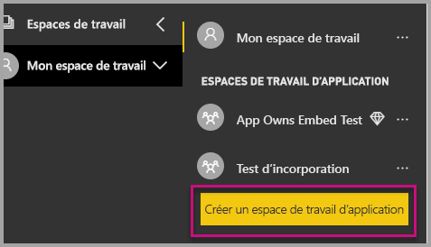

2. Nommez l’espace de travail. Si l’**ID d’espace de travail** correspondant n’est pas disponible, modifiez-le de façon à obtenir un ID unique. Celui-ci doit aussi correspondre au nom de l’application.

    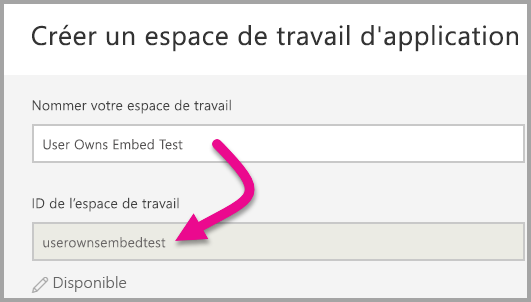

3. Vous devez définir quelques options. Si vous choisissez **Public**, toute personne au sein de votre organisation peut voir le contenu de l’espace de travail. En revanche, **Privé** signifie que seuls les membres de l’espace de travail peuvent en voir le contenu.

    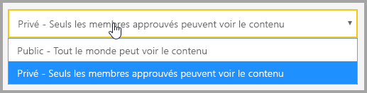

    Vous ne pouvez pas modifier le paramètre Public/Privé après avoir créé le groupe.

4. Vous pouvez également spécifier si les membres peuvent **apporter des modifications** ou consulter en **lecture seule**.

    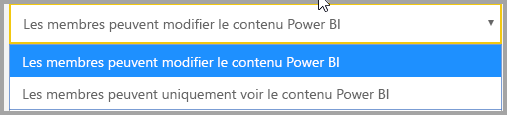

5. Ajouter les adresses e-mail des personnes qui doivent avoir accès à l’espace de travail, puis sélectionnez **Ajouter**. Vous ne pouvez ajouter d’alias de groupe, uniquement des individus.

6. Décidez pour chaque personne si celle-ci est membre ou administrateur. Les administrateurs peuvent modifier l’espace de travail, y compris y ajouter des membres. Les membres peuvent modifier le contenu de l’espace de travail, sauf s’ils disposent d’un accès en affichage seul. Les administrateurs et les membres peuvent publier l’application.

    Vous pouvez à présent voir le nouvel espace de travail. Power BI crée l’espace de travail et l’ouvre. Celui-ci figure dans la liste des espaces de travail dont vous êtes membre. Étant donné que vous êtes administrateur, vous pouvez sélectionner les points de suspension (…) pour revenir en arrière afin d’apporter des modifications, d’ajouter des membres ou de modifier leurs autorisations.

    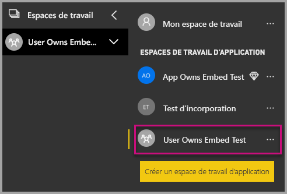

### <a name="create-and-publish-your-reports"></a>Créer et publier des rapports

Vous pouvez créer vos rapports et jeux de données à l’aide de Power BI Desktop, puis publier ces rapports dans un espace de travail d’applications. Pour publier les rapports dans un espace de travail d’application, l’utilisateur final doit disposer d’une licence Power BI Pro.

1. Téléchargez l’exemple [Blog Demo](https://github.com/Microsoft/powerbi-desktop-samples) (Démonstration blog) sur GitHub.

    

2. Ouvrez l’exemple de rapport PBIX dans **Power BI Desktop**.

   

3. Publiez-le sur **l’espace de travail d’application**.

   

    Vous pouvez à présent afficher le rapport dans le service Power BI en ligne.

   

## <a name="embed-your-content-using-the-sample-application"></a>Incorporer votre contenu en utilisant l’exemple d’application

Suivez ces étapes pour commencer l’incorporation de votre contenu à l’aide d’un exemple d’application.

1. Pour commencer, téléchargez l’[exemple App Owns Data](https://github.com/Microsoft/PowerBI-Developer-Samples) (L’utilisateur est propriétaire des données) à partir de GitHub.  Il existe 3 exemples d’applications différents, un pour les [rapports](https://github.com/Microsoft/PowerBI-Developer-Samples/tree/master/User%20Owns%20Data/integrate-report-web-app), un pour les [tableaux de bord](https://github.com/Microsoft/PowerBI-Developer-Samples/tree/master/User%20Owns%20Data/integrate-dashboard-web-app) et un pour les [vignettes](https://github.com/Microsoft/PowerBI-Developer-Samples/tree/master/User%20Owns%20Data/integrate-tile-web-app).  Cet article fait référence à l’application de **rapports** dont nous décrivons les étapes ci-dessous.

    

2. Ouvrez le fichier Cloud.config dans l’exemple d’application. Pour exécuter correctement l’application, vous devez remplir certains champs : le champ **ClientID**et le champ **ClientSecret**.

    

    Renseignez les informations **ClientID** avec l’**ID d’application** provenant d’**Azure**. La valeur **ClientID** est utilisée par l’application pour s’identifier auprès des utilisateurs auxquels vous demandez des autorisations.

    Pour obtenir la valeur **ClientID**, effectuez les étapes suivantes :

    Connectez-vous au [portail Azure](https://portal.azure.com).

    

    Dans le volet de navigation de gauche, choisissez **Tous les services**, puis sélectionnez **Inscriptions d’applications**.

    

    Sélectionnez l’application qui doit utiliser la valeur **ClientID**.

    

    Un **ID d’application** devrait être listé au format GUID. Utilisez cet **ID d’application** comme **ClientID** pour l’application.

    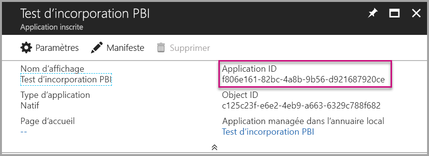

    Renseignez les informations **ClientSecret** à partir de la section **Clés** de votre section **Inscriptions des applications** dans **Azure**.

    Pour obtenir la valeur **ClientSecret**, effectuez les étapes suivantes :

    Connectez-vous au [portail Azure](https://portal.azure.com).

    

    Dans le volet de navigation de gauche, choisissez **Tous les services**, puis sélectionnez **Inscriptions d’applications**.

    

    Sélectionnez l’application qui doit utiliser la valeur **ClientSecret**.

    

    Sélectionnez **Paramètres**.

    

    Sélectionnez **Clés**.

    

    Renseignez la **Description** avec un nom et sélectionnez une **Durée**, puis sélectionnez **Enregistrer** pour obtenir le **Valeur** pour votre application. Une fois le panneau **Clés** fermé après l’enregistrement de la **valeur de la clé**, le champ de valeur s’affiche uniquement comme **_Masqué_**, et à ce stade, vous ne pouvez pas récupérer la **valeur de la clé**. Si vous perdez la **valeur de la clé**, vous devez en créer une autre dans le **portail Azure**.

    

     Renseignez l’information **groupId** avec le **GUID d’espace de travail d’application** provenant de Power BI.

    

    Renseignez l’information **reportId** avec le **GUID de rapport** provenant de Power BI.

    

3. Exécutez l’application !

    Tout d’abord, sélectionnez **Exécuter** dans **Visual Studio**.

    

    Sélectionnez ensuite **Obtenir le rapport**.

    

    Vous pouvez à présent voir le rapport dans l’exemple d’application.

    

## <a name="embed-your-content-within-your-application"></a>Incorporer votre contenu dans l’application
Même si les étapes permettant d’incorporer votre contenu peuvent être effectuées avec les [API REST Power BI](https://docs.microsoft.com/rest/api/power-bi/), les exemples de code décrits dans cet article utilisent le **kit SDK .NET**.

Pour intégrer un rapport à une application web, vous utilisez l’**API REST Power BI**, ou le **SDK C# Power BI**, et un **jeton d’accès** d’autorisation Azure Active Directory (AD) pour obtenir un rapport. Vous chargez ensuite le rapport en utilisant le même **jeton d’accès**. L’**API REST Power BI** fournit un accès par programmation à des ressources **Power BI** spécifiques. Pour plus d’informations, consultez [API REST Power BI](https://docs.microsoft.com/rest/api/power-bi/) et [API JavaScript Power BI](https://github.com/Microsoft/PowerBI-JavaScript).

### <a name="get-an-access-token-from-azure-ad"></a>Obtenir un jeton d’accès à partir d’Azure AD
Dans votre application, vous devez d’abord obtenir un **jeton d’accès** à partir d’Azure AD avant de pouvoir effectuer des appels à l’API REST Power BI. Pour plus d’informations, consultez [Authentifier des utilisateurs et obtenir un jeton d’accès Azure AD pour votre application Power BI](get-azuread-access-token.md).

### <a name="get-a-report"></a>Obtenir un rapport
Pour obtenir un rapport **Power BI**, vous utilisez l’opération [Obtenir des rapports](https://docs.microsoft.com/rest/api/power-bi/reports/getreports) qui obtient une liste de **rapports Power BI**. Dans la liste des rapports, vous pouvez obtenir un ID de rapport.

### <a name="get-reports-using-an-access-token"></a>Obtenir des rapports à l’aide d’un jeton d’accès
L’opération [Obtenir des rapports](https://docs.microsoft.com/rest/api/power-bi/reports/getreports) renvoie une liste de rapports. Vous ne pouvez récupérer qu’un seul rapport dans cette liste.

Pour effectuer l’appel d’API REST, vous devez inclure un en-tête d’*autorisation* au format *Porteur {jeton d’accès}*.

#### <a name="get-reports-with-the-rest-api"></a>Obtenir des rapports avec l’API REST

Voici un exemple de code montrant comment récupérer des rapports avec l’**API REST**.

*Un exemple d’obtention d’un élément de contenu que vous voulez incorporer (rapport, tableau de bord ou vignette) est disponible dans le fichier **_Default.aspx.cs_** dans l’[exemple d’application](#embed-your-content-using-the-sample-application).*

```csharp
using Newtonsoft.Json;

//Get a Report. In this sample, you get the first Report.
protected void GetReport(int index)
{
    //Configure Reports request
    System.Net.WebRequest request = System.Net.WebRequest.Create(
        String.Format("{0}/Reports",
        baseUri)) as System.Net.HttpWebRequest;

    request.Method = "GET";
    request.ContentLength = 0;
    request.Headers.Add("Authorization", String.Format("Bearer {0}", accessToken.Value));

    //Get Reports response from request.GetResponse()
    using (var response = request.GetResponse() as System.Net.HttpWebResponse)
    {
        //Get reader from response stream
        using (var reader = new System.IO.StreamReader(response.GetResponseStream()))
        {
            //Deserialize JSON string
            PBIReports Reports = JsonConvert.DeserializeObject<PBIReports>(reader.ReadToEnd());

            //Sample assumes at least one Report.
            //You could write an app that lists all Reports
            if (Reports.value.Length > 0)
            {
                var report = Reports.value[index];

                txtEmbedUrl.Text = report.embedUrl;
                txtReportId.Text = report.id;
                txtReportName.Text = report.name;
            }
        }
    }
}

//Power BI Reports used to deserialize the Get Reports response.
public class PBIReports
{
    public PBIReport[] value { get; set; }
}
public class PBIReport
{
    public string id { get; set; }
    public string name { get; set; }
    public string webUrl { get; set; }
    public string embedUrl { get; set; }
}
```

#### <a name="get-reports-using-the-net-sdk"></a>Obtenir des rapports à l’aide du Kit de développement logiciel (SDK) .NET
Le SDK .NET permet de récupérer une liste de rapports au lieu d’appeler directement l’API REST. Voici un exemple de code montrant comment répertorier des rapports.

```csharp
using Microsoft.IdentityModel.Clients.ActiveDirectory;
using Microsoft.PowerBI.Api.V2;
using Microsoft.PowerBI.Api.V2.Models;

var tokenCredentials = new TokenCredentials(<ACCESS TOKEN>, "Bearer");

// Create a Power BI Client object. It is used to call Power BI APIs.
using (var client = new PowerBIClient(new Uri(ApiUrl), tokenCredentials))
{
    // Get the first report all reports in that workspace
    ODataResponseListReport reports = client.Reports.GetReports();

    Report report = reports.Value.FirstOrDefault();

    var embedUrl = report.EmbedUrl;
}
```

### <a name="load-a-report-using-javascript"></a>Charger un rapport à l’aide de JavaScript
JavaScript permet de charger un rapport dans un élément div sur votre page web.

Voici un exemple de code montrant comment récupérer un rapport à partir d’un espace de travail donné.

*Un exemple de chargement d’un élément de contenu que vous voulez incorporer, qu’il s’agisse d’un rapport, d’un tableau de bord ou d’une vignette, est disponible dans le fichier **_Default.aspx_** dans l’[exemple d’application](#embed-your-content-using-the-sample-application).*

```javascript
<!-- Embed Report-->
<div> 
    <asp:Panel ID="PanelEmbed" runat="server" Visible="true">
        <div>
            <div><b class="step">Step 3</b>: Embed a report</div>

            <div>Enter an embed url for a report from Step 2 (starts with https://):</div>
            <input type="text" id="tb_EmbedURL" style="width: 1024px;" />
            <br />
            <input type="button" id="bEmbedReportAction" value="Embed Report" />
        </div>

        <div id="reportContainer"></div>
    </asp:Panel>
</div>
```

**Site.master**

```javascript
window.onload = function () {
    // client side click to embed a selected report.
    var el = document.getElementById("bEmbedReportAction");
    if (el.addEventListener) {
        el.addEventListener("click", updateEmbedReporte, false);
    } else {
        el.attachEvent('onclick', updateEmbedReport);
    }

    // handle server side post backs, optimize for reload scenarios
    // show embedded report if all fields were filled in.
    var accessTokenElement = document.getElementById('MainContent_accessTokenTextbox');
    if (accessTokenElement !== null) {
        var accessToken = accessTokenElement.value;
        if (accessToken !== "")
            updateEmbedReport();
    }
};

// update embed report
function updateEmbedReport() {

    // check if the embed url was selected
    var embedUrl = document.getElementById('tb_EmbedURL').value;
    if (embedUrl === "")
        return;

    // get the access token.
    accessToken = document.getElementById('MainContent_accessTokenTextbox').value;

    // Embed configuration used to describe the what and how to embed.
    // This object is used when calling powerbi.embed.
    // You can find more information at https://github.com/Microsoft/PowerBI-JavaScript/wiki/Embed-Configuration-Details.
    var config = {
        type: 'report',
        accessToken: accessToken,
        embedUrl: embedUrl
    };

    // Grab the reference to the div HTML element that will host the report.
    var reportContainer = document.getElementById('reportContainer');

    // Embed the report and display it within the div container.
    var report = powerbi.embed(reportContainer, config);

    // report.on will add an event handler which prints to Log window.
    report.on("error", function (event) {
        var logView = document.getElementById('logView');
        logView.innerHTML = logView.innerHTML + "Error<br/>";
        logView.innerHTML = logView.innerHTML + JSON.stringify(event.detail, null, "  ") + "<br/>";
        logView.innerHTML = logView.innerHTML + "---------<br/>";
    }
  );
}
```

## <a name="using-a-power-bi-premium-dedicated-capacity"></a>Utilisation d’une capacité dédiée Power BI Premium

Maintenant que votre application est développée, il est temps de sauvegarder votre espace de travail d’application avec une capacité dédiée.

### <a name="create-a-dedicated-capacity"></a>Créer une capacité dédiée
En créant une capacité dédiée, vous pouvez mettre à profit le fait que vous disposez d’une ressource dédiée pour le contenu de votre espace de travail d’application. Vous pouvez créer une capacité dédiée avec [Power BI Premium ](../service-premium.md).

Le tableau suivant liste les références SKU Power BI Premium disponibles dans [Office 365](../service-admin-premium-purchase.md).

| Nœud de capacité | Total des cœurs virtuels<br/>*(Backend + Frontend)* | Cœurs virtuels backend | Cœurs virtuels frontend | Limites de connexions actives/DirectQuery | Rendus de pages au maximum aux heures de pointe |
| --- | --- | --- | --- | --- | --- |
| EM1 |1 cœur virtuel |0,5 cœur virtuel, 10 Go de RAM |0,5 cœur virtuel |3,75 par seconde |150-300 |
| EM2 |2 cœurs virtuels |1 cœur virtuel, 10 Go de RAM |1 cœur virtuel |7,5 par seconde |301-600 |
| EM3 |4 cœurs virtuels |2 cœurs virtuels, 10 Go de RAM |2 cœurs virtuels |15 par seconde |601-1 200 |
| P1 |8 cœurs virtuels |4 cœurs virtuels, 25 Go de RAM |4 cœurs virtuels |30 par seconde |1 201-2 400 |
| P2 |16 cœurs virtuels |8 cœurs virtuels, 50 Go de RAM |8 cœurs virtuels |60 par seconde |2 401-4 800 |
| P3 |32 cœurs virtuels |16 cœurs virtuels, 100 Go de RAM |16 cœurs virtuels |120 par seconde |4 801-9 600 |
| P4 |64 cœurs virtuels |32 cœurs virtuels, 200 Go de RAM |32 cœurs virtuels |240 par seconde |9601-19200
| P5 |128 cœurs virtuels |64 cœurs virtuels, 400 Go de RAM |64 cœurs virtuels |480 par seconde |19201-38400

*Avec les **_références SKU d’EM_**, **vous pouvez** accéder au contenu avec une licence Power BI GRATUITE quand vous tentez une incorporation avec des **_applications MS Office_**, mais **vous ne pouvez pas accéder au**  contenu avec une licence Power BI GRATUITE quand vous utilisez **_Powerbi.com_** ou  **_Power BI mobile_**.*

*Avec les  **_références SKU de P_**, **vous pouvez** accéder au contenu avec une licence Power BI GRATUITE quand vous tentez une incorporation avec des **_applications MS Office_** en utilisant  **_Powerbi.com_** ou  **_Power BI mobile_**.*

### <a name="assign-an-app-workspace-to-a-dedicated-capacity"></a>Affecter un espace de travail d’application à une capacité dédiée

Une fois que vous avez créé une capacité dédiée, vous pouvez lui affecter votre espace de travail d’application. Pour ce faire, effectuez les étapes suivantes.

1. Dans le **service Power BI**, développez les espaces de travail, puis sélectionnez les points de suspension en regard de l’espace de travail que vous utilisez pour incorporer votre contenu. Sélectionnez ensuite **Modifier l’espace de travail**.

    

2. Développez **Avancé**, activez **Capacité dédiée**, puis sélectionnez la capacité dédiée que vous avez créée. Ensuite, sélectionnez **Enregistrer**.

    

3. Après avoir sélectionné **Enregistrer**, vous devez voir un **losange** en regard du nom de l’espace de travail d’application.

    

## <a name="admin-settings"></a>Paramètres d’administrateur

Les administrateurs globaux ou les administrateurs de service Power BI peuvent activer ou désactiver la possibilité d’utiliser les API REST pour un locataire. Les administrateurs Power BI peuvent définir ce paramètre pour toute l’organisation ou pour certains groupes de sécurité. Il est activé par défaut pour toute l’organisation. Vous pouvez le faire au moyen du [portail d’administration Power BI](../service-admin-portal.md).

## <a name="next-steps"></a>Étapes suivantes
Dans ce tutoriel, vous avez appris à incorporer du contenu Power BI à une application à l’aide de votre **compte d’organisation Power BI**. Vous pouvez maintenant essayer d’incorporer du contenu Power BI à une application à l’aide d’applications.  Vous pouvez aussi essayer d’incorporer du contenu Power BI pour vos clients.

> [!div class="nextstepaction"]
> [Incorporer à partir d’applications](embed-from-apps.md)

> [!div class="nextstepaction"]
>[Incorporer pour vos clients](embed-sample-for-customers.md)

D’autres questions ? [Essayez d’interroger la communauté Power BI](http://community.powerbi.com/)
