# <a name="tutorial-embed-power-bi-content-into-an-application-for-your-organization"></a>Tutoriel : Incorporer du contenu Power BI dans une application pour votre organisation

Dans **Power BI**, vous pouvez incorporer des rapports (Power BI ou Paginés), des tableaux de bord et des vignettes dans une application à l’aide de l’exemple User owns data (l’utilisateur est propriétaire des données). **User owns data** permet à votre application d’étendre le service Power BI afin qu’elle puisse utiliser l’analytique incorporée. Ce didacticiel montre comment intégrer un rapport (Power BI ou Paginé) dans une application. Vous utiliserez le kit de développement logiciel (SDK) .NET Power BI avec l’API JavaScript Power BI pour incorporer Power BI dans une application de votre organisation.

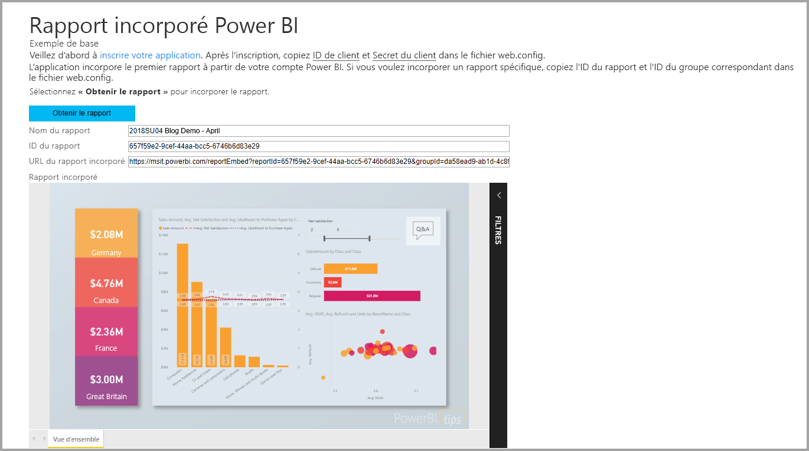

Ce tutoriel vous montre comment effectuer les tâches suivantes :
> [!div class="checklist"]
> * inscrire une application dans Azure ;
> * incorporer un rapport Power BI ou Paginé dans une application à l’aide de votre locataire Power BI.

## <a name="prerequisites"></a>Conditions préalables

Pour commencer, vous devez disposer des éléments suivants :

* Un [compte Power BI Pro](../service-self-service-signup-for-power-bi.md).
* Un abonnement [Microsoft Azure](https://azure.microsoft.com/).
* Vous avez besoin de votre propre installation d’un [locataire Azure Active Directory](create-an-azure-active-directory-tenant.md).
* Pour incorporer des rapports paginés, vous devez disposer au minimum d’une capacité P1. Voir [De quelle taille de capacité Premium ai-je besoin pour des rapports paginés ?](../paginated-reports-faq.md#what-size-premium-capacity-do-i-need-for-paginated-reports).

Si vous n’avez pas d’abonnement à **Power BI Pro**, [inscrivez-vous à un essai gratuit](https://powerbi.microsoft.com/pricing/) avant de commencer.

Si vous n’avez pas d’abonnement Azure, créez un [compte gratuit](https://azure.microsoft.com/free/?WT.mc_id=A261C142F) avant de commencer.

## <a name="set-up-your-embedded-analytics-development-environment"></a>Configurer votre environnement de développement d’analytique incorporée

Avant de commencer à incorporer des rapports, des tableaux de bord ou des vignettes dans votre application, vérifiez que votre environnement autorise l’incorporation avec Power BI.

Vous pouvez accéder à [l’outil de configuration de l’incorporation](https://aka.ms/embedsetup/UserOwnsData) pour démarrer rapidement et télécharger un exemple d’application qui vous guide tout au long de la création d’un environnement et de l’incorporation d’un rapport. Si vous incorporez un rapport paginé, vous devez affecter au moins une capacité P1 à l’espace de travail de l’application créé.

Si vous choisissez de configurer l’environnement manuellement, vous pouvez continuer à suivre les instructions ci-dessous.

### <a name="register-an-application-in-azure-active-directory"></a>Inscrire une application dans Azure Active Directory

[Inscrivez votre application](register-app.md) auprès d’Azure Active Directory pour l’autoriser à accéder aux [API REST Power BI](https://docs.microsoft.com/rest/api/power-bi/). Cette inscription vous permet ainsi d’établir une identité pour votre application et de spécifier des autorisations sur les ressources REST de Power BI.

Vous devez procéder à l’inscription d’une **application web côté serveur**. Vous inscrivez une application web côté serveur pour créer un secret d’application.

## <a name="set-up-your-power-bi-environment"></a>Configurer votre environnement Power BI

### <a name="create-an-app-workspace"></a>Créer un espace de travail d’application

Si vous incorporez des rapports, des tableaux de bord ou des vignettes pour vos clients, vous devez placer votre contenu au sein d’un espace de travail d’application. Les espaces de travail que vous pouvez configurer sont de deux types : les [espaces de travail traditionnels](../service-create-workspaces.md) et les [nouveaux espaces de travail](../service-create-the-new-workspaces.md).

### <a name="create-and-publish-your-power-bi-reports"></a>Créer et publier vos rapports Power BI

Vous pouvez créer vos rapports et vos jeux de données à l’aide de Power BI Desktop. Vous pouvez ensuite publier ces rapports sur l’espace de travail d’une application. Pour publier les rapports dans l’espace de travail d’une application, l’utilisateur final doit disposer d’une licence Power BI Pro.

1. Téléchargez l’exemple de [démonstration](https://github.com/Microsoft/powerbi-desktop-samples) à partir de GitHub.

    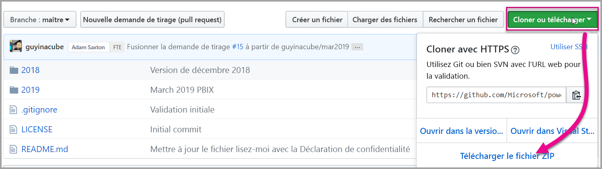

2. Ouvrez l’exemple de rapport .pbix dans Power BI Desktop.

   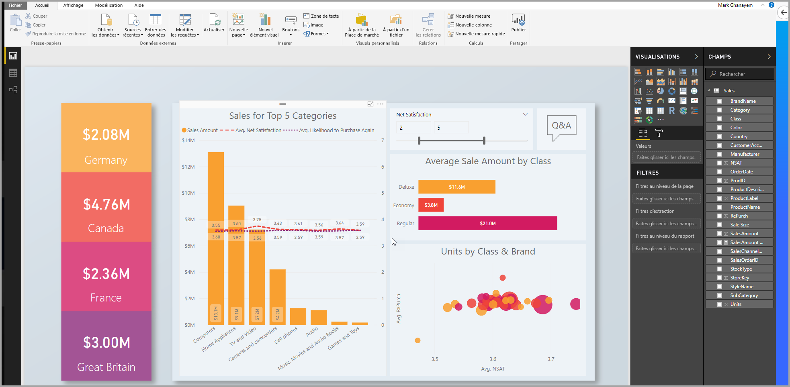

3. Publiez-le sur l’espace de travail de l’application.

   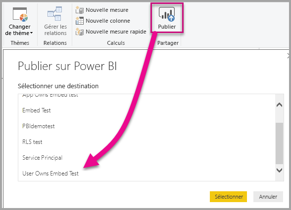

    Vous pouvez à présent afficher le rapport dans le service Power BI en ligne.

   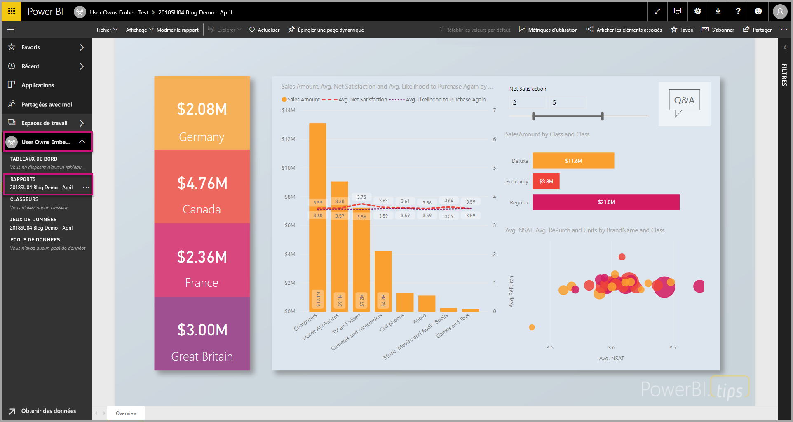
   
### <a name="create-and-publish-your-paginated-reports"></a>Créer et publier vos rapports paginés

Vous pouvez créer vos rapports paginés avec le [Générateur de rapports Power BI](../paginated-reports-report-builder-power-bi.md#create-reports-in-power-bi-report-builder). Ensuite, vous pouvez [charger le rapport](../paginated-reports-quickstart-aw.md#upload-the-report-to-the-service) dans un espace de travail d’application auquel est affecté au minimum une capacité P1. L’utilisateur final qui charge le rapport doit avoir une licence Power BI Pro pour publier dans un espace de travail d’application.
   
## <a name="embed-your-content-by-using-the-sample-application"></a>Incorporer votre contenu en utilisant l’exemple d’application

Cet exemple est intentionnellement simple pour faciliter la démonstration.

Suivez les étapes ci-dessous pour commencer l’incorporation de votre contenu en utilisant l’exemple d’application.

1. Téléchargez [Visual Studio](https://www.visualstudio.com/) (version 2013 ou ultérieure). Veillez à télécharger le dernier [package NuGet](https://www.nuget.org/profiles/powerbi).

2. Pour commencer, téléchargez l’[exemple App Owns Data](https://github.com/Microsoft/PowerBI-Developer-Samples) (L’utilisateur est propriétaire des données) à partir de GitHub.

    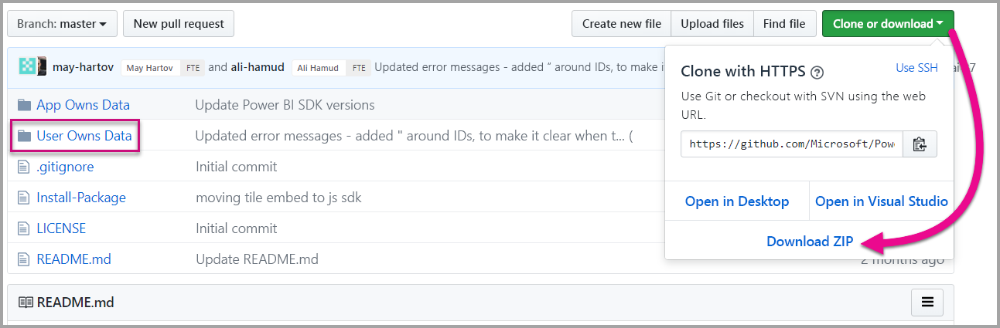

3. Ouvrez le fichier **Cloud.config** dans l’exemple d’application.

    Vous devez renseigner certains champs pour pouvoir exécuter l’application.

    | Champ |
    |--------------------|
    | **[ApplicationID](#application-id)** |
    | **[WorkspaceID](#workspace-id)** |
    | **[ReportID](#report-id)** |
    | **[AADAuthorityUrl](#aadauthorityurl)** |

    

### <a name="application-id"></a>ID de l’application

Dans le champ **applicationId**, indiquez **l’ID d’application** **d’Azure**. L’information **applicationId** est utilisée par l’application pour s’identifier auprès des utilisateurs auxquels vous demandez des autorisations.

Pour récupérer la valeur **applicationId**, suivez ces étapes :

1. Connectez-vous au [portail Azure](https://portal.azure.com).

2. Dans le volet de navigation de gauche, sélectionnez **Tous les services**, puis **Inscriptions d’applications**.

3. Sélectionnez l’application ayant besoin de la valeur **applicationId**.

    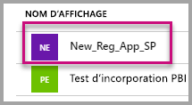

4. Un **ID d’application** est listé au format GUID. Utilisez cet **ID d’application** comme **applicationId** de l’application.

    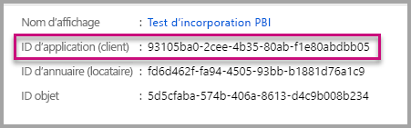

### <a name="workspace-id"></a>ID de l’espace de travail

Dans **workspaceId**, indiquez le GUID d’espace de travail d’application (groupe) provenant de Power BI. Vous pouvez obtenir ces informations à partir de l’URL quand vous êtes connecté au service Power BI ou à l’aide de Powershell.

URL <br>


PowerShell <br>

```powershell
Get-PowerBIworkspace -name "User Owns Embed Test"
```

   

### <a name="report-id"></a>ID du rapport

Dans **reportId**, indiquez le GUID de rapport provenant de Power BI. Vous pouvez obtenir ces informations à partir de l’URL quand vous êtes connecté au service Power BI ou à l’aide de Powershell.

URL de rapport Power BI <br>


URL de rapport paginé<br>


PowerShell <br>

```powershell
Get-PowerBIworkspace -name "User Owns Embed Test" | Get-PowerBIReport
```


### <a name="aadauthorityurl"></a>AADAuthorityUrl

Remplissez les informations **AADAuthorityUrl** avec l’URL qui vous permet d’effectuer l’incorporation dans votre locataire organisationnel ou d’effectuer l’incorporation avec un utilisateur invité.

Pour l’incorporation avec votre locataire organisationnel, utilisez l’URL *https://login.microsoftonline.com/common/oauth2/authorize* .

Pour l’incorporation avec un invité, utilisez l’URL *https://login.microsoftonline.com/report-owner-tenant-id* , où vous ajoutez l’ID de locataire du propriétaire du rapport à la place de *report-owner-tenant-id*.

### <a name="run-the-application"></a>Exécuter l’application

1. Sélectionnez **Exécuter** dans **Visual Studio**.

    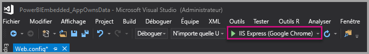

2. Ensuite, sélectionnez **Incorporer un rapport**. Sélectionnez l’option correspondant au contenu choisi pour le test (rapports, tableaux de bord ou vignettes) dans l’application.

    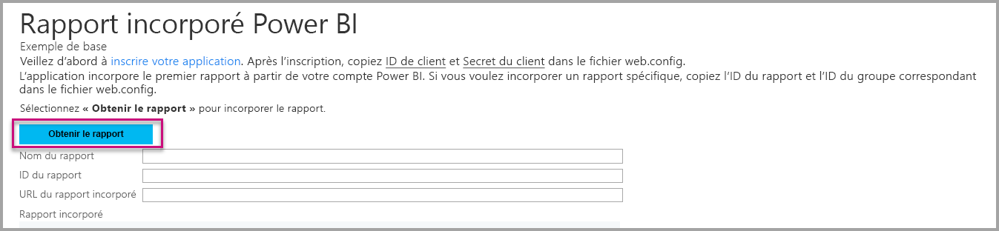

3. Vous pouvez à présent voir le rapport dans l’exemple d’application.

    

## <a name="embed-your-content-within-your-application"></a>Incorporer votre contenu dans l’application

Même si les étapes permettant d’incorporer votre contenu peuvent être effectuées avec les [API REST Power BI](https://docs.microsoft.com/rest/api/power-bi/), les exemples de code décrits dans cet article utilisent le kit SDK .NET.

Pour intégrer un rapport dans une application web, utilisez l’API REST Power BI ou le kit SDK C# de Power BI. Utilisez aussi un jeton d’accès d’autorisation Azure Active Directory pour obtenir un rapport. Ensuite, chargez le rapport en utilisant le même jeton d’accès. L’API REST Power BI fournit un accès par programmation à des ressources Power BI spécifiques. Pour plus d’informations, consultez les [API REST Power BI](https://docs.microsoft.com/rest/api/power-bi/) et l’[API JavaScript Power BI](https://github.com/Microsoft/PowerBI-JavaScript).

### <a name="get-an-access-token-from-azure-ad"></a>Obtenir un jeton d’accès à partir d’Azure AD

Dans votre application, vous devez obtenir un jeton d’accès auprès d’Azure AD avant de pouvoir effectuer des appels à l’API REST Power BI. Pour plus d’informations, consultez [Authentifier des utilisateurs et obtenir un jeton d’accès Azure AD pour votre application Power BI](get-azuread-access-token.md).

### <a name="get-a-report"></a>Obtenir un rapport

Pour obtenir un rapport Power BI ou paginé, utilisez l’opération [Obtenir des rapports](https://docs.microsoft.com/rest/api/power-bi/reports/getreports) qui obtient une liste des rapports Power BI et paginés. Dans la liste des rapports, vous pouvez obtenir un ID de rapport.

### <a name="get-reports-by-using-an-access-token"></a>Obtenir des rapports à l’aide d’un jeton d’accès

L’opération [Obtenir des rapports](https://docs.microsoft.com/rest/api/power-bi/reports/getreports) renvoie une liste de rapports. Vous ne pouvez récupérer qu’un seul rapport dans cette liste.

Pour effectuer l’appel d’API REST, vous devez inclure un en-tête d’*autorisation* au format *Porteur {jeton d’accès}* .

#### <a name="get-reports-with-the-rest-api"></a>Obtenir des rapports avec l’API REST

L’exemple de code suivant vous montre comment récupérer des rapports avec l’API REST :

> [!Note]
> Un exemple d’obtention d’un élément de contenu que vous voulez incorporer est disponible dans le fichier Default.aspx.cs dans l’[exemple d’application](https://github.com/Microsoft/PowerBI-Developer-Samples). Un rapport, un tableau de bord ou une vignette sont des exemples.

```csharp
using Newtonsoft.Json;

//Get a Report. In this sample, you get the first Report.
protected void GetReport(int index)
{
    //Configure Reports request
    System.Net.WebRequest request = System.Net.WebRequest.Create(
        String.Format("{0}/Reports",
        baseUri)) as System.Net.HttpWebRequest;

    request.Method = "GET";
    request.ContentLength = 0;
    request.Headers.Add("Authorization", String.Format("Bearer {0}", accessToken.Value));

    //Get Reports response from request.GetResponse()
    using (var response = request.GetResponse() as System.Net.HttpWebResponse)
    {
        //Get reader from response stream
        using (var reader = new System.IO.StreamReader(response.GetResponseStream()))
        {
            //Deserialize JSON string
            PBIReports Reports = JsonConvert.DeserializeObject<PBIReports>(reader.ReadToEnd());

            //Sample assumes at least one Report.
            //You could write an app that lists all Reports
            if (Reports.value.Length > 0)
            {
                var report = Reports.value[index];

                txtEmbedUrl.Text = report.embedUrl;
                txtReportId.Text = report.id;
                txtReportName.Text = report.name;
            }
        }
    }
}

//Power BI Reports used to deserialize the Get Reports response.
public class PBIReports
{
    public PBIReport[] value { get; set; }
}
public class PBIReport
{
    public string id { get; set; }
    public string reportType { get; set }
    public string name { get; set; }
    public string webUrl { get; set; }
    public string embedUrl { get; set; }
}
```

#### <a name="get-reports-by-using-the-net-sdk"></a>Obtenir des rapports à l’aide du kit SDK .NET

Le SDK .NET permet de récupérer une liste de rapports au lieu d’appeler directement l’API REST. L’exemple de code suivant vous montre comment lister les rapports :

```csharp
using Microsoft.IdentityModel.Clients.ActiveDirectory;
using Microsoft.PowerBI.Api.V2;
using Microsoft.PowerBI.Api.V2.Models;

var tokenCredentials = new TokenCredentials(<ACCESS TOKEN>, "Bearer");

// Create a Power BI Client object. It is used to call Power BI APIs.
using (var client = new PowerBIClient(new Uri(ApiUrl), tokenCredentials))
{
    // Get the first report all reports in that workspace
    ODataResponseListReport reports = client.Reports.GetReports();

    Report report = reports.Value.FirstOrDefault();

    var embedUrl = report.EmbedUrl;
}
```

### <a name="load-a-report-by-using-javascript"></a>Charger un rapport à l’aide de JavaScript

JavaScript permet de charger un rapport dans un élément div sur votre page web. L’exemple de code suivant montre comment récupérer un rapport d’un espace de travail donné :

> [!NOTE]  
> Un exemple de chargement d’un élément de contenu que vous voulez incorporer est disponible dans le fichier **Default.aspx** dans l’[exemple d’application](https://github.com/Microsoft/PowerBI-Developer-Samples).

```javascript
<!-- Embed Report-->
<div> 
    <asp:Panel ID="PanelEmbed" runat="server" Visible="true">
        <div>
            <div><b class="step">Step 3</b>: Embed a report</div>

            <div>Enter an embed url for a report from Step 2 (starts with https://):</div>
            <input type="text" id="tb_EmbedURL" style="width: 1024px;" />
            <br />
            <input type="button" id="bEmbedReportAction" value="Embed Report" />
        </div>

        <div id="reportContainer"></div>
    </asp:Panel>
</div>
```

#### <a name="sitemaster"></a>Site.master

```javascript
window.onload = function () {
    // client side click to embed a selected report.
    var el = document.getElementById("bEmbedReportAction");
    if (el.addEventListener) {
        el.addEventListener("click", updateEmbedReport, false);
    } else {
        el.attachEvent('onclick', updateEmbedReport);
    }

    // handle server side post backs, optimize for reload scenarios
    // show embedded report if all fields were filled in.
    var accessTokenElement = document.getElementById('MainContent_accessTokenTextbox');
    if (accessTokenElement !== null) {
        var accessToken = accessTokenElement.value;
        if (accessToken !== "")
            updateEmbedReport();
    }
};

// update embed report
function updateEmbedReport() {

    // check if the embed url was selected
    var embedUrl = document.getElementById('tb_EmbedURL').value;
    if (embedUrl === "")
        return;

    // get the access token.
    accessToken = document.getElementById('MainContent_accessTokenTextbox').value;

    // Embed configuration used to describe the what and how to embed.
    // This object is used when calling powerbi.embed.
    // You can find more information at https://github.com/Microsoft/PowerBI-JavaScript/wiki/Embed-Configuration-Details.
    var config = {
        type: 'report',
        accessToken: accessToken,
        embedUrl: embedUrl
    };

    // Grab the reference to the div HTML element that will host the report.
    var reportContainer = document.getElementById('reportContainer');

    // Embed the report and display it within the div container.
    var report = powerbi.embed(reportContainer, config);

    // report.on will add an event handler which prints to Log window.
    report.on("error", function (event) {
        var logView = document.getElementById('logView');
        logView.innerHTML = logView.innerHTML + "Error<br/>";
        logView.innerHTML = logView.innerHTML + JSON.stringify(event.detail, null, "  ") + "<br/>";
        logView.innerHTML = logView.innerHTML + "---------<br/>";
    }
  );
}
```

## <a name="using-a-power-bi-premium-dedicated-capacity"></a>Utilisation d’une capacité dédiée Power BI Premium

Maintenant que votre application est développée, il est temps de sauvegarder l’espace de travail de votre application avec une capacité dédiée.

### <a name="create-a-dedicated-capacity"></a>Créer une capacité dédiée

En créant une capacité dédiée, vous pouvez mettre à profit le fait que vous disposez d’une ressource dédiée pour le contenu de votre espace de travail d’application. Pour les rapports paginés, vous devez sauvegarder votre espace de travail d’application avec au minimum une capacité P1. Vous pouvez créer une capacité dédiée avec [Power BI Premium](../service-premium-what-is.md).

Le tableau suivant liste les références SKU Power BI Premium disponibles dans [Microsoft Office 365](../service-admin-premium-purchase.md) :

| Nœud de capacité | Nb total de vCores<br/>(backend + frontend) | vCores backend | vCores frontend | Limites de connexions actives/DirectQuery |
| --- | --- | --- | --- | --- | --- |
| EM1 |1 vCore |0,5 vCore, 10 Go de RAM |0,5 vCore |3,75 par seconde |
| EM2 |2 vCores |1 vCore, 10 Go de RAM |1 vCore |7,5 par seconde |
| EM3 |4 vCores |2 vCores, 10 Go de RAM |2 vCores |15 par seconde |
| P1 |8 vCores |4 vCores, 25 Go de RAM |4 vCores |30 par seconde |
| P2 |16 vCores |8 vCores, 50 Go de RAM |8 vCores |60 par seconde |
| P3 |32 vCores |16 vCores, 100 Go de RAM |16 vCores |120 par seconde |
| P4 |64 vCores |32 vCores, 200 Go de RAM |32 vCores |240 par seconde |
| P5 |128 vCores |64 vCores, 400 Go de RAM |64 vCores |480 par seconde |

> [!NOTE]
> - Lorsque vous tentez une incorporation avec des applications Microsoft Office, vous pouvez utiliser les références SKU EM pour accéder au contenu avec une licence gratuite de Power BI. Toutefois, vous ne pouvez pas accéder au contenu avec une licence gratuite de Power BI si vous utilisez Powerbi.com ou Power BI Mobile.
> - Lorsque vous tentez une incorporation avec des applications Microsoft Office en utilisant Powerbi.com ou Power BI Mobile, vous pouvez accéder au contenu avec une licence gratuite de Power BI.

### <a name="assign-an-app-workspace-to-a-dedicated-capacity"></a>Affecter un espace de travail d’application à une capacité dédiée

Après avoir créé une capacité dédiée, vous pouvez lui affecter l’espace de travail de votre application. Pour ce faire, effectuez les étapes suivantes :

1. Dans le service Power BI, développez les espaces de travail, puis sélectionnez les points de suspension à côté de l’espace de travail que vous utilisez pour incorporer votre contenu. Sélectionnez ensuite **Modifier l’espace de travail**.

    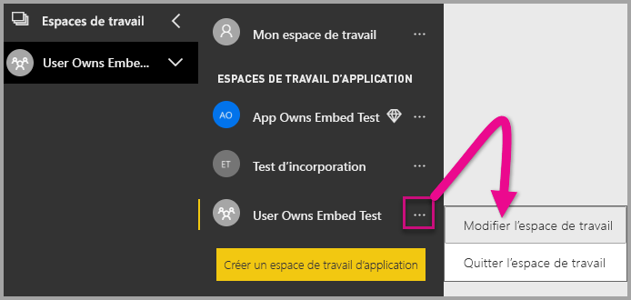

2. Développez **Avancé** et activez **Capacité dédiée**. Sélectionnez la capacité dédiée que vous avez créée. Ensuite, sélectionnez **Enregistrer**.

    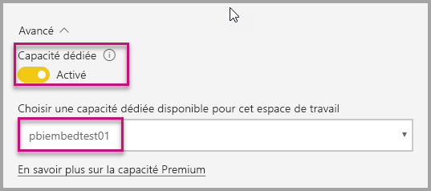

3. Après avoir sélectionné **Enregistrer**, vous devez voir un losange à côté du nom de l’espace de travail de l’application.

    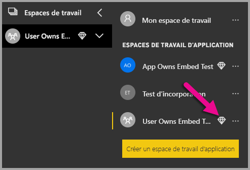

## <a name="admin-settings"></a>Paramètres d’administrateur

Les administrateurs généraux ou les administrateurs du service Power BI peuvent activer ou désactiver la possibilité d’utiliser les API REST pour un locataire. Les administrateurs Power BI peuvent définir ce paramètre pour toute l’organisation ou pour des groupes de sécurité. Il est activé par défaut pour toute l’organisation. Vous pouvez apporter ces changements dans le [portail d’administration Power BI](../service-admin-portal.md).

## <a name="next-steps"></a>Étapes suivantes

Dans ce tutoriel, vous avez appris à incorporer du contenu Power BI dans une application à l’aide de votre compte d’organisation Power BI. Vous pouvez maintenant essayer d’incorporer du contenu Power BI dans une application à l’aide d’applications. Vous pouvez également tenter d’incorporer du contenu Power BI pour vos clients (ceci n’est pas encore pris en charge pour l’incorporation de rapports paginés) :

> [!div class="nextstepaction"]
> [Incorporer à partir d’applications](embed-from-apps.md)

> [!div class="nextstepaction"]
>[Incorporer pour vos clients](embed-sample-for-customers.md)

Si vous avez d’autres questions, [essayez d’interroger la communauté Power BI](http://community.powerbi.com/).
