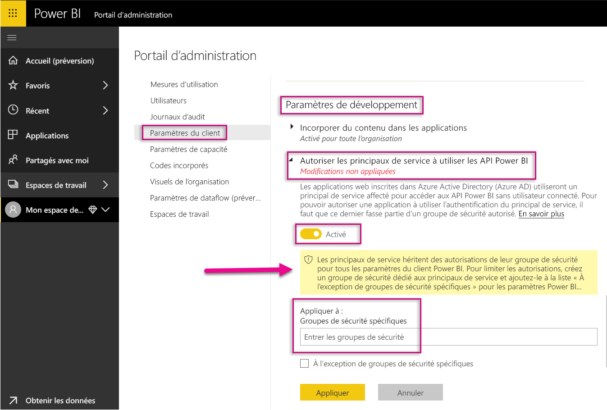
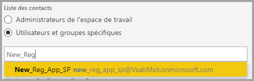
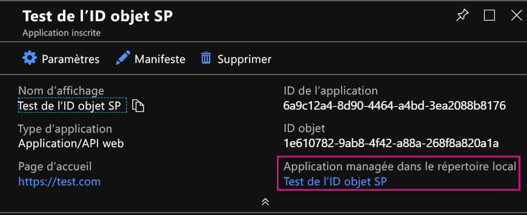

# <a name="service-principal-with-power-bi-preview"></a>Principal de service avec Power BI (préversion)

Un **principal de service** permet d’incorporer du contenu Power BI dans une application et d’utiliser Automation avec Power BI à l’aide d’un jeton d’**application uniquement**. Il est utile de recourir à un principal de service quand vous utilisez **Power BI Embedded** ou quand vous **automatisez des tâches et des processus Power BI**.

Si vous utilisez Power BI Embedded, l’emploi d’un principal de service présente des avantages. Un avantage majeur est que l’authentification dans votre application ne nécessite pas de compte principal (licence Power BI Pro composée simplement d’un nom d’utilisateur et d’un mot de passe pour la connexion). Le principal de service utilise un ID d’application et un secret d’application pour authentifier l’application.

Lors de l’automatisation de tâches Power BI, vous pouvez également créer un script qui définit comment traiter et gérer les principaux de service à l’échelle.

## <a name="application-and-service-principal-relationship"></a>Relation entre l’application et le principal de service

Pour accéder aux ressources qui sécurisent un locataire Azure AD, l’entité qui nécessite l’accès représente un principal de sécurité. Cette action est valable pour les utilisateurs (principal d’utilisateur) et les applications (principal de service).

Le principal de sécurité définit la stratégie d’accès et les autorisations pour les utilisateurs et les applications dans le locataire Azure AD. Cette stratégie d’accès active des fonctionnalités de base, notamment l’authentification des utilisateurs et des applications au moment de la connexion ainsi que l’autorisation durant l’accès aux ressources. Pour plus d’informations, consultez [Application et principal de service dans Azure Active Directory (AAD)](https://docs.microsoft.com/azure/active-directory/develop/app-objects-and-service-principals).

Quand vous inscrivez une application Azure AD dans le portail Azure, deux objets sont créés dans votre locataire Azure AD :

* Un [objet d’application](https://docs.microsoft.com/azure/active-directory/develop/app-objects-and-service-principals#application-object)
* Un [objet de principal de service](https://docs.microsoft.com/azure/active-directory/develop/app-objects-and-service-principals#service-principal-object)

Considérez l’objet d’application comme la représentation *globale* de votre application pour une utilisation sur tous les locataires, et l’objet de principal de service comme la représentation *locale* pour une utilisation dans un locataire spécifique.

L’objet d’application sert de modèle à partir duquel les propriétés communes et par défaut sont *dérivées* pour créer les objets de principal de service correspondants.

Un principal de service est requis pour chaque locataire où l’application est utilisée, ce qui lui permet d’établir une identité pour la connexion et d’accéder aux ressources sécurisées par le locataire. Une application monolocataire n’a qu’un principal de service (dans son locataire de base), sa création et le consentement à son utilisation ayant lieu durant l’inscription de l’application.

## <a name="service-principal-with-power-bi-embedded"></a>Principal de service avec Power BI Embedded

Un principal de service vous permet de masquer les informations de votre compte principal dans votre application à l’aide d’un ID d’application et d’un secret d’application. Vous n’êtes donc plus obligé de coder en dur un compte principal dans votre application pour l’authentification.

Dans la mesure où les **API Power BI** et le **SDK .NET Power BI** prennent désormais en charge les appels à l’aide d’un principal de service, vous pouvez utiliser les [API REST Power BI](https://docs.microsoft.com/rest/api/power-bi/) avec le principal de service. Vous pouvez ainsi apporter des changements aux espaces de travail, notamment pour créer des espaces de travail, ajouter des utilisateurs à des espaces de travail ou en supprimer, et importer du contenu dans des espaces de travail.

Vous ne pouvez utiliser le principal de service que si vos artefacts et ressources Power BI sont stockés dans le [nouvel espace de travail Power BI](../service-create-the-new-workspaces.md).

## <a name="service-principal-vs-master-account"></a>Principal de service et compte principal

Il existe des différences selon que vous utilisez un principal de service ou un compte principal standard (licence Power BI Pro) pour l’authentification. Les principales différences sont listées dans le tableau ci-dessous.

| personnalisée | Compte d’utilisateur principal <br> (licence Power BI Pro) | Principal de service <br> (jeton d’application uniquement) |
|------------------------------------------------------|---------------------|-------------------|
| Peut se connecter au service Power BI  | Oui | Non |
| Activé dans le portail d’administration Power BI | Non | Oui |
| [Fonctionne avec les espaces de travail d’application (v1)](../service-create-workspaces.md) | Oui | Non |
| [Fonctionne avec les nouveaux espaces de travail d’application (v2)](../service-create-the-new-workspaces.md) | Oui | Oui |
| Doit être administrateur de l’espace de travail s’il est utilisé avec Power BI Embedded | Oui | Oui |
| Peut utiliser les API REST Power BI | Oui | Oui |
| Nécessite un administrateur général pour créer | Oui | Non |
| Peut installer et gérer une passerelle de données locale | Oui | Non |

## <a name="get-started-with-a-service-principal"></a>Bien démarrer avec un principal de service

À la différence d’un compte principal traditionnel, un principal de service (jeton d’application uniquement) nécessite la configuration de quelques éléments. Pour commencer, vous devez configurer un environnement adapté.

1. [Inscrivez une application web côté serveur](register-app.md) dans Azure Active Directory (AAD) à utiliser avec Power BI. Après avoir inscrit une application, vous pouvez capturer un ID d’application, un secret d’application et l’ID objet du principal de service pour accéder à votre contenu Power BI. Vous pouvez créer un principal de service avec [PowerShell](https://docs.microsoft.com/powershell/azure/create-azure-service-principal-azureps?view=azps-1.1.0).

    Voici un exemple de script qui crée une application Azure Active Directory.

    ```powershell
    # The app id - $app.appid
    # The service principal object id - $sp.objectId
    # The app key - $key.value

    # Sign in as a user that is allowed to create an app.
    Connect-AzureAD

    # Create a new AAD web application
    $app = New-AzureADApplication -DisplayName "testApp1" -Homepage "https://localhost:44322" -ReplyUrls "https://localhost:44322"

    # Creates a service principal
    $sp = New-AzureADServicePrincipal -AppId $app.AppId

    # Get the service principal key.
    $key = New-AzureADServicePrincipalPasswordCredential -ObjectId $sp.ObjectId
    ```

   > [!Important]
   > Une fois que vous activez le principal de service à utiliser avec Power BI, les autorisations AD de l’application n’ont plus d’effet. Les autorisations de l’application sont ensuite gérées par le biais du portail d’administration Power BI.

2. Créez un [groupe de sécurité dans Azure Active Directory (AAD)](https://docs.microsoft.com/azure/active-directory/fundamentals/active-directory-groups-create-azure-portal) et ajoutez l’application que vous avez créée à ce groupe de sécurité. Vous pouvez créer un groupe de sécurité AAD avec [PowerShell](https://docs.microsoft.com/powershell/azure/create-azure-service-principal-azureps?view=azps-1.1.0).

    Voici un exemple de script qui crée un groupe de sécurité et ajoute une application à ce groupe.

    ```powershell
    # Required to sign in as a tenant admin
    Connect-AzureAD

    # Create an AAD security group
    $group = New-AzureADGroup -DisplayName <Group display name> -SecurityEnabled $true -MailEnabled $false -MailNickName notSet

    # Add the service principal to the group
    Add-AzureADGroupMember -ObjectId $($group.ObjectId) -RefObjectId $($sp.ObjectId)
    ```

3. En tant qu’administrateur Power BI, vous devez activer le principal de service dans les **Paramètres du développeur** du portail d’administration Power BI. Ajoutez le groupe de sécurité que vous avez créé dans Azure AD à la section **Groupe de sécurité spécifique** des **Paramètres du développeur**.

   > [!Important]
   > Les principaux du service ont accès à tous les paramètres de locataire qui sont activés pour toute l’organisation ou pour les groupes de sécurité qui contiennent des principaux du service dans le cadre du groupe. Pour restreindre l’accès des principaux du service à des paramètres de locataire spécifiques, autorisez uniquement l’accès à certains groupes de sécurité ou créez un groupe de sécurité dédié pour les principaux du service et excluez-le.

    

4. Configurez votre [environnement Power BI](embed-sample-for-customers.md#set-up-your-power-bi-environment).

5. Ajoutez le principal de service comme **administrateur** de l’espace de travail que vous avez créé. Vous pouvez gérer cette tâche via des [API](https://docs.microsoft.com/rest/api/power-bi/groups/addgroupuser) ou avec le service Power BI.

    

6. Choisissez à présent d’incorporer votre contenu dans un exemple d’application ou dans votre propre application.

    * [Incorporer du contenu en utilisant l’exemple d’application](embed-sample-for-customers.md#embed-content-using-the-sample-application)
    * [Incorporer du contenu dans votre application](embed-sample-for-customers.md#embed-content-within-your-application)

7. Vous êtes prêt à [passer en production](embed-sample-for-customers.md#move-to-production).

## <a name="migrate-to-service-principal"></a>Migrer vers le principal de service

Vous pouvez migrer vers le principal de service si vous utilisez actuellement un compte principal avec Power BI ou Power BI Embedded.

Effectuez les trois premières étapes de la section [Bien démarrer avec un principal de service](#get-started-with-a-service-principal). Une fois terminé, suivez les instructions ci-dessous.

Si vous utilisez déjà les [nouveaux espaces de travail](../service-create-the-new-workspaces.md) dans Power BI, ajoutez le principal de service comme **administrateur** aux espaces de travail avec vos artefacts Power BI. En revanche, si vous utilisez les [espaces de travail traditionnels](../service-create-workspaces.md), copiez ou déplacez vos artefacts et ressources Power BI dans les nouveaux espaces de travail, puis ajoutez-y le principal de service comme **administrateur**.

Étant donné que l’interface utilisateur ne propose aucune fonctionnalité pour déplacer les artefacts et ressources Power BI d’un espace de travail vers un autre, vous devez utiliser les [API](https://powerbi.microsoft.com/pt-br/blog/duplicate-workspaces-using-the-power-bi-rest-apis-a-step-by-step-tutorial/) pour accomplir cette tâche. Quand vous utilisez les API avec un principal de service, vous avez besoin de l’ID objet du principal de service.

### <a name="how-to-get-the-service-principal-object-id"></a>Comment obtenir l’ID objet du principal de service

Pour affecter un principal de service à un nouvel espace de travail d’application, utilisez les [API REST Power BI](https://docs.microsoft.com/rest/api/power-bi/groups/addgroupuser). Pour référencer un principal de service pour des opérations ou pour faire des changements, par exemple pour appliquer un principal de service comme administrateur à un espace de travail, utilisez l’**ID objet du principal de service**.

Voici les étapes à suivre pour obtenir l’ID objet du principal de service à partir du portail Azure.

1. Créez une inscription d’application dans le portail Azure.  

2. Ensuite, sous **Application managée dans l’annuaire local**, sélectionnez le nom de l’application que vous avez créée.

   

    > [!Note]
    > L’ID objet dans l’image ci-dessus n’est pas celui utilisé avec le principal de service.

3. Sélectionnez **Propriétés** pour afficher l’ID objet.

    

Voici un exemple de script pour récupérer l’ID objet du principal de service avec PowerShell.

   ```powershell
   Get-AzureADServicePrincipal -Filter "DisplayName eq '<application name>'"
   ```

## <a name="considerations-and-limitations"></a>Considérations et limitations

* Un principal de service ne fonctionne qu’avec de [nouveaux espaces de travail d’application](../service-create-the-new-workspaces.md).
* **Mon espace de travail** n’est pas pris en charge lors de l’utilisation d’un principal de service.
* Une capacité Premium dédiée est nécessaire pour passer en production.
* Vous ne pouvez pas vous connecter au portail Power BI avec un principal de service.
* Vous devez disposer de droits d’administrateur Power BI pour activer un principal de service dans les paramètres du développeur du portail d’administration Power BI.
* Il est impossible d’installer ou de gérer une passerelle de données locale à l’aide d’un principal de service.
* Les applications [incorporant du contenu pour votre organisation](embed-sample-for-your-organization.md) ne peuvent pas utiliser un principal de service.
* La gestion de [flux de données](../service-dataflows-overview.md) n’est pas prise en charge.
* Le principal du service ne prend pas en charge les API d’administration.

## <a name="next-steps"></a>Étapes suivantes

* [Inscrire une application](register-app.md)
* [Power BI Embedded pour vos clients](embed-sample-for-customers.md)
* [Objets d’application et de principal de service dans Azure Active Directory](https://docs.microsoft.com/azure/active-directory/develop/app-objects-and-service-principals)
