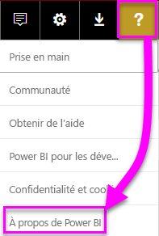
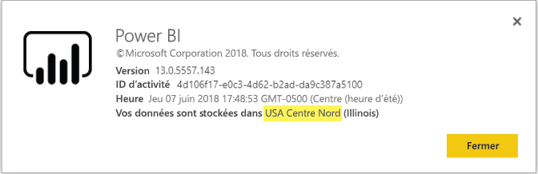

# <a name="frequently-asked-questions-about-power-bi-embedded"></a>Questions fréquentes sur Power BI Embedded

* Si vous avez des questions, [essayez d’interroger la communauté Power BI](http://community.powerbi.com/).
* Le problème persiste ? Visitez la [page de support Power BI](https://powerbi.microsoft.com/support/).

## <a name="general"></a>Général

### <a name="what-is-power-bi-embedded"></a>Qu'est-ce que Power BI Embedded ?

Microsoft Power BI Embedded (PBIE) permet aux développeurs d’applications d’incorporer des rapports stupéfiants entièrement interactifs dans des applications sans consacrer ni temps ni argent à créer entièrement leurs propres visualisations et contrôles de données.

### <a name="who-is-the-target-audience-for-power-bi-embedded"></a>Qui est le public cible de Power BI Embedded ?

Les développeurs et les éditeurs de logiciels qui créent leurs propres applications sont appelés « fournisseurs de logiciels indépendants ».

### <a name="how-is-power-bi-embedded-different-from-power-bi-the-service"></a>En quoi Power BI Embedded est différent du service Power BI ?

Power BI Embedded est conçu pour les éditeurs de logiciels indépendants ou les développeurs qui créent des applications et souhaitent y incorporer des visuels pour aider leurs clients à prendre des décisions sans générer entièrement une solution d’analytique. L’analytique incorporée permet aux utilisateurs en entreprise d’accéder aux données de l’entreprise et d’exécuter des requêtes pour générer des insights à l’aide de ces données au sein de l’application.

Power BI est une solution d’analytique en tant que service qui offre aux organisations une vue unique de leurs données les plus critiques.

### <a name="what-is-the-difference-between-power-bi-premium-and-power-bi-embedded"></a>Quelle est la différence entre Power BI Premium et Power BI Embedded ?

Power BI Premium offre des fonctionnalités destinées aux entreprises qui veulent une solution d’informatique décisionnelle complète qui fournit une vue unique de leur organisation, partenaires, clients et fournisseurs. Power BI Premium aide votre organisation à prendre des décisions. Power BI Premium est un produit SaaS qui permet aux utilisateurs de consommer du contenu via le portail Power BI, l’application mobile et des applications développées en interne.

Power BI Embedded est conçu pour les éditeurs de logiciels indépendants ou les développeurs qui créent des applications et souhaitent y incorporer des visuels. Power BI Embedded aide vos clients à prendre des décisions. Comme Power BI Embedded est conçu pour les développeurs d’applications, les clients de ces applications peuvent utiliser du contenu stocké sur la capacité Power BI Embedded, y compris toute personne à l’intérieur ou à l’extérieur de l’organisation. Le contenu de la capacité Power BI Embedded ne peut pas être partagé via la publication vers le web ou SharePoint en un clic, et ne prend pas en charge les rapports SSRS.

### <a name="what-is-the-microsoft-recommendation-for-when-a-customer-should-buy-power-bi-premium-vs-power-bi-embedded"></a>Que recommande Microsoft à un client qui hésite entre Power BI Embedded et Power BI Premium ?

Microsoft recommande aux entreprises d’acheter Power BI Premium (solution d’informatique décisionnelle cloud libre-service de classe Entreprise), et aux éditeurs de logiciels indépendants d’acheter Power BI Embedded, qui regroupe des composants d’analytique incorporée fonctionnant dans le cloud. Toutefois, il n’existe aucune restriction sur le produit qu’un client peut acheter.

Dans certains cas, un éditeur de logiciels indépendant (généralement de grande taille) peut vouloir utiliser une référence SKU P pour obtenir les avantages supplémentaires du service Power BI complet au sein de leur organisation, ainsi que les incorporer dans leurs applications. Certaines entreprises peuvent décider d’utiliser des références SKU A dans Azure si elles ne sont intéressées que par la création d’applications métier et par l’incorporation d’analytique dans ces dernières, mais pas par l’utilisation du service Power BI complet.

### <a name="how-many-embed-tokens-can-i-create"></a>Combien de jetons incorporés puis-je créer ?

Les jetons incorporés avec une licence PRO étant destinés aux tests de développement, le nombre de jetons incorporés qu’un compte principal Power BI peut générer est limité. Vous devez [acheter une capacité](#technical) pour l’incorporation dans un environnement de production. Une fois que vous avez acheté une capacité, vous n’êtes pas limité dans le nombre de jetons incorporés que vous pouvez générer. Accédez à [Fonctionnalités disponibles](https://docs.microsoft.com/rest/api/power-bi/availablefeatures) pour vérifier la valeur qui indique l’utilisation actuelle de jetons incorporés en pourcentage.

## <a name="technical"></a>Technique

### <a name="what-is-the-difference-between-the-a-skus-in-azure-and-the-em-skus-in-office-365"></a>Quelle est la différence entre les références SKU A dans Azure et les références SKU EM dans Office 365 ?

PowerBI.com est une solution d’entreprise qui inclut de nombreuses fonctionnalités, notamment de collaboration sociale, d’abonnement par e-mail, etc. dans une offre de logiciel en tant que service

Power BI Embedded est un ensemble d’API qui permet aux développeurs de créer une solution d’analytique incorporée dans une offre de plateforme en tant que service. Pour le scénario d’analytique incorporée, PowerBI.com doit être utilisé pour aider les éditeurs de logiciels indépendants et les développeurs à gérer le contenu des solutions d’analytique incorporée et les paramètres au niveau du locataire.

Voici un tableau des différences de fonctionnalités.

| Fonctionnalité | Power BI Embedded | Capacité Power BI Premium | Capacité Power BI Premium |
|----------------------------------------------------------------------------------|-------------------|---------------------------|---------------------------|
|   | (Références SKU A) | (Références SKU EM) | (Références SKU P) |
| Incorporer des artefacts à partir d’un espace de travail d’application Power BI | Capacité Azure | Capacité Office 365 | Capacité Office 365 |
| Utiliser des rapports Power BI dans une application incorporée | Oui | Oui | Oui |
| Utiliser des rapports Power BI dans SharePoint | Non | Oui | Oui |
| Utiliser des rapports Power BI dans Dynamics | Non | Oui | Oui |
| Utiliser des rapports Power BI dans Teams (à l’exception de l’application mobile) | Non | Oui | Oui |
| Accéder à du contenu avec une licence Power BI gratuite dans Powerbi.com et Power BI Mobile | Non | Non | Oui |
| Accéder à du contenu incorporé dans des applications MS Office avec une licence Power BI GRATUITE | Non | Oui | Oui |

### <a name="power-bi-now-offers-three-skus-for-embedding-a-skus-em-skus-and-p-skus-which-one-should-i-purchase-for-my-scenario"></a>Power BI propose maintenant trois références SKU pour l’incorporation : A, EM et P. Laquelle dois-je acheter pour mon scénario ?

|  |Référence SKU A (Power BI Embedded)  |Référence SKU EM (Power BI Premium)  |Référence SKU P (Power BI Premium)  |
|---------|---------|---------|---------|
|Purchase  |Portail Azure |Office |Office |
|Cas d’usage | Incorporer du contenu dans votre application | <li> Incorporer du contenu dans votre application <br><br></br> <li> Incorporer du contenu dans les applications MS Office : <br> - [SharePoint](https://powerbi.microsoft.com/blog/integrate-power-bi-reports-in-sharepoint-online/) <br> - [Teams (à l’exception de l’application mobile)](https://powerbi.microsoft.com/blog/power-bi-teams-up-with-microsoft-teams/) <br> - [Dynamics 365](https://docs.microsoft.com/dynamics365/customer-engagement/basics/add-edit-power-bi-visualizations-dashboard) | <li> Incorporer du contenu dans votre application <br><br></br> <li> Incorporer du contenu dans les applications MS Office : <br> - [SharePoint](https://powerbi.microsoft.com/blog/integrate-power-bi-reports-in-sharepoint-online/) <br> - [Teams (à l’exception de l’application mobile)](https://powerbi.microsoft.com/blog/power-bi-teams-up-with-microsoft-teams/) <br> - [Dynamics 365](https://docs.microsoft.com/dynamics365/customer-engagement/basics/add-edit-power-bi-visualizations-dashboard) <br><br></br> <li> Partager du contenu avec des utilisateurs de Power BI par le biais du [service Power BI](https://powerbi.microsoft.com/en-us/)  |
|Facturation |Toutes les heures |Mensuelle |Mensuelle |
|Avec engagement  |Sans engagement |Annuel  |Mensuelle/Annuelle |
|Différenciation |Élasticité complète : augmenter/réduire la taille, interrompre/reprendre des ressources dans le portail Azure ou via l’API  |Peut être utilisée pour incorporer du contenu dans SharePoint Online et Microsoft Teams (à l’exception de l’application mobile) |Combiner l’incorporation dans les applications et utiliser le service Power BI dans la même capacité |

### <a name="what-are-the-prerequisites-to-create-a-pbie-capacity-in-azure"></a>Quelles sont les prérequis à la création d’une capacité PBIE dans Azure ?

* Vous devez vous connecter à votre annuaire d’organisation (les comptes MSA ne sont pas pris en charge).
* Vous devez avoir un locataire Power BI (c’est-à-dire qu’au moins un utilisateur dans votre annuaire doit être inscrit auprès de Power BI). 
* Vous devez disposer d’un abonnement Azure dans votre annuaire d’organisation.

### <a name="how-can-i-monitor-power-bi-embedded-capacity-consumption"></a>Comment superviser la consommation des capacités Power BI Embedded ?

* Utilisez [le portail d’administration de Power BI](../service-admin-portal.md#power-bi-embedded).

* Téléchargez l’[application de métriques](https://review.docs.microsoft.com/power-bi/service-admin-premium-monitor-capacity) dans Power BI.

* Utilisez la [Journalisation des diagnostics Azure](azure-pbie-diag-logs.md).

### <a name="will-my-capacity-scale-automatically-to-adjust-to-the-consumption-of-my-app"></a>Ma capacité évoluera-t-elle automatiquement pour s’ajuster à la consommation de mon application ?

Bien que la mise à l’échelle automatique ne soit pas proposée à l’heure actuelle, toutes les API peuvent être mises à l’échelle à tout moment.

### <a name="why-creatingscalingresuming-a-capacity-results-in-putting-the-capacity-into-a-suspended-state"></a>Pourquoi les opérations de création, mise à l’échelle et reprise d’une capacité la font-elles basculer dans un état interrompu ?

Le provisionnement d’une capacité (mise à l’échelle/reprise/création) peut échouer. L’auteur de l’appel de provisionnement doit vérifier la valeur de la propriété ProvisioningState d’une capacité à l’aide de l’API d’obtention des détails : [Capacités - Obtenir les détails](https://docs.microsoft.com/rest/api/power-bi-embedded/capacities/getdetails).

### <a name="why-can-i-only-create-pbie-in-a-specific-region"></a>Pourquoi est-il seulement possible de créer des capacités PBIE dans une région spécifique ?

Vous pouvez créer des capacités PBIE uniquement pour la région de votre locataire PBI.

### <a name="how-can-i-find-what-is-my-pbi-tenant-region"></a>Comment déterminer la région de mon locataire PBI ?

Vous pouvez utiliser le portail PBI pour comprendre quelle est la région de votre locataire PBI.

[https://app.powerbi.com/](https://app.powerbi.com/) > ? > À propos de Power BI




### <a name="what-is-supported-with-the-cloud-solution-provider-csp-channel"></a>Que permet le canal de fournisseur de solutions cloud (CSP) ?

* Le type d’abonnement CSP vous permet de créer des capacités PBIE pour votre locataire.
* Le compte partenaire permet de se connecter au locataire d’un client et d’acheter des capacités PBIE pour ce dernier, en spécifiant l’utilisateur du locataire du client comme administrateur de capacité Power BI.

### <a name="why-do-i-get-an-unsupported-account-message"></a>Pourquoi j’obtiens un message de compte non pris en charge ?

Power BI vous impose de vous inscrire avec un compte professionnel. Vous ne pouvez pas vous inscrire à Power BI avec un compte Microsoft (MSA).

### <a name="can-i-use-apis-to-create--manage-azure-capacities"></a>Puis-je utiliser des API pour créer et gérer des capacités Azure ?

Oui, les applets de commande Powershell et les API Azure Resource Manager vous permettent de créer et de gérer des ressources PBIE.

* API REST : https://docs.microsoft.com/rest/api/power-bi-embedded/
* Applets de commande PowerShell : https://docs.microsoft.com/powershell/module/azurerm.powerbiembedded/

### <a name="what-is-the-pbi-embedded-dedicated-capacity-role-in-a-pbi-embedded-solution"></a>Quel est le rôle d’une capacité dédiée PBI Embedded dans une solution PBI Embedded ?

Pour [mettre votre solution en production](https://docs.microsoft.com/power-bi/developer/embedding-content#step-3-promote-your-solution-to-production), vous devez affecter le contenu Power BI (espace de travail d’application que vous utilisez dans votre application) à une capacité Power BI Embedded (référence SKU A).

### <a name="what-are-the-azure-regions-pbi-embedded-is-available"></a>Dans quelles régions Azure PBI Embedded est-il disponible ?

[PAM](https://ecosystemmanager.azurewebsites.net/home) (EcoManager) - voir le responsable de la disponibilité produit

Régions disponibles (16 - mêmes régions que Power BI)

* États-Unis (6) - USA Est, USA Est 2, USA Centre Nord, USA Centre Sud, USA Ouest, USA Ouest 2
* Europe (2) - Europe Nord, Europe Ouest
* Asie-Pacifique (2) - Asie Sud-Est, Asie Est
* Brésil (1) - Brésil Sud
* Japon (1) - Japon Est
* Australie (1) - Australie Sud-Est
* Inde (1) - Inde Ouest
* Canada (1) - Canada Centre
* Royaume-Uni (1) - Royaume-Uni Sud

### <a name="what-is-the-authentication-model-for-power-bi-embedded"></a>Quel est le modèle d’authentification pour Power BI Embedded ?

Power BI Embedded continuera à utiliser Azure AD pour l’authentification de l’utilisateur principal (utilisateur désigné sous licence Power BI Pro), en authentifiant l’application à l’intérieur de Power BI.

L’authentification et l’autorisation des utilisateurs de l’application seront implémentées par l’éditeur de logiciels indépendant. Ce dernier peut implémenter sa propre authentification pour ses applications.

Si vous disposez déjà d’un locataire Azure AD, vous pouvez utiliser votre répertoire actuel, ou vous pouvez créer un locataire Azure AD pour garantir la sécurité du contenu de votre application incorporée.

Pour obtenir un jeton AAD, vous pouvez utiliser une des bibliothèques d’authentification Azure Active Directory - https://docs.microsoft.com/azure/active-directory/develop/active-directory-authentication-libraries. Des bibliothèques clientes sont disponibles pour plusieurs plateformes.

### <a name="my-application-already-uses-aad-for-user-authentication-how-can-we-use-this-identity-when-authenticating-to-power-bi-in-an-user-owns-data-scenario"></a>My Application utilise déjà AAD pour l’authentification utilisateur. Comment utiliser cette identité pour s’authentifier auprès de Power BI dans un scénario où l’utilisateur possède les données ?

Il s’agit d’un flux OAuth « Pour le compte de » standard (https://docs.microsoft.com/azure/active-directory/develop/active-directory-authentication-scenarios#web-application-to-web-api) L’application doit être configurée pour exiger des autorisations d’accès au service Power BI (avec les étendues nécessaires), et dès lors que vous disposez d’un jeton d’utilisateur pour votre application, vous faites simplement appel à l’API ADAL API AcquireTokenAsync en utilisant le jeton d’accès utilisateur et spécifiez l’URL de la ressource Power BI en tant qu’ID de ressource. Consultez l’extrait de code ci-dessous pour savoir comment faire :

```csharp
var context = new AD.AuthenticationContext(authorityUrl);
var userAssertion = new AD.UserAssertion(userAccessToken);
var clientAssertion = new AD.ClientAssertionCertificate(MyAppId, MyAppCertificate)
var authenticationResult = await context.AcquireTokenAsync(resourceId, clientAssertion, userAssertion);
```

### <a name="how-is-power-bi-embedded-different-from-other-azure-services"></a>En quoi Power BI Embedded est différent des autres services Azure ?

L’éditeur de logiciels indépendant/le développeur doit avoir un compte Power BI avant d’acheter Power BI Embedded dans Azure. Votre région de déploiement Power BI Embedded est déterminée par votre compte Power BI. Gérez votre ressource Power BI Embedded dans Azure aux fins suivantes :

* Augmenter/réduire la taille
* Ajouter des administrateurs de capacité
* Interrompre/reprendre le service

Utilisez PowerBI.com pour attribuer/désattribuer des espaces de travail à votre capacité Power BI Embedded.

### <a name="what-deploy-regions-are-supported"></a>Quelles régions de déploiement sont prises en charge ?

Sud-Est de l’Australie, Sud du Brésil, Canada Centre, États-Unis de l'Est 2, Inde-Ouest, Japon de l'Est, Nord du centre des États-Unis, Europe du Nord, Sud du centre des États-Unis, Sud-Est asiatique, Royaume-Uni Sud, Europe de l’Ouest, États-Unis de l'Ouest et États-Unis de l'Ouest 2.

### <a name="what-type-of-content-pack-data-can-be-embedded"></a>Quel type de données du pack de contenu est-il possible d’incorporer ?

Les **tableaux de bord** et les **vignettes** créés à partir de jeux de données du pack de contenu *ne peuvent pas* être incorporés, mais les **rapports** créés à partir d’un jeu de données du pack de contenu *peuvent* l’être.

### <a name="what-is-the-difference-between-using-rls-vs-javascript-filters"></a>Quelle est la différence entre la sécurité au niveau des lignes et les filtres JavaScript ?

Il existe souvent une certaine confusion quant il s’agit de choisir entre la sécurité au niveau des lignes et les filtres JavaScript. L’une de ces méthodes porte sur le contrôle de ce qu’un utilisateur spécifique peut voir, tandis que l’autre concerne l’optimisation de ce que l’utilisateur voit.

Pour la sécurité au niveau des lignes, le développeur ISV contrôle le filtrage des données dans le cadre de la création du modèle et de la génération de jeton d’incorporation. L’utilisateur final voit uniquement ce que l’ISV l’autorise à voir. Dans ce cas, l’utilisateur peut choisir d’en voir moins que ce qui est filtré, mais il ne pourra pas contourner la configuration de sécurité au niveau des lignes et voir plus que ce qui est autorisé.

Pour le filtrage côté client (JavaScript), l’ISV peut décider de ce que l’utilisateur final voit dans la vue initiale, mais il ne peut pas contrôler les changements que l’utilisateur final est susceptible d’appliquer à la vue proprement dite. Même si le filtrage des données peut se produire sur le back-end, il est déclenché par le code client JavaScript et peut être changé par un utilisateur final. Il ne peut donc pas être considéré comme sécurisé.

Pour plus d’informations, consultez [Sécurité au niveau des lignes ou filtres JavaScript](embedded-row-level-security.md#using-rls-vs-javascript-filters).

## <a name="licensing"></a>Licensing

### <a name="how-do-i-purchase-power-bi-embedded"></a>Comment acheter Power BI Embedded ?

Power BI Embedded est disponible via Azure.

### <a name="what-happens-if-i-already-purchased-power-bi-premium-and-now-i-want-some-of-the-benefits-of-power-bi-embedded-in-azure"></a>Que se passe-t-il si j’ai déjà acheté Power BI Premium et que je veux maintenant profiter de certains des avantages de Power BI Embedded dans Azure ?

Les clients continueront à payer les achats Power BI Premium actuels jusqu’à la fin de la durée de leur contrat actuel et pourront ensuite basculer leurs achats Power BI, le cas échéant.

### <a name="do-i-still-have-to-buy-power-bi-premium-to-get-access-to-power-bi-embedded"></a>Dois-je toujours acheter Power BI Premium pour accéder à Power BI Embedded ?

Non. Power BI Embedded inclut la capacité basée sur Azure dont vous avez besoin pour déployer et distribuer votre solution aux clients.

### <a name="whats-the-purchase-commitment-for-power-bi-embedded"></a>Quel est la durée d’engagement pour Power BI Embedded ?

Les clients peuvent modifier leur utilisation sur une base horaire. Il n’existe aucun engagement mensuel ou annuel pour le service Power BI Embedded.

### <a name="how-does-the-usage-of-power-bi-embedded-show-up-on-my-bill"></a>Comment s’affiche l’utilisation de Power BI Embedded sur ma facture ?

Power BI Embedded est facturé à un tarif horaire prévisible basé sur le type de nœuds déployé. Tant que votre ressource est active, vous êtes facturé même si aucune utilisation n’est enregistrée. Pour ne plus être facturé, vous devez suspendre activement votre ressource.

### <a name="who-needs-a-power-bi-pro-license-for-power-bi-embedded-and-why"></a>Qui a besoin d’une licence Power BI Pro pour Power BI Embedded et pourquoi ?

Voici les utilisateurs qui doivent avoir une licence Power BI Pro : les analystes qui ont besoin d’ajouter des rapports à un espace de travail Power BI, les développeurs qui ont besoin d’utiliser des API REST et les administrateurs de locataire qui ont besoin de gérer le locataire et la capacité Power BI.

Comme Power BI Embedded autorise l’utilisation du portail Power BI pour la gestion et la validation du contenu intégré, la licence Power BI Pro est requise pour authentifier l’application à l’intérieur de PowerBI.com afin d’accéder aux rapports dans les dépôts appropriés.

Cependant, pour [créer/modifier des rapports incorporés](https://github.com/Microsoft/PowerBI-JavaScript/wiki/Create-Report-in-Embed-View) au sein de votre propre application, l’utilisateur final n’a pas besoin de licence Pro, car il ne doit tout simplement pas être un utilisateur Power BI.

### <a name="can-i-get-started-for-free"></a>Puis-je commencer gratuitement ?

Oui, vous pouvez utiliser vos [crédits Azure](https://azure.microsoft.com/free/) pour Power BI Embedded.

### <a name="can-i-get-a-trial-experience-for-power-bi-embedded-in-azure"></a>Puis-je me procurer un essai de Power BI Embedded dans Azure ?

Étant donné que Power BI Embedded fait partie d’Azure, il est possible d’utiliser le service avec le [crédit de 200 $ reçu lors de l’inscription à Azure](https://azure.microsoft.com/free/).

### <a name="is-power-bi-embedded-available-for-sovereign-clouds-us-government-germany-china"></a>Power BI Embedded est-il disponible pour les clouds souverains (gouvernement américain, Allemagne, Chine) ?

Power BI Embedded est disponible pour certains [clouds souverains](embed-sample-for-customers-sovereign-clouds.md). Il est toujours **PAS** disponible pour le cloud en Chine.

### <a name="is-power-bi-embedded-available-for-non-profits-and-educational"></a>Power BI Embedded est-il disponible pour les organisations à but non lucratif et les établissements d’enseignement ?

Les organisations à but non lucratif et les établissements d’enseignement peuvent acheter Azure. Il n’existe aucune tarification spéciale pour ces types de clients dans Azure.

## <a name="power-bi-workspace-collection"></a>Collection d’espaces de travail Power BI

### <a name="what-is-power-bi-workspace-collection"></a>Présentation de la collection d’espaces de travail Power BI

La **collection d’espaces de travail Power BI** (**Power BI Embedded** version 1) est une solution basée sur la ressource Azure **Collection d’espaces de travail Power BI**. Cette solution permet de créer des applications **Power BI Embedded** pour les clients avec du contenu Power BI sous la solution **Collection d’espaces de travail Power BI**, des API dédiées et des clés de collection d’espaces de travail permettant d’authentifier l’application sur Power BI.

### <a name="can-i-migrate-from-power-bi-workspace-collection-to-power-bi-embedded"></a>Peut-on migrer d’une collection d’espaces de travail Power BI vers Power BI Embedded ?

1. Vous pouvez utiliser l’outil de migration pour cloner le contenu de la **collection d’espaces de travail Power BI** dans Power BI : https://docs.microsoft.com/power-bi/developer/migrate-from-powerbi-embedded#content-migration.

2. Commencez par la preuve de concept d’application **Power BI Embedded** qui utilise le contenu Power BI.

3. Au moment de passer en production, achetez une capacité dédiée **Power BI Embedded** et affectez-y votre contenu Power BI (espace de travail).

> [!Note]
> Vous pouvez continuer à utiliser la **collection d’espaces de travail Power BI** tout en travaillant en parallèle avec une solution **Power BI Embedded**. Vous pourrez ensuite déplacer votre client vers la nouvelle solution **Power BI Embedded** et mettre hors service la solution **Collection d’espaces de travail Power BI**.

Pour plus d’informations, voir [Guide pratique pour migrer le contenu d’une collection d’espaces de travail Power BI Embedded vers Power BI Embedded](https://docs.microsoft.com/power-bi/developer/migrate-from-powerbi-embedded).

### <a name="is-power-bi-workspace-collection-on-a-path-to-be-deprecated"></a>La collection d’espaces de travail Power BI est-elle en voie de devenir déconseillée ?

Oui, mais les clients qui utilisent déjà la **collection d’espaces de travail Power BI** pourront continuer à s’en servir jusqu’à ce qu’elle soit déconseillée. Ils peuvent également créer de nouvelles collections d’espaces de travail et tous types d’applications **Power BI Embedded** qui utilisent toujours la solution **Collection d’espaces de travail Power BI**.

Toutefois, cela signifie également qu’aucune nouvelle fonctionnalité ne sera ajoutée aux solutions **Collection d’espaces de travail Power BI** et que les clients sont encouragés à planifier leur migration vers la nouvelle solution **Power BI Embedded**.

### <a name="when-will-power-bi-workspace-collection-support-be-discontinued"></a>Quand la prise en charge de la collection d’espaces de travail Power BI ne sera-t-elle plus disponible ?

Les clients qui utilisent déjà la solution **Collection d’espaces de travail Power BI** pourront continuer à s’en servir jusqu’à la fin du mois de juin 2018 ou de leur contrat de support.

### <a name="in-what-regions-can-pbi-workspace-collection-be-created"></a>Dans quelles régions peut-on créer des collections d’espaces de travail PBI ?

Les régions disponibles sont les suivantes : Canada Centre, États-Unis de l’Ouest, États-Unis de l’Est 2, Europe de l’Ouest, Europe du Nord, Inde de l’Ouest, Japon de l’Est, Nord du centre des États-Unis, Royaume-Uni Sud, Sud du Brésil, Sud du centre des États-Unis, Sud-Est asiatique et Sud-Est de l’Australie.

### <a name="why-should-i-migrate-from-pbi-workspace-collection-to-power-bi-embedded"></a>Pourquoi migrer d’une collection d’espaces de travail PBI vers Power BI Embedded ?

De nouvelles fonctionnalités et fonctions ont été introduites dans la solution **Power BI Embedded**, qui n’étaient pas disponibles dans la **collection d’espaces de travail Power BI**.

En voici quelques exemples :

* Toutes les sources de données PBI sont prises en charge (contre deux sources de données avec la **collection d’espaces de travail Power BI**). 
* De nouvelles fonctionnalités, comme les Questions et réponses, l’actualisation, les favoris, l’incorporation de tableaux de bord et de vignettes et les menus personnalisés, ne sont prises en charge que dans la solution **Power BI Embedded**.
* Modèle de facturation de la capacité.

## <a name="embedding-setup-tool"></a>Outil de configuration de l’incorporation

### <a name="what-is-the-embedding-setup-tool"></a>Qu’est-ce que l’outil de configuration de l’incorporation ?

[L’outil de configuration de l’incorporation](https://aka.ms/embedsetup) vous permet de démarrer rapidement et de télécharger un exemple d’application pour commencer l’incorporation avec Power BI.

### <a name="which-solution-should-i-choose"></a>Quelle solution dois-je choisir ?

* [L’incorporation pour vos clients](embedding.md#embedding-for-your-customers) permet d’incorporer des tableaux de bord et des rapports pour les utilisateurs qui n’ont pas de compte Power BI. Exécutez la solution [Incorporer pour vos clients](https://aka.ms/embedsetup/AppOwnsData).
* [L’incorporation pour votre organisation](embedding.md#embedding-for-your-organization) vous permet d’étendre le service Power BI. Exécutez la solution [Incorporer pour votre organisation](https://aka.ms/embedsetup/UserOwnsData).

### <a name="ive-downloaded-the-sample-app-which-solution-do-i-choose"></a>J’ai téléchargé l’exemple d’application : quelle solution choisir ?

Si vous travaillez avec l’expérience **Incorporer pour vos clients**, enregistrez et décompressez le fichier *PowerBI-Developer-Samples.zip*. Ensuite, ouvrez le dossier *PowerBI-Developer-Samples-master\App Owns Data* et exécutez le fichier *PowerBIEmbedded_AppOwnsData.sln*.

Si vous travaillez avec l’expérience **Incorporer pour votre organisation**, enregistrez et décompressez le fichier *PowerBI-Developer-Samples.zip*. Ensuite, ouvrez le dossier *PowerBI-Developer-Samples-master\User Owns Data\integrate-report-web-app* et exécutez le fichier *pbi-saas-embed-report.sln*.

### <a name="how-can-i-edit-my-registered-application"></a>Comment puis-je modifier mon application inscrite ?

Vous pouvez découvrir comment modifier des applications inscrites auprès d’AAD [ici](https://docs.microsoft.com/azure/active-directory/develop/active-directory-integrating-applications#updating-an-application).

### <a name="how-can-i-edit-my-power-bi-user-profile-or-data"></a>Comment puis-je modifier mon profil ou mes données utilisateur Power BI ?

Vous pouvez découvrir comment modifier vos données Power BI [ici](https://docs.microsoft.com/power-bi/service-basic-concepts).

Pour plus d’informations, consultez [Résolution des problèmes de votre application intégrée](embedded-troubleshoot.md)

D’autres questions ? [Essayez la communauté Power BI](http://community.powerbi.com/)

### <a name="what-are-the-best-practices-to-improve-performance"></a>Quelles sont les bonnes pratiques pour améliorer les performances ?

[Performances de Power BI Embedded](embedded-performance-best-practices.md)