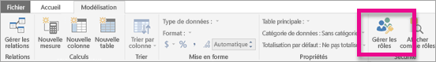
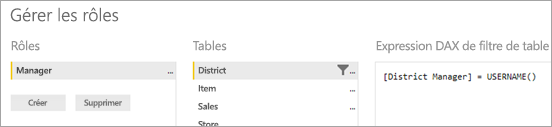
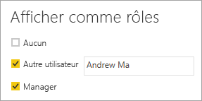

# <a name="use-row-level-security-with-power-bi-embedded-content"></a>Utiliser la sécurité au niveau des lignes avec le contenu incorporé Power BI
La sécurité au niveau des lignes peut être utilisée pour restreindre l’accès aux données dans des tableaux de bord, vignettes, rapports et jeux de données. Plusieurs utilisateurs différents peuvent utiliser ces mêmes artefacts tout en voyant différentes données. L’incorporation prend en charge la sécurité au niveau des lignes.

Si vous incorporez un rapport pour les utilisateurs non-Power BI (l’application possède les données), en général un scénario ISV, cet article est fait pour vous. Vous devez configurer le jeton d’incorporation pour qu’il prenne en compte l’utilisateur et le rôle. Poursuivez votre lecture pour savoir comment procéder.

Si vous incorporez des rapports pour des utilisateurs Power BI (l’utilisateur possède les données), au sein de votre organisation, la sécurité au niveau des lignes fonctionne de la même façon que dans le service Power BI directement. Il n’y a rien de plus à faire dans votre application. Pour plus d’informations, consultez [Sécurité au niveau des lignes avec Power BI](../service-admin-rls.md).


Pour tirer parti de la sécurité au niveau des lignes, il est important de comprendre trois principaux concepts : les utilisateurs, les rôles et les règles. Examinons plus en détail chacun d’entre eux :

**Utilisateurs** : utilisateurs finaux affichant l’artefact (tableau de bord, vignette, rapport ou jeu de données). Dans Power BI Embedded, les utilisateurs sont identifiés par la propriété de nom d’utilisateur dans un jeton d’incorporation.

**Rôles** : les utilisateurs appartiennent à des rôles. Un rôle est un conteneur de règles et peut être nommé en *Directeur des ventes* ou *Commercial*. Vous créez des rôles dans Power BI Desktop. Pour plus d’informations, consultez [Sécurité au niveau des lignes avec Power BI Desktop](../desktop-rls.md).

**Règles** : les rôles ont des règles et ces dernières sont les filtres réels qui vont être appliqués aux données. Cela peut être aussi simple que « Pays = États-Unis » ou quelque chose de beaucoup plus dynamique.
Dans le reste de cet article, nous fournissons un exemple de création d’une sécurité au niveau des lignes et de consommation au sein d’une application incorporée. Cet exemple utilise le fichier PBIX [Exemple Analyse de la vente au détail](http://go.microsoft.com/fwlink/?LinkID=780547).


## <a name="adding-roles-with-power-bi-desktop"></a>Ajout de rôles dans Power BI Desktop
Notre exemple Analyse de la vente au détail affiche les ventes pour tous les magasins d’une chaîne de distribution. Sans la sécurité au niveau des lignes, tous les directeurs régionaux qui se connectent au rapport pour le consulter voient les mêmes données. La direction a déterminé que chaque directeur régional doit voir uniquement les ventes des magasins qu’il gère, et pour ce faire, vous pouvez utiliser la sécurité au niveau des lignes.

La sécurité au niveau des lignes est créée dans Power BI Desktop. Lorsque le jeu de données et les rapports sont ouverts, vous pouvez basculer vers la vue de diagramme pour voir le schéma :


Il convient de noter quelques points avec ce schéma :

* Toutes les mesures, telles que **Total Sales (Total des ventes)**, sont stockées dans la table de faits **Sales (Ventes)**.
* Il existe quatre tables de dimension connexes supplémentaires : **Item (Article)**, **Time (Temps)**, **Store (Magasin)** et **District (Secteur)**.
* Les flèches sur les lignes de relation indiquent dans quel sens les filtres peuvent transiter d’une table à une autre. Par exemple, si un filtre est placé sur **Time[Date]**, dans le schéma actuel, il permet uniquement de filtrer les valeurs de la table **Sales (Ventes)**. Aucune autre table n’est affectée par ce filtre, car toutes les flèches des lignes de relation pointent vers la table Sales et n’en partent pas.
* La table **District (Secteur)** indique qui est le directeur de chaque région :
  
    

En fonction de ce schéma, si vous appliquez un filtre à la colonne **District Manager (Directeur régional)** dans la table **District (Secteur)**, et si ce filtre correspond à l’utilisateur qui consulte le rapport, il filtre également les tables **Store (Magasin)** et **Sales (Ventes)** pour qu’elles affichent uniquement les données pour ce directeur régional.

Voici comment procéder :

1. Sous l’onglet **Modélisation**, sélectionnez **Gérer les rôles**.
   
    
2. Créez un rôle nommé **Directeur**.
   
    
3. Dans la table **District (Secteur)**, entrez l’expression DAX suivante : **[Directeur régional] = USERNAME()**.
   
    
4. Pour vérifier que les règles fonctionnent, sous l’onglet **Modélisation**, sélectionnez **Afficher comme rôles**, puis sélectionnez le rôle **Manager (Directeur)** que vous venez de créer, ainsi que **Autres utilisateurs**. Entrez **AndrewMa** pour l’utilisateur.
   
    
   
    Les rapports affichent maintenant les données comme si vous étiez connecté sous le nom **AndrewMa**.

Appliquer le filtre comme vous l’avez fait ici a pour effet de filtrer tous les enregistrements des tables **District (Secteur)**, **Store (Magasin)** et **Sales (Ventes)**. Toutefois, en raison de la direction du filtrage sur les relations entre **Sales** et **Time**, **Sales** et **Item**, et **Item** et **Time**, les tables ne sont pas filtrées. Pour en savoir plus sur le filtrage croisé bidirectionnel, téléchargez le livre blanc [Bidirectional cross-filtering in SQL Server Analysis Services 2016 and Power BI Desktop](http://download.microsoft.com/download/2/7/8/2782DF95-3E0D-40CD-BFC8-749A2882E109/Bidirectional%20cross-filtering%20in%20Analysis%20Services%202016%20and%20Power%20BI.docx).

## <a name="applying-user-and-role-to-an-embed-token"></a>Application de l’utilisateur et du rôle à un jeton d’incorporation
Maintenant que vous avez configuré vos rôles Power BI Desktop, vous devez effectuer certaines tâches dans votre application pour tirer parti des rôles.

Les utilisateurs sont authentifiés et autorisés par votre application et les jetons d’incorporation sont utilisés pour accorder l’accès utilisateur à un rapport Power BI Embedded spécifique. Power BI Embedded n’a pas d’informations spécifiques sur l’utilisateur. Pour que la sécurité au niveau des lignes fonctionne, vous devez transmettre un contexte supplémentaire dans le cadre de votre jeton d’incorporation sous la forme d’identités. Pour cela, utilisez l’API [Incorporer le jeton](https://docs.microsoft.com/rest/api/power-bi/embedtoken).

L’API accepte une liste des identités avec l’indication des jeux de données pertinents. Pour que la sécurité au niveau des lignes fonctionne, vous devez transmettre les éléments suivants au sein de l’identité.

* **Nom d’utilisateur (obligatoire)** : il s’agit d’une chaîne qui peut être utilisée pour identifier l’utilisateur lors de l’application des règles de sécurité au niveau des lignes. Un seul utilisateur peut être répertorié.
* **Rôles (obligatoire)** : chaîne contenant les rôles à sélectionner lors de l’application des règles de sécurité au niveau des lignes. Si vous transmettez plusieurs rôles, ceux-ci doivent l’être en tant que tableau de chaînes.
* **Jeu de données (obligatoire)** : jeu de données applicable à l’artefact que vous incorporez. 

Vous pouvez créer le jeton d’incorporation à l’aide de la méthode **GenerateTokenInGroup** sur **PowerBIClient.Reports**. 

Par exemple, vous pouvez modifier l’exemple [PowerBIEmbedded_AppOwnsData](https://github.com/Microsoft/PowerBI-Developer-Samples/tree/master/App%20Owns%20Data). *Home\HomeController.cs line 76 and 77* peut être mis à jour de :

```
// Generate Embed Token.
var generateTokenRequestParameters = new GenerateTokenRequest(accessLevel: "view");

var tokenResponse = await client.Reports.GenerateTokenInGroupAsync(GroupId, report.Id, generateTokenRequestParameters);
```

vers

```
var generateTokenRequestParameters = new GenerateTokenRequest("View", null, identities: new List<EffectiveIdentity> { new EffectiveIdentity(username: "username", roles: new List<string> { "roleA", "roleB" }, datasets: new List<string> { "datasetId" }) });

var tokenResponse = await client.Reports.GenerateTokenInGroupAsync("groupId", "reportId", generateTokenRequestParameters);
```

Si vous appelez l’API REST, l’API mise à jour accepte maintenant un tableau JSON supplémentaire, nommé **Identités**, qui contient un nom d’utilisateur, la liste des rôles de chaîne et la liste des jeux de données de chaîne, par exemple :

```
{
    "accessLevel": "View",
    "identities": [
        {
            "username": "EffectiveIdentity",
            "roles": [ "Role1", "Role2" ],
            "datasets": [ "fe0a1aeb-f6a4-4b27-a2d3-b5df3bb28bdc" ]
        }
    ]
}
```

Maintenant, quand une personne se connecte à votre application pour afficher cet artefact, elle peut uniquement voir les données qu’elle est autorisée à voir, en fonction de ce qui a été défini par la sécurité au niveau des lignes.

## <a name="working-with-analysis-services-live-connections"></a>Utilisation des connexions actives d’Analysis Services
Vous pouvez utiliser la sécurité au niveau des lignes avec les connexions actives Analysis Services pour les serveurs locaux. Lorsque vous utilisez ce type de connexion, vous devez comprendre quelques concepts spécifiques.

L’identité effective fournie pour la propriété de nom d’utilisateur doit être celle d’un utilisateur Windows disposant d’autorisations sur le serveur Analysis Services.

**Configuration d’une passerelle de données locale**

Une [passerelle de données locale](../service-gateway-onprem.md) est utilisée lors de l’utilisation des connexions actives d’Analysis Services. Lorsque vous générez un jeton incorporé, avec une identité répertoriée, le compte principal doit être répertorié en tant qu’administrateur de la passerelle. Si le compte principal n’est pas répertorié, la sécurité au niveau des lignes n’est pas correctement appliquée aux données. Une personne qui n’est pas administrateur de la passerelle peut fournir des rôles, mais doit spécifier son propre nom d’utilisateur en tant qu’identité effective.

**Utilisation des rôles**

Des rôles peuvent être fournis avec l’identité dans un jeton incorporé. Si aucun rôle n’est fourni, le nom d’utilisateur fourni est utilisé pour résoudre les rôles associés.

**Utilisation de la fonctionnalité CustomData**

La fonctionnalité CustomData permet de passer du texte libre (chaîne) à l’aide de la propriété de chaîne de connexion CustomData, une valeur qu’utilise AS (via la fonction CUSTOMDATA()).
Vous pouvez l’utiliser comme un autre moyen de personnaliser la consommation de données.
Vous pouvez l’utiliser à l’intérieur de la requête DAX de rôle, de même que sans aucun rôle dans une requête DAX de mesure.
La fonctionnalité CustomData fait partie de nos fonctionnalités de génération de jetons pour les artefacts suivants : tableau de bord, rapport et vignette. Les tableaux de bord peuvent avoir plusieurs identités CustomData (une par vignette/modèle).

> [!NOTE]
> CustomData fonctionne uniquement pour les modèles qui se trouvent dans Azure Analysis Services et uniquement en mode réel. Contrairement aux utilisateurs et aux rôles, la fonctionnalité de données personnalisées ne peut pas être définie dans un fichier .pbix. Quand vous générez un jeton avec la fonctionnalité de données personnalisées, vous devez avoir un nom d’utilisateur.
>
>

**Ajouts du SDK CustomData**

La propriété de chaîne CustomData a été ajoutée à notre identité effective dans le scénario de génération de jetons.
        
        [JsonProperty(PropertyName = "customData")]
        public string CustomData { get; set; }

L’identité peut être créée avec des données personnalisées à l’aide de l’appel suivant :

        public EffectiveIdentity(string username, IList<string> datasets, IList<string> roles = null, string customData = null);

**Utilisation du SDK CustomData**

Si vous appelez l’API REST, vous pouvez ajouter des données personnalisées dans chaque identité, par exemple :

```
{
    "accessLevel": "View",
    "identities": [
        {
            "username": "EffectiveIdentity",
            "roles": [ "Role1", "Role2" ],
            "customData": "MyCustomData",
            "datasets": [ "fe0a1aeb-f6a4-4b27-a2d3-b5df3bb28bdc" ]
        }
    ]
}
```

## <a name="considerations-and-limitations"></a>Considérations et limitations
* L’attribution d’utilisateurs aux rôles, dans le service Power BI, n’affecte pas la sécurité au niveau des lignes lors de l’utilisation d’un jeton d’incorporation.
* Alors que le service Power BI n’applique pas le paramètre de sécurité au niveau des lignes aux administrateurs ni aux membres dotés d’autorisations de modification, lorsque vous fournissez une identité avec un jeton d’incorporation, celle-ci est appliquée aux données.
* Les connexions actives Analysis Services sont prises en charge pour les serveurs locaux.
* Les connexions actives Azure Analysis Services prennent en charge le filtrage par rôles, mais pas le filtrage dynamique par nom d’utilisateur. Le filtrage dynamique peut être effectué à l’aide de CustomData.
* Si le jeu de données sous-jacent ne nécessite pas la sécurité au niveau des lignes, la demande GenerateToken ne doit **pas** contenir d’identité effective.
* Si le jeu de données sous-jacent est un modèle cloud (modèle mis en cache ou DirectQuery), l’identité effective doit inclure au moins un rôle. Sinon, l’attribution de rôle n’est pas effectuée.
* Une liste d’identités active plusieurs jetons d’identité pour l’incorporation de tableau de bord. Pour tous les autres artefacts, la liste contient une identité unique.

D’autres questions ? [Essayez d’interroger la communauté Power BI](https://community.powerbi.com/)
