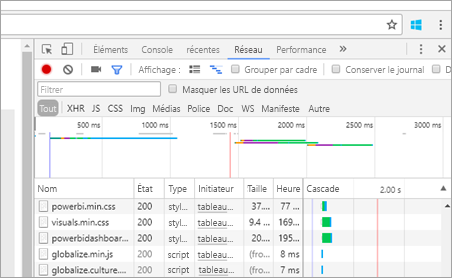

# <a name="troubleshooting-your-embedded-application"></a>Résolution des problèmes de votre application incorporée

Cet article décrit certains problèmes courants que vous pouvez rencontrer lors de l’incorporation de contenu à partir de Power BI.

## <a name="tools-for-troubleshooting"></a>Outils de résolution des problèmes

### <a name="fiddler-trace"></a>Trace Fiddler

[Fiddler](http://www.telerik.com/fiddler) est un outil gratuit de Telerik qui surveille le trafic HTTP.  Vous pouvez voir les allers et retours au niveau des API Power BI à partir de l’ordinateur client. Vous pouvez ainsi repérer les erreurs et d’autres informations connexes.


### <a name="f12-in-browser-for-front-end-debugging"></a>F12 dans le navigateur pour le débogage frontal

F12 lance la fenêtre de développeur dans votre navigateur. Cela vous permet d’examiner le trafic réseau et d’autres informations.



### <a name="extracting-error-details-from-power-bi-response"></a>Extraction des détails de l’erreur à partir de la réponse de Power BI

Cet extrait de code montre comment extraire les détails de l’erreur d’une exception HTTP :

```
public static string GetExceptionText(this HttpOperationException exc)
{
    var errorText = string.Format("Request: {0}\r\nStatus: {1} ({2})\r\nResponse: {3}",
    exc.Request.Content, exc.Response.StatusCode, (int)exc.Response.StatusCode, exc.Response.Content);
    if (exc.Response.Headers.ContainsKey("RequestId"))
    {
        var requestId = exc.Response.Headers["RequestId"].FirstOrDefault();
        errorText += string.Format("\r\nRequestId: {0}", requestId);
    }

    return errorText;
}
```
Nous vous recommandons de journaliser les ID de demande (et les détails de l’erreur à des fins de dépannage).
Indiquez l’ID de la demande lorsque vous contactez le support Microsoft.

## <a name="app-registration"></a>Inscriptions des applications

**Échec de l’inscription des applications**

Les messages d’erreur dans le portail Azure ou la page d’inscription des applications Power BI indiquent des privilèges insuffisants. Pour inscrire une application, vous devez être administrateur du locataire Azure AD ou des inscriptions d’applications doivent être activées pour les utilisateurs non-administrateurs.

**Le service Power BI n’apparaît pas dans le portail Azure lors de l’inscription d’une nouvelle application**

Au moins un utilisateur doit être inscrit à Power BI. Si vous ne voyez pas **Service Power BI** dans la liste des API, aucun utilisateur n’est inscrit à Power BI.

## <a name="rest-api"></a>API REST

**Appel d’API retournant l’erreur 401**

Une capture Fiddler peut être nécessaire pour approfondir vos recherches. L’étendue d’autorisation requise est peut-être manquante pour l’application inscrite dans Azure AD. Vérifiez que l’étendue requise est présente au sein de l’inscription de l’application pour Azure AD dans le portail Azure.

**Appel d’API retournant l’erreur 403**

Une capture Fiddler peut être nécessaire pour approfondir vos recherches. Plusieurs raisons peuvent expliquer une erreur 403.

* L’utilisateur a dépassé la quantité de jetons incorporés pouvant être générés sur une capacité partagée. Vous devez acheter des capacités Azure pour générer des jetons incorporés et attribuer l’espace de travail à cette capacité. Consultez [Créer une capacité Power BI Embedded dans le portail Azure](https://docs.microsoft.com/en-us/azure/power-bi-embedded/create-capacity).
* Le jeton d’authentification Azure AD a expiré.
* L’utilisateur authentifié n’est pas membre du groupe (espace de travail d’application).
* L’utilisateur authentifié n’est pas administrateur du groupe (espace de travail d’application).
* L’en-tête d’autorisation n’est peut-être pas répertorié correctement. Vérifiez l’absence de fautes de frappe.

Le backend de l’application doit peut-être actualiser le jeton d’authentification avant d’appeler GenerateToken.

```
    GET https://wabi-us-north-central-redirect.analysis.windows.net/metadata/cluster HTTP/1.1
    Host: wabi-us-north-central-redirect.analysis.windows.net
    ...
    Authorization: Bearer eyJ0eXAiOi...
    ...
 
    HTTP/1.1 403 Forbidden
    ...
     
    {"error":{"code":"TokenExpired","message":"Access token has expired, resubmit with a new access token"}}
```

**La génération du jeton échoue lors de la fourniture de l’identité effective**

GenerateToken peut échouer, quand une identité effective est fournie, pour différentes raisons.

* Le jeu de données ne prend pas en charge les identités effectives.
* Le nom d’utilisateur n’a pas été fourni.
* Le rôle n’a pas été fourni.
* L’ID du jeu de données n’a pas été fourni.
* L’utilisateur ne dispose des autorisations appropriées

Pour vérifier le motif de l’erreur, essayez ce qui suit.

* Exécutez la commande [get dataset](https://msdn.microsoft.com/library/mt784653.aspx). La propriété IsEffectiveIdentityRequired est-elle définie sur True ?
* Le nom d’utilisateur est obligatoire pour les identités effectives.
* Si IsEffectiveIdentityRolesRequired est défini sur True, le rôle est requis.
* L’ID du jeu de données est obligatoire pour les identités effectives.
* Pour Analysis Services, l’utilisateur principal doit être un administrateur de passerelle.

## <a name="data-sources"></a>Sources de données

**L’éditeur de logiciels indépendant souhaite disposer d’informations d’identification différentes pour la même source de données**

Une source de données peut avoir un ensemble unique d’informations d’identification pour un même utilisateur principal. Si vous avez besoin d’utiliser des informations d’identification différentes, créez des utilisateurs principaux supplémentaires. Ensuite, affectez différentes informations d’identification dans chaque contexte d’utilisateur principal à gérer, et effectuez l’incorporation à l’aide du jeton Azure AD de cet utilisateur.

## <a name="content-rendering"></a>Restitution du contenu

**Le rendu (ou la consommation) du contenu incorporé échoue ou expire**

Vérifiez que le jeton d’incorporation n’a pas expiré. Vérifiez que vous cochez le jeton d’incorporation et que vous l’actualisez. Pour plus d’informations, consultez [Actualiser le jeton à l’aide du SDK JavaScript](https://github.com/Microsoft/PowerBI-JavaScript/wiki/Refresh-token-using-JavaScript-SDK-example).

**Le tableau de bord ou rapport n’est pas chargé**

Si l’utilisateur ne peut pas voir le rapport ou le tableau de bord, vérifiez que ce dernier se charge correctement dans powerbi.com. Le rapport ou tableau de bord ne fonctionne pas dans votre application s’il n’est pas chargé dans powerbi.com.

**Un tableau de bord ou rapport s’exécute lentement**

Ouvrez le fichier à partir de Power BI Desktop ou dans powerbi.com, puis vérifiez que les performances sont acceptables pour écarter des problèmes avec votre application ou les API d’incorporation.

Pour plus d’informations, consultez le [FAQ sur Power BI Embedded](embedded-faq.md).

D’autres questions ? [Posez vos questions à la communauté Power BI](http://community.powerbi.com/)


