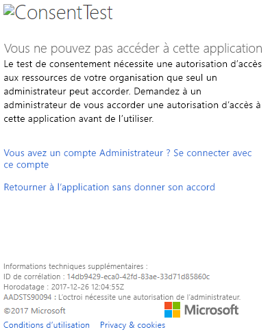
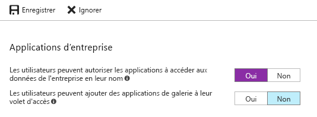

# <a name="troubleshoot-your-embedded-application"></a>Résoudre les problèmes de votre application incorporée

Cet article décrit certains problèmes courants que vous pouvez rencontrer lors de l’incorporation de contenu à partir de Power BI.

## <a name="tools-to-troubleshoot"></a>Outils pour résoudre les problèmes

### <a name="fiddler-trace"></a>Trace Fiddler

[Fiddler](https://www.telerik.com/fiddler) est un outil gratuit de Telerik qui surveille le trafic HTTP.  Vous pouvez voir le trafic au niveau des API Power BI depuis l’ordinateur client. Cet outil peut indiquer des erreurs et d’autres informations connexes.


### <a name="f12-in-browser-for-front-end-debugging"></a>F12 dans le navigateur pour le débogage frontal

F12 lance la fenêtre de développeur dans votre navigateur. Cet outil vous permet de consulter le trafic réseau et d’autres informations.


### <a name="extract-error-details-from-power-bi-response"></a>Extraire les détails de l’erreur à partir de la réponse de Power BI

Cet extrait de code montre comment extraire les détails de l’erreur d’une exception HTTP :

```csharp
public static string GetExceptionText(this HttpOperationException exc)
{
    var errorText = string.Format("Request: {0}\r\nStatus: {1} ({2})\r\nResponse: {3}",
    exc.Request.Content, exc.Response.StatusCode, (int)exc.Response.StatusCode, exc.Response.Content);
    if (exc.Response.Headers.ContainsKey("RequestId"))
    {
        var requestId = exc.Response.Headers["RequestId"].FirstOrDefault();
        errorText += string.Format("\r\nRequestId: {0}", requestId);
    }

    return errorText;
}
```

Nous vous recommandons de journaliser les ID de requête (et les détails des erreurs à des fins de dépannage).
Indiquez l’ID de la requête lorsque vous contactez le support Microsoft.

## <a name="app-registration"></a>Inscriptions des applications

### <a name="app-registration-failure"></a>Échec de l’inscription des applications

Les messages d’erreur dans le portail Azure ou la page d’inscription des applications Power BI indiquent des privilèges insuffisants. Pour inscrire une application, vous devez être administrateur du locataire Azure AD, ou des inscriptions d’applications doivent être activées pour les utilisateurs non-administrateurs.

### <a name="power-bi-service-doesnt-appear-in-the-azure-portal-when-registering-a-new-app"></a>Le service Power BI n’apparaît pas dans le portail Azure lors de l’inscription d’une nouvelle application

Au moins un utilisateur doit être inscrit à Power BI. Si vous ne voyez pas **Service Power BI** dans la liste des API, aucun utilisateur n’est inscrit à Power BI.

## <a name="rest-api"></a>API REST

### <a name="api-call-returning-401"></a>Appel d’API retournant l’erreur 401

Une capture Fiddler peut être nécessaire pour approfondir vos recherches. L’étendue d’autorisation requise est peut-être manquante pour l’application inscrite dans Azure AD. Vérifiez que l’étendue requise est présente au sein de l’inscription de l’application pour Azure AD dans le portail Azure.

### <a name="api-call-returning-403"></a>Appel d’API retournant l’erreur 403

Une capture Fiddler peut être nécessaire pour approfondir vos recherches. Plusieurs raisons peuvent expliquer une erreur 403.

* L’utilisateur a dépassé la quantité de jetons incorporés pouvant être générés sur une capacité partagée. Achetez des capacités Azure pour générer des jetons incorporés et attribuer l’espace de travail à cette capacité. Consultez [Créer une capacité Power BI Embedded dans le portail Azure](https://docs.microsoft.com/azure/power-bi-embedded/create-capacity).
* Le jeton d’authentification Azure AD a expiré.
* L’utilisateur authentifié n’est pas membre du groupe (espace de travail).
* L’utilisateur authentifié n’est pas administrateur du groupe (espace de travail).
* L’utilisateur authentifié ne dispose pas des autorisations nécessaires. Les autorisations peuvent être mises à jour à l’aide de l’[API refreshUserPermissions](https://docs.microsoft.com/rest/api/power-bi/users/refreshuserpermissions).
* L’en-tête d’autorisation n’est peut-être pas répertorié correctement. Vérifiez l’absence de fautes de frappe.

Le backend de l’application doit peut-être actualiser le jeton d’authentification avant d’appeler GenerateToken.

    ```
    GET https://wabi-us-north-central-redirect.analysis.windows.net/metadata/cluster HTTP/1.1
    Host: wabi-us-north-central-redirect.analysis.windows.net
    ...
    Authorization: Bearer eyJ0eXAiOi...
    ...

    HTTP/1.1 403 Forbidden
    ...

    {"error":{"code":"TokenExpired","message":"Access token has expired, resubmit with a new access token"}}
    ```

## <a name="authentication"></a>Authentification

### <a name="authentication-failed-with-aadsts90002-tenant-authorize-not-found"></a>L’authentification a échoué avec AADSTS90002 : « authorize » introuvable pour le locataire

 Si vous recevez des messages pendant la connexion du type ***erreur : invalid_request, error_description : AADSTS90002 : « authorize » introuvable pour le locataire***, c’est parce que la bibliothèque ADAL 4.x ne prend pas en charge « https://login.microsoftonline.com/{Tenant}/oauth2/authorize/  » comme URL d’autorité.
 
Pour résoudre ce problème, vous devez supprimer « oauth2/authorize » à la fin de votre URL d’autorité, consultez les [exemples des développeurs Power BI](https://github.com/Microsoft/PowerBI-Developer-Samples) pour référence.

 Consultez [Meilleure validation d’autorité](https://github.com/AzureAD/azure-activedirectory-library-for-dotnet/wiki/Changes-adalnet-4.0#better-authority-validation) dans les notes de publication de la bibliothèque ADAL 4.x.

### <a name="authentication-failed-with-aadsts70002-or-aadsts50053"></a>Échec de l’authentification avec AADSTS70002 ou AADSTS50053

**_(AADSTS70002 : Erreur de validation des informations d’identification. AADSTS50053 : Vous avez essayé de vous connecter un trop grand nombre de fois avec un ID d’utilisateur ou un mot de passe incorrect)_**

Si vous utilisez à la fois Power BI Embedded et l’authentification directe Azure AD et qu’au moment de vous connecter, vous recevez des messages tels que ***error:unauthorized_client, error_description:AADSTS70002 : Erreur de validation des informations d’identification. AADSTS50053 : Vous avez essayé de vous connecter un trop grand nombre de fois avec un ID d’utilisateur ou un mot de passe incorrect***, cela est dû au fait que l’authentification directe n’est plus utilisée depuis le 14 juin 2018 par défaut.

Il existe un moyen de la réactiver en utilisant une [stratégie Azure AD](https://docs.microsoft.com/azure/active-directory/manage-apps/configure-authentication-for-federated-users-portal#enable-direct-authentication-for-legacy-applications) dont la portée peut être limitée à l’organisation ou à un [principal du service](https://docs.microsoft.com/azure/active-directory/develop/active-directory-application-objects#service-principal-object).

Nous vous recommandons d’activer cette stratégie uniquement en fonction de chaque application.

Pour créer cette stratégie, vous devez être **administrateur général** de l’annuaire dans lequel vous créez et affectez la stratégie. Voici un exemple de script qui vous montre comment créer la stratégie et l’affecter au principal du service de l’application :

1. Installez le [module PowerShell Azure AD (Préversion)](https://docs.microsoft.com/powershell/azure/active-directory/install-adv2?view=azureadps-2.0).

2. Exécutez les commandes PowerShell ci-dessous ligne par ligne (en veillant à ce que la variable $sp n’ait pas plus d’une application en résultat).

```powershell
Connect-AzureAD
```

```powershell
$sp = Get-AzureADServicePrincipal -SearchString "Name_Of_Application"
```

```powershell
$policy = New-AzureADPolicy -Definition @("{`"HomeRealmDiscoveryPolicy`":{`"AllowCloudPasswordValidation`":true}}") -DisplayName EnableDirectAuth -Type HomeRealmDiscoveryPolicy -IsOrganizationDefault $false
```

```powershell
Add-AzureADServicePrincipalPolicy -Id $sp.ObjectId -RefObjectId $policy.Id 
```

Après avoir affecté la stratégie et avant d’effectuer un test, attendez environ 15 à 20 secondes, le temps qu’elle se propage.

### <a name="generate-token-fails-when-providing-effective-identity"></a>La génération du jeton échoue lors de la fourniture de l’identité effective

GenerateToken peut échouer, quand une identité effective est fournie, pour différentes raisons.

* Le jeu de données ne prend pas en charge les identités effectives
* Le nom d’utilisateur n’a pas été fourni
* Le rôle n’a pas été fourni
* L’ID du jeu de données n’a pas été fourni
* L’utilisateur ne dispose des autorisations appropriées

Pour vérifier le motif de l’erreur, essayez les étapes ci-dessous.

* Exécutez [get dataset](https://docs.microsoft.com/rest/api/power-bi/datasets). La propriété IsEffectiveIdentityRequired est-elle définie sur True ?
* Le nom d’utilisateur est obligatoire pour les identités effectives.
* Si IsEffectiveIdentityRolesRequired est défini sur True, le rôle est requis.
* L’ID du jeu de données est obligatoire pour les identités effectives.
* Pour Analysis Services, l’utilisateur principal doit être un administrateur de passerelle.

### <a name="aadsts90094-the-grant-requires-admin-permission"></a>AADSTS90094 : L’octroi nécessite une autorisation de l’administrateur

**_Symptômes :_**<br>
Quand un utilisateur non-administrateur tente de se connecter à une application pour la première fois tout en octroyant un consentement, et obtient une des erreurs suivantes :

* Le test de consentement nécessite une autorisation d’accès aux ressources de votre organisation que seul un administrateur peut accorder. Demandez à un administrateur de vous accorder une autorisation d’accès à cette application avant de l’utiliser.
* AADSTS90094 : L’octroi nécessite une autorisation de l’administrateur.

    

Un utilisateur administrateur peut se connecter et octroyer un consentement.

**_Cause racine :_**<br>
Le consentement de l’utilisateur est désactivé pour le locataire.

**_Plusieurs solutions sont possibles :_**

*Activez le consentement de l’utilisateur pour l’ensemble du locataire (tous les utilisateurs, toutes les applications)*

1. Dans le portail Azure, accédez à « Azure Active Directory » => « Utilisateurs et groupes » => « Paramètres utilisateur »
2. Activez « Les utilisateurs peuvent autoriser les applications à accéder aux données de l’entreprise en leur nom », puis enregistrez les modifications.

    

*Octroi d’autorisations d’accès* à l’application par un administrateur (pour l’ensemble du locataire ou pour un utilisateur spécifique).

### <a name="cs1061-error"></a>Erreur CS1061

Si l’erreur suivante s’affiche, téléchargez [Microsoft.IdentityModel.Clients.ActiveDirectory](https://www.nuget.org/packages/Microsoft.IdentityModel.Clients.ActiveDirectory/2.22.302111727) : « AuthenticationContext' ne contient pas de définition pour 'AcquireToken', et aucun 'AcquireToken' accessible qui accepte un premier argument de type 'AuthenticationContext' n’a été trouvé (peut-être vous manque-t-il une directive using ou une référence d’assembly ?) ».

## <a name="data-sources"></a>Sources de données

### <a name="isv-wants-to-have-different-credentials-for-the-same-data-source"></a>L’éditeur de logiciels indépendant souhaite disposer d’informations d’identification différentes pour la même source de données

Une source de données peut avoir un ensemble unique d’informations d’identification pour un même utilisateur principal. Si vous avez besoin d’utiliser des informations d’identification différentes, créez des utilisateurs principaux supplémentaires. Ensuite, affectez différentes informations d’identification dans chaque contexte d’utilisateur principal à gérer, et effectuez l’incorporation à l’aide du jeton Azure AD de cet utilisateur.

## <a name="troubleshoot-your-embedded-application-with-the-ierror-object"></a>Résoudre les problèmes de votre application incorporée avec l’objet IError

Utilisez l’[**objet IError** retourné par l’événement *erreur* à partir du **kit de développement logiciel (SDK) JavaScript**](https://github.com/Microsoft/PowerBI-JavaScript/wiki/Troubleshooting-and-debugging-of-embedded-parts) pour déboguer votre application et mieux comprendre la cause de vos erreurs.

Après l’acquisition de l’objet IError, vous devez examiner la table d’erreurs courantes appropriée qui correspond au type d’incorporation que vous utilisez. Comparez les **propriétés IError** avec celles de la table et recherchez la ou les raisons possibles de l’échec.

### <a name="typical-errors-when-embedding-for-power-bi-users"></a>Erreurs courantes lors de l’incorporation pour les utilisateurs de Power BI

| Message | Message détaillé | Code d’erreur | Raison(s) possible(s) |
|-------------------------------------------------------|-----------------------------------------------------------------------------------------------------------------------------|-----------|--------------------------------------------------------|
| TokenExpired | Le jeton d’accès a expiré, soumettez à nouveau avec un nouveau jeton d’accès | 403 | Jeton arrivé à expiration  |
| PowerBIEntityNotFound | Réception d’une notification d’échec du rapport | 404 | <li> ID du rapport erroné <li> Le rapport n'existe pas  |
| Paramètres non valides | Paramètre powerbiToken non spécifié | N/A | <li> Aucun jeton d’accès fourni <li> Aucun ID de rapport fourni |
| LoadReportFailed | Échec de l’initialisation : le cluster n’a pas pu être résolu | 403 | * Jeton d’accès incorrect * Le type d’incorporation ne correspond pas au type de jeton |
| PowerBINotAuthorizedException | Réception d’une notification d’échec du rapport | 401 | <li> ID de groupe incorrect <li> Groupe non autorisé |
| TokenExpired | Le jeton d’accès a expiré, soumettez à nouveau avec un nouveau jeton d’accès. Impossible de rendre un visuel de rapport intitulé : <visual title> | N/A | Jeton de requête de données arrivé à expiration |
| OpenConnectionError | Impossible d'afficher l'élément visuel. Impossible de rendre un visuel de rapport intitulé : <visual title> | N/A | Capacité suspendue ou supprimée tant qu’un rapport sur la capacité était ouvert dans une session |
| ExplorationContainer_FailedToLoadModel_DefaultDetails | Impossible de charger le schéma de modèle associé à ce rapport. Assurez-vous que vous disposez d’une connexion au serveur et réessayez. | N/A | <li> Capacité suspendue <li> Capacité supprimée |

### <a name="typical-errors-when-embedding-for-non-power-bi-users-using-an-embed-token"></a>Erreurs courantes lors de l’incorporation pour d’autres utilisateurs que ceux de Power BI (avec un jeton d’incorporation)

| Message | Message détaillé | Code d’erreur | Raison(s) |
|-------------------------------------------------------|-------------------------------------------------------------------------------------------------------------------------------|------------|-------------------------------------------------|
| TokenExpired | Le jeton d’accès a expiré, soumettez à nouveau avec un nouveau jeton d’accès | 403 | Jeton arrivé à expiration  |
| LoadReportFailed | Réception d’une notification d’échec du rapport | 404 | <li> ID du rapport erroné <li> Le rapport n'existe pas  |
| LoadReportFailed | Réception d’une notification d’échec du rapport | 403 | L’ID du rapport ne correspond pas au jeton |
| LoadReportFailed | Réception d’une notification d’échec du rapport | 500 | Il ressort du rapport que l’ID n’est pas un guid |
| Paramètres non valides | Paramètre powerbiToken non spécifié | N/A | <li> Aucun jeton d’accès fourni <li> Aucun ID de rapport fourni |
| LoadReportFailed | Échec de l’initialisation : le cluster n’a pas pu être résolu | 403 | Type de jeton incorrect, jeton incorrect |
| PowerBINotAuthorizedException | Réception d’une notification d’échec du rapport | 401 | ID de groupe incorrect/non autorisé |
| TokenExpired | Le jeton d’accès a expiré, soumettez à nouveau avec un nouveau jeton d’accès. Impossible de rendre un visuel de rapport intitulé : <visual title> | N/A | Jeton de requête de données arrivé à expiration |
| OpenConnectionError | Impossible d'afficher l'élément visuel. Impossible de rendre un visuel de rapport intitulé : <visual title> | N/A | Capacité suspendue ou supprimée tant qu’un rapport sur la capacité était ouvert dans une session |
| ExplorationContainer_FailedToLoadModel_DefaultDetails | Impossible de charger le schéma de modèle associé à ce rapport. Assurez-vous que vous disposez d’une connexion au serveur et réessayez. | N/A | <li> Capacité suspendue <li> Capacité supprimée |

## <a name="content-rendering"></a>Restitution du contenu

### <a name="performance"></a>Performances

[Performances de Power BI Embedded](embedded-performance-best-practices.md)

### <a name="rendering-or-consumption-of-embedded-content-fails-or-times-out"></a>Le rendu (ou la consommation) du contenu incorporé échoue ou expire

Vérifiez que le jeton d’incorporation n’a pas expiré. Vérifiez que vous cochez l’expiration du jeton incorporé et que vous l’actualisez. Pour plus d’informations, consultez [Actualiser le jeton à l’aide du SDK JavaScript](https://github.com/Microsoft/PowerBI-JavaScript/wiki/Refresh-token-using-JavaScript-SDK-example).

### <a name="report-or-dashboard-doesnt-load"></a>Le tableau de bord ou rapport n’est pas chargé

Si l’utilisateur ne peut pas voir le rapport ou le tableau de bord, vérifiez que ce dernier se charge correctement dans powerbi.com. Le rapport ou le tableau de bord ne fonctionne pas dans votre application s’il n’est pas chargé dans powerbi.com.

### <a name="report-or-dashboard-is-performing-slowly"></a>Un tableau de bord ou rapport s’exécute lentement

Ouvrez le fichier à partir de Power BI Desktop ou dans powerbi.com, puis vérifiez que les performances sont acceptables pour écarter des problèmes avec votre application ou les API d’incorporation.

## <a name="embed-setup-tool"></a>Outil de configuration de l’incorporation

Vous pouvez passer par l’[outil de configuration de l’incorporation](https://aka.ms/embedsetup) pour télécharger rapidement un exemple d’application. Vous pouvez ensuite comparer votre application à l’exemple.

### <a name="prerequisites"></a>Conditions préalables

Vérifiez que vous disposez de tous les prérequis appropriés avant d’utiliser l’outil de configuration de l’incorporation. Vous avez besoin d’un compte **Power BI Pro** et d’un abonnement **Microsoft Azure**.

* Si vous n’avez pas d’abonnement à **Power BI Pro**, [inscrivez-vous à un essai gratuit](https://powerbi.microsoft.com/pricing/) avant de commencer.
* Si vous n’avez pas d’abonnement Azure, créez un [compte gratuit](https://azure.microsoft.com/free/?WT.mc_id=A261C142F) avant de commencer.
* Vous aurez besoin de votre propre installation de [client Azure Active Directory ](create-an-azure-active-directory-tenant.md).
* [Visual Studio](https://www.visualstudio.com/) doit être installé (version 2013 ou ultérieure).

### <a name="common-issues"></a>Problèmes courants

Voici quelques problèmes courants que vous pouvez rencontrer lors du test avec l’outil de configuration de l’incorporation :

#### <a name="using-the-embed-for-your-customers-sample-application"></a>Utilisation de l’exemple d’application Embed for your customers (Incorporer pour vos clients)

Si vous travaillez avec l’expérience **Incorporer pour vos clients**, enregistrez et décompressez le fichier *PowerBI-Developer-Samples.zip*. Ensuite, ouvrez le dossier *PowerBI-Developer-Samples-master\App Owns Data* et exécutez le fichier *PowerBIEmbedded_AppOwnsData.sln*.

Quand vous sélectionnez **Accorder des autorisations** (à l’étape Accorder des autorisations), vous obtenez l’erreur suivante :

    AADSTS70001: Application with identifier <client ID> wasn't found in the directory <directory ID>

La solution consiste à fermer la fenêtre contextuelle, à attendre quelques secondes et à recommencer l’opération. Il peut être nécessaire de répéter cette opération quelques fois. Un intervalle de temps provoque ce problème : le processus d’inscription de l’application ne se termine pas quand il est disponible pour des API externes.

Le message d’erreur suivant s’affiche lors de l’exécution de l’exemple d’application :

    Password is empty. Please fill password of Power BI username in web.config.

Cette erreur se produit, car la seule valeur qui n’est pas injectée dans l’exemple d’application est votre mot de passe utilisateur. Ouvrez le fichier Web.config dans la solution et renseignez le champ pbiPassword avec votre mot de passe utilisateur.

Si vous obtenez l’erreur AADSTS50079 : L’utilisateur doit utiliser l’authentification multifacteur.

    Need to use an AAD account that doesn't have MFA enabled.

#### <a name="using-the-embed-for-your-organization-sample-application"></a>Utilisation de l’exemple d’application Embed for your organization (Incorporer pour votre organisation)

Si vous travaillez avec l’expérience **Incorporer pour votre organisation**, enregistrez et décompressez le fichier *PowerBI-Developer-Samples.zip*. Ensuite, ouvrez le dossier *PowerBI-Developer-Samples-master\User Owns Data\integrate-report-web-app* et exécutez le fichier *pbi-saas-embed-report.sln*.

Quand vous exécutez l’exemple d’application **Embed for your organization**, vous obtenez l’erreur suivante :

    AADSTS50011: The reply URL specified in the request doesn't match the reply URLs configured for the application: <client ID>

La raison de cette erreur est que l’URL de redirection spécifiée pour l’application de serveur web est différente de l’URL de l’exemple. Si vous voulez inscrire l’exemple d’application, utilisez `https://localhost:13526/` comme URL de redirection.

Si vous voulez modifier l’application inscrite, découvrez comment [mettre à jour l’application inscrite auprès d’Azure AD](https://docs.microsoft.com/azure/active-directory/develop/quickstart-v1-update-azure-ad-app) pour qu’elle permettre l’accès aux API web.

Si vous voulez modifier votre profil ou vos données utilisateur Power BI, découvrez comment modifier vos [données Power BI](https://docs.microsoft.com/power-bi/service-basic-concepts).

Si vous obtenez l’erreur AADSTS50079 : L’utilisateur doit utiliser l’authentification multifacteur.

    Need to use an AAD account that doesn't have MFA enabled.

Pour plus d’informations, consultez le [FAQ sur Power BI Embedded](embedded-faq.md).

D’autres questions ? [Essayez la communauté Power BI](https://community.powerbi.com/)

Si vous avez besoin d’aide, [contactez le support ](https://powerbi.microsoft.com/support/pro/?Type=documentation&q=power+bi+embedded) ou [créez un ticket de support via le portail Azure](https://ms.portal.azure.com/#blade/Microsoft_Azure_Support/HelpAndSupportBlade/newsupportrequest), et fournissez les messages d’erreur que vous recevez.

## <a name="next-steps"></a>Étapes suivantes

Pour plus d’informations, consultez les [questions fréquentes (FAQ)](embedded-faq.md).

D’autres questions ? [Posez vos questions à la communauté Power BI](https://community.powerbi.com/)
