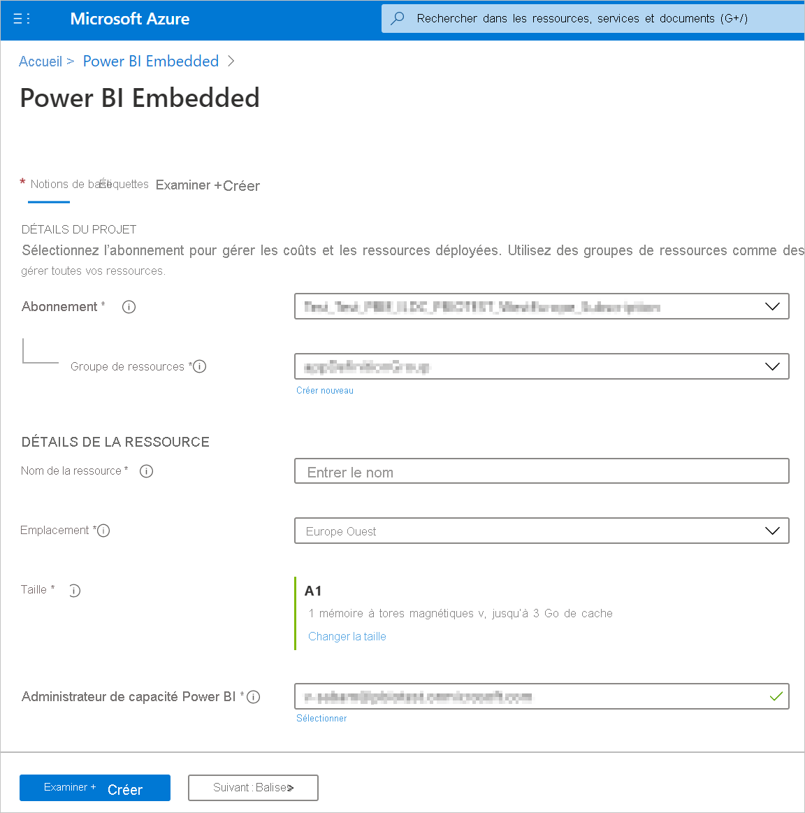
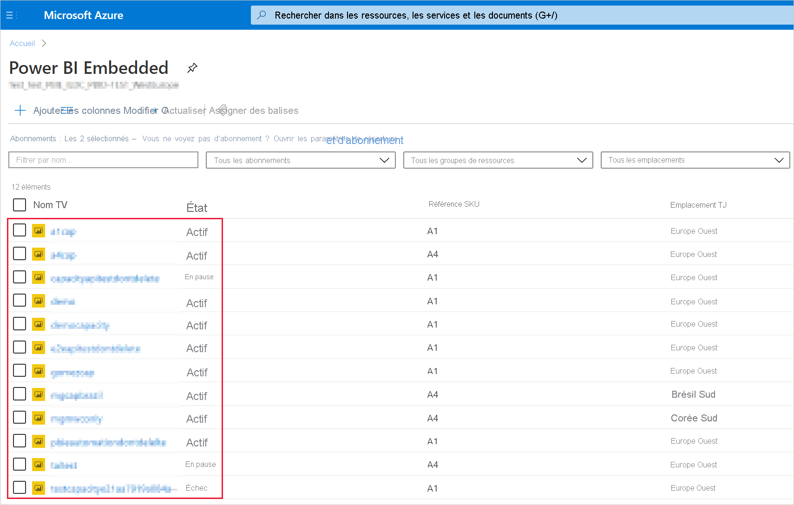
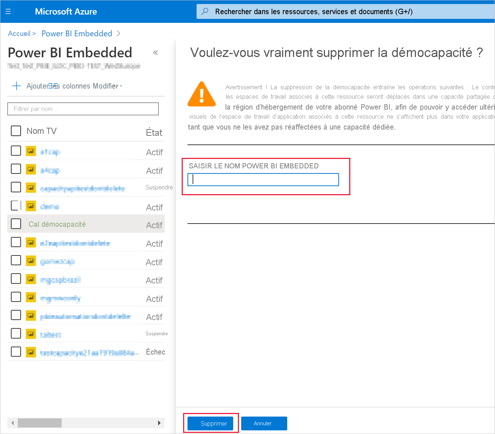

# <a name="create-power-bi-embedded-capacity-in-the-azure-portal"></a>Créer une capacité Power BI Embedded dans le Portail Microsoft Azure

Cet article explique pas à pas comment créer une capacité [Power BI Embedded](azure-pbie-what-is-power-bi-embedded.md) dans Microsoft Azure. Power BI Embedded simplifie les fonctionnalités de Power BI en vous permettant d’ajouter rapidement à vos applications de superbes visuels, rapports et tableaux de bord.

## <a name="before-you-begin"></a>Avant de commencer

Pour suivre ce guide de démarrage rapide, vous avez besoin des éléments suivants :

* **Abonnement Azure :** Accédez à la page [Azure - Essai gratuit](https://azure.microsoft.com/free/) pour créer un compte.

* **Azure Active Directory :** Votre abonnement doit être associé à un locataire Azure Active Directory (Azure AD). De plus, **_vous devez vous connecter à Azure avec un compte relevant de ce locataire_* _. Les comptes Microsoft ne sont pas pris en charge. Pour en savoir plus, consultez [Authentification et autorisations utilisateur](/azure/analysis-services/analysis-services-manage-users).

_ **Locataire Power BI :** Au moins un compte de votre locataire Azure AD doit avoir souscrit à Power BI.

* **Groupe de ressources :** Utilisez un groupe de ressources que vous possédez déjà ou [créez-en un](/azure/azure-resource-manager/resource-group-overview).

## <a name="create-a-capacity"></a>Créer une capacité

Avant de créer une capacité Power BI Embedded, vous devez vous être connecté au moins une fois à Power BI.

# <a name="portal"></a>[Portail](#tab/portal)

1. Connectez-vous au [portail Azure](https://portal.azure.com/).

2. Dans la zone de recherche, recherchez *Power BI Embedded*.

3. Dans Power BI Embedded, sélectionnez **Ajouter**.

4. Fournissez les informations nécessaires, puis cliquez sur **Vérifier + créer**.

    

    * **Abonnement** : abonnement pour lequel vous souhaitez créer la capacité.

    * **Groupe de ressources** : groupe de ressources qui contient cette nouvelle capacité. Choisissez un groupe de ressources existant ou créez-en un autre. Pour plus d’informations, consultez [Vue d’ensemble d’Azure Resource Manager](/azure/azure-resource-manager/resource-group-overview).

    * **Nom de la ressource** : nom de ressource de la capacité.

    * **Emplacement** : emplacement où est hébergé Power BI pour votre locataire. Votre emplacement par défaut est votre région d’origine, mais vous pouvez modifier l’emplacement avec les [options Zone géographique multiple](embedded-multi-geo.md).

    * **Taille** : [référence SKU A](../../admin/service-admin-premium-purchase.md#purchase-a-skus-for-testing-and-other-scenarios) dont vous avez besoin. Pour plus d’informations, consultez [Mémoire et puissance de calcul des références SKU](./embedded-capacity.md).

    * **Administrateur de capacité Power BI** : administrateur de la capacité.
        >[!NOTE]
        >* Par défaut, l’administrateur d’une capacité est l’utilisateur qui la crée.
        >* Vous pouvez sélectionner un autre utilisateur ou principal de service comme administrateur de capacité.
        >* L’administrateur de capacité doit appartenir au locataire où la capacité est provisionnée. Les utilisateurs B2B (Business to Business) ne peuvent pas être administrateurs de capacité.

# <a name="azure-cli"></a>[Azure CLI](#tab/CLI)

### <a name="use-azure-cloud-shell"></a>Utiliser Azure Cloud Shell

Azure héberge Azure Cloud Shell, un environnement d’interpréteur de commandes interactif que vous pouvez utiliser dans votre navigateur. Vous pouvez utiliser Bash ou PowerShell avec Cloud Shell pour utiliser les services Azure. Vous pouvez utiliser les commandes préinstallées Cloud Shell pour exécuter le code de cet article sans avoir à installer quoi que ce soit dans votre environnement local.

Pour démarrer Azure Cloud Shell :

| Option | Exemple/Lien |
|-----------------------------------------------|---|
| Sélectionnez **Essayer** dans le coin supérieur droit d’un bloc de code. La sélection de **Essayer** ne copie pas automatiquement le code dans Cloud Shell. |  |
| Accédez à [https://shell.azure.com](https://shell.azure.com) ou sélectionnez le bouton **Lancer Cloud Shell** pour ouvrir Cloud Shell dans votre navigateur. | [](https://shell.azure.com) |
| Sélectionnez le bouton **Cloud Shell** dans la barre de menus en haut à droite du [portail Azure](https://portal.azure.com). |  |

Pour exécuter le code de cet article dans Azure Cloud Shell :

1. Démarrez Cloud Shell.

2. Sélectionnez le bouton **Copier** dans un bloc de code pour copier le code.

3. Collez le code dans la session Cloud Shell en sélectionnant **Ctrl**+**Maj**+**V** sur Windows et Linux, ou en sélectionnant **Cmd**+**Maj**+**V** sur macOS.

4. Sélectionnez **Entrée** pour exécuter le code.

## <a name="prepare-your-environment"></a>Préparation de votre environnement

Les commandes de capacité Power BI Embedded nécessitent la version 2.3.1 ou ultérieure d’Azure CLI. Exécutez `az --version` pour rechercher la version et les bibliothèques dépendantes installées. Pour installer ou mettre à niveau Azure CLI, consultez [Installer Azure CLI](/cli/azure/install-azure-cli).

1. Connectez-vous.

   Connectez-vous à l’aide de la commande [az login](/cli/azure/reference-index#az-login) si vous utilisez une installation locale de l’interface CLI.

    ```azurecli
    az login
    ```

    Suivez les étapes affichées dans votre terminal pour effectuer le processus d’authentification.

2. Installez l’extension Azure CLI.

    Quand vous utilisez des références d’extension pour l’interface Azure CLI, vous devez d’abord installer l’extension.  Les extensions Azure CLI vous donnent accès à des commandes expérimentales et en préversion qui ne sont pas encore offertes par l’interface CLI principale.  Pour en savoir plus sur les extensions, notamment sur la mise à jour et la désinstallation, consultez [Utiliser des extensions avec Azure CLI](/cli/azure/azure-cli-extensions-overview).

    Installez l’extension pour la capacité Power BI Embedded en exécutant la commande suivante :

    ```azurecli
    az extension add --name powerbidedicated
    ```

### <a name="create-a-capacity-with-azure-cli"></a>Créer une capacité avec Azure CLI

Utilisez la commande [az Power BI embedded-capacity create](/cli/azure/ext/powerbidedicated/powerbi/embedded-capacity?view=azure-cli-latest#ext-powerbidedicated-az-powerbi-embedded-capacity-create) pour créer une capacité.

```azurecli
az powerbi embedded-capacity create --location westeurope
                                    --name
                                    --resource-group
                                    --sku-name "A1"
                                    --sku-tier "PBIE_Azure"
```

### <a name="delete-a-capacity-with-azure-cli"></a>Supprimer une capacité avec Azure CLI

Pour supprimer une capacité à l’aide d’Azure CLI, utilisez la commande [az powerbi embedded-capacity delete](/cli/azure/ext/powerbidedicated/powerbi/embedded-capacity?view=azure-cli-latest#ext-powerbidedicated-az-powerbi-embedded-capacity-delete).

```azurecli
az powerbi embedded-capacity delete --name
                                    --resource-group
```

### <a name="manage-your-capacity-with-azure-cli"></a>Gérer votre capacité avec Azure CLI

Vous pouvez afficher toutes les commandes Azure CLI pour Power BI Embedded dans [az powerbi](/cli/azure/ext/powerbidedicated/powerbi?view=azure-cli-latest).

# <a name="arm-template"></a>[Modèle ARM](#tab/ARM-template)

### <a name="use-resource-manager-template"></a>Utilisation d’un modèle Resource Manager

Un [modèle Resource Manager](/azure/azure-resource-manager/templates/overview) est un fichier JSON (JavaScript Object Notation) qui définit l’infrastructure et la configuration pour votre projet. Le modèle utilise la syntaxe déclarative, qui vous permet d’indiquer ce que vous envisagez de déployer sans avoir à écrire la séquence de commandes de programmation pour le créer. Pour plus d’informations sur le développement de modèles Resource Manager, consultez la [documentation Resource Manager](/azure/azure-resource-manager/) et les [informations de référence sur les modèles](/azure/templates/).

Si vous n’avez pas d’abonnement Azure, créez un compte [gratuit](https://azure.microsoft.com/free/) avant de commencer.

### <a name="review-the-template"></a>Vérifier le modèle

Le modèle utilisé dans ce démarrage rapide est tiré des [modèles de démarrage rapide Azure](https://azure.microsoft.com/resources/templates/101-power-bi-embedded).

```json
{
    "$schema": "https://schema.management.azure.com/schemas/2019-04-01/deploymentTemplate.json#",
    "contentVersion": "1.0.0.0",
    "parameters": {
        "name": {
            "type": "string",
            "metadata": {
              "description": "The capacity name, which is displayed in the Azure portal and the Power BI admin portal"
            }
        },
        "location": {
            "type": "string",
            "defaultValue": "[resourceGroup().location]",
            "metadata": {
              "description": "The location where Power BI is hosted for your tenant"
            }
        },
        "sku": {
            "type": "string",
            "allowedValues": [
                "A1",
                "A2",
                "A3",
                "A4",
                "A5",
                "A6"
            ],
            "metadata": {
              "description": "The pricing tier, which determines the v-core count and memory size for the capacity"
            }
        },
        "admin": {
            "type": "string",
            "metadata": {
              "description": "A user within your Power BI tenant, who will serve as an admin for this capacity"
            }
        }
    },
    "resources": [
        {
            "type": "Microsoft.PowerBIDedicated/capacities",
            "apiVersion": "2017-10-01",
            "name": "[parameters('name')]",
            "location": "[parameters('location')]",
            "sku": {
                "name": "[parameters('sku')]"
            },
            "properties": {
                "administration": {
                    "members": [
                        "[parameters('admin')]"
                    ]
                }
            }
        }
    ]
}
```

Une seule ressource Azure est définie dans le modèle, [Microsoft.PowerBIDedicated/capacities Az](/azure/templates/microsoft.powerbidedicated/allversions) – Créer une capacité Power BI Embedded.

### <a name="deploy-the-template"></a>Déployer le modèle

1. Sélectionnez le lien suivant pour vous connecter à Azure et ouvrir un modèle. Le modèle crée une capacité Power BI Embedded.

    [](https://portal.azure.com/#create/Microsoft.Template/uri/https%3a%2f%2fraw.githubusercontent.com%2fAzure%2fazure-quickstart-templates%2fmaster%2f101-power-bi-embedded%2fazuredeploy.json)

2. Fournissez les informations nécessaires, puis cliquez sur **Vérifier + créer**.

    

    * **Abonnement** : abonnement pour lequel vous souhaitez créer la capacité.

    * **Groupe de ressources** : groupe de ressources qui contient cette nouvelle capacité. Choisissez un groupe de ressources existant ou créez-en un autre. Pour plus d’informations, consultez [Vue d’ensemble d’Azure Resource Manager](/azure/azure-resource-manager/resource-group-overview).

    * **Région** : région à laquelle appartient la capacité.

    * **Nom** : nom de la capacité.

    * **Emplacement** : endroit où est hébergé Power BI pour votre locataire. Votre emplacement par défaut est votre région d’origine, mais vous pouvez modifier l’emplacement avec les [options Zone géographique multiple](./embedded-multi-geo.md
).

    * **SKU** : [référence SKU A](../../admin/service-admin-premium-purchase.md#purchase-a-skus-for-testing-and-other-scenarios) dont vous avez besoin. Pour plus d’informations, consultez [Mémoire et puissance de calcul des références SKU](./embedded-capacity.md).

    * **Admin** : administrateur de la capacité.
        >[!NOTE]
        >* Par défaut, l’administrateur d’une capacité est l’utilisateur qui la crée.
        >* Vous pouvez sélectionner un autre utilisateur ou principal de service comme administrateur de capacité.
        >* L’administrateur de capacité doit appartenir au locataire où la capacité est provisionnée. Les utilisateurs B2B (Business to Business) ne peuvent pas être administrateurs de capacité.

### <a name="validate-the-deployment"></a>Valider le déploiement

Pour valider le déploiement, procédez comme suit :

1. Connectez-vous au [portail Azure](https://portal.azure.com/).

2. Dans la zone de recherche, recherchez *Power BI Embedded*.

3. Passez en revue la liste des capacités Power BI Embedded et vérifiez que la capacité que vous avez créée y figure.

    

### <a name="clean-up-resources"></a>Nettoyer les ressources

Pour supprimer la capacité que vous avez créée, effectuez ces étapes :

1. Connectez-vous au [portail Azure](https://portal.azure.com/).

2. Dans la zone de recherche, recherchez *Power BI Embedded*.

3. Ouvrez le menu contextuel de la capacité que vous avez créée, puis cliquez sur **Supprimer**.

    

4. Dans la page de confirmation, entrez le nom de la capacité, puis cliquez sur **Supprimer**.

    

---

## <a name="next-steps"></a>Étapes suivantes

>[!div class="nextstepaction"]
>[Gérer les capacités](../../admin/service-admin-premium-manage.md)

>[!div class="nextstepaction"]
>[Suspendre et démarrer votre capacité Power BI Embedded sur le portail Azure](azure-pbie-pause-start.md)

>[!div class="nextstepaction"]
>[Incorporer du contenu Power BI dans une application pour vos clients](embed-sample-for-customers.md)

>[!div class="nextstepaction"]
>[D’autres questions ? Essayez d’interroger la communauté Power BI](https://community.powerbi.com/)
