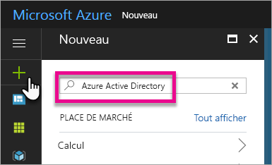
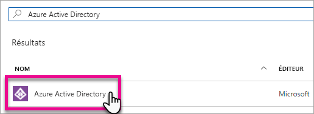
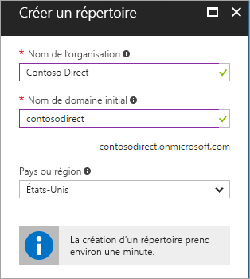
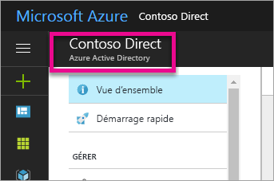
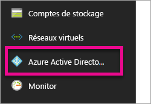
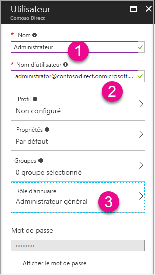
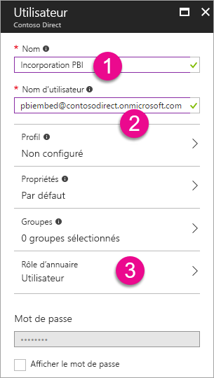
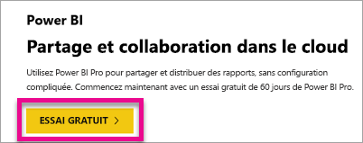

# Créer un locataire Azure Active Directory pour utiliser Power BI

Découvrez comment créer un locataire Azure Active Directory (Azure AD) pour une application personnalisée qui appelle des [API REST Power BI](../automation/rest-api-reference.md).

Dans Azure Active Directory, un locataire représente une organisation. Il s’agit d’une instance dédiée du service Azure AD qu’une organisation reçoit et détient lorsqu’elle s’inscrit à un service cloud Microsoft comme Azure, Microsoft Intune ou Office 365. Chaque locataire Azure AD est distinct et indépendant des autres locataires Azure AD.

Lorsque vous disposez d’un locataire Azure AD, vous pouvez définir une application et lui attribuer des autorisations pour lui permettre d’appeler des [API REST Power BI](../automation/rest-api-reference.md).

Si votre organisation possède déjà un locataire Azure AD, vous pouvez l’utiliser pour votre application. Vous pouvez également créer un locataire spécifiquement pour votre application. Cet article explique comment créer un locataire.

## Créer un client Azure Active Directory

Pour intégrer Power BI à votre application personnalisée, vous devez définir une application dans Azure AD, ce qui vous demande d’avoir un annuaire Azure AD. Cet annuaire est votre *locataire*. Si votre organisation n’a pas encore de locataire, car elle n’utilise pas Power BI ou Office 365, [vous devez configurer un environnement de développement](https://docs.microsoft.com/azure/active-directory/develop/active-directory-howto-tenant). Vous pouvez également créer un locataire si vous souhaitez que votre application soit indépendante du locataire de votre organisation. Si nécessaire, vous pouvez également créer un locataire à des fins de test.

Pour créer un locataire Azure AD :

1. Accédez au [portail Azure](https://portal.azure.com) et connectez-vous à l’aide d’un compte associé à un abonnement Azure.

2. Sélectionnez l’**icône Plus (+)** et recherchez **Azure Active Directory**.

    

3. Sélectionnez **Azure Active Directory** dans les résultats de la recherche.

    

4. Sélectionnez **Créer**.

5. Indiquez un **nom d’organisation** et un **nom de domaine initial**. Sélectionnez ensuite **Créer**. Votre annuaire est à présent créé.

    

   > [!NOTE]
   > Votre domaine initial fait partie de onmicrosoft.com. Vous pourrez ultérieurement ajouter d’autres noms de domaine. Plusieurs domaines peuvent être attribués à l’annuaire d’un locataire.

6. Une fois l’annuaire créé, sélectionnez la zone d’informations pour le gérer.

Maintenant, vous allez ajouter des utilisateurs au locataire.

## Créer des utilisateurs dans un locataire Azure Active Directory

Maintenant que vous disposez d’un annuaire, vous devez créer au moins deux utilisateurs. L’un d’eux est l’administrateur général du locataire et l’autre est l’utilisateur maître chargé de l’incorporation. Cet utilisateur peut être vu comme un compte de service.

1. Dans le portail Azure, veillez à vous trouver sur la sortie Azure Active Directory.

    

    Si ce n’est pas le cas, sélectionnez l’icône Azure Active Directory sur la barre de navigation des services située sur la gauche.

    

2. Sous **Gérer**, sélectionnez **Utilisateurs**.

    

3. Sélectionnez **Tous les utilisateurs**, puis **+ Nouvel utilisateur**.

4. Fournissez un **nom** et un **nom d’utilisateur** pour l’administrateur général de votre locataire. Définissez le **Rôle d’annuaire** sur **Administrateur général**. En outre, vous pouvez afficher le mot de passe temporaire. Lorsque vous avez terminé, sélectionnez **Créer**.

    

5. Faites la même chose pour les utilisateurs standard du locataire. Vous pouvez utiliser ce compte pour votre compte d’incorporation principal. Cette fois-ci, le paramètre **Rôle d’annuaire** doit conserver la valeur **Utilisateur**. Notez le mot de passe, puis sélectionnez **Créer**.

    

6. Inscrivez-vous à Power BI à l’aide du compte d’utilisateur que vous avez créé à l’étape 5. Accédez à [powerbi.com](https://powerbi.microsoft.com/get-started/) et sélectionnez **Essai gratuit** sous **Power BI - Partage et collaboration dans le cloud**.

    

    Au moment de l’inscription, vous êtes invité à essayer Power BI Pro gratuitement pendant 60 jours. Vous pouvez accepter et devenir un utilisateur Pro, ce qui vous permettra de [commencer à développer une solution incorporée](embed-sample-for-customers.md).

   > [!NOTE]
   > Veillez à vous inscrire avec l’adresse e-mail de votre compte d’utilisateur.

## Étapes suivantes

Maintenant que vous avez un locataire Azure AD, vous pouvez l’utiliser pour tester des éléments dans Power BI. Vous pouvez également incorporer des rapports et des tableaux de bord Power BI dans votre application. Pour plus d’informations, consultez [Incorporation de vos tableaux de bord, rapports et vignettes Power BI](embed-sample-for-customers.md).

[Qu’est-ce qu’un annuaire Azure Active ?](https://docs.microsoft.com/azure/active-directory/active-directory-whatis) 
 
[Démarrage rapide : Configurer un environnement de développement](https://docs.microsoft.com/azure/active-directory/develop/active-directory-howto-tenant)  

D’autres questions ? [Essayez d’interroger la communauté Power BI](https://community.powerbi.com/)
