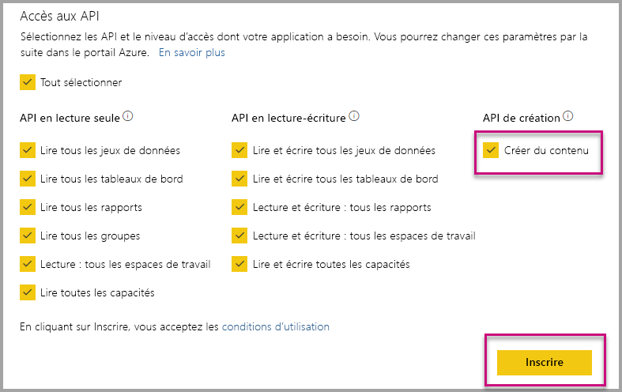

# Installer automatiquement des applications Power BI quand vous incorporez du contenu pour votre organisation

Pour incorporer du contenu à partir d’une application, l’utilisateur qui est chargé de l’incorporation doit avoir [accès à l’application](../../collaborate-share/service-create-distribute-apps.md). Si l’application est installée pour l’utilisateur, l’incorporation se fera facilement. Pour plus d’informations, consultez [Incorporer des rapports ou des tableaux de bord à partir d’applications](embed-from-apps.md). Sur PowerBI.com, vous pouvez décider que toutes les applications doivent être [installées automatiquement](https://powerbi.microsoft.com/blog/automatically-install-apps/). Toutefois, cette action sera effectuée au niveau du locataire et s’appliquera à toutes les applications.

## Installer automatiquement l’application lors d’une incorporation

Si un utilisateur a accès à une application, mais que celle-ci n’est pas installée, l’incorporation échoue. Afin d’éviter de tels échecs lors de l’incorporation du contenu d’une application, vous pouvez autoriser l’installation automatique de l’application lors de l’incorporation. Dans ce cas, si l’application que tente d’incorporer l’utilisateur n’est pas installée, celle-ci le sera automatiquement. Par conséquent, le contenu de votre choix est incorporé immédiatement, et tout se déroule facilement pour l’utilisateur.

## Incorporer pour des utilisateurs Power BI (l’utilisateur est propriétaire des données)

Si vous souhaitez autoriser l’installation automatique des applications pour vos utilisateurs, vous devez attribuer à votre application l’autorisation « Création de contenu » lors de l’[inscription de votre application](register-app.md#register-an-azure-ad-app), ou l’ajouter si vous avez déjà inscrit votre application.

Ensuite, vous devez fournir l’ID d’application dans l’URL d’incorporation. Pour fournir l’ID d’application, le créateur de l’application doit tout d’abord installer l’application, puis utiliser l’un des appels d’[API REST Power BI](/rest/api/power-bi/) pris en charge : [Obtenir des rapports](/rest/api/power-bi/reports/getreports) ou [Obtenir des tableaux de bord](/rest/api/power-bi/dashboards/getdashboards). Ensuite, le créateur de l’application doit copier l’URL d’incorporation dans la réponse de l’API REST. L’ID d’application s’affiche dans l’URL si le contenu provient d’une application.  Une fois que vous disposez de l’URL d’incorporation, vous pouvez régulièrement l’utiliser pour incorporer du contenu.

## Sécuriser l’incorporation

Pour utiliser l’installation automatique des applications, le créateur de l’application doit tout d’abord installer l’application, puis accéder à l’application sur PowerBI.com, accéder au rapport, et enfin, obtenir le lien comme il le ferait habituellement. Tous les autres utilisateurs qui ont accès à l’application et qui peuvent utiliser le lien sont en mesure d’incorporer le rapport.

## Considérations et limitations

* Vous pouvez uniquement incorporer les rapports et les tableaux de bord de ce scénario.

* Cette fonctionnalité n’est pas prise en charge si l’application est propriétaire des données et si l’incorporation se fait dans SharePoint.