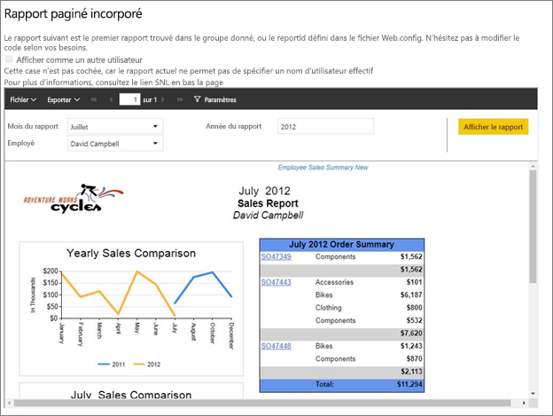
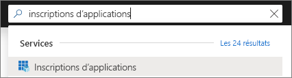
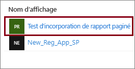
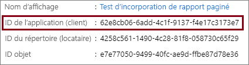
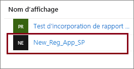
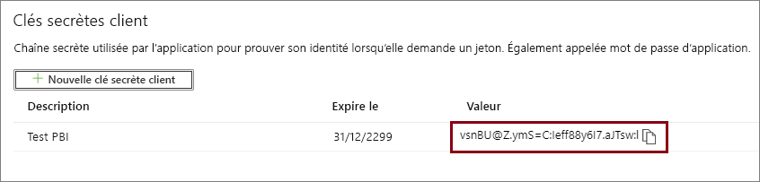
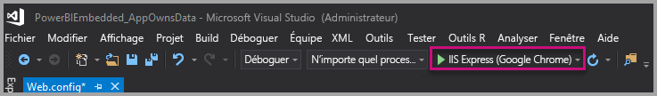
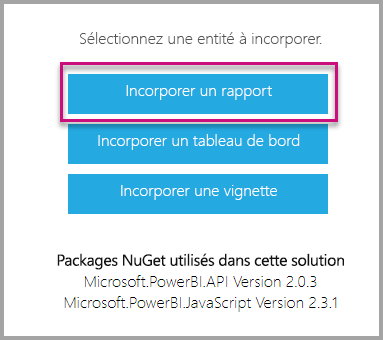

# <a name="tutorial-embed-power-bi-paginated-reports-into-an-application-for-your-customers"></a>Tutoriel : Incorporer des rapports paginés Power BI dans une application pour vos clients

Avec **Power BI Embedded dans Azure** ou l’**incorporation de Power BI dans Office**, vous pouvez incorporer des rapports paginés dans une application à l’aide de l’exemple App Owns Data (L’application possède les données). **Application possède des données** vise à permettre d’avoir une application qui utilise Power BI comme sa plateforme d’analyse incorporée. En tant qu’**éditeur de logiciels indépendant (ISV)** ou que **développeur**, vous pouvez créer du contenu Power BI qui affiche des rapports paginés dans une application qui est entièrement intégrée et interactive, sans exiger des utilisateurs qu’ils disposent d’une licence Power BI. Ce tutoriel montre comment intégrer un rapport paginé dans une application à l’aide du SDK Power BI .NET avec l’API JavaScript Power BI.



Dans ce tutoriel, vous allez découvrir comment :
> [!div class="checklist"]
> * inscrire une application dans Azure ;
> * incorporer un rapport paginé Power BI dans une application.

## <a name="prerequisites"></a>Prérequis

Pour commencer, vous devez disposer des éléments suivants :

* Un [principal de service (jeton d’application uniquement)](embed-service-principal.md)
* Un abonnement [Microsoft Azure](https://azure.microsoft.com/)
* Votre propre configuration d’un [locataire Azure Active Directory](create-an-azure-active-directory-tenant.md)
* Au moins une [capacité](#create-a-capacity) A4 ou P1, avec la charge de travail des [rapports paginés](../../admin/service-admin-premium-workloads.md#paginated-reports) activée

Si vous n’avez pas d’abonnement Azure, créez un [compte gratuit](https://azure.microsoft.com/free/?WT.mc_id=A261C142F) avant de commencer.

> [!IMPORTANT]
> * Vous devez utiliser un **principal de service**. L’utilisateur maître n’est pas pris en charge.
>* [Premium par utilisateur (PPU)](../../admin/service-premium-per-user-faq.md) n’est pas pris en charge. Vous pouvez utiliser PPU pour expérimenter la solution, mais vous ne pourrez pas [passer en production](embed-sample-for-customers.md#move-to-production).
> * Les sources de données qui nécessitent l’authentification unique ne sont pas prises en charge. Pour obtenir la liste des jeux de données pris en charge et leurs méthodes d’authentification, consultez [Sources de données prises en charge pour les rapports paginés Power BI](../../paginated-reports/paginated-reports-data-sources.md). 
> * Un jeu de données Power BI n’est pas pris en charge comme [source de données](../../connect-data/service-get-data.md).

## <a name="set-up-your-power-bi-environment"></a>Configurer votre environnement Power BI

L’incorporation d’un rapport paginé nécessite d’associer un espace de travail à une capacité et de charger le rapport dans l’espace de travail.

### <a name="create-an-app-workspace"></a>Créer un espace de travail d’application

Quand vous utilisez un [principal de service](embed-service-principal.md) pour vous connecter à votre application, vous êtes obligé de recourir aux [nouveaux espaces de travail](../../collaborate-share/service-create-the-new-workspaces.md). En tant que *principal du service*, vous devez également être administrateur ou membre des espaces de travail d’application impliqués dans votre application.

### <a name="create-a-capacity"></a>Créer une capacité

Avant d’importer ou de charger un rapport paginé à incorporer, l’espace de travail contenant le rapport doit être affecté à au moins une capacité A4 ou P1. Vous avez le choix entre deux types de capacité dans Power BI :
* **Power BI Premium** : pour incorporer un rapport paginé, une capacité de référence SKU *P* est nécessaire. Lors de l’incorporation de contenu Power BI, cette solution est appelée *incorporation de Power BI*. Pour plus d’informations sur cet abonnement, consultez [Qu’est-ce que Power BI Premium ?](../../admin/service-premium-what-is.md)
* **Azure Power BI Embedded** : vous pouvez acheter une capacité à partir du [portail Microsoft Azure](https://portal.azure.com). Cet abonnement utilise les références SKU *A*. Pour incorporer des rapports paginés, vous devez disposer au moins d’un abonnement *A4*. Pour en savoir plus sur la création d’une capacité Power BI Embedded, consultez [Créer une capacité Power BI Embedded dans le Portail Microsoft Azure](azure-pbie-create-capacity.md).

Le tableau ci-dessous décrit les ressources et les limites de chaque référence SKU. Pour déterminer la capacité qui correspond le mieux à vos besoins, consultez le tableau [Quelle référence SKU dois-je acheter pour mon scénario ?](./embedded-faq.md#which-solution-should-i-choose)

| Nœuds de capacité | Total des v-cores | Cœurs virtuels backend | RAM (Go) | Cœurs virtuels frontend | 
| --- | --- | --- | --- | --- |
| P1/A4 | 8 | 4 | 25 | 4 |
| P2/A5 | 16 | 8 | 50 | 8 |
| P3/A6 | 32 | 16 | 100 | 16 |
| | | | | |

### <a name="assign-an-app-workspace-to-a-capacity"></a>Affecter un espace de travail d’application à une capacité

Après avoir créé une capacité, vous pouvez lui affecter l’espace de travail de votre application.

Pour affecter une capacité à un espace de travail à l’aide d’un [principal de service](embed-service-principal.md), utilisez l’[API REST Power BI](/rest/api/power-bi/capacities/groups_assigntocapacity). Quand vous utilisez l’API REST Power BI, veillez à utiliser l’[ID objet du principal de service](embed-service-principal.md).

### <a name="create-and-upload-your-paginated-reports"></a>Créer et charger vos rapports paginés

Vous pouvez créer votre rapport paginé à l’aide du [Générateur de rapports Power BI](../../paginated-reports/paginated-reports-report-builder-power-bi.md#create-reports-in-power-bi-report-builder), puis [charger ce rapport dans le service](../../paginated-reports/paginated-reports-quickstart-aw.md#upload-the-report-to-the-service).

Vous pouvez importer des rapports paginés dans les nouveaux espaces de travail à l’aide des [API REST Power BI](/rest/api/power-bi/imports/postimportingroup).

## <a name="embed-content-using-the-sample-application"></a>Incorporer du contenu en utilisant l’exemple d’application

Cet exemple est intentionnellement simple pour faciliter la démonstration. C’est à vous ou à vos développeurs de protéger le secret de l’application.

Suivez les étapes ci-dessous pour commencer l’incorporation de votre contenu en utilisant l’exemple d’application.

1. Téléchargez [Visual Studio](https://www.visualstudio.com/) (version 2013 ou ultérieure). Veillez à télécharger le dernier [package NuGet](https://www.nuget.org/profiles/powerbi).

2. Téléchargez [l’exemple App Owns Data](https://github.com/Microsoft/PowerBI-Developer-Samples) (L’application possède les données) sur GitHub pour commencer.

    

3. Ouvrez le fichier **Web.config** dans l’exemple d’application. Vous devez renseigner certains champs pour pouvoir exécuter l’application. Vous pouvez choisir **ServicePrincipal** comme **AuthenticationType**.

    Remplissez les champs suivants :
    * [applicationId](#application-id)
    * [workspaceId](#workspace-id)
    * [reportId](#report-id)
    * [applicationsecret](#application-secret)
    * [tenant](#tenant)

    > [!Note]
    > La valeur par défaut d’**AuthenticationType** dans cet exemple est MasterUser. Veillez à la remplacer par **ServicePrincipal**. 


    

### <a name="application-id"></a>ID de l’application

Dans le champ **applicationId**, indiquez **l’ID d’application** **d’Azure**. L’information **applicationId** est utilisée par l’application pour s’identifier auprès des utilisateurs auxquels vous demandez des autorisations.

Pour récupérer la valeur **applicationId**, suivez ces étapes :

1. Connectez-vous au [portail Azure](https://portal.azure.com).

2. Dans le volet de navigation de gauche, sélectionnez **Tous les services**, puis recherchez **Inscriptions d’applications**.

    

3. Sélectionnez l’application ayant besoin de la valeur **applicationId**.

    

4. Un **ID d’application** est listé au format GUID. Utilisez cet **ID d’application** comme **applicationId** de l’application.

    

### <a name="workspace-id"></a>ID de l’espace de travail

Dans **workspaceId**, indiquez le GUID d’espace de travail d’application (groupe) provenant de Power BI. Vous pouvez obtenir ces informations à partir de l’URL quand vous êtes connecté au service Power BI ou à l’aide de PowerShell.

URL <br>


PowerShell <br>

```powershell
Get-PowerBIworkspace -name "Paginated Report Embed"
```

   

### <a name="report-id"></a>ID du rapport

Dans **reportId**, indiquez le GUID de rapport provenant de Power BI. Vous pouvez obtenir ces informations à partir de l’URL quand vous êtes connecté au service Power BI ou à l’aide de PowerShell.

URL<br>


PowerShell <br>

```powershell
Get-PowerBIworkspace -name "Paginated Report Embed" | Get-PowerBIReport
```


### <a name="application-secret"></a>Secret de l’application

Renseignez les informations **ApplicationSecret** à partir de la section **Clés** de votre section **Inscriptions d’applications** dans **Azure**.

Pour obtenir la valeur **ApplicationSecret**, effectuez les étapes suivantes :

1. Connectez-vous au [portail Azure](https://portal.azure.com).

2. Dans le volet de navigation de gauche, sélectionnez **Tous les services**, puis recherchez **Inscriptions d’applications**.

    

3. Sélectionnez l’application qui doit utiliser la valeur **ApplicationSecret**.

    

4. Sélectionnez **Certificats et secrets** sous **Gérer**.

5. Sélectionnez **Nouvelle clé secrète client**.

6. Entrez un nom dans la zone **Description** et sélectionnez une durée. Puis sélectionnez **Enregistrer** afin d’obtenir la **valeur** pour votre application. Lorsque vous fermez le volet **Clés** après l’enregistrement de la valeur de la clé, le champ de valeur apparaît uniquement masqué. À ce stade, vous n’êtes pas en mesure de récupérer la valeur de la clé. Si vous perdez la valeur de la clé, créez-en une autre dans le portail Azure.

    

### <a name="tenant"></a>Locataire

Dans **tenant**, indiquez votre ID de locataire Azure. Vous pouvez obtenir ces informations à partir du [centre d’administration d’Azure AD](/onedrive/find-your-office-365-tenant-id) quand vous êtes connecté au service Power BI ou en utilisant PowerShell.

### <a name="run-the-application"></a>Exécuter l’application

1. Sélectionnez **Exécuter** dans **Visual Studio**.

    

2. Ensuite, sélectionnez **Incorporer un rapport**.

    

3. Vous pouvez à présent voir le rapport dans l’exemple d’application.

    

## <a name="embed-power-bi-paginated-reports-within-your-application"></a>Incorporer des rapports paginés Power BI dans votre application

Même si les étapes permettant d’incorporer vos rapports paginés Power BI sont effectuées avec les [API REST Power BI](/rest/api/power-bi/), les exemples de code décrits dans cet article utilisent le **SDK .NET**.

L’incorporation de rapports paginés Power BI pour vos clients dans votre application vous demande de disposer d’un [principal de service](embed-service-principal.md) **Azure AD** et d’obtenir un [jeton d’accès Azure AD](get-azuread-access-token.md#access-token-for-non-power-bi-users-app-owns-data) pour votre application Power BI, avant d’effectuer des appels aux [API REST Power BI](/rest/api/power-bi/).

Pour créer le client Power BI avec votre **jeton d’accès**, créez un objet client Power BI pour interagir avec les [API REST Power BI](/rest/api/power-bi/). Pour cela, wrappez l’élément **AccessToken** avec un objet client Power BI **_Microsoft.Rest.TokenCredentials_* _.

```csharp
using Microsoft.IdentityModel.Clients.ActiveDirectory;
using Microsoft.Rest;
using Microsoft.PowerBI.Api.V2;

var tokenCredentials = new TokenCredentials(authenticationResult.AccessToken, "Bearer");

// Create a Power BI Client object. it's used to call Power BI APIs.
using (var client = new PowerBIClient(new Uri(ApiUrl), tokenCredentials))
{
    // Your code to embed items.
}
```

### <a name="get-the-paginated-report-you-want-to-embed"></a>Obtenir le rapport paginé que vous voulez incorporer

Vous pouvez utiliser l’objet client Power BI pour récupérer une référence à l’élément que vous souhaitez incorporer.

Voici un exemple de code montrant comment récupérer le premier rapport à partir d’un espace de travail donné.

_Un exemple d’obtention d’un élément de contenu, qu’il s’agisse d’un rapport, d’un tableau de bord ou d’une vignette à incorporer, est disponible dans le fichier Services\EmbedService.cs dans l’[exemple d’application](https://github.com/Microsoft/PowerBI-Developer-Samples).*

```csharp
using Microsoft.PowerBI.Api.V2;
using Microsoft.PowerBI.Api.V2.Models;

// You need to provide the workspaceId where the dashboard resides.
ODataResponseListReport reports = await client.Reports.GetReportsInGroupAsync(workspaceId);

// Get the first report in the group.
Report report = reports.Value.FirstOrDefault();
```

### <a name="create-the-embed-token"></a>Créer le jeton incorporé

Générez un jeton d’incorporation qui peut être utilisé à partir de l’API JavaScript. Pour créer un jeton incorporé pour l’incorporation de rapports paginés Power BI, utilisez l’API [GenerateTokenInGroup pour les rapports](/rest/api/power-bi/embedtoken/reports_generatetokeningroup).

Un exemple de création d’un jeton d’incorporation est disponible dans le fichier *Services\EmbedService.cs* de l’[exemple d’application](https://github.com/Microsoft/PowerBI-Developer-Samples).

```csharp
using Microsoft.PowerBI.Api.V2;
using Microsoft.PowerBI.Api.V2.Models;

// Generate Embed Token.
var generateTokenRequestParameters = new GenerateTokenRequest(accessLevel: "view");
EmbedToken tokenResponse = client.Reports.GenerateTokenInGroup(workspaceId, report.Id, generateTokenRequestParameters);

// Generate Embed Configuration.
var embedConfig = new EmbedConfig()
{
    EmbedToken = tokenResponse,
    EmbedUrl = report.EmbedUrl,
    Id = report.Id
};
```

### <a name="load-an-item-using-javascript"></a>Charger un élément en utilisant JavaScript

JavaScript permet de charger un rapport paginé dans un élément div sur votre page web.

Pour obtenir un exemple complet d’utilisation de l’API JavaScript, vous pouvez utiliser [l’outil Playground](https://microsoft.github.io/PowerBI-JavaScript/demo). L’outil Playground est un moyen rapide de jouer avec différents types d’exemples Power BI Embedded. Pour plus d’informations sur l’API JavaScript, vous pouvez consulter la page du [wiki PowerBI-JavaScript](https://github.com/Microsoft/powerbi-javascript/wiki).

## <a name="next-steps"></a>Étapes suivantes

Dans ce tutoriel, vous avez appris à incorporer des rapports paginés Power BI dans une application pour vos clients. Vous pouvez aussi essayer d’incorporer du contenu Power BI pour vos clients ou votre organisation.

> [!div class="nextstepaction"]
>[Incorporer du contenu pour vos clients](embed-sample-for-customers.md)

> [!div class="nextstepaction"]
>[Incorporer du contenu pour votre organisation](embed-sample-for-your-organization.md)

D’autres questions ? [Essayez d’interroger la communauté Power BI](https://community.powerbi.com/)