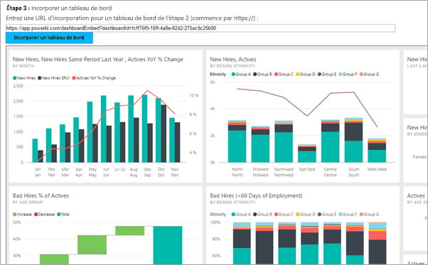
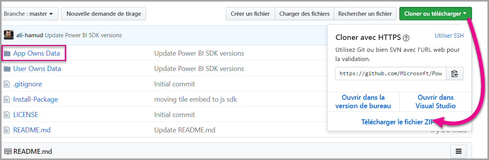

# <a name="tutorial-embed-a-power-bi-content-into-your-application-for-national-clouds"></a>Tutoriel : Incorporer du contenu Power BI dans votre application pour des clouds nationaux

Découvrez comment incorporer du contenu analytique dans vos applications de processus d’entreprise pour le cloud national. Vous pouvez utiliser le kit de développement logiciel (SDK) .NET Power BI avec l’API JavaScript Power BI pour incorporer un rapport, un tableau de bord ou une vignette dans vos applications web.

Power BI prend également en charge les [clouds nationaux](/azure/active-directory/develop/authentication-national-cloud).

Les différents clouds nationaux sont :

* U.S. Government Community Cloud (GCC)

* U. S. Government Community Cloud High (GCC High)

* U. S. Military Contractors (DoDCON)

* U. S. Military (DoD)

* Cloud Power BI pour l’Allemagne

* Cloud Power BI pour la Chine



Pour vous familiariser avec cette procédure pas à pas, vous avez besoin d’un **compte Power BI**. Si vous n’avez pas configuré de compte, alors selon le type de gouvernement ou de pays, vous pouvez choisir le cloud national adapté à vos besoins. Vous pouvez vous inscrire pour obtenir un [compte Power BI pour l’État fédéral américain](../../admin/service-govus-signup.md), un [compte cloud Power BI pour l’Allemagne](https://powerbi.microsoft.com/power-bi-germany/?ru=https%3A%2F%2Fapp.powerbi.de%2F%3FnoSignUpCheck%3D1) ou un [compte cloud Power BI pour la Chine](https://www.21vbluecloud.com/powerbi/).

> [!NOTE]
> Vous voulez plutôt incorporer un tableau de bord s’adressant à votre organisation ? Consultez [Intégrer un tableau de bord dans une application pour votre organisation](embed-sample-for-your-organization.md).

Pour intégrer un tableau de bord à une application web, utilisez l’API **Power BI** et un **jeton d’accès** d’autorisation Azure Active Directory (AD) pour obtenir un tableau de bord. Ensuite, chargez le tableau de bord à l’aide d’un jeton incorporé. L’API **Power BI** fournit un accès par programmation à des ressources **Power BI** spécifiques. Pour plus d’informations, consultez [API REST Power BI](/rest/api/power-bi/), [Kit SDK Power BI .NET et [API JavaScript Power BI](https://github.com/Microsoft/PowerBI-JavaScript).

## <a name="download-the-sample"></a>Télécharger l’exemple

Cet article présente le code utilisé dans l’[exemple L’application possède les données](https://github.com/Microsoft/PowerBI-Developer-Samples) sur GitHub. Pour suivre cette procédure pas à pas, vous pouvez télécharger l’exemple. 



* Government Community Cloud (GCC) :

    > [!NOTE]
    > L’incorporation de contenu Power BI à partir d’une plateforme GCC (Government Community Cloud) peut s’effectuer uniquement avec une référence SKU Microsoft 365. D’autres clients de cloud national peuvent utiliser des [références SKU Microsoft 365 ou Azure](embedded-faq.md).

1. Remplacez le fichier Cloud.config par le contenu de GCCCloud.config.

2. Mettez à jour l’ID d’application (ID d’application de l’application native), l’ID d’espace de travail, l’utilisateur (votre utilisateur principal) et le mot de passe dans le fichier Web.config.

3. Ajoutez les paramètres GCC dans le fichier web.config comme suit.

```xml
<add key="authorityUrl" value="https://login.microsoftonline.com/common/" />
<add key="resourceUrl" value="https://analysis.usgovcloudapi.net/powerbi/api" />
<add key="apiUrl" value="https://api.powerbigov.us/" />
<add key="embedUrlBase" value="https://app.powerbigov.us" />
```

* Military Contractors (DoDCON) :

1. Remplacez le fichier Cloud.config par le contenu de TBCloud.config.

2. Mettez à jour l’ID d’application (ID d’application de l’application native), l’ID d’espace de travail, l’utilisateur (votre utilisateur principal) et le mot de passe dans le fichier Web.config.

3. Ajoutez les paramètres DoDCON dans le fichier web.config comme suit.

```xml
<add key="authorityUrl" value="https://login.microsoftonlineS.us/common/" />
<add key="resourceUrl" value="https://high.analysis.usgovcloudapi.net/powerbi/api" />
<add key="apiUrl" value="https://api.high.powerbigov.us/" />
<add key="embedUrlBase" value="https://app.high.powerbigov.us" />
```

* Military (DoD) :

1. Remplacez le fichier Cloud.config par le contenu de PFCloud.config.

2. Mettez à jour l’ID d’application (ID d’application de l’application native), l’ID d’espace de travail, l’utilisateur (votre utilisateur principal) et le mot de passe dans le fichier Web.config.

3. Ajoutez les paramètres DoDCON dans le fichier web.config comme suit.

```xml
<add key="authorityUrl" value="https://login.microsoftonline.us/common/" />
<add key="resourceUrl" value="https://mil.analysis.usgovcloudapi.net/powerbi/api" />
<add key="apiUrl" value="https://api.mil.powerbigov.us/" />
<add key="embedUrlBase" value="https://app.mil.powerbigov.us" />
```

* Paramètres du cloud Power BI pour l’Allemagne

1. Remplacez le fichier Cloud.config par le contenu de cloud Power BI pour l’Allemagne.

2. Mettez à jour l’ID d’application (ID d’application de l’application native), l’ID d’espace de travail, l’utilisateur (votre utilisateur principal) et le mot de passe dans le fichier Web.config.

3. Ajoutez les paramètres du cloud Power BI pour l’Allemagne dans le fichier web.config comme suit.

```xml
<add key="authorityUrl" value="https://login.microsoftonline.de/common/" />
<add key="resourceUrl" value="https://analysis.cloudapi.de/powerbi/api" />
<add key="apiUrl" value="https://api.powerbi.de/" />
<add key="embedUrlBase" value="https://app.powerbi.de" />
```

* Paramètres du cloud Power BI pour la Chine

1. Remplacez le fichier Cloud.config par le contenu de cloud [Power BI pour la Chine](https://github.com/microsoft/PowerBI-Developer-Samples/blob/master/.NET%20Framework/Embed%20for%20your%20organization/CloudConfigs/Power%20BI%20operated%20by%2021Vianet%20in%20China/Cloud.config).

2. Mettez à jour l’ID d’application (ID d’application de l’application native), l’ID d’espace de travail, l’utilisateur (votre utilisateur principal) et le mot de passe dans le fichier Web.config.

3. Ajoutez les paramètres du cloud Power BI pour la Chine dans le fichier web.config comme suit.

```xml
<add key="authorityUrl" value="https://login.chinacloudapi.cn/common/" />
<add key="resourceUrl" value="https://analysis.chinacloudapi.cn/powerbi/api" />
<add key="apiUrl" value="https://api.powerbi.cn/" />
<add key="embedUrlBase" value="https://app.powerbi.cn" />
```

## <a name="step-1---register-an-app-in-azure-ad"></a>Étape 1 - Inscrire une application dans Azure AD

Inscrivez votre application auprès d’Azure AD pour effectuer des appels d’API REST. Pour plus d’informations, consultez [Inscrire une application Azure AD pour incorporer du contenu Power BI](register-app.md). Étant donné qu’il existe différentes affiliations de clouds nationaux, vous disposez d’URL distinctes pour inscrire votre application.

* Government Community Cloud (GCC) - ```https://app.powerbigov.us/apps```

* Military Contractors (DoDCON) - ```https://app.high.powerbigov.us/apps```

* Military (DoD) - ```https://app.mil.powerbigov.us/apps```

* Cloud Power BI pour l’Allemagne - ```https://app.powerbi.de/apps```

* Cloud Power BI pour la Chine - ```https://app.powerbi.cn/apps```

Si vous avez téléchargé [l’exemple Embedding for your customer](https://github.com/microsoft/PowerBI-Developer-Samples/tree/master/.NET%20Core/Embed%20for%20your%20customers/AppOwnsData) (Incorporation pour votre client), utilisez **l’ID d’application** obtenu pour que l’exemple puisse s’authentifier auprès d’Azure AD. Pour configurer l’exemple, modifiez **l’ID d’application** dans le fichier *web.config*.

## <a name="step-2---get-an-access-token-from-azure-ad"></a>Étape 2 : obtenir un jeton d’accès à partir d’Azure AD

Dans votre application, vous devez obtenir un **jeton d’accès** auprès d’Azure AD avant de pouvoir effectuer des appels à l’API REST Power BI. Pour plus d’informations, consultez [Authentifier des utilisateurs et obtenir un jeton d’accès Azure AD pour votre application Power BI](get-azuread-access-token.md). Étant donné qu’il existe des affiliations de clouds nationaux différentes, vous disposez d’URL distinctes pour obtenir un jeton pour votre application.

* Government Community Cloud (GCC) - ```https://login.microsoftonline.com```

* Military Contractors (DoDCON) - ```https://login.microsoftonline.us```

* Military (DoD) - ```https://login.microsoftonline.us```

* Cloud Power BI pour l’Allemagne - ```https://login.microsoftonline.de```

* Cloud Power BI pour la Chine - ```https://login.chinacloudapi.cn```

Vous pouvez voir des exemples de ces jetons d’accès dans chaque tâche d’élément de contenu du fichier **Controllers\HomeController.cs**.

## <a name="step-3---get-a-content-item"></a>Étape 3 : obtenir un élément de contenu

Pour incorporer votre contenu Power BI, vous devez effectuer quelques opérations pour vous assurer du bon déroulement de l’incorporation. Même si toutes ces étapes peuvent être effectuées directement avec l’API REST, l’exemple d’application, ainsi que les autres exemples présentés ici, utilisent le kit SDK .NET.

### <a name="create-the-power-bi-client-with-your-access-token"></a>Créer un client Power BI avec votre jeton d’accès

Avec votre jeton d’accès, vous devez créer votre objet de client Power BI pour interagir avec les API Power BI. Pour cela, wrappez l’élément AccessToken avec un objet *Microsoft.Rest.TokenCredentials*.

```csharp
using Microsoft.IdentityModel.Clients.ActiveDirectory;
using Microsoft.Rest;
using Microsoft.PowerBI.Api.V2;

var tokenCredentials = new TokenCredentials(authenticationResult.AccessToken, "Bearer");

// Create a Power BI Client object. This is used to call the Power BI APIs.
using (var client = new PowerBIClient(new Uri(ApiUrl), tokenCredentials))
{
    // Your code to embed items.
}
```

### <a name="get-the-content-item-you-want-to-embed"></a>Obtenir l’élément de contenu que vous souhaitez incorporer

Utilisez l’objet client Power BI pour récupérer une référence vers l’élément que vous souhaitez incorporer. Vous pouvez incorporer des tableaux de bord, des vignettes ou des rapports. Voici un exemple montrant comment récupérer le premier tableau de bord, rapport ou vignette à partir d’un espace de travail donné.

Un exemple est disponible dans le fichier **Controllers\HomeController.cs** de l’ [exemple App Owns Data sample](https://github.com/microsoft/PowerBI-Developer-Samples/tree/master/.NET%20Core/Embed%20for%20your%20customers/AppOwnsData) (L’application possède les données).

#### <a name="reports"></a>Rapports

```csharp
using Microsoft.PowerBI.Api.V2;
using Microsoft.PowerBI.Api.V2.Models;

// You need to provide the workspaceId where the dashboard resides.
ODataResponseListReport reports = client.Reports.GetReportsInGroupAsync(workspaceId);

// Get the first report in the group.
Report report = reports.Value.FirstOrDefault();
```

#### <a name="dashboards"></a>Tableaux de bord

```csharp
using Microsoft.PowerBI.Api.V2;
using Microsoft.PowerBI.Api.V2.Models;

// You need to provide the workspaceId where the dashboard resides.
ODataResponseListDashboard dashboards = client.Dashboards.GetDashboardsInGroup(workspaceId);

// Get the first report in the group.
Dashboard dashboard = dashboards.Value.FirstOrDefault();
```

#### <a name="tiles"></a>Vignettes

```csharp
using Microsoft.PowerBI.Api.V2;
using Microsoft.PowerBI.Api.V2.Models;

// To retrieve the tile, you first need to retrieve the dashboard.

// You need to provide the workspaceId where the dashboard resides.
ODataResponseListDashboard dashboards = client.Dashboards.GetDashboardsInGroup(workspaceId);

// Get the first report in the group.
Dashboard dashboard = dashboards.Value.FirstOrDefault();

// Get a list of tiles from a specific dashboard
ODataResponseListTile tiles = client.Dashboards.GetTilesInGroup(workspaceId, dashboard.Id);

// Get the first tile in the group.
Tile tile = tiles.Value.FirstOrDefault();
```

### <a name="create-the-embed-token"></a>Créer le jeton incorporé

En utilisant l’API JavaScript, vous pouvez générer un jeton d’incorporation. Le jeton d’incorporation est propre à l’élément incorporé. Chaque fois que vous incorporez un élément de contenu Power BI, vous devez créer un jeton d’incorporation associé à cet élément. Pour en savoir plus, notamment sur les niveaux d’accès ( **accessLevel** ) à utiliser, consultez [Incorporer un jeton](/rest/api/power-bi/embedtoken).

> [!IMPORTANT]
> Étant donné que les jetons d’incorporation sont uniquement destinés aux tests de développeur, le nombre de jetons d’incorporation qu’un compte principal Power BI peut générer est limité. Vous [devez acheter une capacité](./embedded-faq.md#technical) pour les scénarios d’incorporation de production. Une fois une capacité achetée, la génération de jetons incorporés n’est pas limitée.

Un exemple est disponible dans le fichier **Controllers\HomeController.cs** de l’ [exemple Embedding for your organization](https://github.com/microsoft/PowerBI-Developer-Samples/tree/master/.NET%20Core/Embed%20for%20your%20customers/AppOwnsData) (Incorporation pour votre organisation).

Une classe est créée pour **EmbedConfig** et **TileEmbedConfig**. Des exemples sont disponibles dans les fichiers **Models\EmbedConfig.cs** et **Models\TileEmbedConfig.cs**.

#### <a name="reports"></a>Rapports

```csharp
using Microsoft.PowerBI.Api.V2;
using Microsoft.PowerBI.Api.V2.Models;

// Generate Embed Token.
var generateTokenRequestParameters = new GenerateTokenRequest(accessLevel: "view");
EmbedToken tokenResponse = client.Reports.GenerateTokenInGroup(workspaceId, report.Id, generateTokenRequestParameters);

// Generate Embed Configuration.
var embedConfig = new EmbedConfig()
{
    EmbedToken = tokenResponse,
    EmbedUrl = report.EmbedUrl,
    Id = report.Id
};
```

#### <a name="dashboards"></a>Tableaux de bord

```csharp
using Microsoft.PowerBI.Api.V2;
using Microsoft.PowerBI.Api.V2.Models;

// Generate Embed Token.
var generateTokenRequestParameters = new GenerateTokenRequest(accessLevel: "view");
EmbedToken tokenResponse = client.Dashboards.GenerateTokenInGroup(workspaceId, dashboard.Id, generateTokenRequestParameters);

// Generate Embed Configuration.
var embedConfig = new EmbedConfig()
{
    EmbedToken = tokenResponse,
    EmbedUrl = dashboard.EmbedUrl,
    Id = dashboard.Id
};
```

#### <a name="tiles"></a>Vignettes

```csharp
using Microsoft.PowerBI.Api.V2;
using Microsoft.PowerBI.Api.V2.Models;

// Generate Embed Token for a tile.
var generateTokenRequestParameters = new GenerateTokenRequest(accessLevel: "view");
EmbedToken tokenResponse = client.Tiles.GenerateTokenInGroup(workspaceId, dashboard.Id, tile.Id, generateTokenRequestParameters);

// Generate Embed Configuration.
var embedConfig = new TileEmbedConfig()
{
    EmbedToken = tokenResponse,
    EmbedUrl = tile.EmbedUrl,
    Id = tile.Id,
    dashboardId = dashboard.Id
};
```

## <a name="step-4---load-an-item-using-javascript"></a>Étape 4 : charger un élément à l’aide de JavaScript

Vous pouvez utiliser JavaScript pour charger un tableau de bord dans un élément div sur votre page web. L’exemple utilise un modèle EmbedConfig/TileEmbedConfig avec des vues pour un tableau de bord, une vignette ou un rapport. Pour obtenir un exemple complet de l’utilisation de l’API JavaScript, vous pouvez consulter l’[exemple Microsoft Power BI Embedded](https://microsoft.github.io/PowerBI-JavaScript/demo).

Un exemple d’application est disponible dans l’[exemple Incorporation pour votre organisation](https://github.com/microsoft/PowerBI-Developer-Samples/tree/master/.NET%20Core/Embed%20for%20your%20customers/AppOwnsData).

### <a name="viewshomeembeddashboardcshtml"></a>Views\Home\EmbedDashboard.cshtml

```csharp
<script src="~/scripts/powerbi.js"></script>
<div id="dashboardContainer"></div>
<script>
    // Read embed application token from Model
    var accessToken = "@Model.EmbedToken.Token";

    // Read embed URL from Model
    var embedUrl = "@Html.Raw(Model.EmbedUrl)";

    // Read dashboard Id from Model
    var embedDashboardId = "@Model.Id";

    // Get models. models contains enums that can be used.
    var models = window['powerbi-client'].models;

    // Embed configuration used to describe the what and how to embed.
    // This object is used when calling powerbi.embed.
    // This also includes settings and options such as filters.
    // You can find more information at https://github.com/Microsoft/PowerBI-JavaScript/wiki/Embed-Configuration-Details.
    var config = {
        type: 'dashboard',
        tokenType: models.TokenType.Embed,
        accessToken: accessToken,
        embedUrl: embedUrl,
        id: embedDashboardId
    };

    // Get a reference to the embedded dashboard HTML element
    var dashboardContainer = $('#dashboardContainer')[0];

    // Embed the dashboard and display it within the div container.
    var dashboard = powerbi.embed(dashboardContainer, config);
</script>
```

### <a name="viewshomeembedtilecshtml"></a>Views\Home\EmbedTile.cshtml

```csharp
<script src="~/scripts/powerbi.js"></script>
<div id="tileContainer"></div>
<script>
    // Read embed application token from Model
    var accessToken = "@Model.EmbedToken.Token";

    // Read embed URL from Model
    var embedUrl = "@Html.Raw(Model.EmbedUrl)";

    // Read tile Id from Model
    var embedTileId = "@Model.Id";

    // Read dashboard Id from Model
    var embedDashboardId = "@Model.dashboardId";

    // Get models. models contains enums that can be used.
    var models = window['powerbi-client'].models;

    // Embed configuration used to describe the what and how to embed.
    // This object is used when calling powerbi.embed.
    // This also includes settings and options such as filters.
    // You can find more information at https://github.com/Microsoft/PowerBI-JavaScript/wiki/Embed-Configuration-Details.
    var config = {
        type: 'tile',
        tokenType: models.TokenType.Embed,
        accessToken: accessToken,
        embedUrl: embedUrl,
        id: embedTileId,
        dashboardId: embedDashboardId
    };

    // Get a reference to the embedded tile HTML element
    var tileContainer = $('#tileContainer')[0];

    // Embed the tile and display it within the div container.
    var tile = powerbi.embed(tileContainer, config);
</script>
```

### <a name="viewshomeembedreportcshtml"></a>Views\Home\EmbedReport.cshtml

```csharp
<script src="~/scripts/powerbi.js"></script>
<div id="reportContainer"></div>
<script>
    // Read embed application token from Model
    var accessToken = "@Model.EmbedToken.Token";

    // Read embed URL from Model
    var embedUrl = "@Html.Raw(Model.EmbedUrl)";

    // Read report Id from Model
    var embedReportId = "@Model.Id";

    // Get models. models contains enums that can be used.
    var models = window['powerbi-client'].models;

    // Embed configuration used to describe the what and how to embed.
    // This object is used when calling powerbi.embed.
    // This also includes settings and options such as filters.
    // You can find more information at https://github.com/Microsoft/PowerBI-JavaScript/wiki/Embed-Configuration-Details.
    var config = {
        type: 'report',
        tokenType: models.TokenType.Embed,
        accessToken: accessToken,
        embedUrl: embedUrl,
        id: embedReportId,
        permissions: models.Permissions.All,
        settings: {
            filterPaneEnabled: true,
            navContentPaneEnabled: true
        }
    };

    // Get a reference to the embedded report HTML element
    var reportContainer = $('#reportContainer')[0];

    // Embed the report and display it within the div container.
    var report = powerbi.embed(reportContainer, config);
</script>
```

## <a name="next-steps"></a>Étapes suivantes

* Vous pouvez examiner un exemple d’application sur GitHub. Les exemples ci-dessus sont basés sur cet exemple. Pour plus d’informations, consultez l’[exemple Incorporation pour votre organisation](https://github.com/microsoft/PowerBI-Developer-Samples/tree/master/.NET%20Core/Embed%20for%20your%20customers/AppOwnsData).

* Pour plus d’informations sur l’API JavaScript, consultez [API JavaScript Power BI](https://github.com/Microsoft/PowerBI-JavaScript).

* Pour plus d’informations sur le cloud Power BI pour l’Allemagne, consultez [FAQ sur le cloud Power BI pour l’Allemagne](../../admin/service-govde-faq.md)

* [Guide pratique pour migrer le contenu d’une collection d’espaces de travail Power BI vers Power BI](migrate-from-powerbi-embedded.md)

Considérations et limitations

D’autres questions ? [Essayez d’interroger la communauté Power BI](https://community.powerbi.com/)
