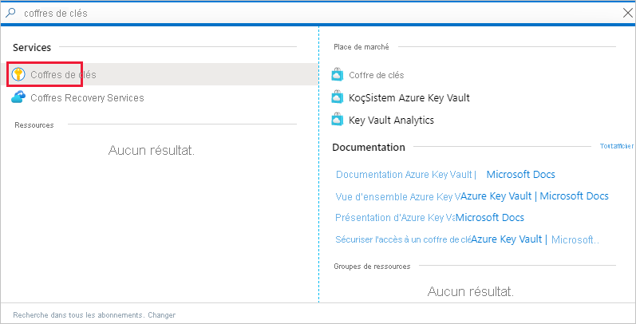
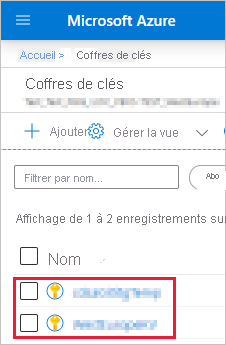
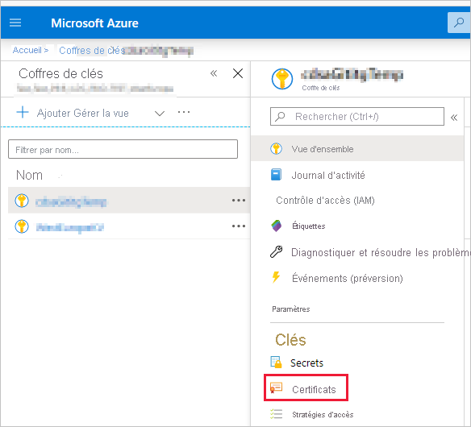
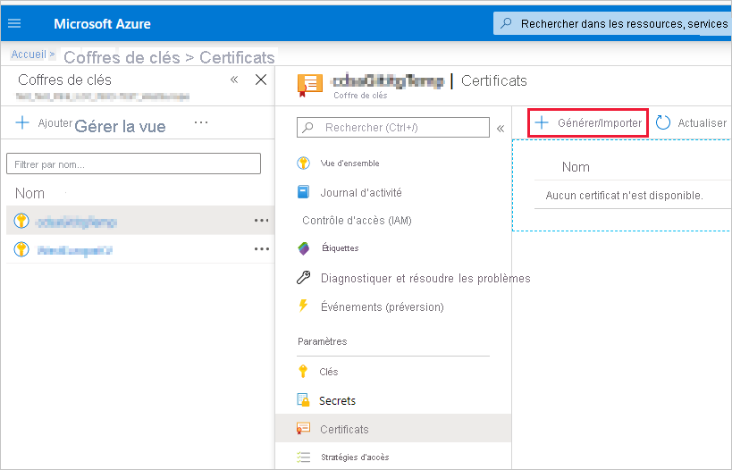
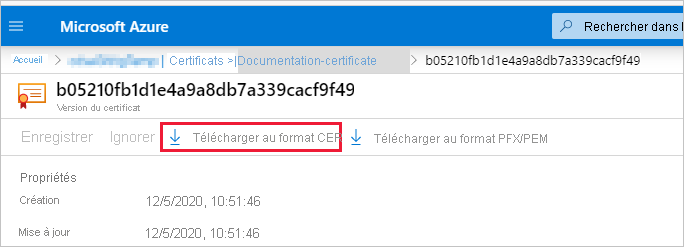
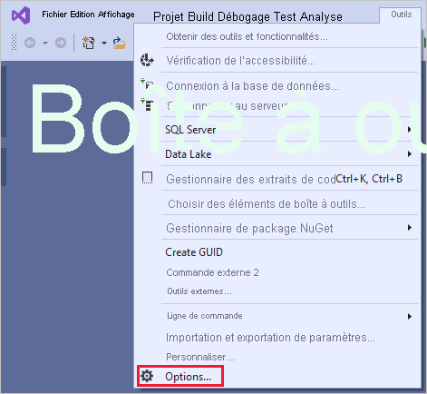
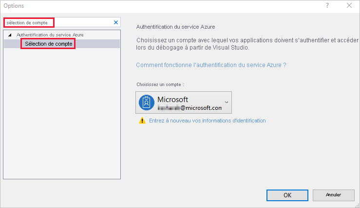

# <a name="embed-power-bi-content-with-service-principal-and-a-certificate"></a>Incorporer du contenu Power BI avec un principal de service et un certificat

[!INCLUDE[service principal overview](../../includes/service-principal-overview.md)]

>[!NOTE]
>Nous vous recommandons de sécuriser vos services de back-end en utilisant des certificats au lieu de clés secrètes. [Découvrez plus d’informations sur l’obtention de jetons d’accès auprès d’Azure AD en utilisant des clés secrètes ou des certificats](https://docs.microsoft.com/azure/architecture/multitenant-identity/client-assertion).

## <a name="certificate-based-authentication"></a>Authentification par certificat

L’authentification basée sur les certificats vous permet d’être authentifié par Azure Active Directory (Azure AD) avec un certificat client sur un appareil Windows, Android ou iOS, ou stocké dans un [coffre de clés Azure](https://docs.microsoft.com/azure/key-vault/basic-concepts).

L’utilisation de cette méthode d’authentification permet de gérer les certificats à partir d’un emplacement central en utilisant l’autorité de certification pour la rotation ou la révocation.

Vous pouvez en savoir plus sur les certificats dans Azure AD dans la page GitHub [Client credential flows](https://github.com/AzureAD/microsoft-authentication-library-for-dotnet/wiki/Client-credential-flows).

## <a name="method"></a>Méthode

Pour utiliser le principal de service et un certificat avec l’analytique incorporée, effectuez ces étapes :

1. Création d'un certificat

2. Créer une application Azure AD.

3. Configurer l’authentification par certificat.

4. Obtenir le certificat auprès d’Azure Key Vault.

5. S’authentifier en utilisant un principal de service et un certificat.

## <a name="step-1---create-a-certificate"></a>Étape 1 : Créer un certificat

Vous pouvez vous procurer un certificat auprès d’une *autorité de certification* approuvée ou bien générer vous-même un certificat.

Cette section décrit la création d’un certificat en utilisant [Azure Key Vault](https://docs.microsoft.com/azure/key-vault/create-certificate) et le téléchargement du fichier *.cer* qui contient la clé publique.

1. Connectez-vous à [Microsoft Azure](https://ms.portal.azure.com/#allservices).

2. Recherchez **Coffres de clés**, puis cliquez sur le lien **Coffres de clés**.

    

3. Cliquez sur le coffre de clés auquel vous souhaitez ajouter un certificat.

    

4. Cliquez sur **Certificats**.

    

5. Cliquez sur **Générer/Importer**.

    

6. Configurez les champs de **Créer un certificat** comme suit :

    * **Méthode de création de certificat** : Général

    * **Nom du certificat** : Entrez un nom pour votre certificat

    * **Type d’autorité de certification** : Certificat auto-signé

    * **Sujet** : Un nom unique [X. 500](https://wikipedia.org/wiki/X.500)

    * **Noms DNS** : 0 noms DNS

    * **Période de validité (en mois)**  : Entrez la durée de validité du certificat

    * **Type de contenu** : PKCS #12

    * **Type d’action de la durée de vie** : Renouveler automatiquement en fonction d’un pourcentage donné de la durée de vie

    * **Pourcentage de la durée de vie** : 80

    * **Configuration de stratégie avancée** : Non configurée

7. Cliquez sur **Créer**. Le certificat nouvellement créé est désactivé par défaut. L’activation peut prendre jusqu’à cinq minutes.

8. Sélectionnez le certificat que vous avez créé.

9. Cliquez sur **Télécharger au format CER**. Le fichier téléchargé contient la clé publique.

    

## <a name="step-2---create-an-azure-ad-application"></a>Étape 2 : Créer une application Azure AD

[!INCLUDE[service principal create app](../../includes/service-principal-create-app.md)]

## <a name="step-3---set-up-certificate-authentication"></a>Étape 3 : Configurer l’authentification par certificat

1. Dans votre application Azure AD, cliquez sur l’onglet **Certificats et secrets**.

     

2. Cliquez sur **Charger le certificat** et chargez le fichier *.cer* que vous avez créé et téléchargé dans la [première étape](#step-1---create-a-certificate) de ce tutoriel. Le fichier *.cer* contient la clé publique.

## <a name="step-4---get-the-certificate-from-azure-key-vault"></a>Étape 4 : Obtenir le certificat auprès d’Azure Key Vault

Utilisez Managed Service Identity (MSI) pour obtenir le certificat auprès d’Azure Key Vault. Ce processus implique l’obtention du certificat *.pfx* contenant les clés publique et privée.

Reportez-vous à l’exemple de code pour lire le certificat provenant d’Azure Key Vault. Si vous voulez utiliser Visual Studio, reportez-vous à [Configurer Visual Studio pour utiliser MSI](#configure-visual-studio-to-use-msi).

```csharp
private X509Certificate2 ReadCertificateFromVault(string certName)
{
    var serviceTokenProvider = new AzureServiceTokenProvider();
    var keyVaultClient = new KeyVaultClient(new KeyVaultClient.AuthenticationCallback(serviceTokenProvider.KeyVaultTokenCallback));
    CertificateBundle certificate = null;
    SecretBundle secret = null;
    try
    {
        certificate = keyVaultClient.GetCertificateAsync($"https://{KeyVaultName}.vault.azure.net/", certName).Result;
        secret = keyVaultClient.GetSecretAsync(certificate.SecretIdentifier.Identifier).Result;
    }
    catch (Exception)
    {
        return null;
    }

    return new X509Certificate2(Convert.FromBase64String(secret.Value));
}
```

## <a name="step-5---authenticate-using-service-principal-and-a-certificate"></a>Étape 5 : S’authentifier en utilisant un principal de service et un certificat

Vous pouvez authentifier votre application en utilisant un principal de service et un certificat stocké dans Azure Key Vault en vous connectant à Azure Key Vault.

Pour vous connecter à Azure Key Vault et y lire le certificat, reportez-vous au code ci-dessous.

>[!NOTE]
>Si vous disposez déjà d’un certificat créé par votre organisation, chargez le fichier *.pfx* sur Azure Key Vault.

```csharp
// Preparing needed variables
var Scope = "https://analysis.windows.net/powerbi/api/.default"
var ApplicationId = "{YourApplicationId}"
var tenantSpecificURL = "https://login.microsoftonline.com/{YourTenantId}/"
X509Certificate2 certificate = ReadCertificateFromVault(CertificateName);

// Authenticating with a SP and a certificate
public async Task<AuthenticationResult> DoAuthentication(){
    IConfidentialClientApplication clientApp = null;
    clientApp = ConfidentialClientApplicationBuilder.Create(ApplicationId)
                                                    .WithCertificate(certificate)
                                                    .WithAuthority(tenantSpecificURL)
                                                    .Build();
    try
    {
        authenticationResult = await clientApp.AcquireTokenForClient(Scope).ExecuteAsync();
    }
    catch (MsalException)
    {
        throw;
    }
    return authenticationResult
}
```

## <a name="configure-visual-studio-to-use-msi"></a>Configurer Visual Studio pour utiliser MSI

Lors de la création de votre solution incorporée, il peut être utile de configurer Visual Studio pour utiliser Managed Service Identity (MSI). [MSI](https://docs.microsoft.com/azure/active-directory/managed-identities-azure-resources/overview) est une fonctionnalité qui vous permet de gérer votre identité Azure AD. Une fois configuré, il permet à Visual Studio de s’authentifier auprès de votre coffre Azure Key Vault.

1. Ouvrez votre projet dans Visual Studio.

2. Cliquez sur **Outils** > **Options**.

     

3. Recherchez **Sélection de compte**, puis cliquez sur **Sélection de compte**.

    

4. Ajoutez le compte qui a accès à votre coffre Azure Key Vault.

[!INCLUDE[service principal limitations](../../includes/service-principal-limitations.md)]

## <a name="next-steps"></a>Étapes suivantes

>[!div class="nextstepaction"]
>[Inscrire une application](register-app.md)

>[!div class="nextstepaction"]
>[Power BI Embedded pour vos clients](embed-sample-for-customers.md)

>[!div class="nextstepaction"]
>[Objets d’application et de principal de service dans Azure Active Directory](https://docs.microsoft.com/azure/active-directory/develop/app-objects-and-service-principals)

>[!div class="nextstepaction"]
>[Sécurité au niveau des lignes à l’aide d’une passerelle de données locale avec principal de service](embedded-row-level-security.md#on-premises-data-gateway-with-service-principal)

>[!div class="nextstepaction"]
>[Incorporer du contenu Power BI avec un principal de service et un secret d’application](embed-service-principal.md)