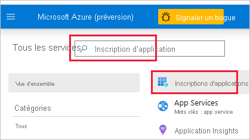
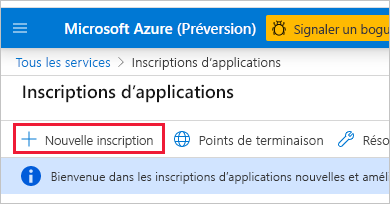
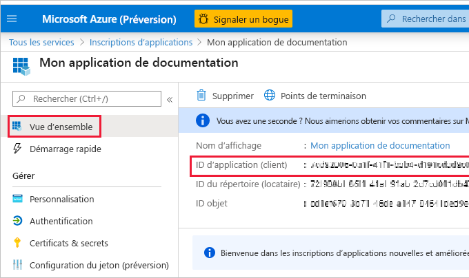

# <a name="embed-power-bi-content-with-service-principal-and-an-application-secret"></a>Incorporer du contenu Power BI avec un principal de service et un secret d’application

Le principal de service est une méthode d’authentification qui peut être utilisée pour permettre l’accès d’une application Azure AD à des API ou un contenu de service Power BI.

Lorsque vous créez une application Azure Active Directory (Azure AD), un [objet principal de service](/azure/active-directory/develop/app-objects-and-service-principals#service-principal-object) est créé. L’objet principal de service, également connu sous le nom de *principal de service*, permet à Azure AD d’authentifier votre application. Une fois authentifié, l’application peut accéder aux ressources de l’abonné Azure AD.

Pour s’authentifier, le principal de service utilise l’*ID d’application* de l’application Azure AD et l’un des éléments suivants :

* Certificat
* Secret de l’application

Cet article décrit l’authentification du principal de service à l’aide de l’*ID d’application* et *Secret de l’application*.

>[!NOTE]
>Azure AD recommande de sécuriser vos services back-end en utilisant des certificats au lieu de clés secrètes.
>* [Découvrez plus d’informations sur l’obtention de jetons d’accès auprès d’Azure AD en utilisant des clés secrètes ou des certificats](/azure/architecture/multitenant-identity/client-assertion).
>* Pour sécuriser votre solution à l’aide d’un certificat, suivez les instructions de cet article, puis suivez les étapes décrites dans [Incorporer du contenu Power BI avec un principal de service et un certificat](embed-service-principal-certificate.md).

## <a name="method"></a>Méthode

Pour utiliser le principal de service et un ID d’application avec une analytique incorporée, effectuez les étapes suivantes :

1. Créer une [application Azure AD](/azure/active-directory/manage-apps/what-is-application-management).

    1. Créez le secret de l’application Azure AD.
    
    2. Obtenez l’*ID d’application* et *Secret d’application* de l’application.

    >[!NOTE]
    >Ces étapes sont décrites dans **l’étape 1**. Pour plus d’informations sur la création d’une application Azure AD, consultez l’article [créer une application Azure AD](/azure/active-directory/develop/howto-create-service-principal-portal).

2. Créez un groupe de sécurité Azure AD.

3. Activez les paramètres d’administrateur de service Power BI.

4. Ajoutez le principal de service à votre espace de travail.

5. Incorporez votre contenu.

> [!IMPORTANT]
> Une fois que vous activez le principal de service à utiliser avec Power BI, les autorisations AD de l’application n’ont plus d’effet. Les autorisations de l’application sont ensuite gérées par le biais du portail d’administration Power BI.

## <a name="step-1---create-an-azure-ad-app"></a>Étape 1 : créer une application Azure AD

Créer une application Azure AD à l’aide d’une de ces méthodes :

* [Créez l’application dans le portail Microsoft Azure](embed-service-principal.md#creating-an-azure-ad-app-in-the-microsoft-azure-portal).

* [Créez l’application à l’aide de PowerShell](embed-service-principal.md#creating-an-azure-ad-app-using-powershell).

### <a name="creating-an-azure-ad-app-in-the-microsoft-azure-portal"></a>Création d’une application Azure AD dans le Portail Microsoft Azure

1. Connectez-vous à [Microsoft Azure](https://ms.portal.azure.com/#allservices).

2. Recherchez les **inscriptions d’applications**, puis cliquez sur le lien **Inscriptions d’applications**.

    

3. Cliquez sur **Nouvelle inscription**.

    

4. Entrez les informations obligatoires :
    * **Nom** : entrer un nom pour votre application
    * **Types de comptes pris en charge** : sélectionner les types de comptes pris en charge
    * (facultatif) **Rédiriger l’URI** : entrer un URI si nécessaire

5. Cliquez sur **S'inscrire**.

6. Une fois l’inscription terminée, l’*ID d’application* est disponible dans l’onglet **Vue d’ensemble**. Copiez et enregistrez l’*ID de l’application* pour une future utilisation.

    

7. Cliquer sur l’onglet **Certificats et secrets**.

     

8. Cliquez sur **Nouveau secret client**.

    

9. Dans la fenêtre *Ajouter un secret client*, entrez une description, spécifiez à quel moment vous souhaitez que le secret client expire, puis cliquez sur **Ajouter**.

10. Copiez et enregistrez la valeur *Secret client*.

    

    >[!NOTE]
    >Une fois que vous avez quitté cette fenêtre, la valeur secret client est masquée et vous ne pouvez pas l’afficher ni la copier à nouveau.

### <a name="creating-an-azure-ad-app-using-powershell"></a>Création d’une application Azure AD à l’aide de PowerShell

Cette section comprend un échantillon de script permettant de créer une nouvelle application Azure AD à l’aide de [PowerShell](/powershell/azure/create-azure-service-principal-azureps).

```powershell
# The app ID - $app.appid
# The service principal object ID - $sp.objectId
# The app key - $key.value

# Sign in as a user that's allowed to create an app
Connect-AzureAD

# Create a new Azure AD web application
$app = New-AzureADApplication -DisplayName "testApp1" -Homepage "https://localhost:44322" -ReplyUrls "https://localhost:44322"

# Creates a service principal
$sp = New-AzureADServicePrincipal -AppId $app.AppId

# Get the service principal key
$key = New-AzureADServicePrincipalPasswordCredential -ObjectId $sp.ObjectId
```

## <a name="step-2---create-an-azure-ad-security-group"></a>Étape 2 : créer un groupe de sécurité Azure AD

Votre principal de service n’a accès à aucune de vos API ni au contenu Power BI. Pour accorder l’accès au principal de service, créez un groupe de sécurité dans Azure AD et ajoutez le principal de service que vous avez créé à ce groupe de sécurité.

Vous pouvez créer un groupe de sécurité Azure AD de deux façons :
* [Manuellement (dans Azure)](embed-service-principal.md#create-a-security-group-manually)
* [Utiliser PowerShell](embed-service-principal.md#create-a-security-group-using-powershell)

### <a name="create-a-security-group-manually"></a>Créer un groupe de sécurité manuellement

Pour créer un groupe de sécurité Azure manuellement, suivez les instructions de l’article [Créer un groupe de base et ajouter des membres à l’aide d’Azure Active Directory](/azure/active-directory/fundamentals/active-directory-groups-create-azure-portal). 

### <a name="create-a-security-group-using-powershell"></a>Créer un groupe de sécurité à l’aide PowerShell

Voici un échantillon de script qui crée un nouveau groupe de sécurité et ajoute une application à ce groupe.

>[!NOTE]
>Si vous souhaitez activer l’accès au principal de service pour toute l’organisation, ignorez cette étape.

```powershell
# Required to sign in as admin
Connect-AzureAD

# Create an Azure AD security group
$group = New-AzureADGroup -DisplayName <Group display name> -SecurityEnabled $true -MailEnabled $false -MailNickName notSet

# Add the service principal to the group
Add-AzureADGroupMember -ObjectId $($group.ObjectId) -RefObjectId $($sp.ObjectId)
```

## <a name="step-3---enable-the-power-bi-service-admin-settings"></a>Étape 3 : activer les paramètres d’administrateur de service Power BI

Pour qu’une application Azure AD soit en mesure d’accéder au contenu et aux API de Power BI, un administrateur Power BI doit activer l’accès au principal de service dans le portail d’administrateur Power BI.

Ajoutez le groupe de sécurité que vous avez créé dans Azure AD sous la section **Paramètres du développeur** relative au groupe de sécurité.

>[!IMPORTANT]
>Les principaux de service ont accès à tous les paramètres d’abonné pour lesquels ils sont activés. En fonction de vos paramètres d’administrateur, cela comprend des groupes de sécurité spécifiques ou toute l’organisation.
>
>Pour restreindre l’accès du principal de service à des paramètres d’abonné spécifiques, autorisez l’accès uniquement à des groupes de sécurité spécifiques. Vous pouvez également créer un groupe de sécurité dédié pour les principaux de service et l’exclure des paramètres d’abonné souhaités.

>[!div class="mx-imgBorder"]
>:::image type="content" source="media/embed-service-principal/admin-portal.png" alt-text="Capture d’écran montrant les paramètres de développeur dans les options d’administration dans le portail Power BI.":::

## <a name="step-4---add-the-service-principal-to-your-workspace"></a>Étape 4 - Ajouter le principal de service à votre espace de travail

Pour activer vos artefacts d’accès à l’application Azure AD, tels que les rapports, les tableaux de bord et les jeux de données du service Power BI, ajoutez l’entité du principal de service (ou le groupe de sécurité qui contient votre principal de service) en tant que membre ou administrateur à votre espace de travail.

>[!NOTE]
>Cette section fournit des instructions relatives à l’interface utilisateur. Vous pouvez également ajouter un principal de service ou un groupe de sécurité à un espace de travail à l’aide de [Groupes : ajouter une API utilisateur de groupe](/rest/api/power-bi/groups/addgroupuser).

1. Accédez à l’espace de travail pour lequel vous souhaitez activer l’accès, puis dans le menu **Plus**, sélectionnez **Accès à l’espace de travail**.

    :::image type="content" source="media/embed-service-principal/workspace-access.png" alt-text="Capture d’écran montrant le bouton d’accès à l’espace de travail dans le menu Plus d’un espace de travail Power BI.":::

2. Dans le volet **Accès**, ajoutez l’un des éléments suivants :

    * Votre **principal de service**. Le nom de votre principal de service correspond au *nom d’affichage* de votre application Azure AD, tel qu’il s’affiche sous l’onglet Vue d’ensemble de votre application Azure AD.

    * Le **groupe de sécurité** qui comprend votre principal de service.

3. Dans le menu déroulant, sélectionnez **Membre** ou **Administrateur**.

4. Sélectionnez **Ajouter**.

## <a name="step-5---embed-your-content"></a>Étape 5 : incorporer votre contenu

Vous pouvez incorporer votre contenu dans un exemple d’application ou dans votre propre application.

* [Incorporer du contenu en utilisant l’exemple d’application](embed-sample-for-customers.md#embed-content-using-the-sample-application)
* [Incorporer du contenu dans votre application](embed-sample-for-customers.md#embed-content-within-your-application)

Une fois votre contenu incorporé, vous êtes prêt à [passer à la production](embed-sample-for-customers.md#move-to-production).

>[!NOTE]
>Pour sécuriser votre contenu à l’aide d’un certificat, suivez les étapes décrites dans [Incorporer du contenu Power BI avec un principal de service et un certificat](embed-service-principal-certificate.md).

## <a name="considerations-and-limitations"></a>Considérations et limitations

* Un principal de service ne fonctionne qu’avec les [nouveaux espaces de travail](../../collaborate-share/service-create-the-new-workspaces.md).
* **Mon espace de travail** n’est pas pris en charge lors de l’utilisation d’un principal de service.
* Une capacité est nécessaire pour passer en production.
* Vous ne pouvez pas vous connecter au portail Power BI avec un principal de service.
* Vous devez disposer de droits d’administrateur Power BI pour activer un principal de service dans les paramètres du développeur du portail d’administration Power BI.
* Les applications [incorporées pour votre organisation](embed-sample-for-your-organization.md) ne peuvent pas utiliser un principal de service.
* La gestion de [flux de données](../../transform-model/dataflows/dataflows-introduction-self-service.md) n’est pas prise en charge.
* Le principal de service ne prend actuellement pas en charge aucune API administrateur.
* Quand vous utilisez un principal de service avec une source de données [Azure Analysis Services](/azure/analysis-services/analysis-services-overview), le principal de service doit lui-même disposer d’autorisations d’instance Azure Analysis Services. L’utilisation d’un groupe de sécurité qui contient le principal du service à cet effet ne fonctionne pas.

## <a name="next-steps"></a>Étapes suivantes

>[!div class="nextstepaction"]
>[Inscrire une application](register-app.md)

> [!div class="nextstepaction"]
>[Power BI Embedded pour vos clients](embed-sample-for-customers.md)

>[!div class="nextstepaction"]
>[Incorporer en utilisant un principal de service et un certificat](embed-service-principal-certificate.md)

>[!div class="nextstepaction"]
>[Objets d’application et de principal de service dans Azure Active Directory](/azure/active-directory/develop/app-objects-and-service-principals)

>[!div class="nextstepaction"]
>[Sécurité au niveau des lignes à l’aide d’une passerelle de données locale avec principal de service](embedded-row-level-security.md#on-premises-data-gateway-with-service-principal)