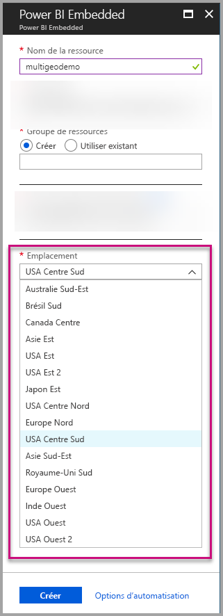
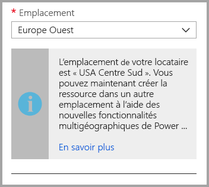
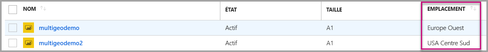
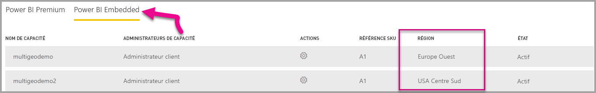

# Prise en charge de plusieurs zones géographiques pour Power BI Embedded

La **prise en charge de plusieurs zones géographiques pour Power BI Embedded** signifie que les éditeurs de logiciels indépendants et les organisations qui génèrent des applications à l’aide de Power BI Embedded pour incorporer des analytiques dans leurs applications peuvent désormais déployer leurs données dans différentes régions du monde.

Maintenant, les clients utilisant **Power BI Embedded** peuvent configurer une **capacité A** à l’aide d’options de **zones géographiques multiples**, sur la base des mêmes fonctionnalités et limitations que celles [prises en charge par Power BI Premium à l’aide des zones géographiques multiples](../../service-admin-premium-Multi-Geo.md).

## Création d’une nouvelle ressource de capacité Power BI Embedded avec des zones géographiques multiples

Dans l’écran **Créer une ressource**, vous devez choisir l’emplacement de votre capacité. Jusqu'à présent, comme il était limité à l’emplacement de votre locataire Power BI, un seul emplacement était disponible. Avec les fonctionnalités de zones géographiques multiples, vous pouvez choisir de déployer votre capacité dans différentes régions.

Notez que lorsque vous ouvrez le menu déroulant de l’emplacement, votre locataire d’origine est la sélection par défaut.
  

Lorsqu’un emplacement différent est choisi, un message vous invite à confirmer que vous êtes informé de la sélection.

## Afficher l’emplacement des capacités

Vous pouvez voir facilement l’emplacement de vos capacités en accédant à la page de gestion principale de Power BI Embedded dans le portail Azure.

Cette option est également disponible dans le portail d’administration dans Powerbi.com. Dans le portail d’administration, choisissez « Paramètres de capacité », puis basculez vers l’onglet « Power BI Embedded ».

[En savoir plus sur la création des capacités avec Power BI Embedded.](azure-pbie-create-capacity.md)

## Gérer l’emplacement de capacités existant

Vous ne pouvez pas modifier un emplacement de ressource Power BI Embedded une fois que vous avez créé une nouvelle capacité.

Pour déplacer votre contenu Power BI vers une autre région, procédez comme suit :

1. [Créez une nouvelle capacité](azure-pbie-create-capacity.md) dans une autre région.

2. Affectez tous les espaces de travail de la capacité existante à la nouvelle capacité.

3. Supprimez ou suspendez l’ancienne capacité.

Il est important de noter que si vous décidez de supprimer une capacité sans réaffecter son contenu, tout le contenu de cette capacité se déplace vers une capacité partagée qui se trouve dans votre région d’origine.

## Prise en charge de l’API pour des zones géographiques multiples

Pour prendre en charge la gestion des capacités avec des zones géographiques multiples via l’API, nous avons apporté des modifications aux API existantes :

1. **[Obtenir des capacités](https://docs.microsoft.com/rest/api/power-bi/capacities/getcapacities)**  : l’API retourne une liste des capacités accessibles à l’utilisateur. La réponse inclut désormais une propriété supplémentaire appelée « région », qui spécifie l’emplacement de la capacité.

2. **[Affecter à la capacité](https://docs.microsoft.com/rest/api/power-bi/capacities)**  : l’API permet d’affecter un espace de travail donné à une capacité. Cette opération ne vous autorise pas à affecter des espaces de travail à une capacité en dehors de votre région d’origine, ni à déplacer des espaces de travail entre des capacités dans différentes régions. Pour effectuer cette opération, l’utilisateur ou le [principal du service](embed-service-principal.md) a toujours besoin d’autorisations d’administration sur l’espace de travail, ainsi que d’autorisations d’administration ou d’affectation sur la capacité cible.

3. **[API Azure Resource Manager](https://docs.microsoft.com/rest/api/power-bi-embedded/capacities)**  : toutes les opérations d’API Azure Resource Manager, y compris *Créer* et *Supprimer*, prennent en charge des zones géographiques multiples.

## Considérations et limitations

* Confirmez que tout mouvement que vous lancez entre des régions est conforme à toutes les exigences de conformité des entreprises et du gouvernement avant d’amorcer le transfert de données.

* Une requête de mise en cache stockée dans une région distante reste dans cette région au repos. Toutefois, les autres données en transit peuvent aller et venir entre différentes zones géographiques.

* Lors du déplacement de données d’une région à une autre dans un environnement de zones géographiques multiples, les données source peuvent rester dans la région à partir de laquelle les données ont été déplacées pendant 30 jours maximum. Pendant ce temps, les utilisateurs n’y ont pas accès. Elles sont supprimées de cette région et détruites pendant la période de 30 jours.

* Les zones géographiques multiples ne sont généralement pas à l’origine de performances meilleures. Le chargement de rapports et de tableaux de bord implique toujours des requêtes à la région d’origine pour les métadonnées.

## Étapes suivantes

En savoir plus sur les capacités de Power BI Embedded et sur les options de zones géographiques multiples pour toutes les capacités en se référant aux liens ci-dessous.

* [Qu’est-ce que Power BI Embedded ?](azure-pbie-what-is-power-bi-embedded.md)

* [Créer une capacité Power BI Embedded](azure-pbie-create-capacity.md)

* [Les zones géographiques multiples dans les capacités Power BI Premium](../../service-admin-premium-multi-geo.md)

D’autres questions ? [Essayez d’interroger la communauté Power BI](https://community.powerbi.com/)