# <a name="power-bi-embedded-migration-tool"></a>Outil de migration Power BI Embedded

Vous pouvez utiliser cet outil de migration pour copier vos rapports du service Azure Power BI Embedded (PaaS) vers le service Power BI (SaaS).

La migration du contenu de vos collections d’espaces de travail vers le service Power BI peut être effectuée parallèlement à votre solution actuelle et ne requiert aucun temps d’arrêt.

## <a name="limitations"></a>Limites

* Les jeux de données envoyés ne peuvent pas être téléchargés et doivent être recréés à l’aide des API REST Power BI pour le service Power BI.
* Il n’est pas possible non plus de télécharger les fichiers PBIX importés avant le 26 novembre 2016.

## <a name="download"></a>Télécharger

Vous pouvez télécharger l’exemple d’outil de migration à partir de [GitHub](https://github.com/Microsoft/powerbi-migration-sample). Vous pouvez télécharger un fichier zip du dépôt ou le cloner localement. Une fois que vous l’avez téléchargé, ouvrez le fichier *powerbi-migration-sample.sln* dans Visual Studio pour générer et exécuter l’outil de migration.

## <a name="migration-plans"></a>Plans de migration

Votre plan de migration correspond tout simplement à des métadonnées qui répertorient le contenu de Power BI Embedded et la façon dont vous souhaitez le publier dans le service Power BI.

### <a name="start-with-a-new-migration-plan"></a>Démarrer avec un nouveau plan de migration

Un plan de migration correspond aux métadonnées des éléments disponibles dans Power BI Embedded et que vous souhaitez déplacer vers le service Power BI. Le plan de migration est stocké sous forme de fichier XML.

Vous devez commencer par créer un plan de migration. Pour cela, procédez comme suit.

1. Sélectionnez **Fichier** > **Nouveau plan de migration**.

    

2. Dans la boîte de dialogue **Select Power BI Embedded Resource Group** (Sélectionner le groupe de ressources Power BI Embedded), sélectionnez la liste déroulante Environnement, puis prod.

3. Vous êtes invité à vous connecter. Utilisez les informations de connexion de votre abonnement Azure.

   > [!IMPORTANT]
   > Il ne s’agit **pas** du compte professionnel dont vous vous servez pour vous connecter à Power BI.

4. Sélectionnez l’abonnement Azure dans lequel sont stockées vos collections d’espaces de travail Power BI Embedded.

    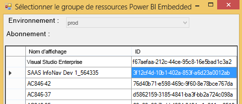
5. Sous la liste des abonnements, sélectionnez le **groupe de ressources** qui contient vos collections d’espaces de travail, puis choisissez **Sélectionner**.

    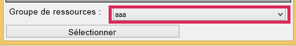

6. Sélectionnez **Analyser**. Vous obtenez alors un inventaire des éléments de votre abonnement Azure avec lequel vous pouvez commencer votre plan.

    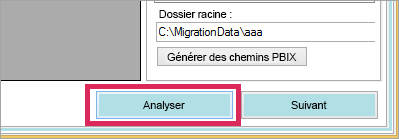

   > [!NOTE]
   > Le processus d’analyse peut prendre plusieurs minutes selon le nombre de collections d’espaces de travail et le volume du contenu de la collection d’espaces de travail.

7. Une fois l’opération **Analyser** terminée, vous êtes invité à enregistrer votre plan de migration.

À ce stade, vous avez connecté votre plan de migration à votre abonnement Azure. Lisez la suite pour comprendre le flux du travail avec un plan de migration. Il comprend l’analyse et la planification de la migration, le téléchargement, la création des groupes et le chargement.

### <a name="save-your-migration-plan"></a>Enregistrer le plan de migration

Vous pouvez enregistrer votre plan de migration pour l’utiliser ultérieurement. Cette opération crée un fichier XML, qui contient toutes les informations de votre plan de migration.

Pour enregistrer votre plan de migration, procédez comme suit.

1. Sélectionnez **Fichier** > **Save Migration Plan** (Enregistrer le plan de migration).

    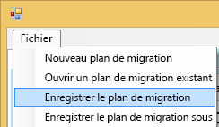

2. Nommez votre fichier ou utilisez le nom de fichier généré, puis sélectionnez **Enregistrer**.

### <a name="open-an-existing-migration-plan"></a>Ouvrir un plan de migration existant

Vous avez la possibilité d’ouvrir un plan de migration enregistré préalablement afin de continuer à travailler sur votre migration.

Pour ouvrir un plan de migration existant, procédez comme suit.

1. Sélectionnez **Fichier** > **Open Existing Migration Plan** (Ouvrir un plan de migration existant).

    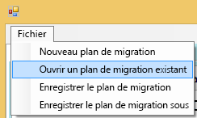

2. Sélectionnez votre fichier de migration, puis **Ouvrir**.

## <a name="step-1-analyze--plan-migration"></a>Étape 1 : Analyser et planifier la migration

L’onglet **Analyze & Plan Migration** (Analyser et planifier la migration) vous donne un aperçu de ce que contient actuellement le groupe de ressources de votre abonnement Azure.

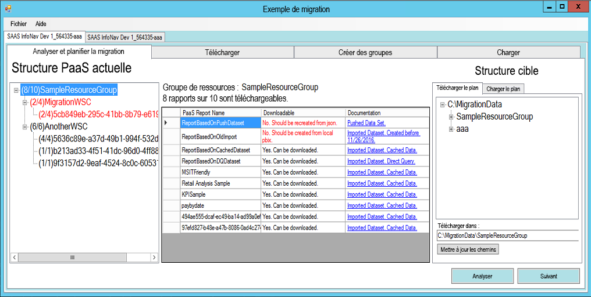

À titre d’exemple, nous allons examiner le groupe *SageResourceGroup*.

### <a name="paas-topology"></a>Topologie PaaS

Il s’agit d’une liste des éléments suivants : *Groupe de ressources > Collections d’espaces de travail > Espaces de travail*. Le groupe de ressources et les collections d’espaces de travail affichent un nom convivial. Les espaces de travail affichent un GUID.

Les éléments de la liste sont également associés à une couleur et un nombre au format (#/#). Ils indiquent le nombre de rapports pouvant être téléchargés.
La couleur noir signifie que tous les rapports peuvent être téléchargés.

La couleur rouge signifie que certains rapports peuvent être téléchargés. Le nombre de gauche correspond au nombre total de rapports pouvant être téléchargés. Le nombre de droite correspond au nombre total de rapports au sein du regroupement.

Vous pouvez sélectionner un élément dans la topologie PaaS pour afficher les rapports dans la section Rapports.

### <a name="reports"></a>Rapports

La section Rapports répertorie les rapports disponibles et indique s’ils peuvent être téléchargés ou non.


### <a name="target-structure"></a>Structure cible

La section **Structure cible** vous permet d’indiquer à l’outil où les éléments doivent être téléchargés et la manière de les charger.

#### <a name="download-plan"></a>Télécharger le plan

Un chemin d’accès est automatiquement créé pour vous. Vous pouvez le modifier si vous le souhaitez. Si vous modifiez le chemin d’accès, vous devez sélectionner **Mettre à jour les chemins d’accès**.

> [!NOTE]
> Cela n’exécute pas le téléchargement. Cela spécifie uniquement la structure de l’emplacement de téléchargement des rapports.

#### <a name="upload-plan"></a>Charger le plan

Ici, vous pouvez spécifier un préfixe à utiliser pour les espaces de travail qui seront créés dans le service Power BI. Le préfixe sera suivi du GUID de l’espace de travail qui existait dans Azure.


> [!NOTE]
> Cela ne permet pas de créer les groupes dans le service Power BI. Cela définit uniquement la structure d’affectation de noms pour les groupes.

Si vous modifiez le préfixe, vous devez sélectionner **Generate Upload Plan** (Générer le plan à charger).

Vous avez la possibilité de cliquer avec le bouton droit sur un groupe et de le renommer directement dans le plan à charger si vous le souhaitez.

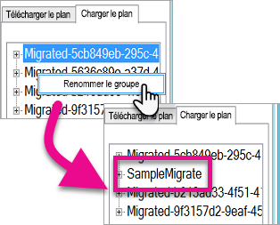

> [!NOTE]
> Le nom du *groupe* ne doit pas contenir d’espaces, ni de caractères non valides.

## <a name="step-2-download"></a>Étape 2 : Télécharger

L’onglet **Télécharger** comprend la liste des rapports et les métadonnées associées. Il indique également l’état actuel de l’exportation, ainsi que son état précédent.

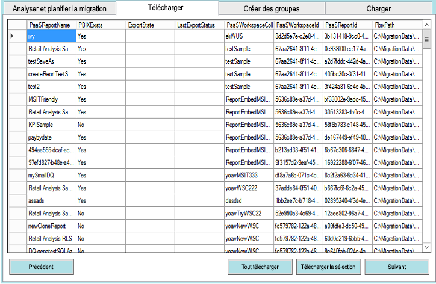

Vous disposez de deux options :

* Sélectionner des rapports spécifiques, puis **Download Selected** (Télécharger la sélection).
* Sélectionner **Télécharger tout**.

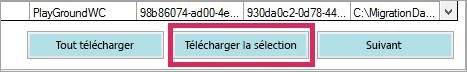

Si le téléchargement a réussi, l’état indique *Terminé* et reflète que le fichier PBIX existe.

Une fois le téléchargement terminé, sélectionnez l’onglet **Créer des groupes**.

## <a name="step-3-create-groups"></a>Étape 3 : Créer des groupes

Une fois que vous avez téléchargé les rapports disponibles, vous pouvez accéder à l’onglet **Créer des groupes**. Cet onglet va créer les espaces de travail dans le service Power BI en fonction du plan de migration que vous avez créé. Il crée l’espace de travail avec le nom que vous avez indiqué sous l’onglet **Charger** dans **Analyser et planifier la migration**.

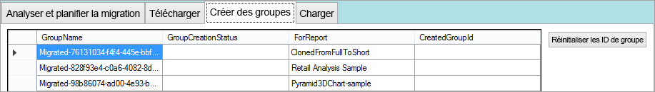

Pour créer les espaces de travail, sélectionnez **Créer les groupes sélectionnés** ou **Créer tous les groupes manquants**.

Lorsque vous sélectionnez une de ces options, vous êtes invité à vous connecter. *Vous devez utiliser les informations d’identification du service Power BI sur lequel vous souhaitez créer les espaces de travail.*

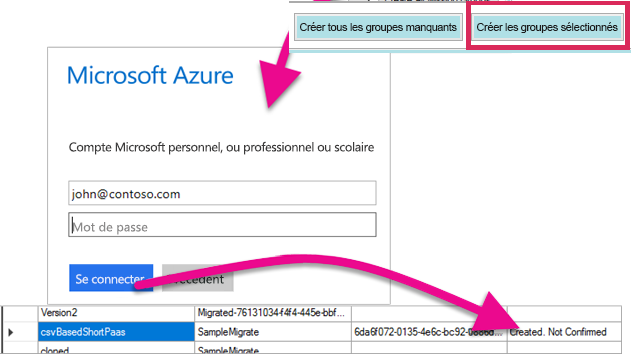

Cela permet de créer l’espace de travail dans le service Power BI. Cela ne charge pas les rapports dans l’espace de travail.

Vous pouvez vérifier que l’espace de travail a bien été créé en vous connectant à Power BI et en confirmant que l’espace de travail existe. Vous remarquez que l’espace de travail est vide.

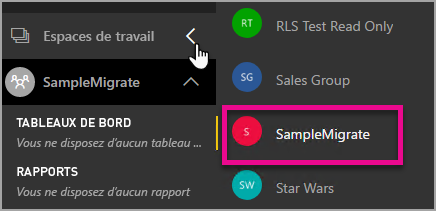

Une fois l’espace de travail créé, vous pouvez passer à l’onglet **Charger**.

## <a name="step-4-upload"></a>Étape 4 : Charger

L’onglet **Charger** permet de charger les rapports dans le service Power BI. Il comprend une liste des rapports téléchargés dans l’onglet Télécharger, ainsi que le nom des groupes cibles conformément à votre plan de migration.

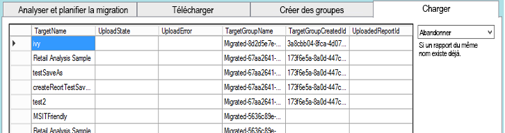

Vous pouvez charger les rapports sélectionnés ou tous les rapports. Vous pouvez également réinitialiser l’état de chargement afin de charger de nouveau des éléments.

Vous avez aussi la possibilité de sélectionner ce qui doit se passer si un rapport portant le même nom existe. Vous avez le choix entre trois options : **Abandonner**, **Ignorer** et **Remplacer**.


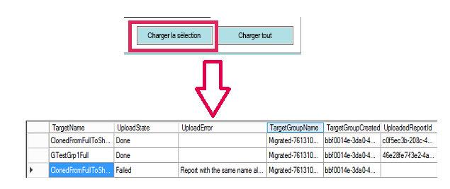

### <a name="duplicate-report-names"></a>Noms de rapport en double

Si vous avez un rapport qui porte le même nom, mais que vous savez qu’il s’agit d’un rapport différent, vous devez modifier le nom cible (**TargetName**) du rapport. Vous pouvez changer le nom en modifiant manuellement le fichier XML du plan de migration.

Vous devez fermer l’outil de migration pour effectuer la modification, puis rouvrir l’outil et le plan de migration.

Dans l’exemple ci-dessus, un des rapports clonés a échoué, car un rapport portant le même nom existe. Dans le fichier XML du plan de migration, vous pouvez voir ceci.

```xml
<ReportMigrationData>
    <PaaSWorkspaceCollectionName>SampleWorkspaceCollection</PaaSWorkspaceCollectionName>
    <PaaSWorkspaceId>4c04147b-d8fc-478b-8dcb-bcf687149823</PaaSWorkspaceId>
    <PaaSReportId>525a8328-b8cc-4f0d-b2cb-c3a9b4ba2efe</PaaSReportId>
    <PaaSReportLastImportTime>1/3/2017 2:10:19 PM</PaaSReportLastImportTime>
    <PaaSReportName>cloned</PaaSReportName>
    <IsPushDataset>false</IsPushDataset>
    <IsBoundToOldDataset>false</IsBoundToOldDataset>
    <PbixPath>C:\MigrationData\SampleResourceGroup\SampleWorkspaceCollection\4c04147b-d8fc-478b-8dcb-bcf687149823\cloned-525a8328-b8cc-4f0d-b2cb-c3a9b4ba2efe.pbix</PbixPath>
    <ExportState>Done</ExportState>
    <LastExportStatus>OK</LastExportStatus>
    <SaaSTargetGroupName>SampleMigrate</SaaSTargetGroupName>
    <SaaSTargetGroupId>6da6f072-0135-4e6c-bc92-0886d8aeb79d</SaaSTargetGroupId>
    <SaaSTargetReportName>cloned</SaaSTargetReportName>
    <SaaSImportState>Failed</SaaSImportState>
    <SaaSImportError>Report with the same name already exists</SaaSImportError>
</ReportMigrationData>
```

Pour l’élément ayant échoué, vous pouvez modifier le nom de SaaSTargetReportName.

```xml
<SaaSTargetReportName>cloned2</SaaSTargetReportName>
```

Vous pouvez ensuite rouvrir le plan dans l’outil de migration, puis charger le rapport qui a échoué.

Si vous revenez à Power BI, vous pouvez voir que les rapports et les jeux de données ont été chargés dans l’espace de travail.

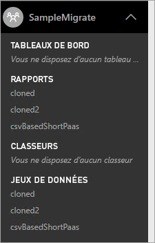

<a name="upload-local-file"></a>

### <a name="upload-a-local-pbix-file"></a>Charger un fichier PBIX local

Vous pouvez charger une version locale d’un fichier Power BI Desktop. Pour cela, vous devez fermer l’outil, modifier le fichier XML et entrer le chemin d’accès complet de votre PBIX local dans la propriété **PbixPath**.

```xml
<PbixPath>[Full Path to PBIX file]</PbixPath>
```

Une fois que vous avez modifié le fichier XML, rouvrez le plan dans l’outil de migration et chargez le rapport.

<a name="directquery-reports"></a>

### <a name="directquery-reports"></a>Rapports DirectQuery

Vous devez mettre à jour la chaîne de connexion pour les rapports DirectQuery. Vous pouvez effectuer cette opération sur *powerbi.com* ou interroger la chaîne de connexion programmatiquement à partir de Power BI Embedded (Paas). Pour un exemple, consultez la page [Extraire la chaîne de connexion DirectQuery du rapport PaaS](migrate-code-snippets.md#extract-directquery-connection-string-from-paas-report).

Vous pouvez ensuite mettre à jour la chaîne de connexion du jeu de données dans le service Power BI (Saas) et définir les informations d’identification de la source de données. Consultez les exemples suivants pour voir comment effectuer cette opération.

* [Mettre à jour la chaîne de connexion DirectQuery dans l’espace de travail SaaS](migrate-code-snippets.md#update-directquery-connection-string-is-saas-workspace)
* [Définir les informations d’identification de DirectQuery dans l’espace de travail SaaS](migrate-code-snippets.md#set-directquery-credentials-in-saas-workspace)

## <a name="embedding"></a>Incorporation

Maintenant que vos rapports ont été migrés du service Azure Power BI Embedded vers le service Power BI, vous pouvez mettre à jour votre application et commencer à incorporer les rapports dans cet espace de travail.

Pour plus d’informations, consultez [Comment migrer le contenu d’une collection d’espaces de travail Power BI Embedded vers Power BI](migrate-from-powerbi-embedded.md).

## <a name="next-steps"></a>Étapes suivantes

[Incorporation avec Power BI](embedding.md)  
[Comment migrer le contenu d’une collection d’espaces de travail Power BI Embedded vers Power BI](migrate-from-powerbi-embedded.md)  
[Qu’est-ce que Power BI Premium ?](../../admin/service-premium-what-is.md)  
[Dépôt Git d’API JavaScript](https://github.com/Microsoft/PowerBI-JavaScript)  
[Dépôt Git de C# pour Power BI ](https://github.com/Microsoft/PowerBI-CSharp)  
[Exemple de JavaScript incorporé](https://microsoft.github.io/PowerBI-JavaScript/demo/)  
[Livre blanc sur Power BI Premium](https://aka.ms/pbipremiumwhitepaper)  

D’autres questions ? [Essayez d’interroger la communauté Power BI](https://community.powerbi.com/)