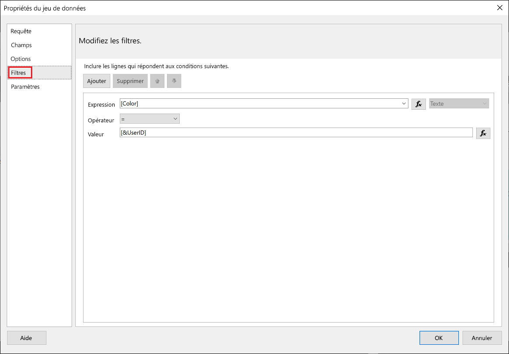
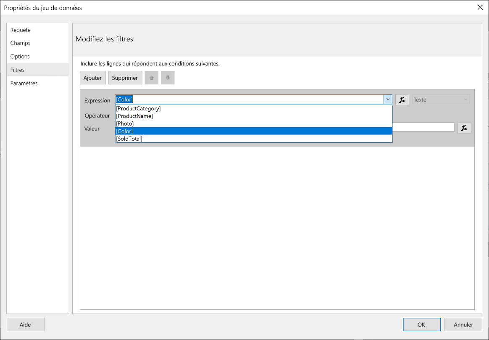
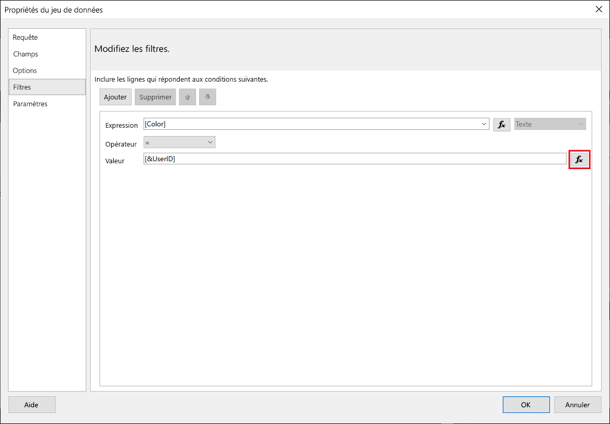
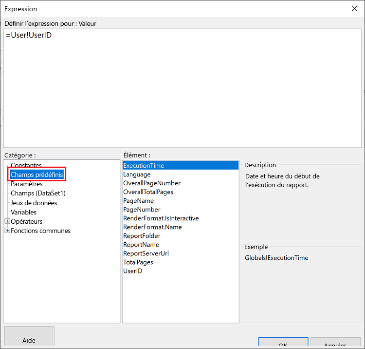
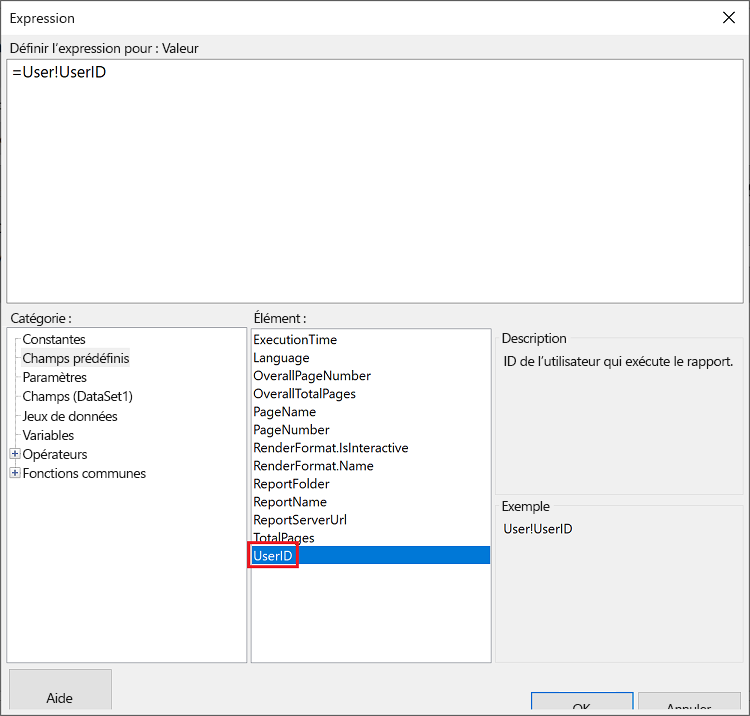
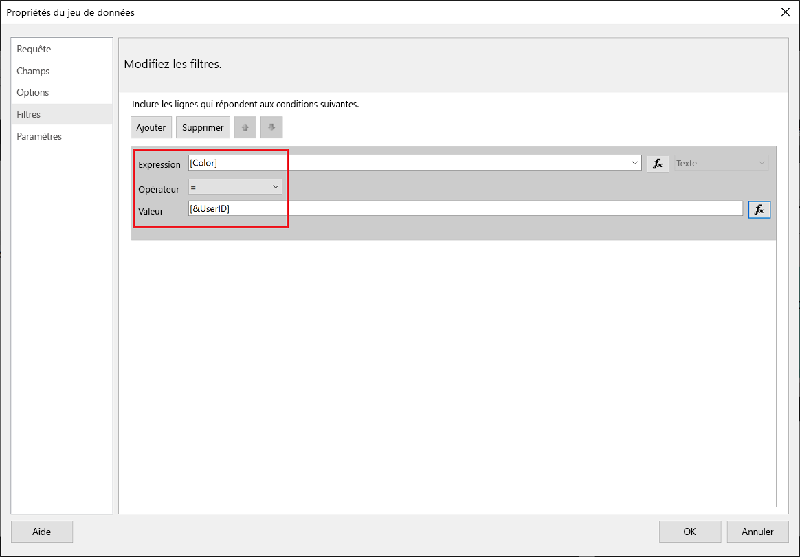
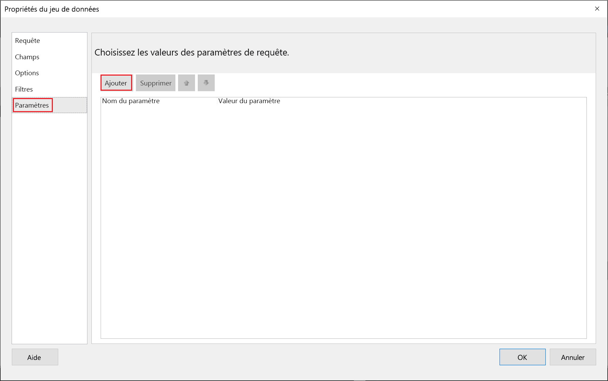
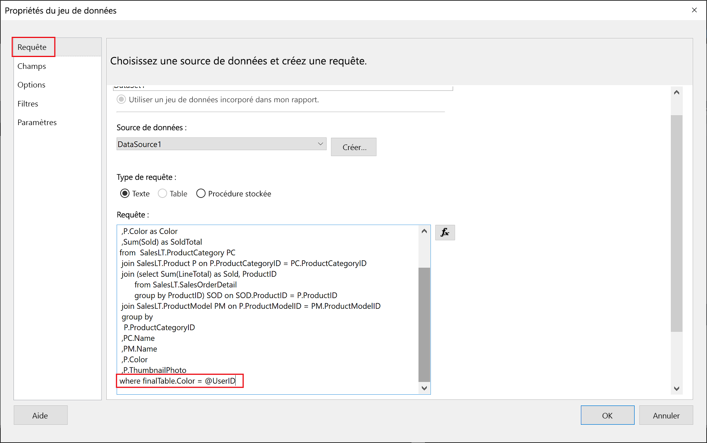

# <a name="implementing-row-level-security-in-embedded-paginated-reports-preview"></a>Implémentation de la sécurité au niveau des lignes dans des rapports paginés incorporés (préversion)

Quand vous incorporez un rapport paginé, vous pouvez contrôler les données qui sont affichées. Cela permet d’ajuster les informations affichées par utilisateur. Par exemple, si vous avez un rapport paginé Power BI qui inclut des résultats de ventes globaux, vous pouvez l’incorporer afin que seuls les résultats des ventes d’une certaine région soient disponibles.

Cette fonctionnalité offre un moyen sécurisé d’afficher un sous-ensemble des données, de façon à ne pas compromettre le reste des données. Elle ressemble à la fonctionnalité [Sécurité au niveau des lignes (RLS)](embedded-row-level-security.md), laquelle offre un moyen sécurisé d’afficher des données dans des rapports Power BI (qui ne sont pas paginés), des tableaux de bord, des vignettes et des jeux de données.  

> [!NOTE]
> Cette fonctionnalité fonctionne avec l’incorporation de rapports paginés pour les clients.

## <a name="configuring-a-parameter-to-filter-the-dataset"></a>Configuration d’un paramètre pour filtrer le jeu de données

Quand vous appliquez la sécurité au niveau des lignes à un rapport paginé Power BI, vous devez affecter un [paramètre](../../paginated-reports/report-builder-parameters.md) à l’attribut **UserID**. Ce paramètre limite les données extraites du jeu de données, avant l’incorporation du rapport.

Après avoir affecté le paramètre à **UserID**, utilisez l’API [GenerateTokenForCreateInGroup pour les rapports](https://docs.microsoft.com/rest/api/power-bi/embedtoken/reports_generatetokenforcreateingroup) afin d’obtenir le jeton d’incorporation.

## <a name="use-userid-as-a-filter-at-report-or-query-level"></a>Utiliser UserID comme filtre au niveau du rapport ou de la requête

Vous pouvez utiliser **UserId** comme *filtre* ou dans une *requête* sur la source de données dans [Power BI Report Builder](../../paginated-reports/report-builder-power-bi.md).

### <a name="using-the-filter"></a>Utilisation du filtre

1. Dans le volet gauche de la fenêtre **Propriétés du jeu de données**, sélectionnez **Filtre**.

    

2. Dans le menu déroulant **Expression**, sélectionnez le paramètre que vous voulez utiliser pour le filtrage des données.

     

3. Cliquez sur le bouton de fonction **Valeur**. 

    

4. Dans la fenêtre **Expression**, dans la liste **Catégorie**, sélectionnez **Champs prédéfinis**.

    

5. Dans la liste **Élément**, sélectionnez **UserID**, puis cliquez sur **OK**.

    

6. Dans la fenêtre **Propriétés du jeu de données**, vérifiez que l’expression est *votre paramètre sélectionné = UserID*, puis cliquez sur **OK**.

    

### <a name="using-a-query"></a>Utilisation d’une requête

1. Dans le volet gauche de la fenêtre **Propriétés du jeu de données**, sélectionnez **Paramètres**, puis cliquez sur **Ajouter**.

    

2. Dans la zone **Nom du paramètre**, entrez **\@UserID**, puis dans **Valeur du paramètre**, ajoutez **[&UserID]** .

     

3. Dans le volet gauche, sélectionnez **Requête**. Dans la Requête, ajoutez le paramètre **UserID** comme partie de votre requête, puis cliquez sur **OK**.
    > [!NOTE]
    > Dans la capture d’écran ci-dessous, le paramètre Color est utilisé comme exemple (whereFinalTable.Color = @UserID). Si nécessaire, il est possible de créer une requête plus complexe.

    

## <a name="passing-the-configured-parameter-using-the-embed-token"></a>Passage du paramètre configuré à l’aide du jeton d’incorporation

Lors de l’incorporation d’un rapport paginé pour vos clients, l’API [GenerateTokenForCreateInGroup pour les rapports](https://docs.microsoft.com/rest/api/power-bi/embedtoken/reports_generatetokenforcreateingroup) est utilisée pour obtenir le jeton d’incorporation. Ce jeton peut également être utilisé pour filtrer certaines des données extraites du rapport paginé.

Pour exposer uniquement certaines données, affectez au champ `username` les informations que vous voulez afficher. Par exemple, dans un rapport paginé qui a un paramètre Color (Couleur), si vous entrez *green* (vert) dans le champ `username`, le jeton d’incorporation limite les données incorporées afin d’afficher uniquement les données qui ont la valeur *green* (vert) dans la colonne Color.

```JSON
{
    "accessLevel": "View",
    "reportId": "cfafbeb1-8037-4d0c-896e-a46fb27ff229",
    "identities": [
            {
                    // Replace the 'username' with a paginated report parameter
                    "username":     "...",
                    "reports: [
                        "cfafbeb1-8037-4d0c-896e-a46fb27ff229"
                    ]
            }
    ]
}
```
