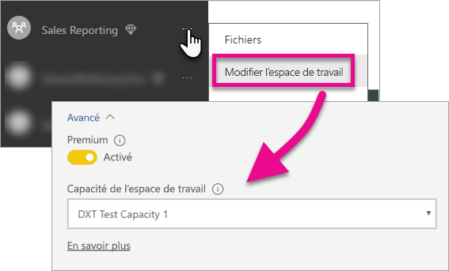

# Incorporer vos tableaux de bord, rapports et vignettes Power BI

Découvrez les étapes à suivre pour incorporer du contenu Power BI dans votre application.

Microsoft a [annoncé Power BI Premium](https://powerbi.microsoft.com/blog/microsoft-accelerates-modern-bi-adoption-with-power-bi-premium/), un nouveau modèle de gestion des licences basé sur la capacité, qui augmente la flexibilité en ce qui concerne la manière dont les utilisateurs consultent, partagent et distribuent du contenu. L’offre renforce également l’extensibilité et les performances du service Power BI. Il a également été annoncé que Power BI Embedded permet de créer une capacité dans Microsoft Azure. Power BI Embedded se concentre sur votre application et vos clients. 

Cet article est consacré à l’incorporation de contenu Power BI s’adressant à votre organisation et à vos clients. Les étapes à suivre sont semblables pour les deux scénarios. Les étapes spécifiques à l’incorporation pour vos clients sont signalées.

Pour que cela soit possible, vous devez suivre quelques étapes avec votre application. Nous allons examiner les étapes à suivre pour créer et utiliser du contenu incorporé dans votre application.

> [!NOTE]
> Les API Power BI font encore référence aux espaces de travail d’application en tant que groupes. Toutes les références à des groupes indiquent que vous travaillez avec des espaces de travail d’applications.

## Étape 1 : configurer votre environnement de développement d’analytique incorporée

Avant de commencer à incorporer des tableaux de bord et des rapports dans votre application, vous devez vérifier que votre environnement est configuré pour autoriser l’incorporation. Dans le cadre de la configuration, vous devez effectuer les opérations suivantes.

* [Vous assurer des disposer d’un locataire (ou client) Azure Active Directory](embedding-content.md#azureadtenant)
* [Créer votre compte Power BI Pro](embedding-content.md#proaccount)
* [Inscrire votre application Azure Active Directory et octroyer les autorisations correspondantes](embedding-content.md#appreg)

> [!NOTE]
> La capacité Power BI n’est pas nécessaire pour le développement de votre application. Les développeurs de l’application doivent disposer d’une licence Power BI Pro.

### Locataire Azure Active Directory

Pour incorporer des éléments à partir de Power BI, vous devez disposer d’un locataire Azure Active Directory (Azure AD). Au moins un utilisateur Power BI Pro doit être attribué à ce locataire. Vous devez également définir une application Azure AD au sein du locataire. Vous pouvez recourir à un locataire Azure AD existant ou créer un locataire dédié à l’incorporation.

Vous devez déterminer quel locataire utiliser si vous incorporez du contenu s’adressant à vos clients.

* Utiliser le locataire Power BI existant de votre entreprise ?
* Utiliser un locataire distinct pour votre application ?
* Utiliser un locataire distinct pour chaque client ?

Si vous ne voulez pas utiliser un locataire existant et décidez de créer un locataire pour votre application, ou pour chaque client, voir [Créer un locataire Azure Active Directory](create-an-azure-active-directory-tenant.md) ou [Obtenir un locataire Azure Active Directory](https://docs.microsoft.com/azure/active-directory/develop/active-directory-howto-tenant).

### Créer un compte d’utilisateur Power BI Pro

Un seul compte Power BI Pro suffit pour incorporer du contenu. Toutefois, vous pouvez créer plusieurs utilisateurs pour les accès spécifiques aux éléments. Vous pouvez par exemple attribuer les utilisateurs suivants à votre locataire.

Les comptes suivants doivent être disponibles dans votre locataire et une licence Power BI Pro doit leur être attribuée. Une licence Power BI Pro est requise pour utiliser des espaces de travail application au sein de Power BI.

#### Un utilisateur administrateur d’organisation ou de client

Si possible, le compte de votre application ne doit pas être l’utilisateur Administrateur général de votre organisation/locataire si vous incorporez du contenu pour vos clients. L’accès dont dispose le compte de l’application au sein de votre locataire est ainsi minimisé. De préférence, l’utilisateur administrateur doit être membre de tous les espaces de travail d’applications créés à des fins d’incorporation.

#### Des comptes pour les analystes devant créer du contenu

Il se peut que vous ayez plusieurs utilisateurs qui créent du contenu pour Power BI. Un compte Power BI Pro est requis pour chaque analyste qui crée et déploie du contenu dans Power BI.

#### Un compte utilisateur *principal* d’application si vous incorporez pour vos clients

Il s’agit du compte à utiliser par votre application lors de l’incorporation de contenu pour vos clients. Le scénario est généralement adapté aux applications d’éditeurs de logiciels indépendants. Le compte principal est vraiment le seul compte requis dont vous avez besoin au sein de votre organisation. Il peut également être utilisé en tant que compte d’administrateur et d’analyste, mais cela n’est pas recommandé. Le serveur principal de votre application stocke les informations d’identification de ce compte et les utilise pour acquérir le jeton d’authentification Azure AD à utiliser avec les API de Power BI. Ce compte est utilisé afin de générer le jeton d’incorporation de l’application pour vos clients.

Le compte principal est simplement un utilisateur standard avec une licence Power BI Pro que vous utilisez avec votre application. Le compte doit également être administrateur de l’espace de travail d’applications créé pour l’incorporation.

###  Inscription de l’application et octroi d’autorisations

Vous devez inscrire votre application avec Azure AD afin d’effectuer des appels d’API REST. Pour plus d’informations, consultez [Inscrire une application Azure AD pour incorporer du contenu Power BI](register-app.md).

### Créer des espaces de travail d’applications

Si vous incorporez des tableaux de bord et des rapports pour vos clients, ceux-ci doivent être placés dans un espace de travail d’applications. Le compte *principal* mentionné précédemment doit être administrateur de l’espace de travail d’applications.

[!INCLUDE [powerbi-service-create-app-workspace](../includes/powerbi-service-create-app-workspace.md)]

### Créer et charger vos rapports

Vous pouvez créer vos rapports et jeux de données à l’aide de Power BI Desktop, puis publier ces rapports dans un espace de travail d’applications. Pour publier les rapports dans un espace de travail d’applications, l’utilisateur final doit disposer d’une licence Power BI Pro.

## Étape 2 : incorporer votre contenu

Dans votre application, vous devez vous authentifier auprès de Power BI. Si vous incorporez du contenu pour vos clients, vous devez stocker les informations d’identification du compte *principal* dans votre application. Pour plus d’informations, consultez [Authentifier des utilisateurs et obtenir un jeton d’accès Azure AD pour votre application Power BI](get-azuread-access-token.md).

Une fois que vous êtes authentifié, dans votre application, utilisez les API REST Power BI et JavaScript pour incorporer des tableaux de bord et des rapports dans votre application. 

Pour l’**incorporation de contenu s’adressant à votre organisation**, consultez les procédures suivantes :

* [Intégrer un tableau de bord à une application](integrate-dashboard.md)
* [Intégrer une vignette à une application](integrate-tile.md)
* [Intégrer un rapport à une application](integrate-report.md)

Pour l’**incorporation avec vos clients**, qui est généralement utilisée par les éditeurs de logiciels indépendants, consultez les rubriques suivantes :

* [Intégrer un tableau de bord, une vignette ou un rapport dans votre application](embed-sample-for-customers.md)

Si l’incorporation s’adresse à vos clients, un jeton d’incorporation est requis. Pour plus d’informations, consultez [Générer des jetons](https://msdn.microsoft.com/library/mt784614.aspx).

## Étape 3 : promouvoir votre solution en mode de production

Le passage en production nécessite quelques étapes supplémentaires.

### Incorporation pour votre organisation

Si votre incorporation s’adresse à votre organisation, vous devez simplement leur indiquer comment accéder à votre application. 

Les utilisateurs de la version gratuite peuvent consommer du contenu incorporé à partir d’un espace de travail d’application (groupe), si cet espace de travail est soutenu par une capacité. Chaque utilisateur de la version gratuite doit être répertorié en tant que membre de l’espace de travail d’application (groupe). Sinon, le système génère une erreur « (401) Non autorisé ». Le tableau suivant répertorie les références Power BI Premium disponibles dans Office 365.

| Nœud de capacité | Nombre total de cœurs *(Serveur principal + serveur frontal)* | Cœurs du serveur principal | Cœurs du serveur frontal | Limites de connexions actives/DirectQuery | Rendus de pages au maximum aux heures de pointe |
| --- | --- | --- | --- | --- | --- |
| EM3 |4 cœurs virtuels |2 cœurs, 10 Go de RAM |2 cœurs | |601-1 200 |
| P1 |8 cœurs virtuels |4 cœurs, 25 Go de RAM |4 cœurs |30 par seconde |1 201-2 400 |
| P2 |16 cœurs virtuels |8 cœurs, 50 Go de RAM |8 cœurs |60 par seconde |2 401-4 800 |
| P3 |32 cœurs virtuels |16 cœurs, 100 Go de RAM |16 cœurs |120 par seconde |4 801-9 600 |

> [!NOTE]
> Pour acheter Power BI Premium, vous devez être Administrateur général ou Administrateur de facturation de votre locataire. Pour plus d’informations sur l’achat de Power BI Premium, consultez [Acheter Power BI Premium](../service-admin-premium-purchase.md).

### Incorporation pour vos clients

Si l’incorporation s’adresse à vos clients, vous devez effectuer les opérations suivantes.

* Si vous utilisez un locataire distinct pour le développement, vérifiez que vos espaces de travail d’applications ainsi que vos tableaux de bord et rapports sont disponibles dans votre environnement de production. Vérifiez que vous avez créé l’application dans Azure AD pour votre locataire de production et attribué les autorisations d’application appropriées comme indiqué à l’étape 1.
* Achetez une capacité adaptée à vos besoins. Vous pouvez utiliser le tableau ci-dessous pour identifier la référence SKU de la capacité Power BI Embedded dont vous avez besoin. Pour plus d’informations, consultez le [livre blanc Planification d’une capacité d’analytique incorporée](https://aka.ms/pbiewhitepaper). Lorsque vous êtes prêt, vous pouvez procéder à l’achat à partir du [portail Microsoft Azure](https://portal.azure.com). Pour plus d’informations sur la façon de créer une capacité Power BI Embedded, consultez [Créer une capacité Power BI Embedded dans le portail Azure](https://docs.microsoft.com/azure/power-bi-embedded/create-capacity).

| Nœud de capacité | Nombre total de cœurs *(Serveur principal + serveur frontal)* | Cœurs du serveur principal | Cœurs du serveur frontal | Limites de connexions actives/DirectQuery | Rendus de pages au maximum aux heures de pointe |
| --- | --- | --- | --- | --- | --- |
| A1 |1 cœur virtuel |.5 cœurs, 3 Go de RAM |.5 cœurs | 5 par seconde |1-300 |
| A2 |2 cœurs virtuels |1 cœur, 5 Go de RAM |1 cœur | 10 par seconde |301-600 |
| A3 |4 cœurs virtuels |2 cœurs, 10 Go de RAM |2 cœurs | 15 par seconde |601-1 200 |
| A4 |8 cœurs virtuels |4 cœurs, 25 Go de RAM |4 cœurs |30 par seconde |1 201-2 400 |
| A5 |16 cœurs virtuels |8 cœurs, 50 Go de RAM |8 cœurs |60 par seconde |2 401-4 800 |
| A6 |32 cœurs virtuels |16 cœurs, 100 Go de RAM |16 cœurs |120 par seconde |4 801-9 600 |

* Modifiez l’espace de travail d’applications et attribuez-le à une capacité sous Avancé.

    

* Déployez votre application mise à jour en production, puis commencez à incorporer des rapports et tableaux de bord Power BI.

## Paramètres d’administrateur

Les administrateurs globaux ou les administrateurs de service Power BI peuvent activer ou désactiver la possibilité d’utiliser les API REST pour un locataire. Les administrateurs Power BI peuvent définir ce paramètre pour toute l’organisation ou pour certains groupes de sécurité. Il est activé par défaut pour toute l’organisation. Son réglage s’effectue au moyen du [Portail d’administration Power BI](../service-admin-portal.md).

## Étapes suivantes

[Incorporation avec Power BI](embedding.md)  
[Comment migrer le contenu d’une collection d’espaces de travail Power BI Embedded vers Power BI](migrate-from-powerbi-embedded.md)  
[Qu’est-ce que Power BI Premium ?](../service-premium.md)  
[Acheter Power BI Premium](../service-admin-premium-purchase.md)  
[Dépôt Git d’API JavaScript](https://github.com/Microsoft/PowerBI-JavaScript)  
[Dépôt Git de C# pour Power BI ](https://github.com/Microsoft/PowerBI-CSharp)  
[Exemple de JavaScript incorporé](https://microsoft.github.io/PowerBI-JavaScript/demo/)  
[Livre blanc Planification d’une capacité d’analytique incorporée](https://aka.ms/pbiewhitepaper)  
[Livre blanc sur Power BI Premium](https://aka.ms/pbipremiumwhitepaper)  

D’autres questions ? [Essayez d’interroger la communauté Power BI](http://community.powerbi.com/)

