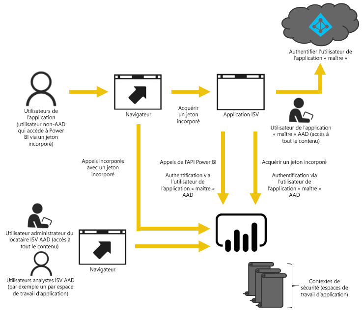

# Incorporation avec Power BI
Power BI fournit des API pour l’incorporation de vos tableaux de bord et rapports dans des applications. Les API Power BI offrent un ensemble cohérent de fonctionnalités et l’accès aux dernières fonctionnalités de Power BI telles que des tableaux de bord, des passerelles et des espaces de travail d’application lors de l’incorporation de contenu.

## Une seule API
Les deux principaux scénarios d’incorporation de contenu Power BI sont les suivants :  Incorporation pour les utilisateurs de votre organisation (disposant de licences Power BI) et incorporation pour les utilisateurs et les clients sans que ceux-ci aient besoin de licences Power BI. L’API REST Power BI est adaptée aux deux scénarios. 

Pour les clients et utilisateurs sans licence Power BI, vous pouvez incorporer des tableaux de bord et des rapports dans votre application personnalisée, en utilisant la même API pour votre organisation ou vos clients. Vos clients voient les données qui sont gérées par l’application. Et les utilisateurs Power BI de votre organisation possèdent des options supplémentaires pour afficher *leurs propres données* directement dans Power BI ou dans le contexte de l’application incorporée. Vous pouvez tirer pleinement parti des API JavaScript et REST pour vos besoins d’incorporation.

Reportez-vous à [Exemple de JavaScript incorporé](https://microsoft.github.io/PowerBI-JavaScript/demo/) pour consulter un exemple d’incorporation.

## Incorporation pour votre organisation
L’incorporation pour votre organisation vous permet d’étendre le service Power BI. Pour voir son contenu, l’utilisateur de votre application doit se connecter au service Power BI. Une fois qu’un utilisateur de votre organisation est connecté, il a uniquement accès aux tableaux de bord et rapports dont il est propriétaire ou qui ont été partagés avec lui dans le service Power BI. 

*Une application web interne, le composant WebPart SharePoint Online et l’intégration de Microsoft Teams sont des exemples d’incorporation pour votre organisation.*

Pour l’incorporation s’adressant à votre organisation, consultez les procédures suivantes :

* [Intégrer un tableau de bord à une application](integrate-dashboard.md)
* [Intégrer une vignette à une application](integrate-tile.md)
* [Intégrer un rapport à une application](integrate-report.md)

Les fonctionnalités en libre-service, telles que la modification ou l’enregistrement, sont disponibles par le bais de l’[API JavaScript](https://github.com/Microsoft/PowerBI-JavaScript) lors de l’incorporation relative aux utilisateurs Power BI.

## Incorporation pour vos clients
L’incorporation pour vos clients permet d’incorporer des tableaux de bord et des rapports pour les utilisateurs qui n’ont pas de compte Power BI. Vos clients n’ont pas à se soucier de Power BI. Au moins un compte Power BI Pro est nécessaire pour créer une application incorporée. Ce compte sert de compte principal pour votre application. Considérez-le comme un compte proxy. Ce compte Power BI Pro vous permet également de générer les jetons d’incorporation qui offrent un accès aux tableaux de bord et rapports au sein du service Power BI qui sont gérés ou possédés par votre application. 

*Un exemple d’incorporation pour vos clients est un application d’éditeur de logiciel indépendant vendue à d’autres sociétés.*

Pour incorporer des tableaux de bord, des rapports et des vignettes, vous pouvez utiliser les mêmes API que pour une incorporation s’adressant à votre organisation.

> [!IMPORTANT]
> Même si l’incorporation dépend du service Power BI, vos clients ne dépendent pas de Power BI. Ils n’ont pas besoin de s’inscrire à Power BI pour afficher le contenu incorporé dans votre application.
> 
> 

Lorsque vous êtes prêt à passer en mode de production, vous devez attribuer une capacité à votre espace de travail d’applications. Power BI Embedded, au sein de Microsoft Azure, offre une capacité à utiliser avec vos applications.

Pour plus d’informations sur l’incorporation, consultez [Comment incorporer vos tableaux de bord, rapports et vignettes Power BI](embedding-content.md).

Si vous utilisiez le service Collection d’espaces de travail Power BI au sein d’Azure, pour plus d’informations sur la façon de migrer votre contenu, consultez [Migrer le contenu du service Azure Collection d’espaces de travail Power BI](migrate-from-powerbi-embedded.md).

## Étapes suivantes
[Comment incorporer vos tableaux de bord, rapports et vignettes Power BI](embedding-content.md)  
[Comment migrer le contenu d’une collection d’espaces de travail Power BI Embedded vers Power BI](migrate-from-powerbi-embedded.md)  
[Qu’est-ce que Power BI Premium ?](../service-premium.md)  
[Dépôt Git d’API JavaScript](https://github.com/Microsoft/PowerBI-JavaScript)  
[Dépôt Git de C# pour Power BI ](https://github.com/Microsoft/PowerBI-CSharp)  
[Exemple de JavaScript incorporé](https://microsoft.github.io/PowerBI-JavaScript/demo/)  
[Livre blanc Planification d’une capacité d’analytique incorporée](https://aka.ms/pbiewhitepaper)  
[Livre blanc sur Power BI Premium](https://aka.ms/pbipremiumwhitepaper)  

D’autres questions ? [Essayez d’interroger la communauté Power BI](http://community.powerbi.com/)

