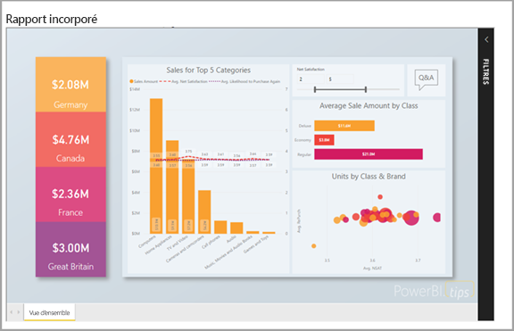

# Analytique intégrée avec Power BI

Le service Power BI (SaaS) et le service Power BI Embedded dans Azure (PaaS) comportent des API permettant d’incorporer des tableaux de bord et des rapports. Lors de l’incorporation de contenu, vous pouvez ainsi accéder aux dernières fonctionnalités Power BI, comme des tableaux de bord, des passerelles et des espaces de travail.

Vous pouvez passer par l’[outil de configuration de l’incorporation](https://aka.ms/embedsetup) pour démarrer et télécharger rapidement un exemple d’application.

Choisissez la solution qui vous convient :

* [L’incorporation pour votre organisation](embedding.md#embedding-for-your-organization) vous permet d’étendre le service Power BI. Pour ce faire, implémentez la solution [Incorporer pour votre organisation](https://aka.ms/embedsetup/UserOwnsData).
* L’[incorporation pour vos clients](embedding.md#embedding-for-your-customers) vous permet d’incorporer des tableaux de bord et des rapports pour des utilisateurs qui n’ont pas de compte Power BI. Pour ce faire, implémentez la solution [Incorporer pour vos clients](https://aka.ms/embedsetup/AppOwnsData).

## Utiliser des API

Les deux principaux scénarios d’incorporation de contenu Power BI sont les suivants :
- Incorporation pour les utilisateurs de votre organisation (disposant de licences Power BI). 
 
- Incorporation pour vos utilisateurs et vos clients sans avoir besoin de licences Power BI. 

L’[API REST Power BI](https://docs.microsoft.com/rest/api/power-bi/) est adaptée aux deux scénarios.

Pour les clients et utilisateurs sans licence Power BI, vous pouvez incorporer des tableaux de bord et des rapports dans votre application personnalisée, en utilisant la même API pour votre organisation ou vos clients. Vos clients voient les données gérées par l’application. En outre, les utilisateurs Power BI de votre organisation disposent d’options supplémentaires pour afficher *leurs données* directement dans Power BI ou dans le contexte de l’application incorporée. Vous pouvez tirer pleinement parti des API JavaScript et REST pour vos besoins d’incorporation.

Pour comprendre le fonctionnement de l’incorporation, consultez l’[exemple de code JavaScript incorporé](https://microsoft.github.io/PowerBI-JavaScript/demo/).

## Incorporation pour votre organisation

**L’incorporation pour votre organisation** vous permet d’étendre le service Power BI. Ce type d’incorporation exige que les utilisateurs de votre application se connectent au service Power BI pour afficher le contenu. Une fois qu’un utilisateur de votre organisation est connecté, il a accès seulement aux tableaux de bord et aux rapports dont il est propriétaire, ou que quelqu’un a partagés avec lui dans le service Power BI.

Des applications internes comme [SharePoint Online](https://powerbi.microsoft.com/blog/integrate-power-bi-reports-in-sharepoint-online/), l’[intégration de Microsoft Teams (vous devez disposer de droits d’administrateur)](https://powerbi.microsoft.com/blog/power-bi-teams-up-with-microsoft-teams/) et [Microsoft Dynamics](https://docs.microsoft.com/dynamics365/customer-engagement/basics/add-edit-power-bi-visualizations-dashboard) sont des exemples d’incorporation pour une entreprise.

Pour effectuer une incorporation pour votre organisation, consultez [Tutoriel : Incorporer du contenu Power BI dans une application pour votre organisation](embed-sample-for-your-organization.md).

Les fonctionnalités en libre-service, telles que la modification ou l’enregistrement, sont disponibles par le bais de [l’API JavaScript](https://github.com/Microsoft/PowerBI-JavaScript) lors de l’incorporation relative aux utilisateurs Power BI.

Vous pouvez passer par l’[outil de configuration de l’incorporation](https://aka.ms/embedsetup/UserOwnsData) pour démarrer et télécharger un exemple d’application qui vous guide dans l’intégration d’un rapport pour votre organisation.

## Incorporation pour vos clients

**L’incorporation pour vos clients** vous permet d’incorporer des tableaux de bord et des rapports pour des utilisateurs qui n’ont pas de compte Power BI. Ce type d’incorporation est également appelé *Power BI Embedded*.

[Power BI Embedded](azure-pbie-what-is-power-bi-embedded.md) est un service **Microsoft Azure** qui offre aux éditeurs de logiciels indépendants et aux développeurs la possibilité d’incorporer rapidement des visuels, des rapports et des tableaux de bord dans une application. Cette incorporation s’effectue par le biais d’un modèle basé sur les capacités et facturé à l’heure.

Power BI Embedded présente des avantages pour les éditeurs ISV, leurs développeurs et leurs clients. Par exemple, ils peuvent commencer à créer des visuels gratuitement avec Power BI Desktop. En réduisant leurs efforts de développement analytique de visuels, les éditeurs de logiciels indépendants (ISV) peuvent écourter le délai de mise sur le marché et se démarquer des concurrents grâce à des expériences avec les données qui font la différence. Ils peuvent aussi choisir de facturer un supplément pour la valeur ajoutée qu’ils créent avec l’analytique incorporée.

Avec Power BI Embedded, vos clients n’ont pas à se soucier de Power BI. Vous pouvez utiliser deux méthodes différentes pour créer une application incorporée :
- Compte Power BI Pro 
- Principal du service 

Le compte Power BI Pro sert de compte principal de votre application (vous pouvez le considérer comme un compte proxy). Ce compte vous permet de générer des jetons incorporés qui offrent un accès aux tableaux de bord et rapports Power BI de votre application.

Un [principal du service](embed-service-principal.md) peut incorporer du contenu Power BI dans une application en utilisant un jeton **application uniquement**. Il vous permet également de générer des jetons incorporés qui offrent un accès aux tableaux de bord et rapports Power BI de votre application.

Les développeurs utilisant Power BI Embedded peuvent consacrer du temps à la génération des fonctionnalités principales de leur application, au lieu de le passer à développer des visuels et de l’analytique. Ils peuvent rapidement répondre aux demandes de rapport et de tableau de bord des clients et incorporer facilement des SDK et des API entièrement documentés. En facilitant l’exploration de données dans les applications, les éditeurs indépendants de logiciels permettent aux clients de prendre des décisions rapides en fonction des données et du contexte, sur n’importe quel appareil.

> [!IMPORTANT]
> Même si l’incorporation nécessite le service Power BI, vos clients n’ont pas besoin de disposer d’un compte Power BI pour afficher le contenu incorporé de votre application. 

Quand vous êtes prêt à passer en mode de production, vous devez affecter une capacité dédiée à votre espace de travail. Power BI Embedded dans Microsoft Azure offre des [capacités dédiées](azure-pbie-create-capacity.md) à utiliser avec vos applications.

Pour obtenir des informations sur l’incorporation, consultez le [Guide pratique pour incorporer du contenu Power BI](embed-sample-for-customers.md).

## Étapes suivantes

Vous pouvez maintenant essayer incorporer du contenu de Power BI dans une application, ou essayer d’incorporer du contenu de Power BI pour vos clients.

> [!div class="nextstepaction"]
> [Incorporer pour votre organisation](embed-sample-for-your-organization.md)

> [!div class="nextstepaction"]
> [Qu’est-ce que Power BI Embedded ?](azure-pbie-what-is-power-bi-embedded.md)

> [!div class="nextstepaction"]
>[Incorporer pour vos clients](embed-sample-for-customers.md)

D’autres questions ? [Essayez d’interroger la communauté Power BI](https://community.powerbi.com/)
