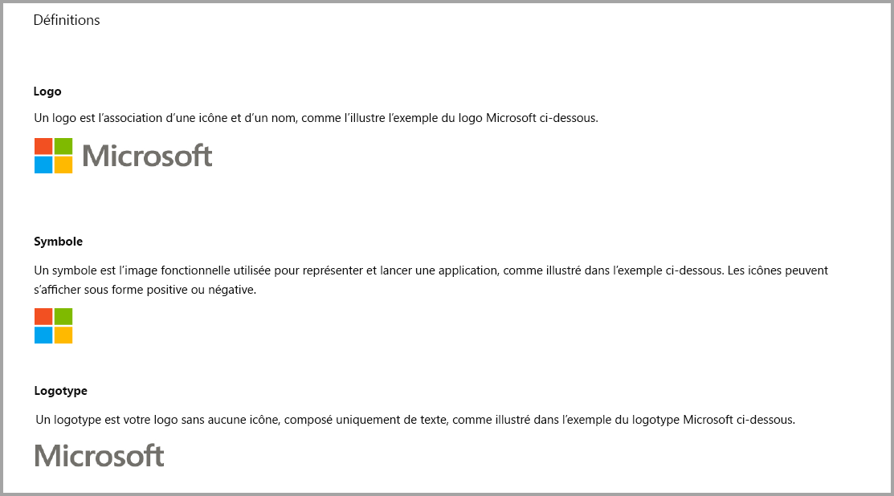
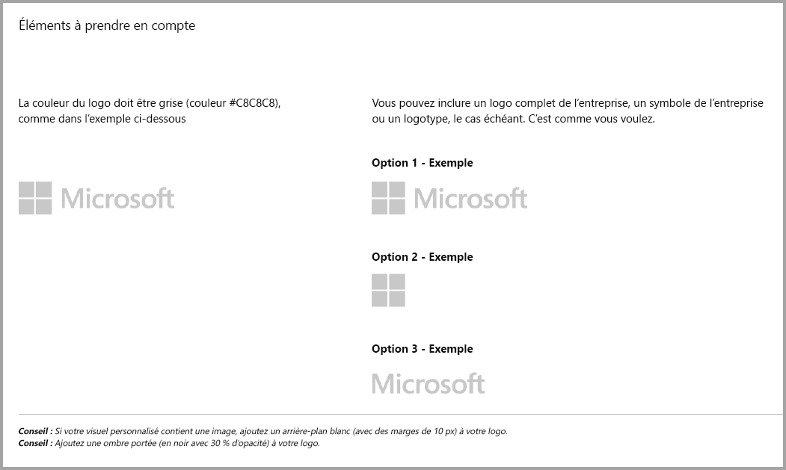
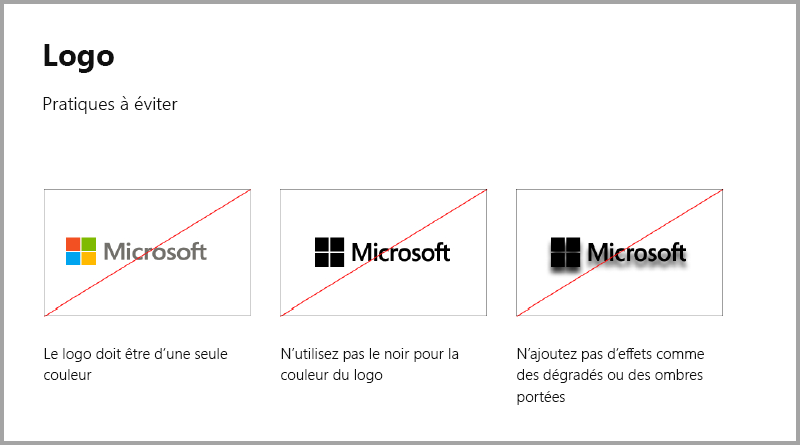
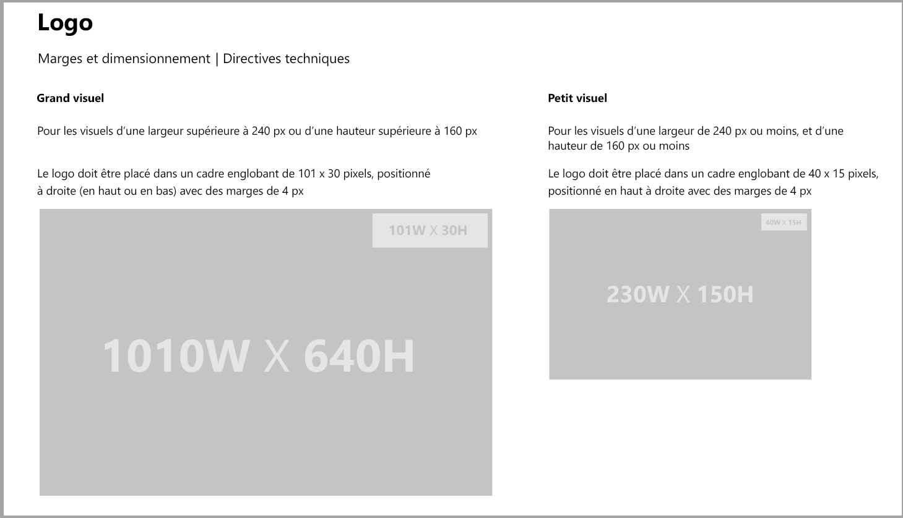
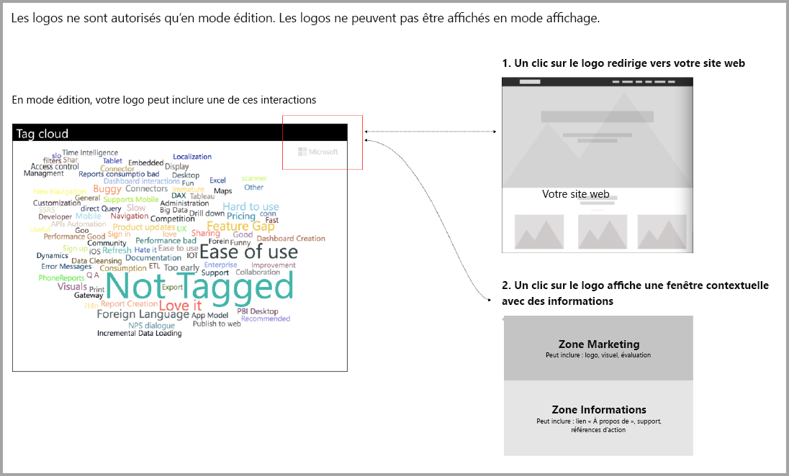

# Marche à suivre pour les visuels Power BI

## Marche à suivre pour les visuels Power BI avec des achats supplémentaires

Jusqu’à une date récente, la Place de marché (AppSource) acceptait uniquement les visuels Power BI gratuits. Cette stratégie a changé (décembre 2018), pour également vous permettre d’envoyer à AppSource des visuels ayant une étiquette de prix « Un autre achat peut être requis ». 

Les visuels de type « Un achat supplémentaire peut être requis » sont similaires aux compléments d’achat dans l’application (IAP) de l’Office Store. Les développeurs peuvent également faire certifier ces visuels une fois ceux-ci approuvés par l’équipe AppSource et après avoir vérifié qu’ils répondent aux critères de certification. Pour plus d’informations sur la configuration requise, consultez [Visuels personnalisés certifiés](../power-bi-custom-visuals-certified.md).

> [!NOTE]
> Pour que le visuel soit certifié, il ne doit pas accéder à des services externes ni à des ressources externes.

>[!IMPORTANT]  
> Si vous mettez à jour votre visuel en le faisant passer de gratuit à « Un autre achat peut être requis », les utilisateurs doivent recevoir le même niveau de fonctionnalités gratuites qu’avant la mise à jour. Vous pouvez compléter les fonctionnalités gratuites existantes par des fonctionnalités avancées payantes facultatives. Nous vous recommandons de soumettre les visuels IAP avec les fonctionnalités avancées en tant que nouveaux visuels au lieu de mettre à jour les fonctionnalités gratuites existantes.

## Qu’est-ce qui a changé dans le processus de soumission ?

Les développeurs chargent leurs visuels IAP sur AppSource par le biais du tableau de bord du vendeur, comme pour les visuels gratuits. Pour indiquer que le visuel soumis a des fonctionnalités IAP, les développeurs doivent indiquer « visuel avec achat dans l’application » dans les notes du tableau de bord du vendeur. Les développeurs doivent également fournir un jeton ou une clé de licence pour que l’équipe chargée de la validation puisse valider les fonctionnalités IAP. Une fois le visuel validé et approuvé, l’entrée AppSource correspondant au visuel IAP indique « Un autre achat peut être requis » sous les options de prix.

## Qu’est-ce qu’un visuel Power BI avec des fonctionnalités IAP ?

Un visuel IAP est un visuel **gratuit** qui offre des **fonctionnalités gratuites**. Il a également des fonctionnalités avancées pour le fonctionnement desquelles des frais supplémentaires peuvent être facturés. Dans la description du visuel, les développeurs doivent attirer l’attention des utilisateurs sur les fonctionnalités dont le fonctionnement nécessite des achats supplémentaires. À l’heure actuelle, Microsoft ne fournit pas d’API natives pour prendre en charge l’achat d’applications et de compléments.

Les développeurs peuvent utiliser n’importe quel système de paiement tiers pour ces achats. Pour plus d’informations, consultez notre [magasin de stratégies](https://docs.microsoft.com/office/dev/store/validation-policies#2-apps-or-add-ins-can-display-certain-ads).

> [!NOTE]
> Les filigranes ne sont pas autorisés sur les fonctionnalités gratuites ou les visuels gratuits. Les filigranes peuvent être employés uniquement dans les fonctionnalités payantes qui sont utilisées sans licence valide. Nous vous recommandons d’afficher une fenêtre contextuelle avec toutes les informations relatives à la licence si les fonctionnalités payantes avancées sont utilisées sans licence valide.  

## Instructions relatives aux logos

Cette section décrit les spécifications relatives à l’ajout de logos et de logotypes dans les visuels.

> [!IMPORTANT]
> Les logos sont autorisés en **mode d’édition uniquement**. Les logos ne peuvent **pas** être affichés en mode Affichage.

## Meilleures pratiques

### Page d’arrivée du visuel

Utilisez la page d’arrivée pour indiquer aux utilisateurs comment utiliser votre visuel et où se procurer la licence. N’incluez pas de vidéos qui se déclenchent automatiquement. Ajoutez uniquement des documents permettant d’améliorer l’expérience utilisateur, comme des informations ou des liens vers les détails d’achat de la licence et la manière d’utiliser les fonctionnalités IAP.

### Jeton et clé de licence

Par souci pratique pour l’utilisateur, ajoutez les champs liés au jeton ou à la clé de licence en haut du volet de format.

## FORUM AUX QUESTIONS

Pour plus d’informations sur les visuels, consultez [Foire aux questions sur les visuels avec achats supplémentaires](https://docs.microsoft.com/power-bi/power-bi-custom-visuals-faq#visuals-with-additional-purchases).

## Étapes suivantes

Découvrez comment publier votre visuel personnalisé sur [AppSource](office-store.md) pour que d’autres utilisateurs puissent le trouver et l’utiliser.
