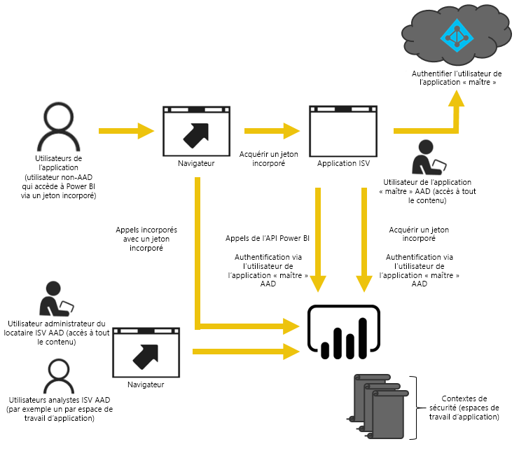
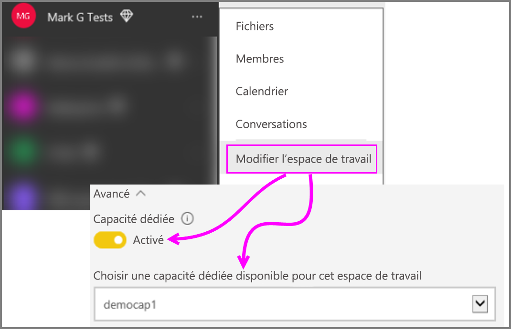

# Guide pratique pour migrer le contenu d’une collection d’espaces de travail Power BI vers Power BI Embedded
Découvrez comment migrer le contenu d’une collection d’espaces de travail Power BI vers Power BI Embedded, et comment tirer profit des nouvelles fonctionnalités d’incorporation dans les applications.

Microsoft [a récemment annoncé Power BI Embedded](https://powerbi.microsoft.com/en-us/blog/power-bi-embedded-capacity-based-skus-coming-to-azure/), un nouveau modèle de gestion des licences basé sur la capacité, qui apporte aux utilisateurs plus de flexibilité dans la consultation, le partage et la distribution de leur contenu. L’offre améliore également la scalabilité et les performances.

Avec Power BI Embedded, vous disposez d’une surface d’API, d’un ensemble cohérent de fonctionnalités et de l’accès aux dernières fonctionnalités de Power BI, telles que les tableaux de bord, les passerelles et les espaces de travail d’application, lors de l’incorporation de votre contenu. Plus tard, vous pourrez commencer à utiliser Power BI Desktop et passer au déploiement avec Power BI Embedded.

La collection d’espaces de travail Power BI actuelle reste encore disponible pendant une durée limitée. Les clients avec un contrat Entreprise gardent l’accès jusqu’à l’expiration de leur contrat. Les clients qui ont acquis la collection d’espaces de travail Power BI par le biais de canaux directs ou CSP conservent l’accès pendant un an à partir de la version en disponibilité générale de Power BI Embedded.  Cet article fournit des conseils pour la migration de la collection d’espaces de travail Power BI vers la nouvelle version de Power BI Embedded, et explique les changements que cette migration entraîne dans votre application.

> [!IMPORTANT]
> Il y a forcément une dépendance entre la migration et Power BI Embedded, mais il n’y a pas de dépendance entre Power BI et les utilisateurs de votre application qui utilisent un **jeton incorporé**. Ils n’ont pas besoin de s’inscrire à Power BI pour afficher le contenu incorporé dans votre application. Vous pouvez utiliser cette approche d’incorporation pour les utilisateurs de contenu incorporé non-Power BI.
> 

Avant de commencer la migration vers le nouveau Power BI Embedded, vous pouvez effectuer rapidement une procédure pas à pas pour configurer votre nouvel environnement Power BI Embedded avec [l’outil d’expérience d’intégration](https://aka.ms/embedsetup).

Choisissez la solution qui vous convient :
* **Incorporer pour vos clients** : si vous êtes intéressé par une solution où [l’application possède les données](https://aka.ms/embedsetup/AppOwnsData). [L’incorporation pour vos clients](embedding.md#embedding-for-your-customers) permet d’incorporer des tableaux de bord et des rapports pour les utilisateurs qui n’ont pas de compte Power BI. 
* **Incorporer pour votre organisation** : si vous êtes intéressé par une solution où [l’utilisateur possède les données](https://aka.ms/embedsetup/UserOwnsData). [L’incorporation pour votre organisation](embedding.md#embedding-for-your-organization) vous permet d’étendre le service Power BI.

## Préparer la migration
Pour préparer la migration d’une collection d’espaces de travail Power BI vers Power BI Embedded, vous devez effectuer quelques opérations. Vous allez avoir besoin d’un client disponible ainsi que d’un utilisateur détenteur d’une licence Power BI Pro.

1. Assurez-vous que vous avez accès à un client Azure Active Directory (Azure AD).
   
    Vous devez déterminer quelle configuration de locataire utiliser.
   
   * Utiliser le locataire Power BI existant de votre entreprise ?
   * Utiliser un locataire distinct pour votre application ?
   * Utiliser un locataire distinct pour chaque client ?
     
     Si vous décidez de créer un locataire pour votre application, ou pour chaque client, consultez [Créer un locataire Azure Active Directory](create-an-azure-active-directory-tenant.md) ou [Obtenir un locataire Azure Active Directory](https://docs.microsoft.com/azure/active-directory/develop/active-directory-howto-tenant).
2. Dans ce nouveau locataire, créez un utilisateur correspondant à votre compte d’application « principal ». Ce compte doit s’inscrire à Power BI et disposer d’une licence Power BI Pro.

## Comptes dans Azure AD
Les comptes suivants doivent exister au sein de votre client.

> [!NOTE]
> Ces comptes doivent disposer de licences Power BI Pro pour utiliser les espaces de travail d’applications.
>

1. Un utilisateur administrateur du client.
   
    Il est recommandé que cet utilisateur soit membre de tous les espaces de travail d’application créés à des fins d’incorporation.
2. Des comptes pour les analystes devant créer du contenu.
   
    Ces utilisateurs doivent être affectés aux espaces de travail d’application en fonction des besoins.
3. Un compte d’utilisateur *principal* d’applications, ou compte incorporé.
   
    Le serveur principal d’applications stocke les informations d’identification de ce compte et les utilise pour se procurer le jeton Azure AD à utiliser avec les API REST Power BI. Ce compte est utilisé pour générer le jeton incorporé pour l’application. Ce compte doit également être l’administrateur des espaces de travail d’applications créés pour l’incorporation.
   
> [!NOTE]
> Il s’agit simplement d’un compte d’utilisateur ordinaire de votre organisation qui sera utilisé à des fins d’incorporation.
>

## Inscription et autorisations d’application
Vous devez inscrire une application dans Azure AD et accorder certaines autorisations.

### Inscrire une application
Vous devez inscrire votre application avec Azure AD afin d’effectuer des appels d’API REST. Cela inclut l’accès au portail Azure pour appliquer une configuration supplémentaire en plus de la page d’inscription de l’application Power BI. Pour plus d’informations, consultez [Inscrire une application Azure AD pour incorporer du contenu Power BI](register-app.md).

Vous devez inscrire l’application à l’aide du compte **principal** d’application.

## Créer des espaces de travail d’application (facultatif)
Vous pouvez tirer parti des espaces de travail d’application pour mettre en place une meilleure isolation si votre application sert plusieurs clients. Les tableaux de bord et rapports sont ainsi isolés entre vos clients. Vous pouvez ensuite utiliser un compte Power BI par espace de travail d’application afin d’isoler davantage les expériences d’application entre vos clients.

> [!IMPORTANT]
> Vous ne pouvez pas utiliser un espace de travail personnel pour tirer parti de l’incorporation à des utilisateurs non-Power BI.
> 
> 

Pour créer un espace de travail d’applications dans Power BI, un utilisateur détenteur d’une licence Pro est requis. Par défaut, l’utilisateur de Power BI qui crée l’espace de travail de l’application est un administrateur de cet espace de travail.

> [!NOTE]
> Le compte *principal* d’application doit être un administrateur de l’espace de travail.
> 
> 

## Migration de contenu
La migration du contenu de vos collections d’espaces de travail vers Power BI Embedded peut être effectuée parallèlement à votre solution actuelle et ne demande aucun temps d’arrêt.

Un **outil de migration** est à votre disposition pour vous aider à copier le contenu de collections d’espaces de travail Power BI vers Power BI Embedded. Celui-ci est particulièrement utile si votre contenu est volumineux. Pour plus d’informations, consultez [Outil de migration Power BI Embedded](migrate-tool.md).

La migration de contenu repose principalement sur deux API.

1. Download PBIX (Télécharger PBIX) : cette API permet de télécharger les fichiers PBIX qui ont été chargés dans Power BI après octobre 2016.
2. Import PBIX (Importer PBIX) : cette API charge n’importe quel fichier PBIX dans Power BI.

Pour obtenir des extraits de code associés, consultez [Extraits de code pour migrer du contenu à partir d’une collection d’espaces de travail Power BI](migrate-code-snippets.md).

### Types de rapports
Il existe différents types de rapports, chacun nécessitant un flux de migration différent.

#### Rapport et jeu de données en cache
Les jeux de données en cache font référence aux fichiers PBIX comportant des données importées, par opposition à une connexion directe ou DirectQuery.

**Flux**

1. Appelez l’API Download PBIX pour procéder au téléchargement à partir de l’espace de travail PaaS.
2. Enregistrez le fichier PBIX.
3. Appelez l’API Import PBIX pour procéder à l’importation vers l’espace de travail SaaS.

#### Rapport et jeu de données DirectQuery
**Flux**

1. Appelez GET https://api.powerbi.com/v1.0/collections/{collection_id}/workspaces/{wid}/datasets/{dataset_id}/Default.GetBoundGatewayDataSources et enregistrez la chaîne de connexion reçu.
2. Appelez l’API Download PBIX pour procéder au téléchargement à partir de l’espace de travail PaaS.
3. Enregistrez le fichier PBIX.
4. Appelez l’API Import PBIX pour procéder à l’importation vers l’espace de travail SaaS.
5. Mettre à jour la chaîne de connexion en appelant - POST  https://api.powerbi.com/v1.0/myorg/datasets/{dataset_id}/Default.SetAllConnections
6. Obtenir l’ID de GW et l’ID de la source de données en appelant - GET https://api.powerbi.com/v1.0/myorg/datasets/{dataset_id}/Default.GetBoundGatewayDataSources
7. Mettre à jour les informations d’identification de l’utilisateur en appelant - PATCH https://api.powerbi.com/v1.0/myorg/gateways/{gateway_id}/datasources/{datasource_id}

#### Jeux de données et rapports obsolètes
Il s’agit des jeux de données/rapports créés avant octobre 2016. L’API Download PBIX ne prend pas en charge les fichiers PBIX chargés avant octobre 2016

**Flux**

1. Procurez-vous le fichier PBIX à partir de votre environnement de développement (votre contrôle de code source interne).
2. Appelez l’API Import PBIX pour procéder à l’importation vers l’espace de travail SaaS.

#### Jeu de données et rapport de transmission
L’API Download PBIX ne prend pas en charge les jeux de données *API de transmission*. Les données des jeux de données API de transmission ne peuvent pas être transférées de PaaS vers SaaS.

**Flux**

1. Appelez l’API « Create dataset » (Créer un jeu de données) avec le jeu de données Json pour créer un jeu de données dans l’espace de travail SaaS.
2. Régénérez le rapport pour le jeu de données créé*.

Vous pouvez migrer le rapport de l’API d’envoi (push) de PaaS vers SaaS en essayant les solutions de contournement suivantes.

1. Chargement de PBIX factices vers l’espace de travail PaaS.
2. Clonez le rapport de l’API de transmission et liez-le au PBIX factice de l’étape 1.
3. Téléchargez le rapport de l’API de transmission avec le PBIX factice.
4. Chargez le PBIX factice dans votre espace de travail SaaS.
5. Créez le jeu de données de transmission dans votre espace de travail SaaS.
6. Reliez le rapport au jeu de données de l’API de transmission.

## Créer et charger de nouveaux rapports
En plus du contenu que vous avez migré à partir de la collection d’espaces de travail Power BI, vous pouvez créer vos rapports et jeux de données à l’aide de Power BI Desktop, puis publier ces rapports dans un espace de travail d’applications. Pour publier les rapports dans un espace de travail d’applications, l’utilisateur final doit disposer d’une licence Power BI Pro.

## Régénérer votre application
1. Pour utiliser les API REST de Power BI et l’emplacement du rapport dans powerbi.com, vous devez modifier application.
2. Régénérez votre authentification AuthN/AuthZ à Power BI en utilisant le compte *principal* pour votre application. Vous pouvez tirer parti de l’utilisation d’un [jeton incorporé](https://docs.microsoft.com/rest/api/power-bi/embedtoken) pour autoriser cet utilisateur à agir au nom d’autres utilisateurs.
3. Incorporez vos rapports de powerbi.com dans votre application.

## Mapper vos utilisateurs à un utilisateur de Power BI
Dans votre application, vous devez mapper les utilisateurs que vous gérez au sein de ce celle-ci aux informations d’identification d’un compte Power BI *master* pour les besoins de votre application. Les informations d’identification de ce compte Power BI *master* sont stockées dans votre application et utilisées pour créer des jetons incorporés.

## Que faire lorsque vous êtes prêt pour la production
Lorsque vous êtes prêt à passer à la production, vous devez procéder comme suit.

* Si vous utilisez un locataire distinct pour le développement, veillez à ce que vos espaces de travail d’applications ainsi que vos tableaux de bord et rapports soient disponibles dans votre environnement de production. Vérifiez également que vous avez créé l’application dans Azure AD pour votre locataire de production et attribué les autorisations d’application appropriées comme indiqué à l’étape 1.
* Achetez une capacité adaptée à vos besoins. Pour mieux comprendre de quelle quantité et de quel type de capacité vous avez besoin, consultez le [Livre blanc sur la planification de la capacité d’analytique pour Power BI Embedded](https://aka.ms/pbiewhitepaper). Vous pouvez [acheter de la capacité](https://portal.azure.com/#create/Microsoft.PowerBIDedicated) dans Azure.
* Modifiez l’espace de travail d’applications et attribuez-le à une capacité Premium sous Avancé.
 
    
    
* Déployez votre application mise à jour dans votre environnement de production, puis commencez à incorporer des rapports à partir de Power BI Embedded.

## Après la migration
Vous devez effectuer un peu de nettoyage dans Azure.

* Supprimez tous les espaces de travail de la solution déployée au sein de la collection d’espaces de travail Power BI incorporée dans Azure.
* Supprimez toutes les collections d’espaces de travail existant dans Azure.

## Étapes suivantes
[Incorporation avec Power BI](embedding.md)  
[Outil de migration des collections d’espaces de travail Power BI](migrate-tool.md)  
[Extraits de code pour migrer du contenu à partir d’une collection d’espaces de travail Power BI](migrate-code-snippets.md)  
[Comment incorporer vos tableaux de bord, rapports et vignettes Power BI](embedding-content.md)  
[Qu’est-ce que Power BI Premium ?](../service-premium.md)  
[Dépôt Git d’API JavaScript](https://github.com/Microsoft/PowerBI-JavaScript)  
[Dépôt Git de C# pour Power BI ](https://github.com/Microsoft/PowerBI-CSharp)  
[Exemple de JavaScript incorporé](https://microsoft.github.io/PowerBI-JavaScript/demo/)  
[Livre blanc sur la planification de la capacité d’analytique des collections d’espaces de travail](https://aka.ms/pbiewhitepaper)  
[Livre blanc sur Power BI Premium](https://aka.ms/pbipremiumwhitepaper)  

D’autres questions ? [Essayez d’interroger la communauté Power BI](http://community.powerbi.com/)