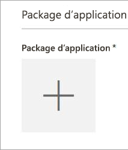
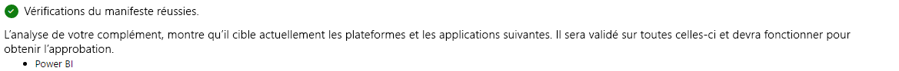
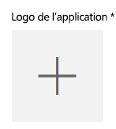

# Publier des visuels personnalisés dans l’Office Store
Découvrez comment vous pouvez publier votre visuel personnalisé dans l’Office Store pour que d’autres utilisateurs puissent le trouver et l’utiliser.

Une fois que vous avez créé votre visuel personnalisé, vous pouvez le publier sur l’Office Store pour que les utilisateurs puissent le trouver et l’utiliser. Avant cela, vous devez effectuer quelques étapes de préparation. Pour plus d’informations sur la création d’un visuel personnalisé, consultez [Créer des visuels personnalisés à l’aide des outils de développement](../service-custom-visuals-getting-started-with-developer-tools.md).

Qu’est-ce que l’Office Store ? Il s’agit simplement de l’endroit où vous pouvez rechercher des applications (compléments) pour vos logiciels Office 365. L’[Office Store](https://appsource.microsoft.com/marketplace/apps?product=power-bi-visuals) connecte des millions d’utilisateurs d’Office 365 à des solutions qui les aident à effectuer leur travail de façon plus efficace, intelligente et élaborée.

## Préparation de la soumission de votre visuel personnalisé
Une fois que vous avez terminé de coder et de tester votre visuel personnalisé et que vous l’avez empaqueté dans un fichier pbiviz, vous devez également préparer les éléments suivants pour la soumission.

| Élément | Obligatoire | Description |
| --- | --- | --- |
| Le package Pbiviz contient toutes les métadonnées requises |Oui |Nom du visuel Nom d’affichage GUID Version Description Nom et e-mail de l’auteur |
| Exemple de fichier de rapport .pbix |Oui |Pour présenter votre visuel, vous devez en démontrer son utilité aux utilisateurs. Vous devez insister sur la valeur que le visuel apporte à l’utilisateur et donner des exemples d’utilisation, des options de mise en forme, etc. Vous pouvez également ajouter une page de *conseils* à la fin. Dans cette page, donnez quelques conseils et astuces, expliquez ce qu’il faut éviter de faire et donnez d’autres indications. |
| Icône |Oui |Vous devez inclure le logo du visuel personnalisé qui s’affiche sur la page principale de l’Office Store. Les formats .png, .jpg, .jpeg et .gif sont disponibles. Les dimensions doivent être précisément de 300 pixels (largeur) x 300 pixels (hauteur). La taille de fichier ne peut pas être supérieure à 512 Ko. |
| Captures d’écran |Oui |Vous devez fournir au moins une capture d’écran. Les formats .png, .jpg, .jpeg et .gif sont disponibles. La taille doit être précisément de 1 366 px (largeur) sur 768 px (hauteur). Elle ne peut pas dépasser 1 024 Ko. *Pour une utilisation optimale, ajoutez des bulles de texte pour expliquer la proposition de valeur des principales fonctionnalités affichées dans chaque capture d’écran.* |
| Lien vers le support |Oui |Fournissez l’URL à laquelle les clients peuvent se connecter s’ils rencontrent des problèmes avec votre visuel. Le format de votre URL doit inclure https:// ou http://. |
| Lien vers le document sur la confidentialité |Oui |Indiquez un lien vers la politique de confidentialité pour les clients qui utilisent votre visuel. Le format de votre lien doit inclure https:// ou http://. |
| Contrat de Licence Utilisateur Final (CLUF) |Oui |Vous devez charger un fichier CLUF. Il peut s’agir de votre propre fichier CLUF ou du fichier CLUF par défaut de l’Office Store pour les visuels personnalisés Power BI. Pour utiliser le fichier CLUF par défaut, collez l’URL suivante dans la boîte de dialogue de téléchargement du fichier « Contrat de Licence Utilisateur Final » du tableau de bord vendeur : [https://visuals.azureedge.net/app-store/Power BI - Default Custom Visual EULA.pdf](https://visuals.azureedge.net/app-store/Power BI - Default Custom Visual EULA.pdf). |
| Lien vers la vidéo |Non |Pour augmenter l’intérêt porté par les utilisateurs à votre visuel personnalisé, nous vous conseillons de fournir un lien vers une vidéo de présentation de votre visuel. Le format de votre URL doit inclure https:// ou http://. |
| Dépôt GitHub |Non |Il est préférable d’avoir un lien valide et public vers un dépôt [GitHub](https://www.github.com) avec les sources de votre visuel et des exemples de données pour permettre aux autres développeurs de fournir des commentaires et de proposer des améliorations pour votre code. |

## Soumission à Power BI
La soumission commence par l’envoi d’un e-mail à l’équipe de soumission des visuels personnalisés Power BI. Envoyez un e-mail à l’adresse [pbivizsubmit@microsoft.com](mailto:pbivizsubmit@microsoft.com).

Joignez le fichier .pbiviz et l’exemple de fichier de rapport .pbix à votre e-mail. Dans sa réponse, l’équipe Power BI vous donne des instructions et un fichier XML de package d’application à charger. Ce package d’application XML est requis pour soumettre votre visuel par le biais du Centre pour développeurs Office.

> [!NOTE]
> Pour améliorer la qualité et faire en sorte que les rapports existants ne soient pas endommagés, 2 semaines supplémentaires sont nécessaires pour que les mises à jour apportées aux visuels existants atteignent l’environnement de production après l’approbation dans l’Office Store.
> 
> 

## Soumission à l’Office Store
Une fois que l’équipe Power BI vous a envoyé le XML de package d’application, accédez au [Centre pour développeurs Office](https://sellerdashboard.microsoft.com/Application/Summary) pour soumettre votre visuel à l’Office Store.

> [!NOTE]
> Vous devez avoir un compte de développeur Office valide pour vous connecter au [Centre pour développeurs Office](https://dev.office.com/). Un compte de développeur Office doit être un compte Microsoft (Live ID, par exemple hotmail.com ou outlook.com).
> 
> [!IMPORTANT]
> Vous devez envoyer un e-mail avec les fichiers .pbiviz et .pbix à l’équipe Power BI avant la soumission à l’Office Store. L’équipe Power BI peut ainsi charger les fichiers sur le serveur de partage public. Sinon, l’Office Store ne peut pas récupérer les fichiers. Vous devez envoyer les fichiers à chaque soumission d’un nouveau visuel, mise à jour d’un visuel existant et correctif apporté aux soumissions rejetées par l’Office Store.
> 
> 

### Processus de soumission du visuel
Suivez les étapes ci-dessous pour terminer la soumission.

1. Sélectionnez **Ajouter une nouvelle application**.
   
    
2. Sélectionnez **Visuel personnalisé Power BI**, puis **Suivant**.
3. Sélectionnez le signe **+** sous **Package d’application** et sélectionnez le fichier XML de package d’application que vous avez reçu de l’équipe Power BI à partir de la boîte de dialogue Ouvrir un fichier.
   
    
4. Vous devez recevoir une approbation indiquant qu’il s’agit d’un package d’application Power BI valide.
   
    
5. Remplissez les détails dans la fenêtre **Informations générales**.
   
   * *Submission title (Titre de la soumission) :* indiquez la façon dont votre soumission sera nommée dans le centre de développement.
   * *Version :* votre numéro de version est rempli automatiquement à partir du package d’application du complément.
   * *Date de sortie :* sélectionnez la date de publication de votre application dans l’Office Store. Si vous choisissez une date ultérieure, votre application n’est pas disponible dans le Store jusqu’à cette date.
   * *Catégorie :* la première catégorie est automatiquement remplie comme suit : « Visualisation de données + BI ». C’est la manière dont tous les visuels personnalisés Power BI sont marqués. Vous pouvez fournir jusqu’à 2 catégories supplémentaires afin que les utilisateurs trouvent facilement votre visuel.
   * *Remarques relatives au test (facultatives) :* cette option est utile si vous souhaitez fournir des instructions pour les testeurs Microsoft
   * *Mon application fait appel à des solutions de chiffrement, prend en charge, contient ou utilise ce type de technologie :* gardez cette option désélectionnée.
   * *Ajouter ce complément au catalogue des compléments Office sur iPad :* gardez cette option désélectionnée.
6. Chargez le logo de votre visuel en sélectionnant le signe **+** sous **Logo de l’application**. Sélectionnez ensuite le fichier d’icône dans la boîte de dialogue Ouvrir un fichier. .png, .jpg, .jpeg et .gif sont les formats autorisés. Les dimensions doivent être précisément de 300 pixels (largeur) x 300 pixels (hauteur) et la taille du fichier ne peut pas être supérieure à 512 Ko.
   
    
7. Indiquez les informations requises dans **Documents de support**.
   
   * Lien vers les documents de support
   * Lien vers le document sur la confidentialité
   * Lien vers la vidéo
   * Contrat de Licence Utilisateur Final (CLUF)
     
       Vous devez charger un fichier CLUF. Il peut s’agir de votre propre fichier CLUF ou du fichier CLUF par défaut de l’Office Store pour les visuels personnalisés Power BI. Pour utiliser le fichier CLUF par défaut, collez l’URL suivante dans la boîte de dialogue de téléchargement du fichier « Contrat de Licence Utilisateur Final » du tableau de bord vendeur : [https://visuals.azureedge.net/app-store/Power BI - Default Custom Visual EULA.pdf](https://visuals.azureedge.net/app-store/Power BI - Default Custom Visual EULA.pdf).
8. Sélectionnez **Suivant** pour accéder à la page **Détails**.
9. Sélectionnez **Langue**, puis choisissez une langue dans la liste.
   
    
10. Remplissez la description.
    
    * *Nom de l’application (pour cette langue) :* indiquez le nom de votre application tel qu’il doit apparaître dans l’Office Store.
    * *Description courte :* entrez une courte description de votre application (100 caractères maximum), telle qu’elle doit apparaître dans l’Office Store. Cette description s’affiche dans les pages de niveau supérieur avec le logo. Vous pouvez utiliser la description du package pbiviz.
    * *Description longue :* fournissez une description plus détaillée de l’application. Les clients pourront la voir dans la page de détails de votre application. Si vous souhaitez laisser la communauté améliorer votre visuel en le rendant open source, fournissez le lien vers le référentiel public, en l’occurrence GitHub.
11. Chargez au moins une capture d’écran. Les formats .png, .jpg, .jpeg et .gif sont disponibles. La taille doit être précisément de 1 366 px (largeur) sur 768 px (hauteur). Elle ne peut pas dépasser 1 024 Ko. *Pour une utilisation optimale, ajoutez des bulles de texte pour expliquer la proposition de valeur des principales fonctionnalités affichées dans chaque capture d’écran.*
12. Si vous souhaitez ajouter d’autres langues, sélectionnez **Ajouter une langue** et répétez les étapes 10 et 11. Ajouter d’autres langues aide vos utilisateurs à afficher les détails du visuel personnalisé dans leur propre langue. Pour les langues non répertoriées, la première langue sélectionnée s’affiche par défaut.
13. Lorsque vous avez terminé l’ajout de langues, sélectionnez **Suivant** pour passer à la page **Bloquer l’accès**.
14. Si vous souhaitez empêcher les clients de pays ou régions spécifiques d’acheter votre application, activez la case à cocher et choisissez une option dans la liste.
15. Sélectionnez **Suivant** pour accéder à la page **Tarification**.
16. Actuellement, seuls les visuels *gratuits* sont pris en charge et les achats supplémentaires au sein du visuel (achat dans l’application) ne sont pas autorisés. Sélectionnez **Cette application est gratuite**. 
    
    > [!NOTE]
    > Si vous sélectionnez une autre option ou que vous avez inséré du contenu de type Achat dans l’application dans le visuel soumis, la soumission est rejetée.
    > 
    > 
17. Vous pouvez maintenant sélectionner « Enregistrer comme brouillon » et soumettre le visuel ultérieurement, ou choisir **Soumettre pour approbation** pour soumettre le visuel personnalisé à l’Office Store.

## Suivi de l’utilisation et de l’état de la soumission
Vous pouvez passer en revue les [stratégies de validation](https://dev.office.com/officestore/docs/validation-policies#13-power-bi-custom-visuals).

Après l’envoi de la soumission, vous pouvez afficher son état dans le [tableau de bord de l’application](https://sellerdashboard.microsoft.com/Application/Summary/).

## Certifier votre visuel
Une fois votre visuel créé, vous pouvez éventuellement le faire certifier. Cela signifie qu’il peut s’exécuter dans le service Power BI et être utilisé avec d’autres fonctionnalités du service telles que l’export vers PowerPoint. Pour plus d’informations, consultez la page [*Certification* d’un visuel personnalisé](../power-bi-custom-visuals-certified.md).

## Étapes suivantes
[Créer des visuels personnalisés à l’aide des outils de développement](../service-custom-visuals-getting-started-with-developer-tools.md)  
[Télécharger et utiliser les visuels personnalisés de l’Office Store](../service-custom-visuals-office-store.md)  
[Visualisations dans Power BI](../power-bi-report-visualizations.md)  
[Visualisations personnalisées dans Power BI](../power-bi-custom-visuals.md)  
[*Certification* d’un visuel personnalisé](../power-bi-custom-visuals-certified.md)

D’autres questions ? [Essayez d’interroger la communauté Power BI](http://community.powerbi.com/)

