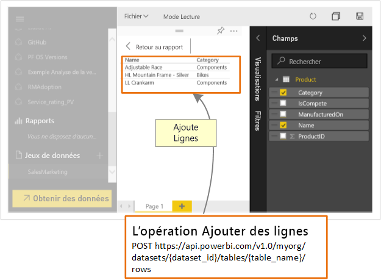

# Comment les développeurs peuvent-ils se servir de l’API Power BI ?

Power BI présente des tableaux de bord interactifs, qui peuvent être créés et mis à jour à partir de différentes sources de données en temps réel. À l’aide d’un langage de programmation qui prend en charge les appels REST, vous pouvez créer des applications qui s’intègrent à un tableau de bord Power BI en temps réel. Vous pouvez également intégrer des vignettes et des rapports Power BI à des applications.

Les développeurs peuvent également générer leurs propres visualisations de données qui peuvent être utilisées dans des tableaux de bord et rapports interactifs.

Voici quelques opérations possibles avec les API Power BI.

| **Pour ce faire** | **Accédez ici** |
| --- | --- |
| Incorporer des tableaux de bord, des rapports et des vignettes pour les utilisateurs Power BI et non-Power BI (l’application est propriétaire des données) |[Comment incorporer vos tableaux de bord, rapports et vignettes Power BI](embedding-content.md) |
| Étendre un workflow d’entreprise existant pour transmettre des données clés à un tableau de bord Power BI. |[Transmettre des données à un tableau de bord](walkthrough-push-data.md) |
| Authentifiez-vous sur Power BI. |[S’authentifier sur Power BI](get-azuread-access-token.md) |
| Créer un élément visuel personnalisé. |[Développement d’un visuel personnalisé Power BI](custom-visual-develop-tutorial.md) |

> [!NOTE]
> Les API Power BI font encore référence aux espaces de travail d’application en tant que groupes. Toutes les références à des groupes indiquent que vous travaillez avec des espaces de travail d’applications.

## Exemples pour les développeurs de Power BI

Les exemples des développeurs de Power BI comprennent des éléments pour l’incorporation des tableaux de bord, des rapports et des vignettes.

[Exemples des développeurs Power BI](https://github.com/Microsoft/PowerBI-Developer-Samples)

* Les exemples **App Owns Data** sont destinés à l’incorporation avec des utilisateurs non-Power BI.
* Les exemples **User Owns Data** sont destinés à l’incorporation avec des utilisateurs Power BI.

## Dépôts GitHub

* [Kit de développement logiciel (SDK) .NET](https://github.com/Microsoft/PowerBI-CSharp)
* [API JavaScript](https://github.com/Microsoft/PowerBI-JavaScript)
* [Visuels personnalisés](https://github.com/Microsoft/PowerBI-visuals)

## Outils développeurs

Voici les outils que vous pouvez utiliser pour faciliter le développement d’éléments Power BI.

Vous pouvez passer par l’[outil de configuration de l’incorporation](https://aka.ms/embedsetup) pour démarrer et télécharger rapidement un exemple d’application sur l’incorporation de contenu Power BI.

Choisissez la solution qui vous convient :

* [L’incorporation pour vos clients](embedding.md#embedding-for-your-customers) permet d’incorporer des tableaux de bord et des rapports pour les utilisateurs qui n’ont pas de compte Power BI. Exécutez la solution [Incorporer pour vos clients](https://aka.ms/embedsetup/AppOwnsData).

* [L’incorporation pour votre organisation](embedding.md#embedding-for-your-organization) vous permet d’étendre le service Power BI. Exécutez la solution [Incorporer pour votre organisation](https://aka.ms/embedsetup/UserOwnsData).

Pour obtenir un exemple complet d’utilisation de l’API JavaScript, vous pouvez utiliser [l’outil Playground](https://microsoft.github.io/PowerBI-JavaScript/demo). Cet outil est un moyen rapide de jouer avec différents types d’exemples Power BI Embedded. Des informations supplémentaires sur l’API JavaScript sont également disponibles sur la page du [wiki PowerBI-JavaScript](https://github.com/Microsoft/powerbi-javascript/wiki).

## Transmettre des données à Power BI

Vous pouvez utiliser l’API Power BI pour envoyer des données dans un jeu de données. Cette fonctionnalité vous permet d’ajouter une ligne à une table à l’intérieur d’un jeu de données. Les nouvelles données peuvent ensuite être reflétées dans des vignettes sur un tableau de bord et dans des visuels à l’intérieur de votre rapport.

## Étapes suivantes

[Transmission de données à un jeu de données](walkthrough-push-data.md)  
[Développement d’un visuel personnalisé Power BI](custom-visual-develop-tutorial.md)  
[Référence de l’API REST de Power BI](https://docs.microsoft.com/rest/api/power-bi/)  

D’autres questions ? [Essayez d’interroger la communauté Power BI](http://community.powerbi.com/)
