# Visuels dans Power BI

Lorsque vous créez ou modifiez un rapport Power BI, vous pouvez utiliser plusieurs types de visuels. Les icônes pour ces visuels apparaissent dans le volet **Visualisations**. Cet ensemble de visuels est fourni par défaut quand vous téléchargez [Power BI Desktop](https://powerbi.microsoft.com/desktop/) ou que vous ouvrez le [service Power BI](https://app.powerbi.com).

Toutefois, vous n’êtes pas limité à cet ensemble de visuels. Si vous sélectionnez **Plus d’options** (...) en bas, une autre source de visuels de rapport devient disponible : les *visuels Power BI*.

Les développeurs créent des visuels Power BI en utilisant le SDK Visuels Power BI. Ces visuels permettent aux utilisateurs professionnels d’afficher leurs données de la manière qui leur convient le mieux. Les auteurs de rapports peuvent ensuite importer les fichiers de visuels personnalisés dans leurs rapports et les utiliser comme n’importe quel autre visuel Power BI. Les visuels Power BI sont des objets essentiels dans Power BI qui peuvent être filtrés, mis en évidence, modifiés, partagés, etc.

Les visuels Power BI sont déployés de trois façons :

* Fichiers de visuels personnalisés
* Visuels organisationnels
* Visuels de la Place de marché

## Fichiers de visuels personnalisés

Les visuels Power BI sont des packages qui incluent du code pour afficher les données qu’ils reçoivent. Toute personne peut créer un visuel personnalisé et l’empaqueter dans un fichier `.pbiviz` unique, qui peut ensuite être importé dans un rapport Power BI.

> [!WARNING]
> Un visuel personnalisé peut contenir du code présentant des risques en matière de sécurité ou de confidentialité. Vérifiez que vous faites confiance à son auteur et à sa source avant de l’importer dans votre rapport.

## Visuels organisationnels

Les administrateurs Power BI approuvent et déploient des visuels Power BI dans leur organisation, que les auteurs de rapports peuvent facilement découvrir, mettre à jour et utiliser. Les administrateurs peuvent facilement gérer (par exemple, mettre à jour la version, désactiver/activer) ces visuels.

 [En savoir plus sur les visuels organisationnels](power-bi-custom-visuals-organization.md).

## Visuels de la Place de marché

Les membres de la communauté et Microsoft ont mis à disposition du public leurs visuels Power BI et les ont publiés sur la Place de marché [AppSource](https://appsource.microsoft.com/marketplace/apps?product=power-bi-visuals). Vous pouvez télécharger ces visuels et les ajouter à vos rapports Power BI. Microsoft a testé et approuvé ces visuels Power BI en termes de fonctionnalité et de qualité.

Qu’est-ce qu’[AppSource](office-store.md) ? Il s’agit de l’endroit où vous pouvez rechercher des applications, des compléments et des extensions pour vos logiciels Microsoft. AppSource connecte des millions d’utilisateurs de produits comme Office 365, Azure, Dynamics 365 et Power BI à des solutions qui les aident à effectuer leur travail de façon plus efficace, intelligente et élaborée.

### Visuels certifiés

Les visuels certifiés Power BI sont des visuels de la Place de marché qui ont passé des tests de qualité rigoureux et qui sont pris en charge dans d’autres scénarios, notamment les [abonnements par e-mail](../service-report-subscribe.md) et l’[exportation vers PowerPoint](../consumer/end-user-powerpoint.md).
Pour voir la liste des visuels Power BI certifiés ou pour soumettre les vôtres, consultez [Visuels Power BI certifiés](power-bi-custom-visuals-certified.md).

Vous êtes un développeur web et souhaitez créer vos propres visualisations et les ajouter à AppSource ? Consultez [Développement d’un visuel personnalisé Power BI](visuals/custom-visual-develop-tutorial.md) et découvrez comment [publier des visuels personnalisés dans AppSource](office-store.md).

### Importer un visuel personnalisé à partir d’un fichier

1. En bas du volet **Visualisations**, sélectionnez les points de suspension.

    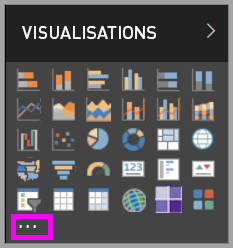

2. Dans la liste déroulante, sélectionnez **Importer à partir d'un fichier**.

    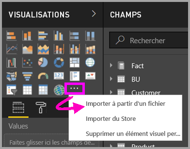

3. Dans le menu **Ouvrir un fichier**, sélectionnez le fichier `.pbiviz` que vous voulez importer, puis choisissez **Ouvrir**. L’icône du visuel personnalisé est ajoutée au bas du volet **Visualisations** et est ensuite disponible pour une utilisation dans votre rapport.

    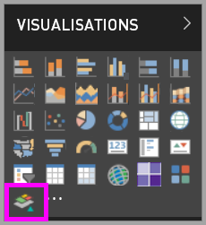

### Importer des visuels organisationnels

1. En bas du volet **Visualisations**, sélectionnez les points de suspension.

    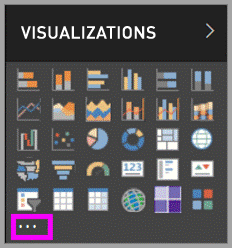

2. Dans la liste déroulante, sélectionnez **Importer à partir de la Place de marché**.

    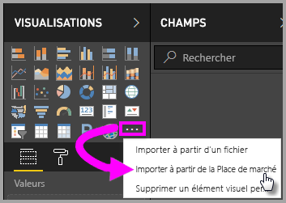

3. Sélectionnez **MON ORGANISATION** dans le menu de l’onglet supérieur.

    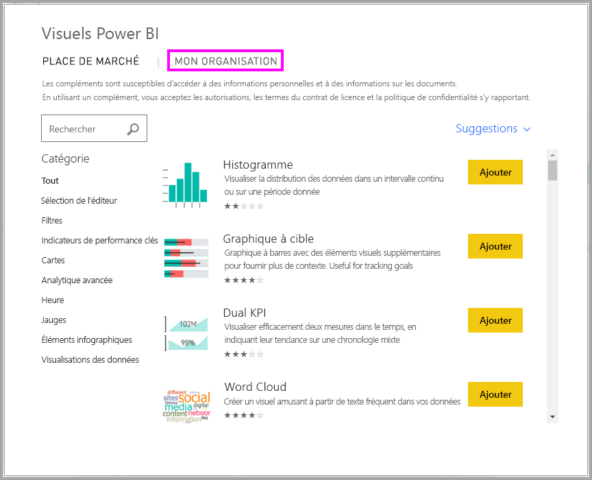

4. Faites défiler la liste pour rechercher le visuel à importer.

    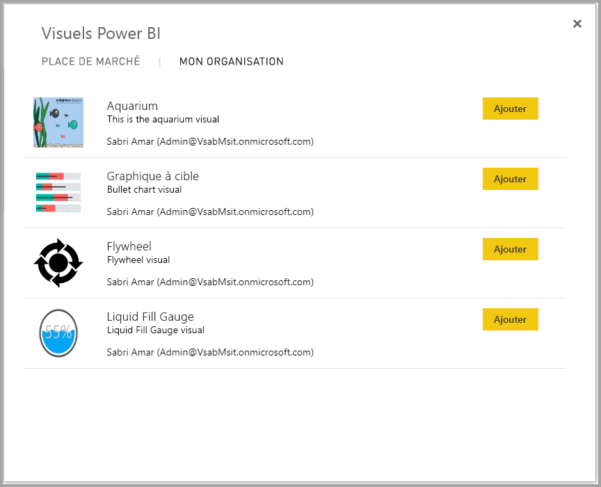

5. Sélectionnez **Ajouter** pour importer le visuel personnalisé. L’icône est ajoutée au bas du volet **Visualisations** et est ensuite disponible pour une utilisation dans votre rapport.

    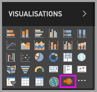

## Télécharger ou importer des visuels Power BI à partir de Microsoft AppSource

Vous avez deux options pour le téléchargement et l’importation de visuels Power BI : depuis Power BI et depuis le [site web AppSource](https://appsource.microsoft.com/).

### Importer des visuels Power BI depuis Power BI

1. En bas du volet **Visualisations**, sélectionnez les points de suspension.

    

2. Dans la liste déroulante, sélectionnez **Importer à partir de la Place de marché**.

    

3. Faites défiler la liste pour rechercher le visuel à importer.

    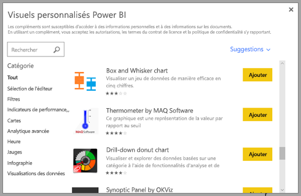

4. Pour en savoir plus sur un des visuels, mettez-le en surbrillance et sélectionnez-le.

    

5. Sur la page de détails, vous pouvez voir des captures d’écran, des vidéos, une description détaillée et bien plus encore.

    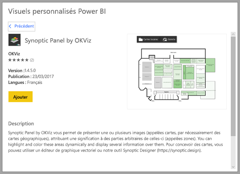

6. Faites défiler vers le bas pour voir les avis.

    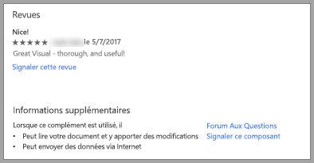

7. Sélectionnez **Ajouter** pour importer le visuel personnalisé. L’icône est ajoutée au bas du volet **Visualisations** et est ensuite disponible pour une utilisation dans votre rapport.

    

### Télécharger et importer des visuels Power BI depuis Microsoft AppSource

1. Ouvrez [Microsoft AppSource](https://appsource.microsoft.com) et sélectionnez l’onglet **Applications**.

    

2. Accédez alors à la [page de résultats d’applications](https://appsource.microsoft.com/marketplace/apps) dans laquelle vous pouvez afficher les principales applications dans chaque catégorie, notamment les *applications Power BI*. Comme nous recherchons des visuels Power BI, limitons les résultats en sélectionnant **Visuels Power BI** dans la liste du volet de navigation.

    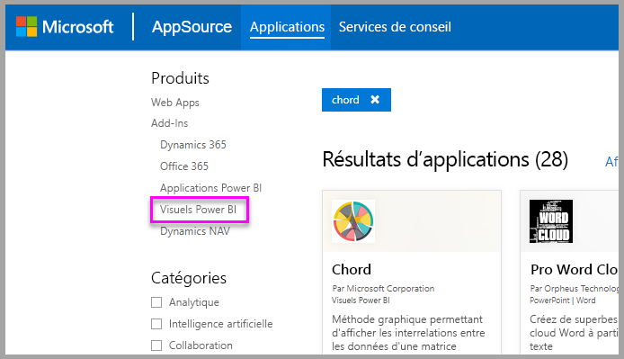

3. AppSource affiche une vignette pour chaque visuel personnalisé.  Chaque vignette a un instantané du visuel personnalisé et donne une brève description ainsi qu’un lien de téléchargement. Pour afficher plus de détails, sélectionnez la vignette.

    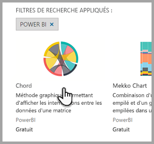

4. Sur la page de détails, vous pouvez voir des captures d’écran, des vidéos, une description détaillée et bien plus encore. Sélectionnez **Obtenir maintenant** pour télécharger le visuel personnalisé et accepter les conditions d’utilisation.

    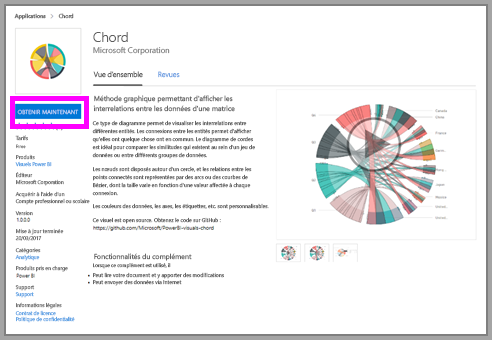

5. Sélectionnez le lien pour télécharger le visuel personnalisé.

    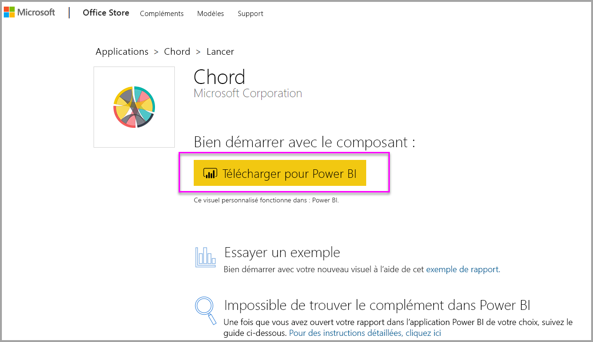

    La page de téléchargement inclut également des instructions sur l’importation du visuel personnalisé dans Power BI Desktop et le service Power BI.

    Vous pouvez également télécharger un exemple de rapport incluant le visuel personnalisé et présentant ses fonctionnalités.

    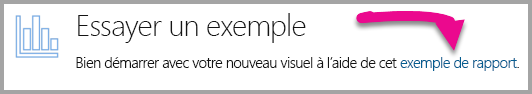

6. Enregistrez le fichier `.pbiviz`, puis ouvrez Power BI.

7. Importez le fichier `.pbiviz` dans votre rapport. (Consultez la section [Importer un visuel personnalisé à partir d’un fichier](#import-a-custom-visual-from-a-file) ci-dessus.)

## Considérations et limitations

* Un élément visuel personnalisé est ajouté à un rapport spécifique lors son importation. Si vous souhaitez utiliser l’élément visuel dans un autre rapport, vous devez l’y importer. Quand un rapport comportant un élément visuel personnalisé est enregistré à l’aide de l’option **Enregistrer sous** , une copie de l’élément visuel personnalisé est enregistrée avec le nouveau rapport.

* Si vous ne voyez pas le volet **Visualisations**, cela signifie que vous n’avez pas l’autorisation de modifier le rapport.  Vous pouvez ajouter des visuels Power BI seulement aux rapports que vous pouvez modifier, mais pas à ceux qui ont été seulement partagés avec vous.

## Résoudre des problèmes

Pour résoudre les problèmes, consultez [Résolution des problèmes de vos visuels Power BI de Power BI](power-bi-custom-visuals-troubleshoot.md).

## FORUM AUX QUESTIONS

Pour plus d’informations et des réponses à vos questions, consultez [Forum aux questions sur les visuels Power BI de Power BI](power-bi-custom-visuals-faq.md#organizational-visuals).

## Étapes suivantes

* [Visualisations dans des rapports Power BI](../visuals/power-bi-report-visualizations.md)

D’autres questions ? [Posez vos questions à la Communauté Power BI](https://community.powerbi.com/).
