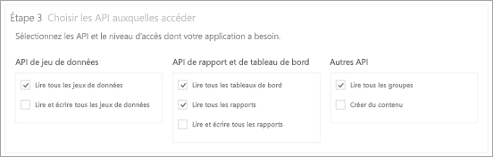
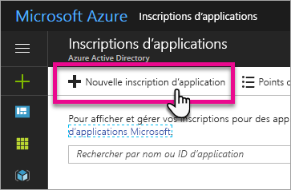
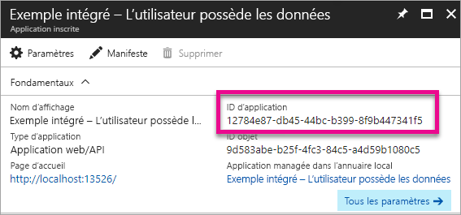
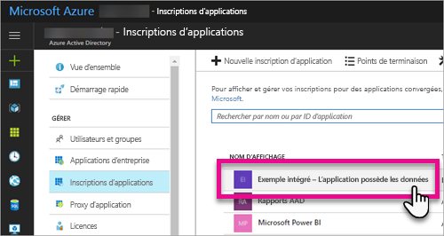
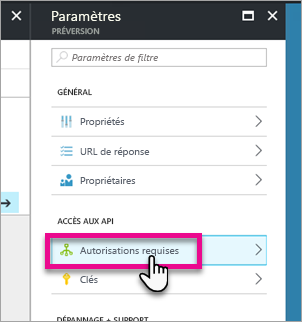
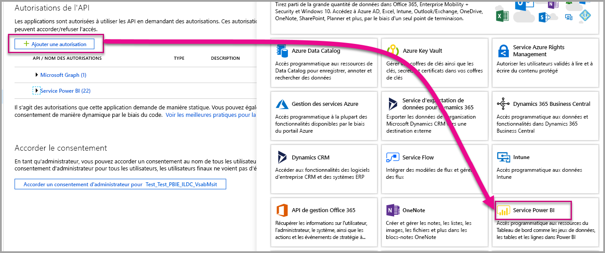
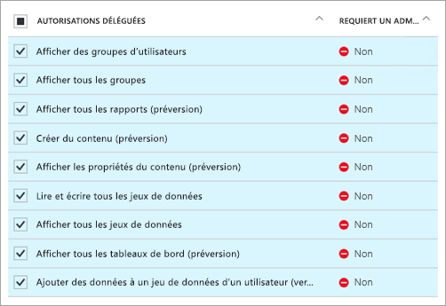
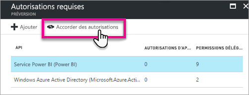

# <a name="register-an-azure-ad-app-to-embed-power-bi-content"></a>Inscrire une application Azure AD pour incorporer du contenu Power BI
Découvrez comment inscrire une application dans Azure Active Directory (Azure AD) afin de l’utiliser avec l’incorporation de contenu Power BI.

Vous devez inscrire votre application auprès d’Azure AD afin de l’autoriser à accéder aux API REST Power BI. Vous pourrez ainsi établir une identité pour votre application et spécifier des autorisations sur les ressources REST de Power BI.

> [!IMPORTANT]
> Pour pouvoir inscrire une application Power BI, vous devez disposer d’un [locataire Azure Active Directory et d’un utilisateur d’organisation](create-an-azure-active-directory-tenant.md). Si vous n’êtes pas encore inscrit à Power BI avec un utilisateur de votre locataire, l’inscription de l’application échoue.
> 
> 

Vous pouvez inscrire votre application de deux façons. Vous pouvez vous servir de l’[outil d’inscription d’application Power BI](https://dev.powerbi.com/apps/) ou y accéder directement à partir du portail Azure. L’outil d’inscription d’application Power BI est l’option la plus simple, car il n’y a que quelques champs à renseigner. Si vous souhaitez apporter des modifications à votre application, utilisez le portail Azure.

## <a name="register-with-the-power-bi-app-registration-tool"></a>Inscrire une application avec l’outil d’inscription d’application BI Power
Vous devez inscrire votre application dans **Azure Active Directory** afin d’établir une identité pour votre application et spécifier des autorisations sur les ressources REST de Power BI. Lorsque vous inscrivez une application, par exemple une application console ou un site web, vous recevez un identificateur que l’application utilise pour s’identifier auprès des utilisateurs auxquels elle demande des autorisations.

Voici comment inscrire votre application avec l’outil d’inscription d’application Power BI :

1. Accédez à [dev.powerbi.com/apps](https://dev.powerbi.com/apps).
2. Sélectionnez **Connectez-vous avec votre compte existant**.
3. Fournissez le **Nom de l’application**.
4. La sélection du type d’application dépend du type d’application que vous utilisez.
   
   * Optez pour le type **Application web côté serveur** pour les applications ou les API web.
   * Optez pour le type **Application native** pour les applications qui s’exécutent sur des appareils clients. ***Choisissez également **Application native** si vous incorporez du contenu pour vos clients, quelle que soit l’application réelle. Même pour les applications web.***
5. Spécifiez l’**URL de redirection** et l’**URL de la page d’accueil**. Toute URL valide fonctionne.
   
    L’**URL de la page d’accueil** est disponible uniquement si vous choisissez le type d’application **Application web côté serveur**.
   
    Pour les exemples *Incorporation pour vos clients* et *integrate-dashboard-web-app*, l’URL de redirection est `http://localhost:13526/redirect`. Pour les exemples relatifs au rapport et à la vignette, l’URL de redirection est `http://localhost:13526/`.
6. Choisissez les API auxquelles cette application a accès. Pour plus d’informations sur les autorisations d’accès Power BI, consultez [Autorisations Power BI](power-bi-permissions.md).
   
    
7. Sélectionnez **Inscrire l’application**.
   
    Vous recevez alors un **ID client**. Si vous avez sélectionné le type **Application web côté serveur**, vous recevez également une **clé secrète client**. Le cas échéant, vous pourrez récupérer l’**ID client** sur le portail Azure ultérieurement. Si vous perdez le **Secret du client**, vous devez en créer un autre dans le portail Azure.

8. Vous devrez accéder à Azure pour sélectionner **Accorder des autorisations**.
> [!Note]
    > Pour ce faire, vous devez être un administrateur global dans le locataire Azure
>

* Accédez à Azure.
* Recherchez et sélectionnez **Inscriptions des applications**.
* Choisissez votre application.
* Sélectionnez **Paramètres**.
* Sélectionnez **Autorisations nécessaires**.
* Sélectionnez **Service Power BI** pour vérifier les autorisations que vous avez sélectionnées à partir du site d’inscription de l’application.
* Sélectionnez **Accorder des autorisations**.


Vous pouvez à présent utiliser l’application inscrite au sein de votre application personnalisée pour interagir avec le service Power BI.

> [!IMPORTANT]
> Si vous incorporez du contenu s’adressant à vos clients, vous devez configurer des autorisations supplémentaires dans le portail Azure. Pour en savoir plus, consultez [Appliquer des autorisations à votre application](#apply-permissions-to-your-application).
> 
> 

## <a name="register-with-the-azure-portal"></a>Inscrire une application par le biais du portail Azure
L’autre option pour l’inscription de votre application consiste à accéder directement au portail Azure. Pour inscrire votre application, procédez comme suit.

1. Acceptez les [conditions d’utilisation de l’API Microsoft Power BI](https://powerbi.microsoft.com/api-terms).
2. Connectez-vous au [portail Azure](https://portal.azure.com).
3. Choisissez votre locataire Azure AD en sélectionnant votre compte dans l’angle supérieur droit de la page.
4. Dans le volet de navigation gauche, choisissez **Autres services**, sélectionnez **Inscriptions des applications** sous **Sécurité + Identité**, puis **Nouvelle inscription d’application**.
   
    
5. Suivez les invites pour créer une application.
   
   * Pour des applications web, spécifiez l’URL de connexion, qui est l’URL de base de votre application, où les utilisateurs peuvent se connecter. Par exemple : http://localhost:13526.
   * Pour des applications natives, spécifiez un URI de redirection qu’Azure AD utilise pour retourner des réponses de jeton. Entrez une valeur spécifique de votre application. Par exemple : http://myapplication/redirect

Pour plus d’informations sur la façon d’inscrire des applications dans Azure Active Directory, consultez [Intégration d’applications dans Azure Active Directory](https://docs.microsoft.com/azure/active-directory/develop/active-directory-integrating-applications).

## <a name="how-to-get-the-client-id"></a>Comment obtenir l’ID client
Lorsque vous inscrivez une application, vous recevez un **ID client**.  L’**ID client** permet à l’application de s’identifier auprès des utilisateurs auxquels elle demande des autorisations.

Voici comment obtenir un ID client :

1. Connectez-vous au [portail Azure](https://portal.azure.com).
2. Choisissez votre locataire Azure AD en sélectionnant votre compte dans l’angle supérieur droit de la page.
3. Dans le volet de navigation gauche, choisissez **Autres services**, puis sélectionnez **Inscriptions des applications**.
4. Sélectionnez l’application dont vous souhaitez récupérer l’ID client.
5. Vous pouvez voir un **ID d’application** répertorié en tant que GUID. Il s’agit de l’ID client pour l’application.
   
    

## <a name="apply-permissions-to-your-application-within-azure-ad"></a>Appliquer des autorisations à votre application dans Azure AD
> [!IMPORTANT]
> Cette section s’applique uniquement aux applications qui **incorporent du contenu s’adressant à votre organisation**.
> 
> 

Vous devez activer des autorisations supplémentaires pour votre application en plus de ce que vous avez fourni dans la page d’inscription de l’application. Cela est possible via le portail Azure AD, ou par programme.

Vous devez être connecté en utilisant un compte *principal* pour l’incorporation, ou un compte Administrateur global.

### <a name="using-the-azure-ad-portal"></a>Utilisation du portail Azure AD
1. Accédez à [Inscriptions des applications](https://portal.azure.com/#blade/Microsoft_AAD_IAM/ApplicationsListBlade) dans le portail Azure, puis sélectionnez l’application que vous utilisez pour l’incorporation.
   
    
2. Sous **Accès aux API**, sélectionnez **Autorisations requises**.
   
    
3. Sélectionnez **Windows Azure Active Directory** puis vérifiez que l’option **Accéder au répertoire en tant qu’utilisateur actuellement connecté** est sélectionnée. Sélectionnez **Enregistrer**.
   
    
4. Dans **Autorisations requises**, sélectionnez **Service Power BI (Power BI)**.
   
    
   
   > [!NOTE]
   > Si vous avez créé l’application dans le portail Azure AD, le **service Power BI (Power BI)** peut ne pas être présent. Dans ce cas, sélectionnez **+ Ajouter**, puis **1 Sélectionner une API**. Choisissez **Service Power BI** dans la liste des API, puis **Sélectionner**.  Si **Service Power BI (Power BI)** n’est pas disponible dans **+ Ajouter**, inscrivez-vous à Power BI avec au moins un utilisateur.
   > 
   > 
5. Sous **Autorisations déléguées**, sélectionnez toutes les autorisations. Vous devez les sélectionner une par une afin d’enregistrer les sélections. Lorsque vous avez terminé, sélectionnez **Enregistrer**.
   
    
6. Dans **Autorisations requises**, sélectionnez **Accorder des autorisations**.
   
    L’action **Accorder des autorisations** est nécessaire pour éviter qu’Azure AD exige une confirmation du *compte principal*. Si le compte qui effectue cette action est celui d’un administrateur global, vous pouvez accorder des autorisations pour tous les utilisateurs de votre organisation pour cette application. Si le compte qui effectue cette action est le *compte principal* et pas celui d’un administrateur global, vous pouvez uniquement accorder des autorisations au *compte principal* pour cette application.
   
    

### <a name="applying-permissions-programmatically"></a>Application d’autorisations par programmation
1. Vous devez obtenir les principaux du service (utilisateurs) existants au sein de votre client. Pour plus d’informations sur la procédure à suivre, voir [Get servicePrincipal](https://developer.microsoft.com/en-us/graph/docs/api-reference/beta/api/serviceprincipal_get).
   
    Vous pouvez appeler l’API *Get servicePrincipal* sans {id}. Elle obtiendra tous les principaux du service au sein du client.
2. Recherchez un principal du service en utilisant votre id client d’application en tant que propriété **appId**.
3. Créez un plan de service s’il n’y en a pas pour votre application.
   
    ```
    Post https://graph.microsoft.com/beta/servicePrincipals
    Authorization: Bearer ey..qw
    Content-Type: application/json
    {
    "accountEnabled" : true,
    "appId" : "{App_Client_ID}",
    "displayName" : "{App_DisplayName}"
    }
    ```
4. Accorder l’autorisation d’application à l’API Power BI
   
    ```
    Post https://graph.microsoft.com/beta/OAuth2PermissionGrants
    Authorization: Bearer ey..qw
    Content-Type: application/json
    { 
    "clientId":"{Service_Plan_ID}",
    "consentType":"AllPrincipals",
    "resourceId":"c78b2585-1df6-41de-95f7-dc5aeb7dc98e",
    "scope":"Dataset.ReadWrite.All Dashboard.Read.All Report.Read.All Group.Read Group.Read.All Content.Create Metadata.View_Any Dataset.Read.All Data.Alter_Any",
    "expiryTime":"2018-03-29T14:35:32.4943409+03:00",
    "startTime":"2017-03-29T14:35:32.4933413+03:00"
    }
    ```
5. Accorder l’autorisation d’application à AAD
   
    La valeur de **consentType** dépend de l’utilisateur effectuant la demande. Vous pouvez fournir la valeur **AllPrincipals** ou **Principal**. La valeur **AllPrincipals** peut uniquement être utilisée par un administrateur pour accorder l’autorisation à tous les utilisateurs. La valeur **Principal** est utilisée pour accorder une autorisation à un utilisateur spécifique. 
   
    L’octroi d’autorisation est nécessaire pour éviter qu’Azure AD exige une confirmation du *compte principal*. 
   
    Si vous utilisez un locataire existant et ne souhaitez pas accorder d’autorisations au nom de tous les utilisateurs de ce locataire, vous pouvez accorder des autorisations à un utilisateur spécifique en remplaçant la valeur de **contentType** par **Principal**.
   
    ```
    Post https://graph.microsoft.com/beta/OAuth2PermissionGrants
    Authorization: Bearer ey..qw
    Content-Type: application/json
    { 
    "clientId":"{Service_Plan_ID}",
    "consentType":"AllPrincipals",
    "resourceId":"61e57743-d5cf-41ba-bd1a-2b381390a3f1",
    "scope":"User.Read Directory.AccessAsUser.All",
    "expiryTime":"2018-03-29T14:35:32.4943409+03:00",
    "startTime":"2017-03-29T14:35:32.4933413+03:00"
    }
    ```

## <a name="next-steps"></a>Étapes suivantes
Maintenant que vous avez enregistré votre application dans Azure AD, vous devez authentifier les utilisateurs dans votre application. Pour plus d’informations, consultez [Authentifier des utilisateurs et obtenir un jeton d’accès Azure AD pour votre application Power BI](get-azuread-access-token.md).

D’autres questions ? [Essayez d’interroger la communauté Power BI](http://community.powerbi.com/)


