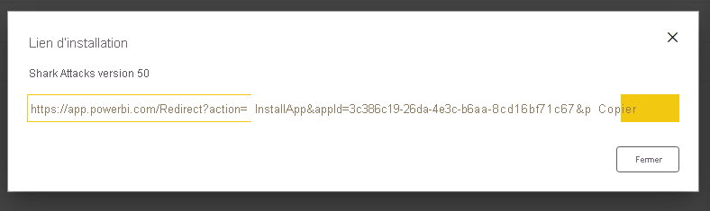
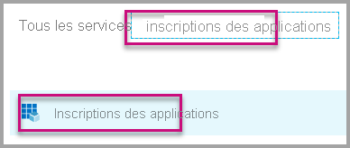
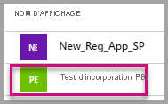
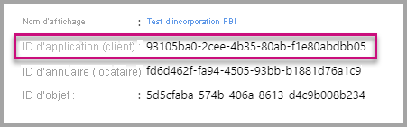
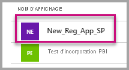
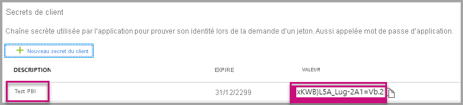

# <a name="tutorial-automate-configuration-of-template-app-installation-using-an-azure-function"></a>Tutoriel : Automatiser la configuration de l’installation d’une application modèle en utilisant une fonction Azure

Les applications modèles sont un excellent moyen pour les clients de commencer à obtenir des insights à partir de leurs données. Les applications modèles leur permettent d’être opérationnels rapidement en les connectant à leurs données et en leur fournissant des rapports prédéfinis qu’ils peuvent ensuite personnaliser s’ils le souhaitent.

Les clients ne connaissent pas toujours les détails nécessaires pour se connecter à leurs données et devoir fournir ces détails lors de l’installation d’une application modèle peut être compliqué pour eux.

Si vous êtes fournisseur de services de données et que vous avez créé une application modèle pour aider vos clients à commencer à utiliser leurs données sur votre service, vous pouvez leur faciliter la tâche d’installation de votre application modèle en automatisant la configuration des paramètres de cette application. Quand le client se connecte à votre portail, il clique sur un lien spécial que vous avez préparé. Ceci lance l’automatisation, qui collecte les informations nécessaires, préconfigure les paramètres de l’application modèle et redirige le client vers son compte Power BI où il peut installer l’application. Tout ce qu’ils doivent faire ici est de cliquer pour installer, puis de se connecter à leur source de données ; ensuite, ils sont prêts à continuer ! 

Cette expérience client est illustrée ci-dessous.


Dans ce tutoriel, vous allez utiliser un exemple de fonction Azure d’installation automatisée que nous avons créé pour préconfigurer et installer votre application modèle. Cet exemple a été conçu délibérément simple pour faciliter la démonstration. Il encapsule la configuration d’une fonction Azure pour tirer parti des API Power BI pour l’installation d’une application modèle et sa configuration automatique pour vos utilisateurs.

Pour plus d’informations sur le flux d’automatisation générale et les API qu’il utilise, consultez [Automatiser la configuration d’une installation d’application modèle](template-apps-auto-install.md)

Notre application simple utilise une fonction Azure. Pour plus d’informations sur Azure Functions, consultez la [documentation Azure Functions](https://docs.microsoft.com/azure/azure-functions/).

## <a name="basic-flow"></a>Flux de base

Voici le flux de base de ce fait l’application quand le client la lance en cliquant sur le lien dans votre portail.

1. L’utilisateur se connecte au portail de l’ISV et clique sur le lien fourni. Ceci lance le flux. À ce stade, le portail de l’ISV prépare la configuration spécifique à l’utilisateur.

2. L’ISV acquiert un jeton d’**application uniquement** basé sur un [principal de service (jeton d’application uniquement)](../embedded/embed-service-principal.md), qui est inscrit dans le locataire de l’ISV.

3. En utilisant les [API REST de Power BI](https://docs.microsoft.com/rest/api/power-bi/), l’ISV crée un **ticket d’installation** qui contient la configuration de paramètre spécifique à l’utilisateur telle qu’elle est préparée par l’ISV.

4. L’ISV redirige l’utilisateur vers Power BI en utilisant une méthode de redirection ```POST``` contenant le ticket d’installation.

5. L’utilisateur est redirigé vers son compte Power BI avec le ticket d’installation et est invité à installer l’application modèle. Quand l’utilisateur clique sur Installer, l’application modèle est installée pour lui.

>[!Note]
>Les valeurs des paramètres sont configurées par l’ISV lors de la création du ticket d’installation, mais les informations d’identification liées à la source de données sont fournies par l’utilisateur seulement dans les étapes finales de l’installation. Ceci les empêche d’être exposées à un tiers, garantissant ainsi une connexion sécurisée entre l’utilisateur et les sources de données de l’application modèle.

## <a name="prerequisites"></a>Prérequis

Avant de commencer, vous devez disposer des éléments suivants :

* La configuration de votre propre locataire Azure Active Directory. Pour obtenir des instructions sur la façon d’en configurer un, consultez [Créer un locataire Azure Active Directory](https://docs.microsoft.com/power-bi/developer/embedded/create-an-azure-active-directory-tenant).

* Un [principal de service (jeton d’application uniquement)](https://docs.microsoft.com/power-bi/developer/embedded/embed-service-principal) inscrit dans le locataire ci-dessus.

* Une application modèle [paramétrable](https://docs.microsoft.com/power-bi/connect-data/service-template-apps-overview) prête pour l’installation. L’application modèle doit être créée dans le même locataire que celui où vous inscrivez votre application dans Azure Active Directory (Azure AD). Pour plus d’informations, consultez [Conseils pour les applications modèles](https://docs.microsoft.com/power-bi/connect-data/service-template-apps-tips.md) ou [Créer une application modèle dans Power BI](https://docs.microsoft.com/power-bi/connect-data/service-template-apps-create).

* Une **licence Power BI Pro**. Si vous n’êtes pas inscrit pour Power BI Pro, [inscrivez-vous pour un essai gratuit](https://powerbi.microsoft.com/pricing/) avant de commencer.

## <a name="set-up-your-template-apps-automation-development-environment"></a>Configurer votre environnement de développement d’automatisation d’applications modèles

Avant de poursuivre la configuration de votre application, suivez les instructions de [Démarrage rapide : Créer une application Azure Functions avec Azure App Configuration](https://docs.microsoft.com/azure/azure-app-configuration/quickstart-azure-functions-csharp) pour développer une fonction Azure avec un service Azure App Configuration. Créez la configuration de votre application comme décrit dans l’article.

### <a name="register-an-application-in-azure-active-directory-azure-ad"></a>Inscrire une application dans Azure Active Directory (Azure AD)

Créez un principal de service comme décrit dans [Incorporer du contenu Power BI avec un principal de service et un secret d’application](https://docs.microsoft.com/power-bi/developer/embedded/embed-service-principal).

Veillez à inscrire l’application en tant qu’**application web côté serveur**. Vous inscrivez une application web côté serveur pour créer un secret d’application.

Enregistrez l’*ID d’application* (ID de client) et le *Secret de l’application* (secret du client), car vous en aurez besoin pour les étapes ultérieures.

Vous pouvez passer par l’[outil de configuration de l’incorporation](https://aka.ms/embedsetup/AppOwnsData) pour vous préparer rapidement à créer une inscription d’application. Si vous utilisez l’[outil d’inscription d’application Power BI](https://app.powerbi.com/embedsetup), sélectionnez l’option *Incorporer pour vos clients*.

## <a name="template-app-preparation"></a>Préparation de l’application modèle

Une fois que vous avez créé votre application modèle et qu’elle est prête pour l’installation, enregistrez les informations qui suivent pour les étapes suivantes :

* *ID d’application*, *Clé de package* et *ID de propriétaire* tels qu’ils apparaissent dans l’URL d’installation à la fin du processus [Définir les propriétés de l’application modèle](../../connect-data/service-template-apps-create.md#define-the-properties-of-the-template-app) quand l’application a été créée.

    Vous pouvez également accéder au même lien en cliquant sur **Obtenir un lien** dans la [Gestion de la publication](../../connect-data/service-template-apps-create.md#manage-the-template-app-release) de l’application modèle.

* Les *noms des paramètres* tels qu’ils sont définis dans le jeu de données de l’application modèle. Les noms des paramètres sont des chaînes qui sont sensibles à la casse, et qui peuvent également être récupérés sous l’onglet **Valeurs des paramètres** quand vous [définissez les propriétés de l’application modèle](../../connect-data/service-template-apps-create.md#define-the-properties-of-the-template-app) ou à partir des paramètres du jeux de données dans Power BI.

>[!NOTE]
>Vous pouvez tester votre application d’installation préconfigurée sur votre application modèle si celle-ci est prête pour l’installation, même si elle n’est pas encore publiquement disponible sur AppSource. Cependant, pour que les utilisateurs en dehors de votre locataire puissent utiliser l’application d’installation automatisée pour installer votre application modèle, celle-ci doit être publiquement disponible dans la [Place de marché des applications Power BI](https://app.powerbi.com/getdata/services). Avant de distribuer votre application modèle en utilisant l’application d’installation automatisée que vous créez, veillez à la publier sur l’[Espace partenaires](https://docs.microsoft.com/azure/marketplace/partner-center-portal/create-power-bi-app-offer).


## <a name="install-and-configure-your-template-app-using-our-azure-function-sample"></a>Installer et configurer votre application modèle en utilisant notre exemple de fonction Azure

Dans cette section, vous allez utiliser un exemple de fonction Azure d’installation automatisée que nous avons créé pour préconfigurer et installer votre application modèle. Cet exemple a été conçu délibérément simple pour faciliter la démonstration. Il vous permet de tirer parti d’une [fonction Azure](https://docs.microsoft.com/azure/azure-functions/functions-overview) et d’une [Azure App Configuration](https://docs.microsoft.com/azure/azure-app-configuration/overview) pour déployer et utiliser facilement l’API d’installation automatisée pour vos applications modèles.

### <a name="download-visual-studio-version-2017-or-later"></a>Télécharger [Visual Studio](https://www.visualstudio.com/) (version 2017 ou ultérieure)

Téléchargez [Visual Studio](https://www.visualstudio.com/) (version 2017 ou ultérieure). Veillez à télécharger le dernier [package NuGet](https://www.nuget.org/profiles/powerbi).

### <a name="download-the-automated-install-azure-function-sample"></a>Télécharger l’exemple de fonction Azure d’installation automatisée

Téléchargez l’[exemple de fonction Azure d’installation automatisée](https://github.com/microsoft/Template-apps-examples/tree/master/Developer%20Samples/Automated%20Install%20Azure%20Function) à partir de GitHub pour commencer.


### <a name="setup-your-azure-app-configuration"></a>Configurer votre service Azure App Configuration

Pour exécuter cet exemple, vous devez configurer votre service Azure App Configuration avec les valeurs et les clés décrites ci-dessous. Les clés sont l’**ID d’application**, le **Secret de l’application**, et les éléments **AppId**, **PackageKey** et **OwnerId** de votre application modèle. Pour plus d’informations sur l’obtention de ces valeurs, consultez les sections ci-dessous. 

Les clés sont également définies dans le fichier **Constants.cs**.

| Clé Configuration | Signification           |
|---------------    |-------------------|
| TemplateAppInstall:Application:AppId | *AppId* de l’[URL d’installation](#getting-the-template-app-properties) |
| TemplateAppInstall:Application:PackageKey | *PackageKey* de l’[URL d’installation](#getting-the-template-app-properties) |
| TemplateAppInstall:Application:OwnerId | *OwnerId* de l’[URL d’installation](#getting-the-template-app-properties) |
| TemplateAppInstall:ServicePrincipal:ClientId | [ID d’application](#getting-the-application-id) du principal de service |
| TemplateAppInstall:ServicePrincipal:ClientSecret | [Secret de l’application](#getting-the-application-secret) du principal de service |
|||


Le fichier **Constants.cs** :


#### <a name="getting-the-template-app-properties"></a>Obtention des propriétés de l’application modèle
Renseignez toutes les propriétés pertinentes de l’application modèle telles qu’elles sont définies lors de la création de l’application. Ces propriétés sont les éléments **AppId**, **PakcageKey** et **OwnerId** de l’application modèle.

Pour obtenir ces valeurs, effectuez ces étapes :

1. Connectez-vous à [Power BI](https://app.powerbi.com).

2. Accédez à l’espace de travail d’origine de l’application.

3. Ouvrez le volet Gestion de la publication.

    

4. Sélectionnez la version de l’application pour obtenir son lien d’installation.

    

5. Copiez le lien dans le Presse-papiers.

    

6. Cette URL d’installation contient les 3 paramètres d’URL dont les valeurs vous sont nécessaires. Utilisez les valeurs de **appId**, **packageKey** et **ownerId** pour l’application. L’URL sera similaire à l’exemple ci-dessous.

    ```html
    https://app.powerbi.com/Redirect?action=InstallApp&appId=3c386...16bf71c67&packageKey=b2df4b...dLpHIUnum2pr6k&ownerId=72f9...1db47&buildVersion=5
    ```

#### <a name="getting-the-application-id"></a>Obtention de l’ID d’application

Dans le champ **applicationId**, indiquez **l’ID d’application** **d’Azure**. L’information **applicationId** est utilisée par l’application pour s’identifier auprès des utilisateurs auxquels vous demandez des autorisations.

Pour récupérer la valeur **applicationId**, suivez ces étapes :

1. Connectez-vous au [portail Azure](https://portal.azure.com).

2. Dans le volet de navigation de gauche, sélectionnez **Tous les services**, puis **Inscriptions d’applications**.

    

3. Sélectionnez l’application ayant besoin de la valeur **applicationId**.

    

4. Un **ID d’application** est listé au format GUID. Utilisez cet **ID d’application** comme **applicationId** de l’application.

    

#### <a name="getting-the-application-secret"></a>Obtention du secret de l’application

Renseignez les informations **ApplicationSecret** à partir de la section **Clés** de votre section **Inscriptions d’applications** dans **Azure**.  Cet attribut fonctionne quand vous utilisez un [principal de service](../embedded/embed-service-principal.md).

Pour obtenir la valeur **ApplicationSecret**, effectuez les étapes suivantes :

 1. Connectez-vous au [portail Azure](https://portal.azure.com).

 2. Dans le volet de navigation de gauche, sélectionnez **Tous les services**, puis **Inscriptions d’applications**.

    

3. Sélectionnez l’application qui doit utiliser la valeur **ApplicationSecret**.

    

4. Sélectionnez **Certificats et secrets** sous **Gérer**.

5. Sélectionnez **Nouvelle clé secrète client**.

6. Entrez un nom dans la zone **Description** et sélectionnez une durée. Puis sélectionnez **Enregistrer** afin d’obtenir la **valeur** pour votre application. Lorsque vous fermez le volet **Clés** après l’enregistrement de la valeur de la clé, le champ de valeur apparaît uniquement masqué. À ce stade, vous n’êtes pas en mesure de récupérer la valeur de la clé. Si vous perdez la valeur de la clé, créez-en une autre dans le portail Azure.

    

## <a name="test-your-function-locally"></a>Tester votre fonction localement

Suivez les étapes décrites dans [Exécuter la fonction localement](https://docs.microsoft.com/azure/azure-functions/functions-create-your-first-function-visual-studio#run-the-function-locally) pour exécuter votre fonction.

Configurez votre portail pour émettre une requête ```POST``` à l’URL de la fonction (par exemple ```POST http://localhost:7071/api/install```). Le corps de la requête doit être un objet JSON décrivant des paires clé-valeur, où les clés sont des *noms de paramètres* (définis dans Power BI Desktop) et où les valeurs sont les valeurs souhaitées à définir pour chaque paramètre dans l’application modèle.

>[!Note]
> En production, les valeurs de paramètre sont déduites pour chaque utilisateur selon la logique prévue de votre portail.

Le flux souhaité doit être :

1. Le portail prépare la requête, par utilisateur\session.
2. La requête ```POST /api/install``` est envoyée à votre fonction Azure. Le corps de la requête se compose de paires clé-valeur, où la clé est le nom de paramètre et où la valeur est la valeur souhaitée à définir. 
3. Si tout est correctement configuré, le navigateur doit rediriger automatiquement vers le compte Power BI du client et montrer le flux de l’installation automatisée.
4. Lors de l’installation, les valeurs des paramètres sont définies comme configuré dans les étapes 1 et 2.
 
## <a name="next-steps"></a>Étapes suivantes

### <a name="publish-your-project-to-azure"></a>Publier votre projet sur Azure

Pour obtenir des instructions sur la publication de votre projet sur Azure, suivez la [documentation sur les fonctions Azure](https://docs.microsoft.com/azure/azure-functions/functions-create-your-first-function-visual-studio#publish-the-project-to-azure) afin de pouvoir intégrer les API d’installation automatisée des applications modèles dans votre produit et de les tester dans des environnements de production.
