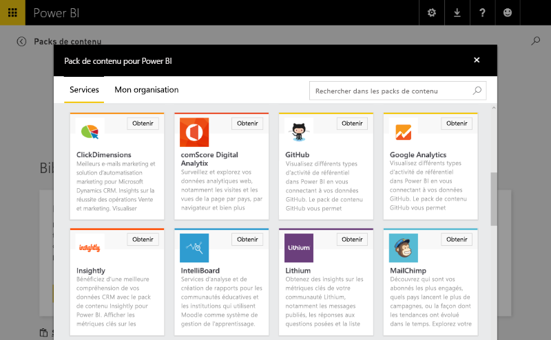
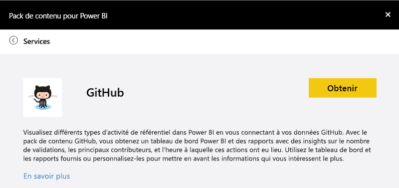
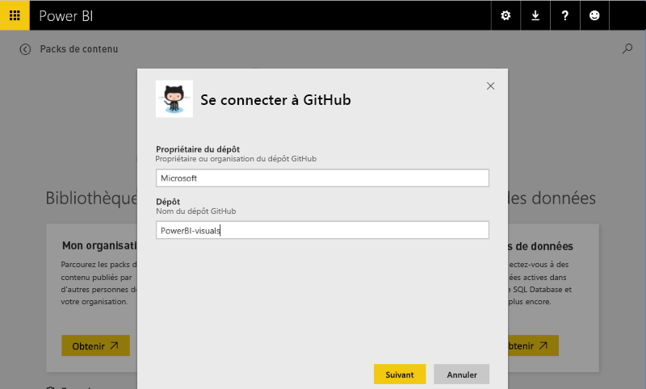
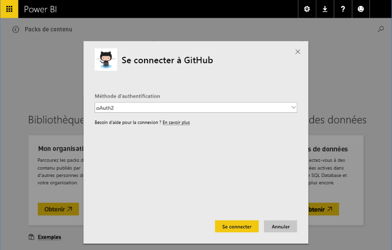
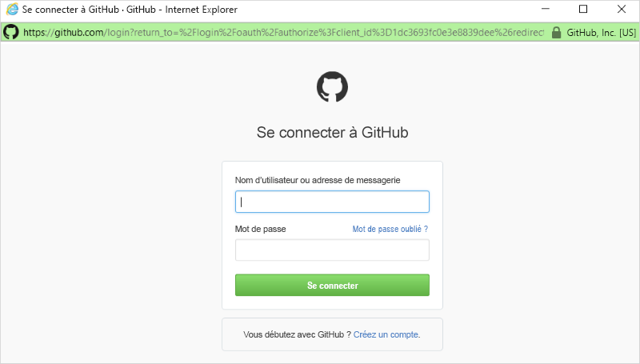
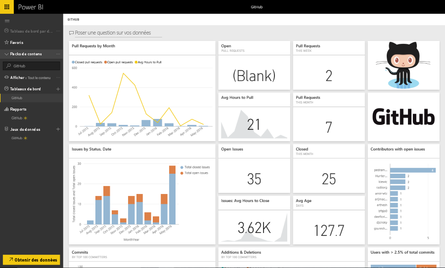

# Expériences de modèle de pack de contenu dans Power BI
Cette section présente une expérience classique pour un utilisateur qui se connecte à un [pack de contenu](../service-connect-to-services.md) ISV. 

Essayez de vous connecter vous-même en vous connectant à un pack de contenu publié sur https://app.powerbi.com/getdata/services (comme le [pack de contenu GitHub](https://app.powerbi.com/getdata/services/github) décrit ci-dessous).

## Connexion
Pour commencer, un utilisateur parcourt à la galerie du pack de contenu et sélectionne un pack de contenu auquel se connecter. L’entrée du pack de contenu fournit un nom, une icône et un texte descriptif fournissant plus d’informations à l’utilisateur.

## Paramètres
Une fois cela sélectionné, l’utilisateur sera invité à fournir des paramètres (si requis). La boîte de dialogue de paramètres est fournie par déclaration de l’auteur lors de la création du pack de contenu.

Actuellement, l’interface utilisateur des paramètres est très simple : il n’y a aucune façon d’énumérer des listes déroulantes, et la validation de l’entrée des données est restreinte aux expressions régulières.

## Informations d’identification
Après la définition des paramètres, l’utilisateur devra se connecter.  Si la source prend en charge plusieurs types d’authentification, l’utilisateur choisit l’option la plus adaptée. Si la source nécessite OAuth, alors l’interface utilisateur de connexion du service s’affichera lorsque l’utilisateur appuie sur Connexion.  Sinon, l’utilisateur peut saisir ses informations d’identification dans la boîte de dialogue fournie.

## Instanciation
Une fois la connexion établie, les artefacts inclus dans le pack de contenu (modèle, rapports et tableau de bord) apparaissent dans la barre de navigation.  Ces artefacts sont ajoutés au compte de chaque utilisateur.  Les données se chargent de façon asynchrone pour remplir le jeu de données (modèle).  L’utilisateur peut alors consommer le tableau de bord, les rapports et les modèles.

Par défaut, une planification d’actualisation quotidienne est configurée pour l’utilisateur et réévaluera les requêtes dans ce modèle.  Les informations d’identification fournies à l’utilisateur doivent lui permettre d’actualiser les données sans être présent.

## Exploration et surveillance
Une fois le pack de contenu intégré au compte de l’utilisateur, ce dernier peut explorer et surveiller les données/analyses.

Cela comprend généralement :

* L’affichage et la personnalisation du tableau de bord.
* L’affichage et la personnalisation du rapport.
* L’utilisation du langage naturel pour poser des questions sur les données
* L’utilisation du canevas d’exploration pour explorer les données du modèle de données.

Vous devez veiller à fournir une modélisation en langage naturel (synonymes) et un schéma de modèle compréhensible pour créer de meilleures expériences d’exploration.

