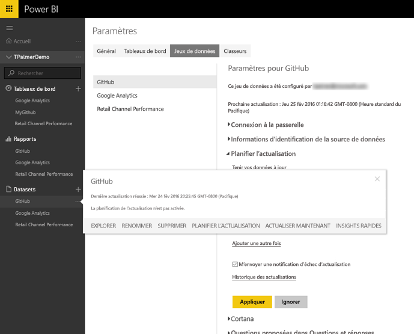
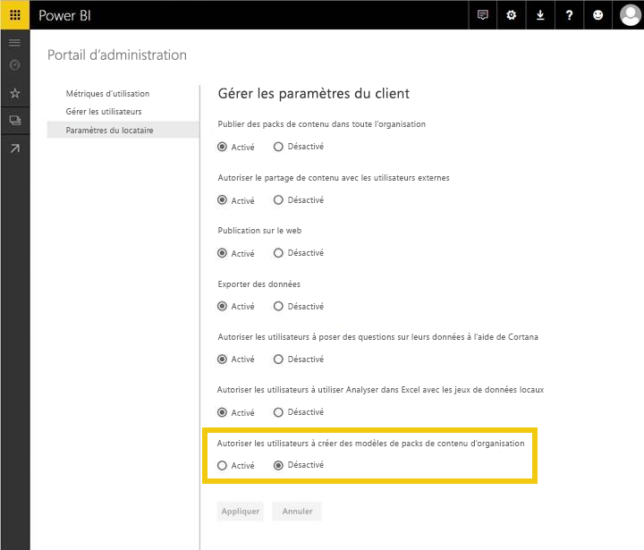
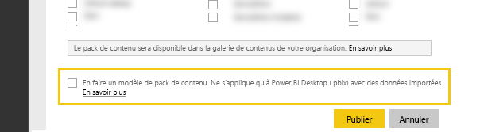
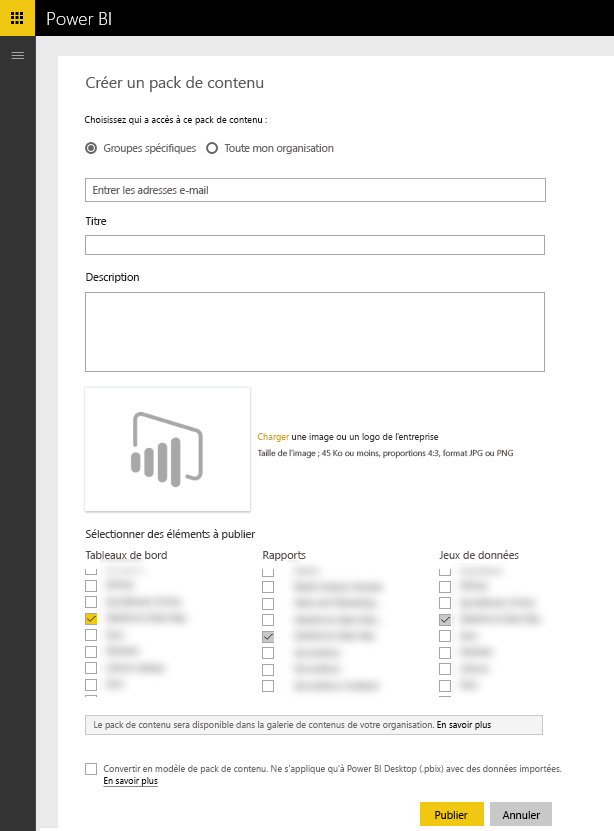

# Test des packs de contenu de modèle pour Power BI
Il existe plusieurs façons de tester votre pack de contenu avant de le soumettre pour publication.  

> [!NOTE]
> Si votre pack de contenu utilise un [connecteur de données](https://aka.ms/DataConnectors) personnalisé que vous avez développé, vous ne pouvez pas tester l’actualisation des données ou le pack de contenu de modèle, comme décrit ci-dessous. Si tel est le cas, [envoyez](#submission) votre pack de contenu afin que l’équipe Power BI vous recontacte pour vous aider à le tester.
> 
> 

## Test de l’actualisation des données planifiée
Les packs de contenu de modèle tirent parti de l’actualisation dans PowerBI.com pour instancier un pack de contenu avec les données du client quand celui-ci se connecte. Avant la publication du pack de contenu, vous pouvez tester ce flux avec le fichier Desktop que vous avez créé.

Après avoir chargé le fichier, sélectionnez « ... » à côté du jeu de données, puis sélectionnez Planifier l’actualisation. Configurez les informations d’identification pour la source. Vérifiez que l’actualisation de votre jeu de données se déroule correctement ; essayez « Actualiser maintenant » et « Planifier l’actualisation ». Si votre actualisation connaît des problèmes, vérifiez le message d’erreur et validez vos requêtes et votre système terminal.

### Conseils d’actualisation supplémentaires
* Une seule source de données doit être détectée quand vous essayez de planifier l’actualisation.  
* La connexion de test doit indiquer que l’utilisateur peut charger le pack de contenu. Si tel n’est pas le cas, vérifiez que vos requêtes gèrent les cas d’erreur supplémentaires.  
* L’actualisation doit se terminer dans un délai raisonnable (environ 5minutes).  

## Test des modèles
Un pack de contenu de modèle est similaire aux solutions existantes, à la différence qu’il n’inclut pas les données réelles dans le jeu de données. En revanche, quand un utilisateur consomme ou instancie un modèle, il est invité à fournir des paramètres et des informations d’identification pour se connecter. Une fois connecté, il voit ses propres données dans le tableau de bord, le rapport et les jeux de données. 

Après avoir instancié le pack de contenu, l’utilisateur a accès aux paramètres du jeu de données, dont l’actualisation planifiée et les paramètres de sécurité au niveau des lignes du jeu de données, qui ne sont **pas** publiés avec le pack de contenu.  

> [!NOTE]
> Les packs de contenu de modèle peuvent comporter uniquement 1 tableau de bord, 1 rapport et 1 jeu de données. Consultez la liste de restrictions dans la page [Création](template-content-pack-authoring.md#restrictions). 
> 
> 

Pour permettre à votre client de créer le modèle, collaborez avec votre administrateur Power BI pour activer le commutateur de fonctionnalité ci-dessous. 

Une fois le commutateur de fonctionnalité activé, vous voyez s’afficher une case à cocher sous l’option [« Créer un pack de contenu »](https://app.powerbi.com/groups/me/publish-content/). Celle-ci vous permet de publier un modèle de pack de contenu pour votre organisation. 

### Affectation de noms
Nous vous suggérons d’affecter des noms cohérents à vos tableau de bord, rapport et jeu de données dans votre pack de contenu. Ces noms sont codés en dur et sont les mêmes pour tous les utilisateurs ; ainsi, l’utilisation de votre nom de produit/scénario peut faciliter la localisation par vos clients.

### Astuces supplémentaires pour les modèles
* Vérifiez que les paramètres que vous spécifiez dans les requêtes sont significatifs pour les utilisateurs finaux.
* Prenez en compte le temps que doit patienter l’utilisateur final jusqu’à ce que l’actualisation planifiée soit terminée.

## Soumission
Le processus de soumission via [Microsoft AppSource](https://appsource.microsoft.com/en-us/partners/list-an-app) vous permet de publier votre pack de contenu de modèle dans la galerie des packs de contenu de service dans PowerBI.com, ainsi que de faire figurer votre pack de contenu dans [Microsoft AppSource](http://appsource.microsoft.com).

### Avant la soumission
* Passez en revue les conseils de création pour chacun des artefacts dans le pack de contenu.
* Effectuez des tests et connectez-vous sous différents comptes et conditions de données. (Ignorez cette étape si vous avez développé votre propre [connecteur de données](https://aka.ms/DataConnectors))
* Passez en revue tous les éléments visuels, recherchez attentivement les éléments mal orthographiés.
* Vérifiez que le pack de contenu répond bien à Questions et réponses. Nous vous suggérons de tester au moins 30 questions variées dans le modèle de données. (Ignorez cette étape si vous avez développé votre propre [connecteur de données](https://aka.ms/DataConnectors))

### Soumission
Une fois que vous êtes prêt pour l’envoi, visitez la [page relative à la soumission d’applications](https://appsource.microsoft.com/en-us/partners/list-an-app) sur AppSource et envoyez vos informations. Veillez à sélectionner Power BI dans la liste des produits disponibles.

L’équipe Power BI vérifie votre soumission et vous recontacte pour s’assurer que tous les artefacts satisfont aux contraintes de la soumission. Outre leur caractère exhaustif, nous validons la qualité du tableau de bord et des rapports fournis, en vérifiant qu’ils satisfont au scénario d’entreprise dans l’application.

### Mises à jour
La mise à jour de votre pack de contenu suit un flux similaire à la soumission d’origine. 

