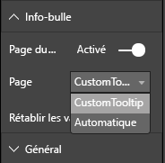

# <a name="tooltips-in-power-bi-visuals"></a>Info-bulles dans les visuels Power BI

Les visuels peuvent maintenant utiliser la prise en charge des info-bulles Power BI. Les info-bulles Power BI gèrent les interactions suivantes :

* Afficher une info-bulle.
* Masquer une info-bulle.
* Déplacer une info-bulle.

Les info-bulles peuvent afficher un élément textuel avec un titre, une valeur dans une couleur donnée et une opacité aux coordonnées spécifiées. Ces informations sont transmises à l’API, et l’hôte Power BI les affiche de la même façon qu’il affiche les info-bulles dans des visuels natifs.

L’image suivante montre une info-bulle dans un exemple de graphique à barres :


L’image d’info-bulle précédente illustre une catégorie et une valeur de barre uniques. Vous pouvez étendre une seule info-bulle pour qu’elle affiche plusieurs valeurs.

## <a name="manage-tooltips"></a>Gérer les info-bulles

« ITooltipService » est l’interface par le biais de laquelle vous gérez les info-bulles. Elle informe l’hôte qu’une info-bulle doit être affichée, supprimée ou déplacée.

```typescript
    interface ITooltipService {
        enabled(): boolean;
        show(options: TooltipShowOptions): void;
        move(options: TooltipMoveOptions): void;
        hide(options: TooltipHideOptions): void;
    }
```

Votre visuel doit écouter les événements de souris qui s’y produisent et appeler les délégués `show()`, `move()` ou `hide()`, selon le cas, avec le contenu approprié rempli dans les objets `Tooltip****Options`.
`TooltipShowOptions` et `TooltipHideOptions` définissent à leur tour les éléments à afficher et le comportement à adopter dans ces événements.

L’appel de ces méthodes implique des événements utilisateur tels que des déplacements de souris et des événements tactiles. Il est donc judicieux de créer des écouteurs pour ces événements, qui, à leur tour, appellent les membres `TooltipService`.
Notre exemple s’agrège dans une classe appelée `TooltipServiceWrapper`.

### <a name="the-tooltipservicewrapper-class"></a>La classe TooltipServiceWrapper

L’idée de base qui sous-tend cette classe est de stocker l’instance de `TooltipService`, d’écouter les événements de souris D3 sur les éléments pertinents, puis d’appeler les éléments `show()` et `hide()` si nécessaire.

La classe stocke et gère l’état et la logique appropriés de ces événements, qui sont principalement destinés à l’interfaçage avec le code D3 sous-jacent. L’interfaçage et la conversion D3 ne sont pas traités dans cet article.

L’exemple de code complet est disponible dans le [dépôt de visuels SampleBarChart](https://github.com/Microsoft/PowerBI-visuals-sampleBarChart/commit/981b021612d7b333adffe9f723ab27783c76fb14).

### <a name="create-tooltipservicewrapper"></a>Créer TooltipServiceWrapper

Le constructeur BarChart compte maintenant un membre `TooltipServiceWrapper`, qui est instancié dans le constructeur avec l’instance `tooltipService` de l’hôte.

```typescript
        private tooltipServiceWrapper: ITooltipServiceWrapper;

        this.tooltipServiceWrapper = createTooltipServiceWrapper(this.host.tooltipService, options.element);
```

La classe `TooltipServiceWrapper` contient l’instance `tooltipService`, également en tant qu’élément D3 racine des paramètres visuels et tactiles.

```typescript
    class TooltipServiceWrapper implements ITooltipServiceWrapper {
        private handleTouchTimeoutId: number;
        private visualHostTooltipService: ITooltipService;
        private rootElement: Element;
        private handleTouchDelay: number;

        constructor(tooltipService: ITooltipService, rootElement: Element, handleTouchDelay: number) {
            this.visualHostTooltipService = tooltipService;
            this.handleTouchDelay = handleTouchDelay;
            this.rootElement = rootElement;
        }
        .
        .
        .
    }
```

Le point d’entrée unique de cette classe pour enregistrer les écouteurs d’événements est la méthode `addTooltip`.

### <a name="the-addtooltip-method"></a>La méthode addTooltip

```typescript
        public addTooltip<T>(
            selection: d3.Selection<Element>,
            getTooltipInfoDelegate: (args: TooltipEventArgs<T>) => VisualTooltipDataItem[],
            getDataPointIdentity: (args: TooltipEventArgs<T>) => ISelectionId,
            reloadTooltipDataOnMouseMove?: boolean): void {

            if (!selection || !this.visualHostTooltipService.enabled()) {
                return;
            }
        ...
        ...
        }
```

* **selection: d3.Selection<Element>**  : éléments D3 sur lesquels les info-bulles sont gérées.

* **getTooltipInfoDelegate: (args: TooltipEventArgs<T>) => VisualTooltipDataItem[]**  : délégué pour remplir le contenu de l’info-bulle (élément à afficher) selon le contexte.

* **getDataPointIdentity: (args: TooltipEventArgs<T>) => ISelectionId** : délégué pour récupérer l’ID de point de données (inutilisé dans cet exemple). 

* **reloadTooltipDataOnMouseMove? boolean** : valeur booléenne qui indique s’il faut actualiser les données de l’info-bulle pendant un événement MouseMove (inutilisée dans cet exemple).

Comme vous le voyez, l’exécution de la méthode `addTooltip` s’arrête sans aucune action si l’instance `tooltipService` est désactivée ou en l’absence de véritable sélection.

### <a name="call-the-show-method-to-display-a-tooltip"></a>Appeler la méthode show pour afficher une info-bulle

La méthode `addTooltip` écoute ensuite l’événement D3 `mouseover`, comme dans le code suivant :

```typescript
        ...
        ...
        selection.on("mouseover.tooltip", () => {
            // Ignore mouseover while handling touch events
            if (!this.canDisplayTooltip(d3.event))
                return;

            let tooltipEventArgs = this.makeTooltipEventArgs<T>(rootNode, true, false);
            if (!tooltipEventArgs)
                return;

            let tooltipInfo = getTooltipInfoDelegate(tooltipEventArgs);
            if (tooltipInfo == null)
                return;

            let selectionId = getDataPointIdentity(tooltipEventArgs);

            this.visualHostTooltipService.show({
                coordinates: tooltipEventArgs.coordinates,
                isTouchEvent: false,
                dataItems: tooltipInfo,
                identities: selectionId ? [selectionId] : [],
            });
        });
```

* **makeTooltipEventArgs** : Extrait le contexte des éléments sélectionnés D3 dans un tooltipEventArgs. Calcule également les coordonnées.

* **getTooltipInfoDelegate** : génère ensuite le contenu de l’info-bulle à partir de tooltipEventArgs. C’est un rappel de la classe BarChart, dicté par la logique du visuel. Il s’agit du contenu du texte réel à afficher dans l’info-bulle.

* **getDataPointIdentity** : inutilisé dans cet exemple.

* **this.visualHostTooltipService.show** : appel pour afficher l’info-bulle.  

Une gestion supplémentaire est disponible dans l’exemple correspondant aux événements `mouseout` et `mousemove`.

Pour plus d’informations, consultez [Référentiel visuel SampleBarChart](https://github.com/Microsoft/PowerBI-visuals-sampleBarChart/commit/981b021612d7b333adffe9f723ab27783c76fb14).

### <a name="populate-the-tooltip-content-by-the-gettooltipdata-method"></a>Remplir le contenu de l’info-bulle à l’aide de la méthode getTooltipData

La classe BarChart a été ajoutée avec un membre `getTooltipData`, qui extrait simplement les éléments `category`, `value`et `color` du point de données dans un élément VisualTooltipDataItem[].

```typescript
        private static getTooltipData(value: any): VisualTooltipDataItem[] {
            return [{
                displayName: value.category,
                value: value.value.toString(),
                color: value.color,
                header: 'ToolTip Title'
            }];
        }
```

Dans l’implémentation précédente, le membre `header` est constant, mais vous pouvez l’utiliser dans des implémentations plus complexes qui requièrent des valeurs dynamiques. Vous pouvez remplir `VisualTooltipDataItem[]` avec plusieurs éléments, et ajouter ainsi des lignes supplémentaires à l’info-bulle. Cela peut être utile dans les visuels tels que les graphiques à barres empilées, où l’info-bulle affiche parfois des données issues de plusieurs points de données.

### <a name="call-the-addtooltip-method"></a>Appeler la méthode addTooltip

La dernière étape consiste à appeler la méthode `addTooltip` en cas de changement des données existantes. Cet appel se produit dans la méthode `BarChart.update()`. Un appel est effectué pour surveiller la sélection de tous les éléments « bar », en passant uniquement l’élément `BarChart.getTooltipData()`, comme indiqué plus haut.

```typescript
        this.tooltipServiceWrapper.addTooltip(this.barContainer.selectAll('.bar'),
            (tooltipEvent: TooltipEventArgs<number>) => BarChart.getTooltipData(tooltipEvent.data),
            (tooltipEvent: TooltipEventArgs<number>) => null);
```

## <a name="add-report-page-tooltips"></a>Ajouter des info-bulles de page de rapport

Pour ajouter la prise en charge des info-bulles de page de rapport, vous effectuez la plupart des modifications dans le fichier *capabilities.json*.

Exemple de schéma :

```json
{
    "tooltips": {
        "supportedTypes": {
            "default": true,
            "canvas": true
        },
        "roles": [
            "tooltips"
        ]
    }
}
```

Vous pouvez définir des info-bulles de page de rapport dans le volet **Format**.



* `supportedTypes` : configuration des info-bulles qui est prise en charge par le visuel et reflétée également dans les champs. 
   * `default` : spécifie si la liaison « automatique » des info-bulles par le biais du champ de données est prise en charge. 
   * `canvas` : spécifie si les info-bulles de page de rapport sont prises en charge.

* `roles` : (facultatif) quand cet élément est défini, il détermine les rôles de données qui sont liés à l’option d’info-bulle sélectionnée également dans les champs.

Pour plus d’informations, consultez les [conseils d’utilisation des info-bulles de page de rapport](https://powerbi.microsoft.com/blog/power-bi-desktop-march-2018-feature-summary/#tooltips).

Pour afficher l’info-bulle de page de rapport, une fois que l’hôte Power BI a appelé `ITooltipService.Show(options: TooltipShowOptions)` ou `ITooltipService.Move(options: TooltipMoveOptions)`, il utilise selectionId (propriété `identities` de l’argument `options` précédent). Pour être récupéré par l’info-bulle, selectionId doit représenter les données sélectionnées (catégorie, série, etc.) de l’élément que vous avez pointé.

Le code suivant montre un exemple d’envoi de selectionId aux appels d’affichage de l’info-bulle :

```typescript
    this.tooltipServiceWrapper.addTooltip(this.barContainer.selectAll('.bar'),
        (tooltipEvent: TooltipEventArgs<number>) => BarChart.getTooltipData(tooltipEvent.data),
        (tooltipEvent: TooltipEventArgs<number>) => tooltipEvent.data.selectionID);
```
