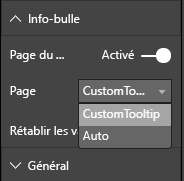

# <a name="power-bi-visuals-tooltips"></a>Info-bulles de visuels Power BI

Les visuels peuvent désormais utiliser la prise en charge de l’info-bulle de Power BI. Les info-bulles Power BI gèrent les interactions suivantes :

Afficher une info-bulle.
Masquer une info-bulle.
Déplacer une info-bulle.

Les info-bulles peuvent afficher un élément textuel avec un titre, une valeur avec une couleur et une opacité données pour des coordonnées spécifiées. Ces données sont fournies à l’API. Et l’hôte Power BI l’affiche de la même façon qu’il affiche des info-bulles pour des visuels natifs.

Exemple : info-bulles de l’exemple de BarChart.


L’info-bulle ci-dessus illustre une catégorie et une valeur de barre uniques. Elle peut être étendue pour afficher plusieurs valeurs au sein d’une seule et même info-bulle.

## <a name="handling-tooltips"></a>Gestion des info-bulles

« ITooltipService » est l’interface par le biais de laquelle vous gérez les info-bulles. Cette interface permet d’informer l’hôte qu’une info-bulle doit être affichée, supprimée ou déplacée.

```typescript
    interface ITooltipService {
        enabled(): boolean;
        show(options: TooltipShowOptions): void;
        move(options: TooltipMoveOptions): void;
        hide(options: TooltipHideOptions): void;
    }
```

Votre visuel doit écouter les événements de souris intérieurs et appeler les délégués `show()`, `move()` et `hide()` si nécessaire avec le contenu approprié renseigné dans les objets `Tooltip****Options`.
`TooltipShowOptions` et `TooltipHideOptions` définissent à leur tour les éléments à afficher et le comportement à adopter dans ces événements.
Étant donné que l’appel de ces méthodes implique des événements utilisateur tels que des déplacements de souris ou des événements tactiles, il est judicieux de créer des écouteurs pour ces événements, qui, à leur tour, invoquent les membres `TooltipService`.
Notre exemple s’agrège dans une classe appelée `TooltipServiceWrapper`.

### <a name="tooltipservicewrapper-class"></a>Classe TooltipServiceWrapper

L’idée de base de cette classe est de contenir l’instance du `TooltipService`, d’écouter les événements de souris D3 sur les éléments pertinents, puis d’appeler les délégués `show()` et `hide()` si nécessaire.
La classe contient et gère l’état et la logique appropriés de ces événements, principalement adaptés à l’interfaçage avec le code D3 sous-jacent. L’interfaçage et la conversion D3 ne sont pas traités dans ce document.

L’exemple de code complet se trouve dans le [référentiel visuel SampleBarChart](https://github.com/Microsoft/PowerBI-visuals-sampleBarChart/commit/981b021612d7b333adffe9f723ab27783c76fb14).

### <a name="creating-tooltipservicewrapper"></a>Création d’une classe TooltipServiceWrapper

Le constructeur BarChart possède maintenant un membre `tooltipServiceWrapper`, qui est instancié dans le constructeur avec l’instance `tooltipService` de l’hôte.

```typescript
        private tooltipServiceWrapper: ITooltipServiceWrapper;

        this.tooltipServiceWrapper = createTooltipServiceWrapper(this.host.tooltipService, options.element);
```

La classe `TooltipServiceWrapper` contient l’instance `tooltipService`, également en tant qu’élément D3 racine des paramètres visuels et tactiles.

```typescript
    class TooltipServiceWrapper implements ITooltipServiceWrapper {
        private handleTouchTimeoutId: number;
        private visualHostTooltipService: ITooltipService;
        private rootElement: Element;
        private handleTouchDelay: number;

        constructor(tooltipService: ITooltipService, rootElement: Element, handleTouchDelay: number) {
            this.visualHostTooltipService = tooltipService;
            this.handleTouchDelay = handleTouchDelay;
            this.rootElement = rootElement;
        }
        .
        .
        .
    }
```

Le point d’entrée unique de cette classe pour enregistrer les écouteurs d’événements est la méthode `addTooltip`.

### <a name="addtooltip-method"></a>Méthode addTooltip

```typescript
        public addTooltip<T>(
            selection: d3.Selection<Element>,
            getTooltipInfoDelegate: (args: TooltipEventArgs<T>) => VisualTooltipDataItem[],
            getDataPointIdentity: (args: TooltipEventArgs<T>) => ISelectionId,
            reloadTooltipDataOnMouseMove?: boolean): void {

            if (!selection || !this.visualHostTooltipService.enabled()) {
                return;
            }
        ...
        ...
        }
```

* **selection: d3.Selection<Element>**
* Éléments D3 sur lesquels les info-bulles sont gérées
* **getTooltipInfoDelegate: (args: TooltipEventArgs<T>) => VisualTooltipDataItem[]**
* Délégué pour renseigner le contenu d’info-bulle (élément à afficher) par contexte
* **getDataPointIdentity: (args: TooltipEventArgs<T>) => ISelectionId**
* Délégué pour récupérer l’ID de point de données (inutilisé dans cet exemple) 
* **reloadTooltipDataOnMouseMove?: boolean**
* Valeur booléenne indiquant s’il convient d’actualiser les données d’info-bulle pendant un événement mouseMove (inutilisée dans cet exemple)

Comme vous le voyez, la méthode `addTooltip` est fermée sans aucune action si l’instance `tooltipService` est désactivée ou en l’absence de véritable sélection.

### <a name="call-of-show-method-to-display-a-tooltip"></a>Appel de la méthode Show pour afficher une info-bulle

`addTooltip` écoute ensuite l’événement `mouseover` D3.

```typescript
        ...
        ...
        selection.on("mouseover.tooltip", () => {
            // Ignore mouseover while handling touch events
            if (!this.canDisplayTooltip(d3.event))
                return;

            let tooltipEventArgs = this.makeTooltipEventArgs<T>(rootNode, true, false);
            if (!tooltipEventArgs)
                return;

            let tooltipInfo = getTooltipInfoDelegate(tooltipEventArgs);
            if (tooltipInfo == null)
                return;

            let selectionId = getDataPointIdentity(tooltipEventArgs);

            this.visualHostTooltipService.show({
                coordinates: tooltipEventArgs.coordinates,
                isTouchEvent: false,
                dataItems: tooltipInfo,
                identities: selectionId ? [selectionId] : [],
            });
        });
```

* **makeTooltipEventArgs**
* Extrait le contexte des éléments sélectionnés D3 dans un tooltipEventArgs. Calcule également les coordonnées.
* **getTooltipInfoDelegate**
* Génère ensuite le contenu de l’info-bulle à partir de tooltipEventArgs. En raison de la logique du visuel, il s’agit d’un rappel de la classe BarChart. Il s’agit du contenu du texte réel à afficher dans l’info-bulle.
* **getDataPointIdentity**
* Inutilisé dans cet exemple.
* **this.visualHostTooltipService.show**
* Appel destiné à afficher l’info-bulle.  

Une gestion supplémentaire est disponible dans l’exemple correspondant aux événements `mouseout` et `mousemove`.

Pour plus d’informations, consultez [Référentiel visuel SampleBarChart](https://github.com/Microsoft/PowerBI-visuals-sampleBarChart/commit/981b021612d7b333adffe9f723ab27783c76fb14).

### <a name="populating-the-tooltip-content-by-gettooltipdata-method"></a>Remplissage du contenu d’info-bulle à l’aide de la méthode getTooltipData

Le `BarChart` a été ajouté avec un membre `getTooltipData` qui extrait simplement la catégorie, la valeur et la couleur du point de données dans un élément VisualTooltipDataItem[].

```typescript
        private static getTooltipData(value: any): VisualTooltipDataItem[] {
            return [{
                displayName: value.category,
                value: value.value.toString(),
                color: value.color,
                header: 'ToolTip Title'
            }];
        }
```

Dans l’implémentation ci-dessus, le membre `header` est constant, mais il peut être utilisé pour des implémentations plus complexes, qui requièrent des valeurs dynamiques. Vous pouvez renseigner le `VisualTooltipDataItem[]` avec plusieurs éléments, qui ajouteront plusieurs lignes à l’info-bulle. Il peut être utile dans les visuels, tels que les graphiques à barres empilées dans lesquels l’info-bulle peut afficher des données provenant de plusieurs points de données.

### <a name="calling-addtooltip-method"></a>Appel de la méthode addTooltip

La dernière étape consiste à appeler `addTooltip` lorsque les données réelles peuvent changer. Cet appel a eu lieu dans la méthode `BarChart.update()`. Un appel est donc effectué pour surveiller la sélection de tous les éléments « bar », en transmettant uniquement l’élément `BarChart.getTooltipData()` comme indiqué ci-dessus.

```typescript
        this.tooltipServiceWrapper.addTooltip(this.barContainer.selectAll('.bar'),
            (tooltipEvent: TooltipEventArgs<number>) => BarChart.getTooltipData(tooltipEvent.data),
            (tooltipEvent: TooltipEventArgs<number>) => null);
```

## <a name="adding-report-page-tooltips"></a>Ajout d’info-bulles de page de rapport

Pour ajouter la prise en charge des info-bulles de page de rapport, la plupart des modifications se trouvent dans capabilities.json.

Exemple de schéma :

```json
{
    "tooltips": {
        "supportedTypes": {
            "default": true,
            "canvas": true
        },
        "roles": [
            "tooltips"
        ]
    }
}
```

La définition des info-bulles de page de rapport peut être effectuée dans le volet Format.



`supportedTypes` est la configuration des info-bulles prise en charge par le visuel et reflétée également dans les champs. `default` spécifie si la liaison « automatique » des info-bulles par le biais du champ de données est prise en charge. Un canevas spécifie si les info-bulles de page de rapport sont prises en charge.

Élément `roles` facultatif. Une fois défini, cet élément détermine les rôles de données qui doivent être liés à l’option d’info-bulle sélectionnée également dans des champs.

Pour plus d’informations, consultez les instructions d’utilisation des info-bulles de page de rapport dans [Report Page Tooltips](https://powerbi.microsoft.com/blog/power-bi-desktop-march-2018-feature-summary/#tooltips) (Info-bulles de page de rapport).

Pour afficher l’info-bulle de page de rapport, dès l’appel de `ITooltipService.Show(options: TooltipShowOptions)` ou `ITooltipService.Move(options: TooltipMoveOptions)`, l’hôte Power BI consomme l’ID selectionId (propriété `identities` de l’argument `options` ci-dessus). L’ID selectionId doit représenter les données sélectionnées (catégorie, série, etc.) de l’élément que vous avez pointé pour être récupéré par l’info-bulle.

Exemple d’envoi de l’ID selectionId aux appels d’affichage d’info-bulle :

```typescript
    this.tooltipServiceWrapper.addTooltip(this.barContainer.selectAll('.bar'),
        (tooltipEvent: TooltipEventArgs<number>) => BarChart.getTooltipData(tooltipEvent.data),
        (tooltipEvent: TooltipEventArgs<number>) => tooltipEvent.data.selectionID);
```
