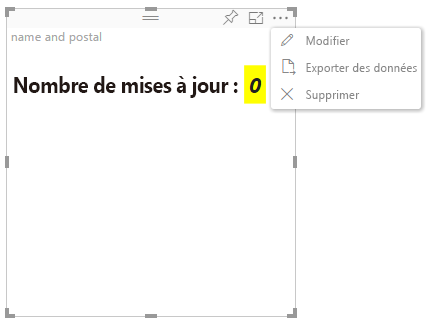

# Mode Édition avancé

Les visuels qui requièrent des contrôles d’interface utilisateur avancés peuvent déclarer la prise en charge du mode Édition avancé.
En cas de prise en charge, en mode de modification de rapport, un bouton `Edit` s’affiche dans le menu du visuel.
Lorsque vous cliquez sur le bouton `Edit`, la valeur EditMode est définie sur `Advanced`.
Le visuel peut utiliser l’indicateur EditMode pour déterminer s’il doit afficher de tels contrôles d’interface utilisateur.

Par défaut, le visuel ne prend pas en charge le mode Édition avancé.
Si un comportement différent est requis, il doit être indiqué explicitement dans le fichier `capabilities.json` du visuel, en définissant la propriété `advancedEditModeSupport`.

Valeurs possibles :

- 0 - NotSupported

- 1 - SupportedNoAction

- 2 - SupportedInFocus

## Passage au mode Édition avancé

Le bouton `Edit` est visible dans les cas suivants :

 1 : propriété `advancedEditModeSupport` définie dans le fichier capabilities.json sur `SupportedNoAction` ou sur `SupportedInFocus`.

 2 : visuel affiché en mode de modification de rapport.

Si la propriété `advancedEditModeSupport` est absente du fichier capabilities.json ou si elle est définie sur `NotSupported`, le bouton Modifier disparaît.

Lorsque l’utilisateur clique sur `Edit`, le visuel reçoit un appel update() avec la valeur EditMode définie sur `Advanced`.
Selon la valeur définie dans les fonctionnalités, les actions suivantes se produisent :

* `SupportedNoAction` : aucune action supplémentaire de l’hôte.
* `SupportedInFocus` : l’hôte affiche le visuel en mode Focus.

## Quitter le mode Édition avancé

Le bouton `Back to report` est visible dans les cas suivants :

1 : propriété `advancedEditModeSupport` définie dans le fichier capabilities.json sur `SupportedInFocus`.
