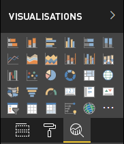

# <a name="analytics-pane-in-power-bi-visuals"></a>Volet Analytique des visuels Power BI

Le **volet Analytique** a été [introduit pour les visuels natifs](https://docs.microsoft.com/power-bi/desktop-analytics-pane) en novembre 2018.
Les visuels personnalisés avec l’API v2.5.0 peuvent présenter et gérer leurs propriétés dans le **volet Analytique**.



Il est géré de la même façon que les [propriétés dans le volet Format](https://docs.microsoft.com/power-bi/developer/custom-visual-develop-tutorial-format-options), en définissant un objet dans le fichier capabilities.json du visuel. 

Les différences sont les suivantes :

1. Dans la définition de `object`, ajoutez un champ `objectCategory` avec la valeur 2.

    > [!NOTE]
    > Le champ `objectCategory` est un champ facultatif introduit dans l’API 2.5.0. Il définit l’aspect du visuel que l’objet contrôle (1 = mise en forme, 2 = analytique). La « mise en forme » est utilisée pour l’apparence, les couleurs, les axes, les étiquettes, etc. « L’analytique » est utilisé pour les prévisions, les courbes de tendance, les lignes de référence, les formes, etc.
    >
    > `objectCategory` est défini par défaut sur « mise en forme » s’il est omis.

2. L’objet doit avoir les deux propriétés suivantes :
    1. `show` de type booléen avec false comme valeur par défaut.
    2. `displayName` de type texte. La valeur par défaut que vous choisissez devient le nom d’affichage initial de l’instance.

```json
{
  "objects": {
    "YourAnalyticsPropertiesCard": {
      "displayName": "Your analytics properties card's name",
      "objectCategory": 2,
      "properties": {
        "show": {
          "type": {
            "bool": true
          }
        },
        "displayName": {
          "type": {
            "text": true
          }
        },
      ... //any other properties for your Analytics card
      }
    }
  ...
  }
}
```

Toutes les autres propriétés peuvent être définies de la même façon que pour les objets format. L’énumération d’objets est effectuée de la même façon que dans le **volet Format**.

***Limites et problèmes connus***

  1. Pas de prise en charge multi-instance pour l’instant. Les objets ne peuvent pas avoir un [sélecteur](https://microsoft.github.io/PowerBI-visuals/docs/concepts/objects-and-properties/#selector) autre que statique (« sélecteur » : Null), et les visuels personnalisés ne peuvent pas avoir plusieurs instances d’une carte définies par l’utilisateur.
  2. Les propriétés de type `integer` ne sont pas affichées correctement. Pour résoudre ce problème, il est conseillé d’utiliser plutôt le type `numeric`.

> [!NOTE]
> Utilisez le volet Analytique uniquement pour les objets qui ajoutent de nouvelles informations ou qui donnent un nouvel éclairage aux informations présentées. Exemple : des lignes de référence dynamiques illustrant des tendances importantes.
> Les options qui contrôlent l’apparence du visuel, c’est-à-dire sa mise en forme, doivent être conservées dans le volet Mise en forme.
