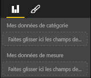

# <a name="power-bi-visual-capabilities"></a>Fonctionnalités visuelles Power BI

Les fonctionnalités fournissent des informations à l’hôte concernant votre visuel. Toutes les propriétés du modèle de fonctionnalités sont `optional`

Les objets racine des fonctionnalités du visuel sont `dataRoles`, `dataViewMappings`, et ainsi de suite.

```json
{
    "dataRoles": [ ... ],
    "dataViewMappings": [ ... ],
    "objects":  { ... },
    "supportsHighlight": true|false,
    "advancedEditModeSupport": 0|1|2,
    "sorting": { ... }
}

```

## <a name="define-the-data-fields-your-visual-expects---dataroles"></a>Définir les champs de données attendus par votre visuel - `dataRoles`

Pour définir des champs pouvant être liés à des données, nous utilisons `dataRoles` qui prend un tableau d’objets `DataViewRole`, définissant toutes les propriétés nécessaires.

### <a name="properties"></a>Propriétés

* **name** : nom interne de ce champ de données (doit être unique)
* **kind** : type de champ :
    * `Grouping` : valeurs discrètes utilisées pour le regroupement des champs de mesure
    * `Measure` : Valeurs de données numériques
    * `GroupingOrMeasure` : peut être utilisé comme un regroupement ou une mesure
* **DisplayName** : nom affiché à l’utilisateur dans le volet des propriétés
* **description** : brève description du champ (facultatif)
* **requiredTypes** : type de données nécessaire pour ce rôle de données. Toutes les valeurs qui ne correspondent pas auront une valeur null (facultatif)
* **preferredTypes** : type de données préféré pour ce rôle de données (facultatif)

### <a name="valid-data-types-in-requiredtypes-and-preferredtypes"></a>Types de données valides dans « requiredTypes » et « preferredTypes »

* **bool** : une valeur booléenne
* **integer** : une valeur entière (nombre entier)
* **numeric** : une valeur numérique
* **text** : une valeur de texte
* **geography** : une donnée géographique

### <a name="example"></a>Example

```json
"dataRoles": [
    {
        "displayName": "My Category Data",
        "name": "myCategory",
        "kind": "Grouping",
        "requiredTypes": [
            {
                "text": true
            },
            {
                "numeric": true
            },
            {
                "integer": true
            }
        ],
        "preferredTypes": [
            {
                "text": true
            }
        ]
    },
    {
        "displayName": "My Measure Data",
        "name": "myMeasure",
        "kind": "Measure",
        "requiredTypes": [
            {
                "integer": true
            },
            {
                "numeric": true
            }
        ],
        "preferredTypes": [
            {
                "integer": true
            }
        ]
    },
    {
        "displayNameKey": "Visual_Location",
        "name": "Locations",
        "kind": "Measure",
        "displayName": "Locations",
        "requiredTypes": [
            {
                "geography": {
                    "address": true
                }
            },
            {
                "geography": {
                    "city": true
                }
            },
            {
                "geography": {
                    "continent": true
                }
            },
            {
                "geography": {
                    "country": true
                }
            },
            {
                "geography": {
                    "county": true
                }
            },
            {
                "geography": {
                    "place": true
                }
            },
            {
                "geography": {
                    "postalCode": true
                }
            },
            {
                "geography": {
                    "region": true
                }
            },
            {
                "geography": {
                    "stateOrProvince": true
                }
            }
        ]
    }
]
```

Les rôles de données ci-dessus créent les champs suivants



## <a name="define-how-you-want-the-data-mapped---dataviewmappings"></a>Définir la façon dont vous souhaitez mapper les données - `dataViewMappings`

Un mappage DataViewMapping décrit comment les rôles de données sont liés les uns aux autres et vous permet de spécifier des exigences conditionnelles pour eux.

La plupart des visuels fournissent un mappage unique, mais vous pouvez fournir plusieurs mappages dataViewMappings. Chaque mappage valide produira un DataView. 

```json
"dataViewMappings": [
    {
        "conditions": [ ... ],
        "categorical": { ... },
        "table": { ... },
        "single": { ... },
        "matrix": { ... }
    }
]
```

[En savoir plus sur les mappages DataViewMappings](dataview-mappings.md)

## <a name="define-property-pane-options---objects"></a>Définir les options du volet de propriétés - `objects`

Les objets décrivent des propriétés personnalisables associées au visuel.
Chaque objet peut avoir plusieurs propriétés et chaque propriété est associée à un type.
Les types font référence à ce que sera la propriété. Pour plus d’informations sur les types, voir ci-dessous.

```json
"objects": {
    "myCustomObject": {
        "displayName": "My Object Name",
        "properties": { ... }
    }
}
```

[En savoir plus sur les objets](objects-properties.md)

## <a name="handle-partial-highlighting---supportshighlight"></a>Gérer une mise en surbrillance partielle- `supportsHighlight`

Par défaut, cette valeur est définie sur false, ce qui signifie que vos « valeurs » seront automatiquement filtrées quand un élément de la page est sélectionné, mettant ainsi à jour votre visuel pour afficher uniquement la valeur sélectionnée. Si vous souhaitez afficher les données complètes, mettez seulement en surbrillance les éléments sélectionnés que vous souhaitez configurer sur `supportsHighlight` true dans votre capabilities.json.

[En savoir plus sur la mise en surbrillance](highlight.md)

## <a name="handle-advanced-edit-mode---advancededitmodesupport"></a>Gérer le mode d’édition avancé - `advancedEditModeSupport`

Un visuel peut déclarer sa prise en charge du mode d’édition avancé.
Par défaut, un visuel ne prend pas en charge le mode d’édition avancé, sauf indication contraire dans capabilities.json.

[En savoir plus sur advancedEditModeSupport](advanced-edit-mode.md)

## <a name="data-sorting-options-for-visual---sorting"></a>Options de tri des données pour un visuel - `sorting`

Un visuel peut définir son comportement de tri par le biais de ses fonctionnalités.
Par défaut, un visuel ne prend pas en charge la modification de son ordre de tri, sauf indication contraire dans capabilities.json.

[En savoir plus sur le tri](sort-options.md)
