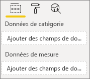
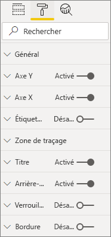
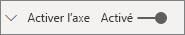
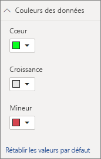

# <a name="build-a-bar-chart"></a>Générer un graphique à barres

Cet article est un guide pas à pas pour la création d’un exemple de visuel de graphique à barres Power BI avec du code. Vous pouvez obtenir l’exemple de code complet sur [https://github.com/Microsoft/PowerBI-visuals-sampleBarChart](https://github.com/Microsoft/PowerBI-visuals-sampleBarChart).

## <a name="view-model"></a>Afficher le modèle
Il est important de commencer par définir le modèle de vue de graphique à barres et d’effectuer une itération sur ce qui est exposé à votre visuel à mesure que vous le créez.

```typescript
/**
 * Interface for BarCharts viewmodel.
 *
 * @interface
 * @property {BarChartDataPoint[]} dataPoints - Set of data points the visual will render.
 * @property {number} dataMax                 - Maximum data value in the set of data points.
 */
interface BarChartViewModel {
    dataPoints: BarChartDataPoint[];
    dataMax: number;
};

/**
 * Interface for BarChart data points.
 *
 * @interface
 * @property {number} value    - Data value for the point.
 * @property {string} category - Corresponding category of the data value.
 */
interface BarChartDataPoint {
    value: number;
    category: string;
};
```

### <a name="use-static-data"></a>Utiliser des données statiques

L’utilisation de données statiques est un excellent moyen de tester votre visuel sans liaison de données. Votre modèle de vue ne changera pas, même après avoir ajouté une liaison de données lors d’une étape ultérieure.

```typescript
let testData: BarChartDataPoint[] = [
    {
        value: 10,
        category: 'a'
    },
    {
        value: 20,
        category: 'b'
    },
    {
        value: 1,
        category: 'c'
    },
    {
        value: 100,
        category: 'd'
    },
    {
        value: 500,
        category: 'e'
    }];

let viewModel: BarChartViewModel = {
    dataPoints: testData,
    dataMax: d3.max(testData.map((dataPoint) => dataPoint.value))
};
```

## <a name="data-binding"></a>Liaison de données 
Pour ajouter la liaison de données, définissez les fonctionnalités de votre visuel dans *capabilities.json*. L’exemple de code a déjà un schéma que vous pouvez utiliser.

La liaison de données agit sur une zone **Champ** dans Power BI.



### <a name="add-data-roles"></a>Ajouter des rôles de données
L’exemple de code a déjà des rôles de données, mais vous pouvez les personnaliser.

- `displayName` est le nom affiché dans la zone **Champ**.
- `name` est le nom interne utilisé pour faire référence au rôle de données.
- `kind` est le type de champ. Les champs *Groupe* (0) ont des valeurs discrètes. Les champs *Mesure* (1) ont des valeurs de données numériques.

```json
"dataRoles": [
    {
        "displayName": "Category Data",
        "name": "category",
        "kind": 0
    },
    {
        "displayName": "Measure Data",
        "name": "measure",
        "kind": 1
    }
],
```

Pour plus d’informations, consultez [Rôles de données](./capabilities.md#define-the-data-fields-that-your-visual-expects-dataroles).

### <a name="add-conditions-to-dataviewmapping"></a>Ajouter des conditions à DataViewMapping
Définissez les conditions dans votre `dataViewMappings` pour définir le nombre de champs que chaque zone Champ peut lier. Utilisez le `name` interne du rôle de données pour faire référence à chaque champ.

```json
    "dataViewMappings": [
        {
            "conditions": [
                {
                    "category": {
                        "max": 1
                    },
                    "measure": {
                        "max": 1
                    }
                }
            ],
        }
    ]
```

Pour plus d’informations, consultez [Mappage de la vue de données](./dataview-mappings.md).

### <a name="define-and-use-visualtransform"></a>Définir et utiliser visualTransform
Le `DataView` est la structure que Power BI fournit à votre visuel, qui contient les données interrogées à visualiser. Toutefois, `DataView` peut fournir des données sous différentes formes, comme des catégories et des tableaux. Pour créer un visuel catégorique comme un graphique à barres, il vous suffit d’utiliser la propriété catégorique sur la `DataView`. La définition de `visualTransform` vous permet de convertir une `DataView` en un modèle de vue que votre visuel utilisera.

Pour affecter des couleurs et les sélectionner lors de la définition de points de données individuels, utilisez `IVisualHost`. 

```typescript
/**
 * Function that converts queried data into a view model that will be used by the visual
 *
 * @function
 * @param {VisualUpdateOptions} options - Contains references to the size of the container
 *                                        and the dataView which contains all the data
 *                                        the visual had queried.
 * @param {IVisualHost} host            - Contains references to the host which contains services
 */
function visualTransform(options: VisualUpdateOptions, host: IVisualHost): BarChartViewModel {
    /*Convert dataView to your viewModel*/
}

```

## <a name="color"></a>Couleur 
La couleur est exposée comme un des services disponibles sur `IVisualHost`.

### <a name="add-color-to-data-points"></a>Ajouter de la couleur aux points de données
Chaque point de données est représenté par une couleur différente. Vous ajoutez de la couleur à l’interface `BarChartDataPoint`.

```typescript
/**
 * Interface for BarChart data points.
 *
 * @interface
 * @property {number} value    - Data value for the point.
 * @property {string} category - Corresponding category of the data value.
 * @property {string} color    - Color corresponding to the data point.
 */
interface BarChartDataPoint {
    value: number;
    category: string;
    color: string;
};
```

### <a name="the-colorpalette-service"></a>Le service colorPalette
Le service `colorPalette` gère les couleurs utilisées dans votre visuel. Son instance est disponible sur `IVisualHost`.

### <a name="assign-color-to-data-points"></a>Affecter une couleur à des points de données
Vous avez défini `visualTransform` comme une construction pour convertir une `dataView` en un modèle de vue utilisable par un graphique à barres. Étant donné que vous itérez à travers les points de données dans `visualTransform`, il s’agit également de l’emplacement idéal pour affecter des couleurs.

```typescript
let colorPalette: IColorPalette = host.colorPalette; // host: IVisualHost
for (let i = 0, len = Math.max(category.values.length, dataValue.values.length); i < len; i++) {
    barChartDataPoints.push({
        category: category.values[i],
        value: dataValue.values[i],
        color: colorPalette.getColor(category.values[i]).value,
    });
}
```

## <a name="selection-and-interactions"></a>Sélection et interactions
La sélection permet à l’utilisateur d’interagir avec votre visuel et d’autres éléments visuels. 

### <a name="add-selection-to-each-data-point"></a>Ajouter la sélection à chaque point de données
Étant donné que chaque point de données est unique, ajoutez la sélection à chaque point de données. Vous ajoutez la propriété de sélection sur l’interface `BarChartDataPoint`.

```typescript
/**
 * Interface for BarChart data points.
 *
 * @interface
 * @property {number} value             - Data value for the point.
 * @property {string} category          - Corresponding category of data value.
 * @property {string} color             - Color corresponding to data point.
 * @property {ISelectionId} selectionId - Id assigned to data point for cross filtering
 *                                        and visual interaction.
 */
interface BarChartDataPoint {
    value: number;
    category: string;
    color: string;
    selectionId: ISelectionId;
};
```

### <a name="assign-selection-ids-to-each-data-point"></a>Affecter des ID de sélection à chaque point de données
Comme vous itérez à travers les points de données dans `visualTransform`, il s’agit également de l’emplacement idéal pour créer des ID de sélection. La variable hôte est un `IVisualHost`, qui contient les services que le visuel peut utiliser, par exemple le générateur de couleurs et de sélection. 

Utilisez la méthode de fabrique `createSelectionIdBuilder` sur `IVisualHost` pour créer un nouvel ID de sélection. Créez un nouveau générateur de sélection pour chaque point de données.

Étant donné que vous effectuez des sélections basées uniquement sur la catégorie, vous avez seulement besoin de définir des sélections `withCategory`.

```typescript
for (let i = 0, len = Math.max(category.values.length, dataValue.values.length); i < len; i++) {
    barChartDataPoints.push({
        category: category.values[i],
        value: dataValue.values[i],
        color: colorPalette.getColor(category.values[i]).value,
        selectionId: host.createSelectionIdBuilder()
            .withCategory(category, i)
            .createSelectionId()
    });
}
```

Pour plus d’informations, consultez [Créer une instance du générateur de sélection](./selection-api.md#create-an-instance-of-the-selection-builder).

### <a name="interact-with-data-points"></a>Interagir avec les points de données
Vous pouvez interagir avec chaque barre du graphique à barres une fois qu’un ID de sélection est attribué au point de données. Le graphique à barres écoute les événements de `click`.

Utilisez la méthode de fabrique `selectionManager` sur `IVisualHost` pour créer un gestionnaire de sélection pour le filtrage croisé et l’effacement des sélections.

```typescript
let selectionManager = this.selectionManager;

//This must be an anonymous function instead of a lambda because
//d3 uses 'this' as the reference to the element that was clicked.
bars.on('click', function(d) {
    selectionManager.select(d.selectionId).then((ids: ISelectionId[]) => {
        bars.attr({
            'fill-opacity': ids.length > 0 ? BarChart.Config.transparentOpacity : BarChart.Config.solidOpacity
        });

        d3.select(this).attr({
            'fill-opacity': BarChart.Config.solidOpacity
        });
    });

    (<Event>d3.event).stopPropagation();
});
```

Pour plus d’informations, consultez [Utilisation de SelectionManager](./selection-api.md#how-to-use-selectionmanager-to-select-data-points).

## <a name="static-objects"></a>Objets statiques

Vous pouvez ajouter des objets au volet **Propriétés** pour personnaliser davantage le visuel. Ces personnalisations peuvent être des modifications de l’interface utilisateur ou des modifications liées aux données interrogées. L’exemple utilise des objets statiques pour restituer l’axe X du graphique à barres.

Vous pouvez activer ou désactiver les objets dans le volet **Propriétés**.



### <a name="define-objects-in-capabilities"></a>Définir des objets dans les fonctionnalités
Définissez une propriété `objects` à l’intérieur de votre fichier *capabilities.json* pour les objets à afficher dans le volet **Propriétés**.
- `enableAxis` est le nom interne auquel la `dataView` fait référence. 
- `displayName` est le nom affiché dans le volet de **Propriétés**.
- `bool` est une valeur primitive généralement utilisée avec des objets statiques, comme des zones de texte ou des commutateurs.
- `show` est une propriété spéciale sur `properties` qui active le commutateur `show` sur l’objet. Étant donné que `show` est un commutateur, il est de type `bool`.



```typescript
"objects": {
    "enableAxis": {
        "displayName": "Enable Axis",
        "properties": {
            "show": {
                "displayName": "Enable Axis",
                "type": { "bool": true }
            }
        }
    }
}
```

Pour plus d'informations, consultez [Objets](./objects-properties.md).

### <a name="define-property-settings"></a>Définir les paramètres de propriété

Les sections suivantes décrivent les principes de base de la définition des paramètres de propriété. Vous pouvez également utiliser les classes d’utilitaire définies dans le package `powerbi-visuals-utils-dataviewutils` pour définir les paramètres de propriété. Pour plus d’informations, consultez la documentation et les exemples de la classe [DataViewObjectsParser](https://github.com/Microsoft/powerbi-visuals-utils-dataviewutils/blob/master/docs/api/data-view-objects-parser.md).


Bien que cela est facultatif, il est préférable de placer la plupart des paramètres sur un seul objet pour faciliter leur référence.

```typescript
/**
 * Interface for BarCharts viewmodel.
 *
 * @interface
 * @property {BarChartDataPoint[]} dataPoints - Set of data points the visual will render.
 * @property {number} dataMax                 - Maximum data value in the set of data points.
 * @property {BarChartSettings} settings      - Object property settings
 */
interface BarChartViewModel {
    dataPoints: BarChartDataPoint[];
    dataMax: number;
    settings: BarChartSettings;
};

/**
 * Interface for BarChart settings.
 *
 * @interface
 * @property "show" enableAxis - Object property that allows axis to be enabled.
 */
interface BarChartSettings {
    enableAxis: {
        show: boolean;
    };
}
```

### <a name="define-and-use-objectenumerationutility"></a>Définir et utiliser ObjectEnumerationUtility
Les valeurs de propriété d’objet sont disponibles en tant que métadonnées sur la `dataView`, mais il n’existe aucun service pour vous aider à récupérer ces propriétés. `ObjectEnumerationUtility` est un ensemble de fonctions statiques que vous pouvez utiliser pour récupérer des valeurs d’objet à partir de la `dataView` et pour d’autres projets visuels. Le `ObjectEnumerationUtility` est facultatif, mais il est parfait pour itérer à travers la `dataView` pour récupérer les propriétés de l’objet.

```typescript
/**
 * Gets property value for a particular object.
 *
 * @function
 * @param {DataViewObjects} objects - Map of defined objects.
 * @param {string} objectName       - Name of desired object.
 * @param {string} propertyName     - Name of desired property.
 * @param {T} defaultValue          - Default value of desired property.
 */
export function getValue<T>(objects: DataViewObjects, objectName: string, propertyName: string, defaultValue: T ): T {
    if(objects) {
        let object = objects[objectName];
        if(object) {
            let property: T = object[propertyName];
            if(property !== undefined) {
                return property;
            }
        }
    }
    return defaultValue;
}
```

Consultez [objectEnumerationUtility.ts](https://github.com/Microsoft/PowerBI-visuals-sampleBarChart/blob/master/src/objectEnumerationUtility.ts) pour le code source.

### <a name="retrieve-property-values-from-dataview"></a>Récupérer les valeurs de propriété à partir de la dataView
La `visualTransform` est l’endroit idéal pour manipuler le modèle de vue du visuel. Pour continuer ce modèle, récupérez les propriétés de l’objet à partir de la `dataView`.

Définissez l’état par défaut de la propriété et utilisez `getValue` pour récupérer la propriété à partir de la `dataView`.

```typescript
let defaultSettings: BarChartSettings = {
    enableAxis: {
        show: false,
    }
};

let barChartSettings: BarChartSettings = {
    enableAxis: {
        show: getValue<boolean>(objects, 'enableAxis', 'show', defaultSettings.enableAxis.show),
    }
}
```

### <a name="populate-property-pane-with-enumerateobjectinstances"></a>Remplir le volet de propriétés avec enumerateObjectInstances
La méthode facultative `enumerateObjectInstances` sur `IVisual` énumère tous les objets et les place dans le volet **Propriétés**. Chaque objet est appelé avec `enumerateObjectInstances`. Le nom de l’objet est disponible sur `EnumerateVisualObjectInstancesOptions`.

Pour chaque objet, définissez la propriété avec son état actuel.

```typescript
/**
 * Enumerates through the objects defined in the capabilities and adds the properties to the format pane
 *
 * @function
 * @param {EnumerateVisualObjectInstancesOptions} options - Map of defined objects
 */
public enumerateObjectInstances(options: EnumerateVisualObjectInstancesOptions): VisualObjectInstanceEnumeration {
    let objectName = options.objectName;
    let objectEnumeration: VisualObjectInstance[] = [];

    switch(objectName) {
        case 'enableAxis':
            objectEnumeration.push({
                objectName: objectName,
                properties: {
                    show: this.barChartSettings.enableAxis.show,
                },
                selector: null
            });
    };

    return objectEnumeration;
}
```

### <a name="control-property-update-logic"></a>Logique de mise à jour des propriétés de contrôle
Une fois qu’un objet est ajouté au volet **Propriétés**, chaque bouton bascule déclenche une mise à jour. Ajoutez une logique d’objet spécifique dans les blocs `if` :

```typescript
if(settings.enableAxis.show) {
    let margins = BarChart.Config.margins;
    height -= margins.bottom;
}
```

## <a name="databound-objects"></a>Objets liés aux données
Les objets liés aux données sont similaires aux objets statiques, mais gèrent généralement la sélection des données. Par exemple, vous pouvez modifier la couleur associée au point de données.



### <a name="define-object-in-capabilities"></a>Définir l’objet dans les fonctionnalités
À l’instar des objets statiques, définissez un autre objet dans *capabilities.json*. 
- `colorSelector` est le nom interne auquel la `dataView` fait référence.
- `displayName` est le nom affiché dans le volet de **Propriétés**.
- `fill` est une valeur d’objet structurel non associée à un type primitif.

```typescript
"colorSelector": {
    "displayName": "Data Colors",
    "properties": {
        "fill": {
            "displayName": "Color",
            "type": {
                "fill": {
                    "solid": {
                        "color": true
                    }
                }
            }
        }
    }
}
```

Pour plus d'informations, consultez [Objets](./objects-properties.md).

### <a name="use-objectenumerationutility"></a>Utiliser ObjectEnumerationUtility
Comme avec les objets statiques, vous devez récupérer les détails de l’objet à partir de la `dataView`. Toutefois, au lieu d’avoir les valeurs d’objet dans les métadonnées, elles sont associées à chaque catégorie.

```typescript
/**
 * Gets property value for a particular object in a category.
 *
 * @function
 * @param {DataViewCategoryColumn} category - List of category objects.
 * @param {number} index                    - Index of category object.
 * @param {string} objectName               - Name of desired object.
 * @param {string} propertyName             - Name of desired property.
 * @param {T} defaultValue                  - Default value of desired property.
 */
export function getCategoricalObjectValue<T>(category: DataViewCategoryColumn, index: number, objectName: string, propertyName: string, defaultValue: T): T {
    let categoryObjects = category.objects;

    if(categoryObjects) {
        let categoryObject: DataViewObject = categoryObjects[index];
        if(categoryObject) {
            let object = categoryObject[objectName];
            if(object) {
                let property: T = object[propertyName];
                if(property !== undefined) {
                    return property;
                }
            }
        }
    }
    return defaultValue;
}
```

Consultez [objectEnumerationUtility.ts](https://github.com/Microsoft/PowerBI-visuals-sampleBarChart/blob/master/src/objectEnumerationUtility.ts) pour le code source.

### <a name="define-default-color-and-retrieve-categorical-object-from-dataview"></a>Définir la couleur par défaut et récupérer un objet catégorique à partir d’une dataView
Chaque couleur est maintenant associée à chaque catégorie dans `dataView`. Vous pouvez définir chaque point de données sur sa couleur correspondante.

```typescript
for (let i = 0, len = Math.max(category.values.length, dataValue.values.length); i < len; i++) {
    let defaultColor: Fill = {
        solid: {
            color: colorPalette.getColor(category.values[i]).value
        }
    }

    barChartDataPoints.push({
        category: category.values[i],
        value: dataValue.values[i],
        color: getCategoricalObjectValue<Fill>(category, i, 'colorSelector', 'fill', defaultColor).solid.color,
        selectionId: host.createSelectionIdBuilder()
            .withCategory(category, i)
            .createSelectionId()
    });
}
```

### <a name="populate-property-pane-with-enumerateobjectinstances"></a>Remplir le volet de propriétés avec enumerateObjectInstances
Utilisez `enumerateObjectInstances` pour remplir le volet **Propriété** avec des objets. 

Pour cette instance, ajoutez un sélecteur de couleurs pour afficher chaque catégorie dans le volet **Propriétés**. Pour ce faire, ajoutez un cas supplémentaire à l’instruction `switch` pour `colorSelector` et itérez à travers chaque point de données avec la couleur associée. 

La sélection est requise pour associer la couleur au point de données.

```typescript
/**
 * Enumerates through the objects defined in the capabilities and adds the properties to the format pane
 *
 * @function
 * @param {EnumerateVisualObjectInstancesOptions} options - Map of defined objects
 */
public enumerateObjectInstances(options: EnumerateVisualObjectInstancesOptions): VisualObjectInstanceEnumeration {
    let objectName = options.objectName;
    let objectEnumeration: VisualObjectInstance[] = [];

    switch(objectName) {
        case 'enableAxis':
            objectEnumeration.push({
                objectName: objectName,
                properties: {
                    show: this.barChartSettings.enableAxis.show,
                },
                selector: null
            });
            break;
        case 'colorSelector':
            for(let barDataPoint of this.barDataPoints) {
                objectEnumeration.push({
                    objectName: objectName,
                    displayName: barDataPoint.category,
                    properties: {
                        fill: {
                            solid: {
                                color: barDataPoint.color
                            }
                        }
                    },
                    selector: barDataPoint.selectionId.getSelector()
                });
            }
            break;
    };

    return objectEnumeration;
}
```

Après avoir fourni un sélecteur pour chaque propriété, vous pouvez obtenir le tableau d’objets `dataView` suivant :


Chaque élément du tableau `dataViews[0].categorical.categories[0].objects` correspond à la catégorie concrète du jeu de données.

La fonction `getCategoricalObjectValue` offre simplement un moyen pratique d’accéder aux propriétés par leur index de catégorie. Vous devez fournir des valeurs `objectName` et `propertyName` qui correspondent à l’objet et à la propriété dans *capabilities.json*.

## <a name="other-features"></a>Autres fonctionnalités 
Vous pouvez ajouter un contrôle de curseur ou des info-bulles au graphique à barres. Pour obtenir le code à ajouter, consultez les validations sur [Ajouter un curseur de volet de propriétés pour contrôler l’opacité](https://github.com/Microsoft/PowerBI-visuals-sampleBarChart/commit/e2e0bc5888d9a3ca305a7a7af5046068645c8b30) et [Ajouter la prise en charge des info-bulles](https://github.com/Microsoft/PowerBI-visuals-sampleBarChart/commit/981b021612d7b333adffe9f723ab27783c76fb14). Pour plus d’informations sur les info-bulles, consultez [Info-bulles dans les visuels Power BI](./add-tooltips.md).

## <a name="packaging"></a>Packaging

Pour pouvoir charger votre élément visuel dans [Power BI Desktop](https://powerbi.microsoft.com/desktop/) ou le partager avec la communauté dans la [galerie d’éléments visuels de Power BI](https://visuals.powerbi.com/), vous devez générer un package pour lui. Accédez au dossier racine de votre projet de visuel, qui contient le fichier *pbiviz.json* et utilisez la commande suivante pour générer un fichier *pbiviz* :

```bash
pbiviz package
```
Cette commande crée un fichier *pbiviz* dans le répertoire *dist/* de votre projet de visuel, et remplace tout fichier *pbiviz* des opérations de package précédentes.

## <a name="next-steps"></a>Étapes suivantes
Vous pouvez ajouter les fonctionnalités suivantes à votre visuel :
* [Ajouter un menu contextuel à un visuel](./context-menu.md)
* [Page d’accueil](./landing-page.md)
* [URL de lancement](./launch-url.md)
* [Prise en charge des paramètres régionaux](./localization.md)